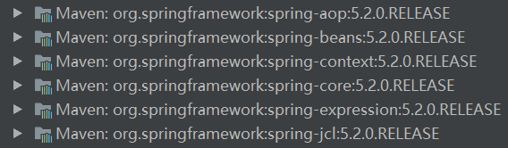
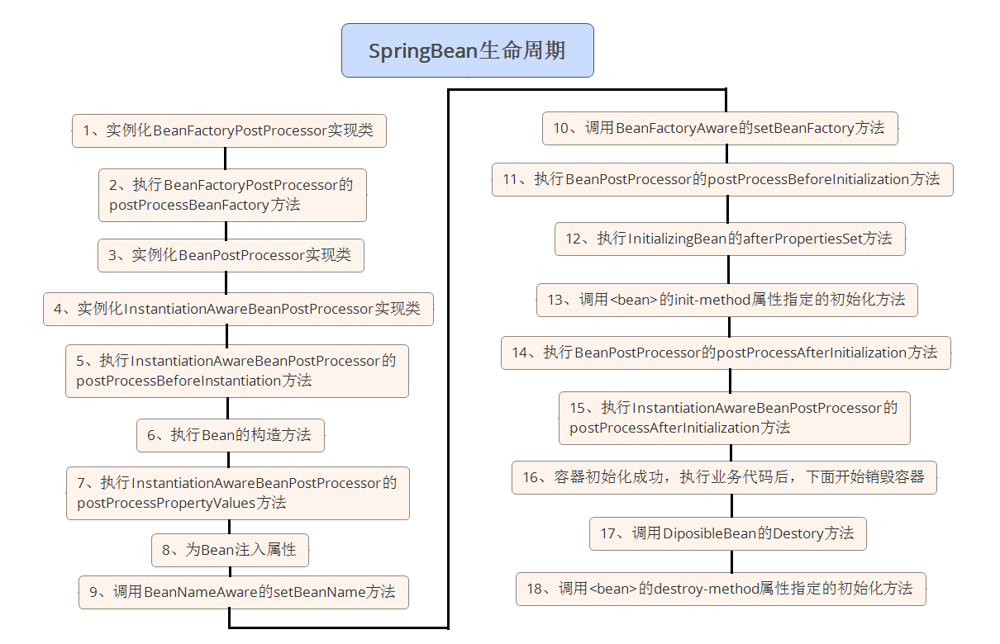

[TOC]


# IOC容器

IOC容器负责实例化,配置和组装java bean,它会根据我们配置的元数据去创建bean,我们可以通过xml或注解的方式去配置元数据

spring提供了IOC容器接口的几种实现:

- 我们通常创建[`ClassPathXmlApplicationContext`](https://docs.spring.io/spring-framework/docs/5.2.0.RELEASE/javadoc-api/org/springframework/context/support/ClassPathXmlApplicationContext.html)类去加载xml配置文件来创建IOC容器
- 我们也可以使用`AnnotationConfigApplicationContext`类去加载使用`@Configuration`注解标注的类来创建IOC容器
- 可以使用[`AnnotationConfigWebApplicationContext`](https://docs.spring.io/spring/docs/5.2.0.RELEASE/spring-framework-reference/core.html#beans-java-instantiating-container-web)类来创建web应用相关的容器

`org.springframework.context.ApplicationContext`接口代表SpringIOC容器

下图是IOC容器实例化和配置java bean的过程图:


> Spring容器先去加载所有的元数据配置,然后通过读取我们的实例类,在初始化时将元数据配置好,再将java bean返回

## 基于xml配置

### xml的配置详解

### 基于xml的Demo

1. 创建一个maven工程,导入`spring-context`的pom依赖

   它会将springFramework所用到的jar包引入,如下图所示

   

   ```xml
   <dependency>
       <groupId>org.springframework</groupId>
       <artifactId>spring-context</artifactId>
       <version>5.2.0.RELEASE</version>
   </dependency>
   ```

2. 在src中创建一个Cat类,并创建get和set方法(因为IOC在注入的时候会使用set方法注入)

   ```java
   public class Cat {
       String name;
       public String getName() {
           return name;
       }
       public void setName(String name) {
           this.name = name;
       }
       @Override
       public String toString() {
           return "Cat{" +
                   "name='" + name + '\'' +
                   '}';
       }
   }
   ```

3. 在src中创建一个Dog类,并创建get和set方法(在Dog类中还需要注入一个Cat对象)

   ```java
   public class Dog {
   
       int age;
       String name;
   
       Cat cat;//需要注入一个Cat对象
   
       public int getAge() {
           return age;
       }
   
       public void setAge(int age) {
           this.age = age;
       }
   
       public String getName() {
           return name;
       }
   
       public void setName(String name) {
           this.name = name;
       }
   
       public Cat getCat() {
           return cat;
       }
   
       public void setCat(Cat cat) {
           this.cat = cat;
       }
   
       @Override
       public String toString() {
           return "Dog{" +
                   "age=" + age +
                   ", name='" + name + '\'' +
                   ", cat=" + cat +
                   '}';
       }
   }
   ```

4. 创建spring.xml配置文件(配置元数据)

   ```xml
   <?xml version="1.0" encoding="UTF-8" ?>
   <beans xmlns="http://www.springframework.org/schema/beans"
          xmlns:xsi="http://www.w3.org/2001/XMLSchema-instance"
          xsi:schemaLocation="http://www.springframework.org/schema/beans
           https://www.springframework.org/schema/beans/spring-beans.xsd">
   	
       <!-- 自动注入一个dog对象,并设置好成员变量的值 -->
       <bean id="dog" class="xml.Dog">
           <property name="age" value="1"></property>
           <property name="name" value="jack"></property>
           <!-- 使用ref来引用外部的bean当作属性注入 -->
           <property name="cat" ref="cat"></property>
       </bean>
   
   	<!-- 配置一个cat对象 -->
       <bean id="cat" class="xml.Cat">
           <property name="name" value="cat"></property>
       </bean>
   </beans>
   ```

5. 创建Test类

   ```java
   public class Test {
       public static void main(String[] args) {
           ClassPathXmlApplicationContext context = new ClassPathXmlApplicationContext("spring.xml");
           Dog dog = (Dog) context.getBean("dog");
           System.out.println(dog);
       }
   }
   ```

   > 结果: Dog{age=1, name='jack', cat=Cat{name='cat'}}

## 基于注解配置详解

> 详细的参考文档: https://docs.spring.io/spring/docs/5.2.0.RELEASE/spring-framework-reference/core.html#beans-annotation-config

### @Autowired

默认首先使用类型匹配,将要注入的对象注入

- 可以标注在构造函数上(一般不使用)

  ```java
  @Autowired
  public MovieRecommender(CustomerPreferenceDao customerPreferenceDao) {
      this.customerPreferenceDao = customerPreferenceDao;
  }
  ```

- 可以标注在set方法上

  ```java
  @Autowired
  public void setMovieFinder(MovieFinder movieFinder) {
      this.movieFinder = movieFinder;
  }
  ```

- 可以标注在字段上

  ```java
  @Autowired
  private MovieCatalog movieCatalog;
  ```

### @Primary

当有多个bean都符合要求时,被标志@Primary的bean拥有优先的特权被先装配; 如果候选对象中仅存在一个主bean，则它将成为自动装配的值。

```java
@Configuration
public class CatFactory {
    //创建Cat1
    @Bean
    @Primary
    public Cat creatCat(){
        return new Cat("1");
    }

    //创建Cat2
    @Bean
    public Cat creatCat2(){
        return new Cat("2");
    }
}
```

> 创建两个Cat类型的对象,并加入到IOC容器中,默认注入bean的时候是使用类型注入的,那么spring就会找到两个类型为Cat的Javabean对象,则会报错; 但是如果在其中一个bean中标注@Primary注解,那么spring如果找到了两个类型为Cat的对象,则会使用有@Primary标注的Javabean进行自动注入

### @Qualifier

标注该注解可以起到微调的作用,即当有同类型且多对象的javabean需要装配时,可以使用该注解将多个同类型的兑现区分开进行自动装配,具体使用参考文档

### @Resource

该注解可以指定Javabean的名称(即id)

```java
@Resource(name = "cat") //指定要根据Javabean的id进行注入
Cat cat;
```

### @PropertySource和@Value

该注解用于引入外部的配置文件,引入后可以直接使用@Value注解从配置文件中取值注入

创建`application.properties`配置文件

```properties
catalog.name=MovieCatalog
```

创建`AppConfig`配置类

```java
@Component
@PropertySource("classpath:annotation/app.properties") //从外部加载配置文件
public class AppConfig {
    @Value("${catalog.name}") //从配置文件中获取值
    String name;
    @Value("1") //直接指定值
    int age;

    public static void main(String[] args) {
        ClassPathXmlApplicationContext context = new ClassPathXmlApplicationContext("annotation/spring.xml");
        AppConfig appconfig = (AppConfig) context.getBean("appConfig");
        System.out.println(appconfig.name);
        System.out.println(appconfig.age);
    }
}
```

### @PostConstruct和@PreDestroy

被`@PostConstruct`标注的方法会在bean实例创建后调用

被`@PreDestroy`标注的方法会在bean销毁后调用

```java
@Component
public class AppConfig {
    //在bean创建后调用
    @PostConstruct
    public void create(){
        System.out.println("创建");
    }

    //在bean销毁前调用
    @PreDestroy
    public void destroy(){
        System.out.println("销毁");
    }

    public static void main(String[] args) {
        ClassPathXmlApplicationContext context = new ClassPathXmlApplicationContext("annotation/spring.xml");
        AppConfig appconfig = (AppConfig) context.getBean("appConfig");
        context.close();//结束
    }
}
```

### @Component,@Repository,@Service,@Controller

被上面这些标注的注解表明该类是一个Javabean,需要被扫描进IOC容器中

`@Component`是通用的标注注解,而@Repository,@Service,@Controller这三个是针对更特定用例的专业化（分别在持久性，服务和表示层中使用）

自动命名:

- 在被上述注解标注的类扫描进IOC容器后,IOC容器会为他们自动命令(即JavaBean的id),默认是类名小写,但是

```java
@Component
public void Dog(){
}

@Controller
public void UserController(){
}
```

### @Configuration和@ComponentScan

被还注解标注的类表明是一个配置类,该注解是一个组合注解,它由`@Component`和其他注解组合而成,所以默认的IOC容器会把标注`@Configuration`的类也扫描进IOC容器

在配置类中,可以使用@Bean注解来在IOC容器中创建Javabean

```java
@Configuration //标注是一个配置
@ComponentScan("annotation") //开启注解扫描,并指定扫描指定的包路径
public class ConfigurationTest {

    @Autowired //使用自动注入的方式注入对象
    Cat cat;

    public static void main(String[] args) {
        AnnotationConfigApplicationContext context = new AnnotationConfigApplicationContext(ConfigurationTest.class);
        Cat cat = (Cat) context.getBean("cat");
        System.out.println(cat);
    }
}
```

还可以这样使用

```java
public static void main(String[] args) {
    AnnotationConfigApplicationContext ctx = new AnnotationConfigApplicationContext();
    ctx.scan("com.acme");//手动设置要扫描哪些包下的注解
    ctx.refresh();//再刷新容器
    MyService myService = ctx.getBean(MyService.class);
}
```

### @Bean

该注解可以显示的将一个有返回值的方法的返回值作为一个Javabean装配到IOC容器

> 注意: 在使用`@Bean`的类必须是要被IOC容器所管理的,如有标注`@@Configuration`,`@Component`等注解的类才可以生效

```java
@Component
public class BeanTest {
    @Bean(name = "cat2")
    public Cat creatCat(){
        return new Cat("2");
    }
}
```

我们还可以通过@Bean注解指定bean初始化时和销毁时调用方法

```java
@Configuration
public class AppConfig {
    //指定该bean初始化
    @Bean(initMethod = "init")
    public BeanOne beanOne() {
        return new BeanOne();
    }
    @Bean(destroyMethod = "cleanup")
    public BeanTwo beanTwo() {
        return new BeanTwo();
    }
}

```

### @Scope

使用`@Scope("prototype")`注解可以使得JavaBean不是单例,每次请求都会重新产生一个JavaBean

### @Import

直接简单的导入某些少量的类到IOC容器中

```java
@Component //标记为可以被IOC容器管理的类
@Import(Cat.class) //将Cat类加入到IOC容器中
public class ImportTest {
    public static void main(String[] args) {
        AnnotationConfigApplicationContext context = new AnnotationConfigApplicationContext(ImportTest.class);
        Cat cat = context.getBean(Cat.class);//获取通过@Import注解导入到IOC容器的类
        System.out.println(cat);
    }
}
```

### 基于注解的Demo

1. 创建一个maven工程,导入`spring-context`的pom依赖

   它会将springFramework所用到的jar包引入,如下图所示

   

   ```xml
   <dependency>
       <groupId>org.springframework</groupId>
       <artifactId>spring-context</artifactId>
       <version>5.2.0.RELEASE</version>
   </dependency>
   ```

2. 在src中创建一个Cat类,并标注@Component注解,默认的bean id为类名小写(cat)

   ```java
   @Component //使用注解标注该类是一个java bean
   public class Cat {
       @Value("cat") //设置要注入的值
       String name;
   
       @Override
       public String toString() {
           return "Cat{" +
                   "name='" + name + '\'' +
                   '}';
       }
   }
   ```

3. 在src中创建一个Dog类,并标注@Component注解,默认的bean id为类名小写(dog)

   ```java
   @Component //使用注解标注该类是一个java bean
   public class Dog {
       
       @Value("1") //通过@Value注解进行注入值,而不需要get和set方法
       int age;
       @Value("jack")
       String name;
       
       @Autowired //使用@Autowired注入Javabean对象,默认找的bean id为cat(即成员变量名称)
       Cat cat;
   
       @Override
       public String toString() {
           return "Dog{" +
                   "age=" + age +
                   ", name='" + name + '\'' +
                   ", cat=" + cat +
                   '}';
       }
   }
   ```

4. 创建spring.xml配置文件,在xml中开启注解扫描

   ```xml
   <?xml version="1.0" encoding="UTF-8" ?>
   <beans xmlns="http://www.springframework.org/schema/beans"
          xmlns:xsi="http://www.w3.org/2001/XMLSchema-instance"
          xmlns:context="http://www.springframework.org/schema/context"
          xsi:schemaLocation="http://www.springframework.org/schema/beans
           https://www.springframework.org/schema/beans/spring-beans.xsd http://www.springframework.org/schema/context https://www.springframework.org/schema/context/spring-context.xsd">
   
       <!-- 开启注解扫描,并指定要扫描的包 -->
       <context:component-scan base-package="annotation"/>
   
   </beans>
   ```

5. 创建Test类

   ```java
   public class Test {
       public static void main(String[] args) {
           ClassPathXmlApplicationContext context = new ClassPathXmlApplicationContext("annotation/spring.xml");
           Dog dog = (Dog) context.getBean("dog");
           System.out.println(dog);
       }
   }
   ```

   > 结果: Dog{age=1, name='jack', cat=Cat{name='cat'}}

## 关于ApplicationContextEvent的自定义事件

1. ContextRefreshedEvent

   在`ApplicationContext`初始化或刷新时触发该事件

2. ContextStartedEvent

   在`ApplicationContext`调用`start()`方法时触发该事件

3. ContextStoppedEvent

   在`ApplicationContext`调用`stop()`方法时触发该事件

4. ContextClosedEvent

   在`ApplicationContext`调用`close()`方法时触发该事件

5. RequestHandledEvent

   一个特定于Web的事件,在所有Bean HTTP的请求完成后,触发该事件; 此事件仅适用于使用Spring的Web应用程序`DispatcherServlet`

6. ServletRequestHandledEvent

   该类的子类`RequestHandledEvent`添加了特定于Servlet的上下文信息

继承对应的事件父类

ContextClosedEventTest:

```java
@Component
public class ContextClosedEventTest extends ContextClosedEvent {
    public ContextClosedEventTest(ApplicationContext source) throws InterruptedException {
        super(source);
        System.out.println("Closed");
        Thread.sleep(1000);
    }
}
```

ContextRefreshedEventTest:

```java
@Component
public class ContextRefreshedEventTest extends ContextRefreshedEvent {
    public ContextRefreshedEventTest(ApplicationContext source) throws InterruptedException {
        super(source);
        System.out.println("Refreshed");
        Thread.sleep(1000);
    }
}
```

ContextStartedEventTest:

```java
@Component
public class ContextStartedEventTest extends ContextStartedEvent {

    public ContextStartedEventTest(ApplicationContext source) throws InterruptedException {
        super(source);
        System.out.println("Started");
        Thread.sleep(1000);
    }
}
```

ContextStoppedEventTest:

```java
@Component
public class ContextStoppedEventTest extends ContextStoppedEvent {
    public ContextStoppedEventTest(ApplicationContext source) throws InterruptedException {
        super(source);
        System.out.println("Stopped");
        Thread.sleep(1000);
    }
}
```

EventTest:

```java
@Component
@ComponentScan("annotation.event")
public class EventTest{
    public static void main(String[] args) {
        AnnotationConfigApplicationContext context = new AnnotationConfigApplicationContext(EventTest.class);
    }
}
```

> 运行结果:
>
> Closed
> Refreshed
> Started
> Stopped

# Java Bean

## bean的作用域

默认将每个IOC容器中的bean设置为单例,使用scope注解可以改变其为多例

## bean的生命周期

生命周期流程图:



具体流程:

1. 实例化`BeanFactoryPostProcessor`
2. 执行`BeanFactoryPostProcessor`的`postProcessBeanFactory()`方法
3. 实例化`BeanPostProcessor`实现类
4. 实例化`InstantiationAwareBeanPostProcessor`实现类
5. 执行`InstantiationAwareBeanPostProcessor`的`postProcessBeforInstantiation()`方法
6. 执行Bean的构造方法
7. 执行`InstantiationAwareBeanPostProcessor`的`postProcessPropertyValues()`方法
8. 为Bean注入属性
9. 调用`BeanNameAware`的`setBeanName()`方法
10. 调用`BeanFactoryAware`的`setBeanFactory()`方法
11. 执行`BeanPostProcess`的`postProcessBeforeInitialization()`方法
12. 执行`InitializingBean`的`afterPropertiesSet()`方法
13. 调用Bean的init-method属性执行的初始化方法
14. 执行`BeanPostProcessor`的`postProcessAfterInitialization()`方法
15. 执行`InstantiationAwareBeanPostProcessor`的`postProcessAfterInitialization()`方法
16. 容器初始化成功,执行业务代码后,下面开始销毁容器
17. 调用`DiposibleBean`的`Destory()`方法
18. 调用Bean的destory-method属性指定的初始化方法

## bean的生命周期中的回调函数Demo

```java
@Component
public class BeanEvent implements BeanPostProcessor, InstantiationAwareBeanPostProcessor {
    
    //在bean的构造函数之前调用
    public Object postProcessBeforeInstantiation(Class<?> beanClass, String beanName) throws BeansException {
        System.out.println("postProcessBeforeInstantiation:"+beanName);
        return null;
    }

    //在bean的构造函数之后调用
    public boolean postProcessAfterInstantiation(Object bean, String beanName) throws BeansException {
        System.out.println("postProcessAfterInstantiation:"+beanName);
        return false;
    }

    //在给bean设置属性的时候调用
    public PropertyValues postProcessProperties(PropertyValues pvs, Object bean, String beanName) throws BeansException {
        System.out.println("postProcessProperties:"+beanName);
        return null;
    }

    //在bean初始化之前调用
    public Object postProcessBeforeInitialization(Object bean, String beanName) throws BeansException {
        System.out.println("postProcessBeforeInitialization:"+beanName);
        return null;
    }

    //在bean初始化之后调用
    public Object postProcessAfterInitialization(Object bean, String beanName) throws BeansException {
        System.out.println("postProcessAfterInitialization:"+beanName);
        return null;
    }
}
```

测试类:

```java
@Component
@ComponentScan("annotation.beanTest")
public class BeanTest {
    public static void main(String[] args) {
        AnnotationConfigApplicationContext context = new AnnotationConfigApplicationContext(BeanTest.class);
    }
}
```

> 运行结果:
>
> postProcessBeforeInstantiation:beanTest
> postProcessAfterInstantiation:beanTest
> postProcessBeforeInitialization:beanTest
> postProcessAfterInitialization:beanTest