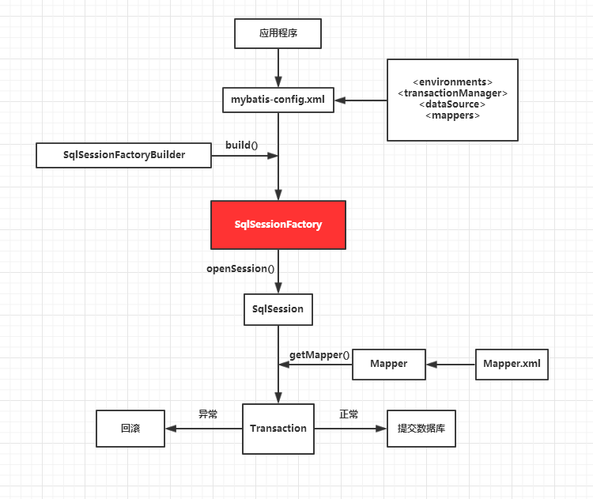
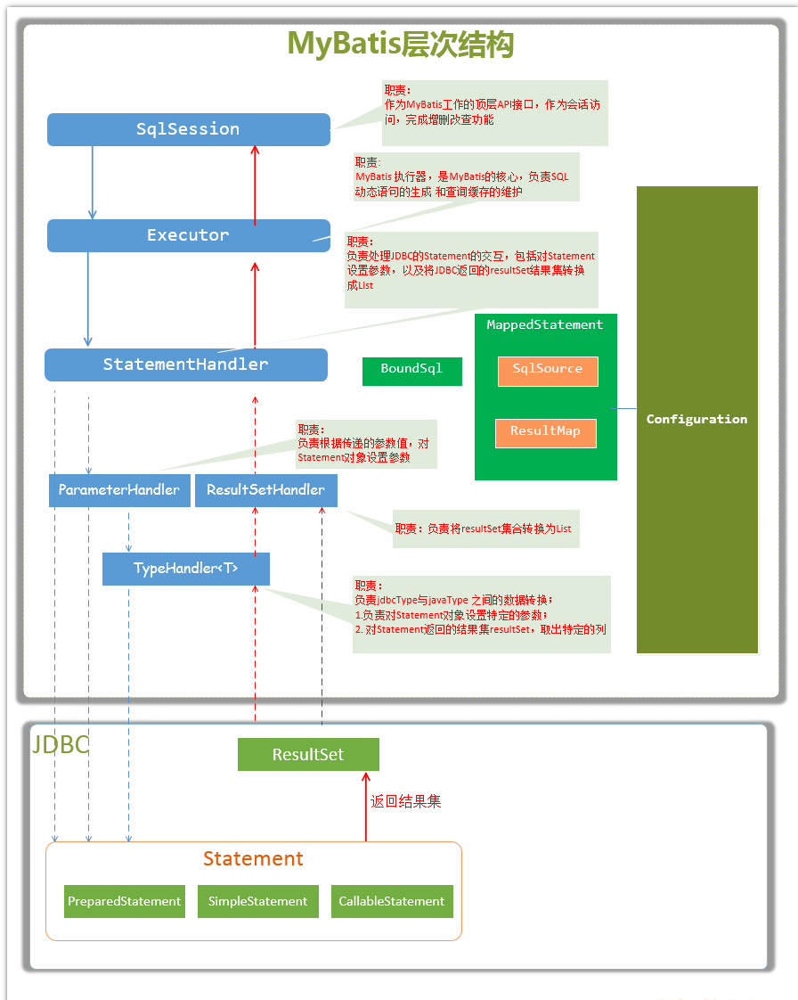
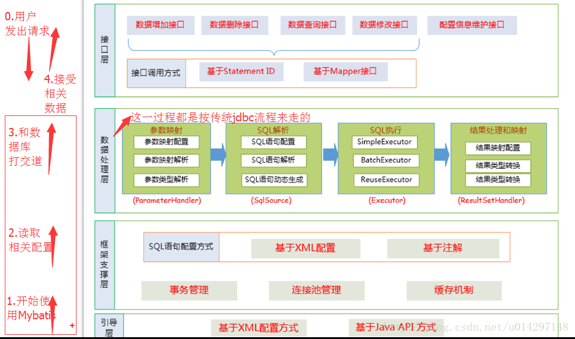

[TOC]

# 简介

Mybatis是一款优秀的持久层框架,它支持定制化sql,存储过程以及高级映射; Mybatis避免了几乎所有的JDBC代码和手动设置参数已经获取结果集; Mybatis可以使用简单的XML或注解来配置和映射原生类型,接口和Java中的POJO(Plain Old Java Object,普通老式Java对象)为数据库中的记录

# 传统的JDBC

## Demo

1. 创建一个maven项目

2. 引入mysql的maven依赖

   ```maven
   <dependency>
       <groupId>mysql</groupId>
       <artifactId>mysql-connector-java</artifactId>
       <version>5.1.32</version>
   </dependency>
   ```

3. 新建数据库表`mybatisTest`,并插入一条数据

   ```sql
   //创建user表
   CREATE TABLE `user` (
      `id` int(11) NOT NULL AUTO_INCREMENT,
      `name` varchar(20) DEFAULT NULL,
      `age` int(11) DEFAULT NULL,
      PRIMARY KEY (`id`)
    ) ENGINE=InnoDB DEFAULT CHARSET=utf8
    
   //插入数据
   INSERT INTO `user` (NAME, age) VALUES ('A', 1);
   INSERT INTO `user` (NAME, age) VALUES ('B', 2);
   INSERT INTO `user` (NAME, age) VALUES ('C', 3);
   ```

4. 使用JDBC查询数据

   ```java
   public class MybatisTest {
       public static void main(String[] args) throws Exception {
   
           Class.forName("com.mysql.jdbc.Driver");//加载mysql驱动
   
           String url="jdbc:mysql://127.0.0.1:3306/test";//数据库地址
           String userName="root";//用户名
           String password="123456";//密码
   
           Connection connection=null;
           PreparedStatement preparedStatement=null;
           ResultSet resultSet=null;
           try {
               connection = DriverManager.getConnection(url, userName, password);
               String sql="select * from user where id=?";//要执行的sql语句
               preparedStatement = connection.prepareStatement(sql);
               preparedStatement.setInt(1,2);//设置参数(id=2)
   
               resultSet = preparedStatement.executeQuery();
               while (resultSet.next()){
                   System.out.println(resultSet.getString("name"));//获取字段名name的值
                   System.out.println(resultSet.getString("age"));//获取字段名age的值
               }
           }finally {
               //在finally中关闭之前打开的资源
               if(resultSet!=null){
                   resultSet.close();
               }
               if(preparedStatement!=null){
                   preparedStatement.close();
               }
               if(connection!=null){
                   connection.close();
               }
           }
       }
   }
   ```

## 使用JDBC查询数据库的步骤

1. 加载JDBC驱动
2. 建立并获取数据库连接
3. 创建JDBC Statements对象
4. 设置sql语句的传入参数
5. 执行sql语句并获得查询结果
6. 对查询结果进行转换处理并将处理结果返回
7. 释放相关资源(关闭Connection,关闭Statement,关闭ResultSet)

## 缺点分析

1. 驱动名称进行了硬编码
2. 每次都要通过url,userName,password来获取到数据库的链接
3. sql语句和Java代码强耦合,无法分离
4. sql语句的参数类型需要手动判断,设值时需要判断下标,需要手动的设置参数
5. 结果集中的数据类型需要手动的判断,获取值时需要手动的指定列名或下标
6. 每次对数据库操作都要打开或关闭链接,浪费资源

## JDBC演变到Mybatis的过程

JDBC与数据库交互有7个步骤,哪些步骤是可以进一步封装的?这就Mybatis框架帮我们做的事情

### 优化与数据库连接的获取和释放

- 问题描述:

  数据库连接频繁的开启和关闭本身就造成了资源的浪费,影响系统的性能

- 解决方案:

  数据库连接的获取和关闭我们可以使用数据库连接池来解决频繁的开启或关闭连接导致资源浪费的问题; 通过连接池可以反复利用已经建立的连接去访问数据库,减少连接的开启和关闭的时间;

### 优化sql统一存取

- 问题描述

  我们使用JDBC操作数据库时,sql语句基本上都散落在各个Java类中,有三点不足:

  1. 可读性差,不利于维护以及做性能调优
  2. 改动Sql需要重新编译,打包部署
  3. 不利于去除sql在数据库客户端执行(需要在自己去重新组装sql)

- 解决方案

  我么可以把sql统一存放在一个地方,以key-value的形式存放,通过key就可以找到对应的sql,然后再对应的去执行

### 传入参数映射和动态sql

- 问题描述

  很多时候,我们使用占位符来传入参数,这种方法有一定的局限,就是需要按照一定顺序传入参数,而且要与占位符一一对应; 但是如果我们传入的参数个数不确定,那么按照传统的JDBC只能将判断逻辑写在Java代码中,使得sql和Java代码更加的耦合

- 解决方案

  对应参数的判断逻辑可以写在sql当中,我们自定义例如`<if test=''></if>`和`<else test=''><else/>`标签判断,再用一个专门的sql解析器解析这样的sql语句就能够解决; 那么`<if>`标签中的变量来自哪里呢? 我们可以使用`#变量名#`或`$变量名$`来获取到对应传入的变量

### 结果映射和结果缓存

- 问题描述

  执行sql语句,获取到执行结果,对执行就欸过进行转换处理并释放相关资源是必不可少的一套动作; 如果是执行查询语句,那么执行完sql语句后,返回的是一个ResultSet结果集,这时我们就需要将ResultSet对象的数据取出来,不然等到释放资源后就取不到结果集了; 如果能够完成获取结果集的封装,直接调用一个封装的方法即可以返回一个数据结构(结果集),那么就完美了

- 解决方案

  我们可以再获取ResultSet结果集后,将所有的数据取出并复制到我们指定的JavaBean中(可以是一个普通对象,一个Map,一个List等等),我们只需要做两点:

  1. 告诉mybatis我们需要返回什么类型的对象
  2. 我们需要返回的对象的数据结构和ResultSet中的结果集的字段怎么一一对应

  这样,mybatis就可以让帮我们将具体的结果赋值到对应的对象中,并返回给我们

  ---

  接下来考虑对sql执行结果的缓存来提升性能; 缓存数据都是key-value形式的,那么这个key怎么确定唯一?我们可以将sql和传入的参数两部分结合起来作为数据缓存的key值

### 解决重复sql语句问题

- 问题描述

  由于我们将所有sql语句都放到配置文件中,这时会遇到一个sql重复的问题; 或者是几个sql语句的功能都差不多,但是可能因为查询的字段不同或者where条件不同而重复写多个sql

- 解决方案

  我们可以将重复的代码抽离成一个独立的片段,可以在各个需要的地方进行引用, 这样需要修改时只需要修改一处即可

### 对比与总结

总结一下对JDBC的优化和封装:

1. 使用数据库连接池对连接进行管理
2. sql语句统一存放到配置文件中,便于管理
3. sql语句中的变量和传入的参数之间的一个映射关系
4. 动态sql语句的处理
5. 对数据库操作结果和返回对象结构的一个映射关系和结果缓存
6. sql语句片段,能够重复引用

### Mybatis待改进之处

- 问题描述

  Mybatis所有的数据库操作都是基于sql语句,对于不同的数据库对应的sql可能会略微不同,无法做到快速的切换数据源

# Mybatis工作原理

## 原理图





## 工作原理解析

详细流程如下:

1. 加载mybatis全局配置文件(mybatis-config.xml),解析配置文件,Mybatis基于xml配置文件生成Configuration(配置类对象,包含了所有配置),和一个个MappedStatement(包括了参数映射配置,动态sql语句,结果映射配置),其对应着一个个xxxMapper.xml中的`<select|update|delete|insert>`标签

   > mybatis-config.xml会包含数据源的配置,事务配置,mappers配置等

2. SqlSessionFactoryBuilder通过Configuration(配置类对象)生成SqlSessionFactory,用来开启SqlSession

3. SqlSession对象完成和数据库的交互

   1. 用户程序调用mybatis接口层api(集Mapper接口中的方法)
   2. SqlSession通过调用api并传入StatementID找到对应的MappedStatement对象
   3. 通过Executor(负责动态sql的生成和查询缓存的维护)将MappedStatement对象进行解析,sql参数转化,动态sql拼接,生成JDBC Statement对象
   4. JDBC执行sql
   5. 借助MappedStatement中的结果映射关系,将返回结果转化为HashMap,Javabean等存储对象并返回

以下是Mybatis的层次图:



# XML配置(mybatis-config.xml)

Mybatis的配置文件会影响Mybatis行为的设置和属性信息; 

配置文档的顶层结构如下： 

- properties（属性）
- settings（设置）
- typeAliases（类型别名）
- typeHandlers（类型处理器）
- objectFactory（对象工厂）
- plugins（插件）
- environments（环境配置）
  - environment（环境变量）
    - transactionManager（事务管理器）
    - dataSource（数据源）
- databaseIdProvider（数据库厂商标识）
- mappers（映射器）

## properties(属性)

## settings(设置)

## typeAliases(类型别名)

## typeHandlers(类型处理器)

## objectFactory(对象工厂)

## plugins(插件)

## environments(环境配置)

## databaseIdProvider(数据库提供商)

## mappers(映射器)

# XML映射文件

Mybatis的真正强大之处在于它的映射文件,它为聚焦于sql而构建,尽可能的较少麻烦

SQL映射文件只有很少的几个顶级元素:

- `insert` – 映射插入语句
- `update` – 映射更新语句
- `delete` – 映射删除语句
- `select` – 映射查询语句
- `sql` – 可被其他语句引用的可重用语句块
- `cache` – 对给定命名空间的缓存配置。
- `cache-ref` – 对其他命名空间缓存配置的引用。
- `resultMap` – 是最复杂也是最强大的元素，用来描述如何从数据库结果集中来加载对象
  1. `constructor` - 用于在实例化类时，注入结果到构造方法中
     - `idArg` - ID 参数；标记出作为 ID 的结果可以帮助提高整体性能
     - `arg` - 将被注入到构造方法的一个普通结果
  2. `id` – 一个 ID 结果；标记出作为 ID 的结果可以帮助提高整体性能
  3. `result` – 注入到字段或 JavaBean 属性的普通结果
  4. `association` – 一个复杂类型的关联；许多结果将包装成这种类型
     - 嵌套结果映射 – 关联本身可以是一个 `resultMap` 元素，或者从别处引用一个
  5. `collection` – 一个复杂类型的集合
     - 嵌套结果映射 – 集合本身可以是一个 `resultMap` 元素，或者从别处引用一个
  6. `discriminator` – 使用结果值来决定使用哪个`resultMap`
     - `case` – 基于某些值的结果映射
       - 嵌套结果映射 – `case` 本身可以是一个 `resultMap` 元素，因此可以具有相同的结构和元素，或者从别处引用一个

## select

## insert, update 和 delete

## sql(sql片段)

 这个元素可以被用来定义可重用的 SQL 代码段 

## association(关联sql片段) 

## 参数

### resultType

### parameterType

### 字符串替换

## resultMap(结果映射)

 `resultMap` 元素是 MyBatis 中最重要最强大的元素 

### id & result

### 支持的 JDBC 类型

### 构造方法

### 关联

### 关联的嵌套 Select 查询

### 关联的嵌套结果映射

### 关联的多结果集（ResultSet）

### 集合

### 集合的嵌套 Select 查询

### 集合的嵌套结果映射

### 集合的多结果集（ResultSet）

### 鉴别器

### 自动映射

## cache(缓存)

## cache-ref


# 动态sql

# sql语句构建起

# 缓存

# 日志

# Mybatis使用Demo

## 基于 XML Demo

## 基于 注解 Demo

# Spring集成Mybatis

# Mybatis插件

## Mybatis Generator的使用

## Mybatis整合分页插件pageHelper


# 参考文档

[Mybatis实战教程]( https://blog.csdn.net/hellozpc/article/details/80878563 )

[Mybatis中文官网](https://mybatis.org/mybatis-3/zh/getting-started.html)