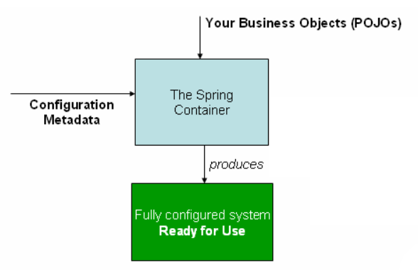

[TOC]

# 概述

spring framework的核心是配置模型(AOP)和依赖注入(IOC),除此之外,spring framework还提供了基础服务,包括消息传递,事务处理和基于servlet的web服务框架(包含了springmvc和响应式的webFlux框架)

## spring和J2EE的关系

spring为了简化J2EE的开发而诞生的,spring遵循了J2EE的部分规范

- Servlet API 
- WebSocket API
- Concurrency Utilities (并发工具包)
- JSON Binding API 
- Bean Validation (校验)
- JPA 
- JMS (消息服务)

spring framework还遵循了IOC和AOP规范,我们可以根据我们的需要进行替换具体的实例

## servlet container 

springboot内嵌了tomcat容器,使得创建项目更加的快捷和便利,而且我们也可以根据我们的需要进行替换servlet容器,甚至于可以不是一个servlet容器(如netty)

## 设计理念

- 在每一个层级上都给用户提供回调的函数

  spring允许我们推迟决策,例如通过配置文件来修改属性,从而不会变动代码; 在其他基础设施上和第三方api的集成上也如此

- 容纳不同的观点

  spring非常的灵活,可以支持不同的应用场景

- 具有强大的向后兼容性

  spring的每个版本都会给我们选好对应的jdk版本和第三方库的版本

- 关心api接口的设计

- 为代码质量设置高标准,具有有意义的,最新和准确的javadoc

# Core

spring最重要的两个核心技术是IOC(控制反转)和AOP(面向切面)

- IOC在spring框架中起到了承上启下的作用,包括对于AOP来说,都需要使用到IOC
- spring framework有自己的AOP框架,它在概念上易于理解,并且能够解决80%的面向切面的编程需求

spring还提供了与AspectJ的AOP框架集成的接口,能够无缝的进行切换

## [IOC Container](https://docs.spring.io/spring/docs/current/spring-framework-reference/core.html#beans)

### 简介 the Spring IoC Container and Beans

bean: 由spring容器管理的对象成为bean;它是由spring IoC容器实例化,组装和管理的对象,bean之间的依赖关系也由spring Ioc容器进行管理

ioc的原理: 通过构造函数参数,工厂方法的参数或在构造函数和工厂方法返回后的对象来设置bean的依赖关系,容器在创建bean时将其依赖注入

`org.springframework.beans`和`org.springframework.context`包是Spring Framework的IoC容器的基础

`BeanFactory`接口提供了一种能够产生任何对象的高级配置机制,`ApplicationContext`是`BeanFactory`的子接口。

`ApplicationContext`:

- 更容易和AOP集成
- 更好的国际化
- 利于事件发布(回调)
- 特定与应用层的上下文,如`WebApplicationContext`,用于web应用程序

简单的说,`BeanFactory`是一个非常抽象的类,提供了框节配置和基本功能,而`ApplicationContext`则是它的一个子类,针对一些特殊的场景进行了完善

### IoC Container 概述

`org.springframework.context.ApplicationContext`接口负责为IOC容器实例化、配置和组装bean,该类通过读取配置原数据来实例化、配置和组装bean,配置元数据的方式可以是xml、java注解或者是Java代码来实现。

spring提供了几个`ApplicationContext`接口的实现,`Class PathXmlApplicationContext`或者`FileSystemApplicationContext`,他们都可以使用在单一应用中。我们可以在xml中声名容器使用java注解或代码来作为配置元数据。

ioc的流程图

通过实例化类和配置元数据，即可创建一个可用和可配置的应用程序系统

### Configuration Metadata

## [Resource](https://docs.spring.io/spring/docs/current/spring-framework-reference/core.html#resources)

## [Validation,Data Binding,Type Conversion](https://docs.spring.io/spring/docs/current/spring-framework-reference/core.html#validation)

## [Spring Expression Language (SpEL)](https://docs.spring.io/spring/docs/current/spring-framework-reference/core.html#expressions)

## [Aspect Oriented Programming(AOP)](https://docs.spring.io/spring/docs/current/spring-framework-reference/core.html#aop)

## [Spring AOP APIs](https://docs.spring.io/spring/docs/current/spring-framework-reference/core.html#aop-api)

## [Null-safety](https://docs.spring.io/spring/docs/current/spring-framework-reference/core.html#null-safety)

## [Data Buffers and Codecs](https://docs.spring.io/spring/docs/current/spring-framework-reference/core.html#databuffers)

## [Appendix](https://docs.spring.io/spring/docs/current/spring-framework-reference/core.html#appendix)

# Testing

# Data Access

# Web Servlet

# Web Reactive

# Integration

