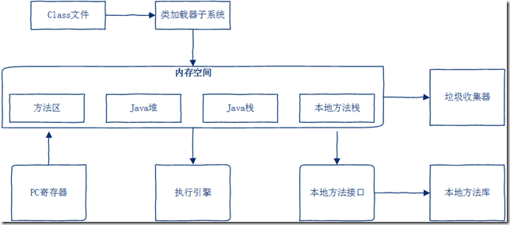

[TOC]

# JVM综述

## JVM体系结构

- 类装载器(ClassLoader)

  > 用来装载.class文件

- 执行引擎

  > 执行字节码文件或者执行本地方法

- 运行时数据区

  - 方法区
  - 堆
  - java栈
  - 程序计数器
  - 本地方法栈

结构图:

## JVM原理

## JVM执行过程

## JVM的生命周期

## JVM各区域潜在的异常

# JVM类装载器

## 类加载机制

JVM把字节码.class文件加载到内存,并对数据进行校验,转换解析和初始化,最终形成可以被虚拟机直接使用的java类型,这就是虚拟机的类加载机制

# JVM执行引擎

# JVM运行时数据

# 垃圾回收

## JVM垃圾回收机制

## 常见的垃圾回收器

## Minor GC,Full GC触发条件

## 降低GC的调优策略

# 参考文档

[深入详细讲解JVM原理](https://blog.csdn.net/know9163/article/details/80574488)

https://www.cnblogs.com/yuechuan/p/8984262.html

http://blog.itpub.net/29609890/viewspace-2219916/