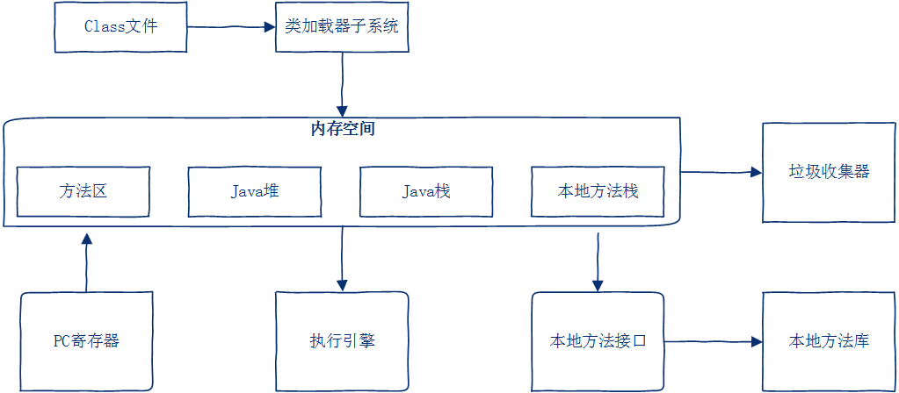

[TOC]

# JVM概述

## JVM原理

下图就展示了java的一次编译,到处运行


Java程序经过一次编译之后,将java代码编译为字节码也就是class文件,然后在不同的操作系统上依靠不同的java虚拟机进行解释,最后在转换为不同平台的机器码,最终得到执行;

## 一个普通的java代码的执行过程

一个HelloWorld类

```java
public class HelloWorld{
    public static void main(String[] args){
        System.out.print("Hello world");
    }
}
```

下面是JVM将HelloWorld类加载并执行的过程,如图所示:


java代码通过编译之后生成字节码文件(class文件),通过:`java HelloWorld`命令执行后,此时java根据系统版本找到jvm.cfg

> 该文件一般位于`C:\Program Files\Java\jdk1.8.0_101\jre\lib\amd64\jvm.cfg`路径下
>
> 

其中-server KNOWN就标识名称为server的jvm可用; 如果这时你搜索你电脑上的jvm.dll,你就会发现它一定在你的某个server目录下,比如我的`C:\Program Files\Java\jdk1.8.0_101\jre\bin\server\jvm.dll`; 简而言之就是通过jvm.cfg文件找到对应的jvm.dll(jvm.dll是java虚拟机的主要实现),然后进行初始化JVM,并获取JNI接口

> JNI接口就是java本地接口,它可以从硬盘中找到对应的class文件并将其装载到jvm中(它还常用于java与操作系统和硬件交互)

通过JNI接口找到class文件并装载进JVM,然后找到mian方法,最后执行

## JVM的生命周期

### JVM实例

一个运行时的java虚拟机负责运行一个java程序

当启动一个java程序时,一个虚拟机实例诞生, 当程序关闭退出,这个虚拟机实例也随之消亡

如果在同一台计算机上同时运行多个java程序,将得到多个java虚拟机实例,每个java程序都运行于它自己的虚拟机实例中

### 生命周期

1. JVM创建

   当启动一个java程序时,一个JVM实例就产生了,任何一个拥有main函数的class都可以作为JVM实例运行的起点

2. JVM运行

   main()作为程序初始线程的起点,任何其他线程均由该主线程启动; JVM内部有两种线程: 守护线程和非守护线程; 主线程属于非守护线程,守护线程通常由JVM自己使用

3. JVM消亡

   当程序中的所有非守护线程都终止时,JVM才退出; 若安全管理器允许,程序也可以使用java.lang.Runtime类或者java.lang.System.exit()来退出

## JVM各区域潜在的异常

- PC寄存器

  此区域是JVM规范中唯一一个不存在OutOfMemory的区域。

- java栈

  1. StackOverflowError ：栈深度大于虚拟机所允许的深度。

  2. OutOfMemory：如果虚拟机栈可以动态扩展（当前大部分Java虚拟机都可以动态扩展，只不过Java虚拟机规范中的也允许固定长度的虚拟机栈），如果扩展是无法申请到足够的内存

- 本地方法栈
  1. StackOverflowError ：栈深度大于虚拟机所允许的深度。
  2. OutOfMemory

- java堆
  1. OutOfMemory: 堆无法扩展时

- 方法区
  1. OutOfMemory: 超出内存容量

# JVM基本结构

## 结构图



主要分为三大类:

1. 类装载器(ClassLoader)
2. 执行引擎
3. 内存空间(方法区,java堆,java栈,本地方法栈,PC寄存器)

## 类装载器ClassLoader

### 类加载机制

JVM把字节码.class文件加载到内存,并对数据进行校验,转换解析和初始化,最终形成可以被虚拟机直接使用的java类型,这就是虚拟机的类加载机制

### 双亲委派模型

## 执行引擎

## 内存空间

### 方法区

### java堆

### java栈

### 本地方法栈

### PC寄存器

# JVM内存模型

# 垃圾收集器(GC)

## JVM垃圾回收机制

## 常见的垃圾回收器

## Minor GC,Full GC触发条件

## 降低GC的调优策略

# 参考文档

[深入详细讲解JVM原理](https://blog.csdn.net/know9163/article/details/80574488)

https://www.cnblogs.com/yuechuan/p/8984262.html

http://blog.itpub.net/29609890/viewspace-2219916/