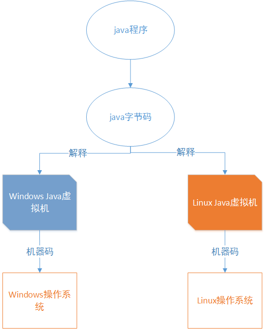

[TOC]

# JVM概述

## JVM原理

下图就展示了java的一次编译,到处运行



Java程序经过一次编译之后,将java代码编译为字节码也就是class文件,然后在不同的操作系统上依靠不同的java虚拟机进行解释,最后在转换为不同平台的机器码,最终得到执行;

## 一个普通的java代码的执行过程

一个HelloWorld类

```java
public class HelloWorld{
    public static void main(String[] args){
        System.out.print("Hello world");
    }
}
```

下面是JVM将HelloWorld类加载并执行的过程,如图所示:


java代码通过编译之后生成字节码文件(class文件),通过:`java HelloWorld`命令执行后,此时java根据系统版本找到jvm.cfg

> 该文件一般位于`C:\Program Files\Java\jdk1.8.0_101\jre\lib\amd64\jvm.cfg`路径下
>
> 

其中-server KNOWN就标识名称为server的jvm可用; 如果这时你搜索你电脑上的jvm.dll,你就会发现它一定在你的某个server目录下,比如我的`C:\Program Files\Java\jdk1.8.0_101\jre\bin\server\jvm.dll`; 简而言之就是通过jvm.cfg文件找到对应的jvm.dll(jvm.dll是java虚拟机的主要实现),然后进行初始化JVM,并获取JNI接口

> JNI接口就是java本地接口,它可以从硬盘中找到对应的class文件并将其装载到jvm中(它还常用于java与操作系统和硬件交互)

通过JNI接口找到class文件并装载进JVM,然后找到mian方法,最后执行

## JVM的生命周期

### JVM实例

一个运行时的java虚拟机负责运行一个java程序

当启动一个java程序时,一个虚拟机实例诞生, 当程序关闭退出,这个虚拟机实例也随之消亡

如果在同一台计算机上同时运行多个java程序,将得到多个java虚拟机实例,每个java程序都运行于它自己的虚拟机实例中

### 生命周期

1. JVM创建

   当启动一个java程序时,一个JVM实例就产生了,任何一个拥有main函数的class都可以作为JVM实例运行的起点

2. JVM运行

   main()作为程序初始线程的起点,任何其他线程均由该主线程启动; JVM内部有两种线程: 守护线程和非守护线程; 主线程属于非守护线程,守护线程通常由JVM自己使用

3. JVM消亡

   当程序中的所有非守护线程都终止时,JVM才退出; 若安全管理器允许,程序也可以使用java.lang.Runtime类或者java.lang.System.exit()来退出

## JVM各区域潜在的异常

- PC寄存器

  此区域是JVM规范中唯一一个不存在OutOfMemory的区域。

- java栈

  1. StackOverflowError ：栈深度大于虚拟机所允许的深度。

  2. OutOfMemory：如果虚拟机栈可以动态扩展（当前大部分Java虚拟机都可以动态扩展，只不过Java虚拟机规范中也允许固定长度的虚拟机栈），如果扩展是无法申请到足够的内存

- 本地方法栈
  1. StackOverflowError ：栈深度大于虚拟机所允许的深度。
  2. OutOfMemory

- java堆
  
1. OutOfMemory: 堆无法扩展时
  
- 方法区
  
  1. OutOfMemory: 超出内存容量

# JVM基本结构

## 结构图


主要分为三大类:

1. 类装载器(ClassLoader)
2. 执行引擎
3. 内存空间(方法区,java堆,java栈,本地方法栈,PC寄存器)

## 类装载器ClassLoader

### 类加载机制

JVM把字节码.class文件加载到内存,并对数据进行校验,转换解析和初始化,最终形成可以被虚拟机直接使用的java对象,这就是虚拟机的类加载机制

### 类加载器

类从被加载到虚拟机内存中开始,到卸载出内存为止,它的生命周期包括了:加载(Loading),验证(Verification),准备(Preparation),解析(Resolution),初始化(Initialization),使用(Useing),卸载(Unloading)七个阶段,其中验证,准备,解析三个部分统称为链接


1. 加载(重点)

   加载阶段通常也被称为"装载",主要完成:

   1. 通过"全类名"来获取定义此类的二进制字节流
   2. 将字节流所代表的静态存储结构转换为方法区的运行时数据结构
   3. 在java堆中生成一个代表这个类的java.lang.Class对象,作为方法区这些数据的访问入口

   加载阶段(即加载阶段中获取类的二进制字节流的动作)是开发期可控性最强的阶段,因为加载阶段可以使用系统提供的类加载器(ClassLoader)来完成,也可以有用户自定义的类加载器完成,开发人员可以通过定义自己的类加载器区控制字节流的获取方法

   加载阶段完成后,虚拟机外部的二进制字节流就按照虚拟机所需的格式存储在**方法区**之中,方法区中的数据存储格式有虚拟机实现自行定义,虚拟机并未规定此区域的具体数据结构,**然后在java堆中实例化一个java.lang.Class类的对象,这个对象作为程序访问方法区中的这些类型数据的外部接口**

2. 验证(了解)

   验证是链接阶段的第一步,这一步主要的目的是确保class文件的字节流中包含的信息符合当前虚拟机的要求,并且不会危害虚拟机自身安全

   验证阶段主要包括四个检验过程: 文件个是验证,元数据验证,字节码验证和符号引用验证

3. 准备(了解)

   准备阶段是正式的**为变量分配内存并设置类变量初始值**的阶段,这些内存都将在**方法区**中进行分配,这个阶段中有两个容易产生混淆的知识点,首先进行内存分配的是类变量(static修饰的变量),不包括实例变量,实例变量将会在对象实例化是随着对象一起分配在**java堆**中; 其次是这里所说的初始值"通常情况"下是数据类型的零值

   假如一个类变量定义为:`public static int value=12;`

   那么变量value在准备阶段过后的初始值为0而不是12,因为这时候尚未开始执行任何java方法,而把value赋值为12的putstatic指令是程序编译后,存放在类构造器`<clinit>()`方法之中,所以把value赋值为12的动作将在初始化阶段才会被执行

   上面所说的"通常情况"下初始值是零值,那么相对于一些特殊的情况,如果类字段的字段属性表中存在ConstantValue属性,那么在准备阶段value就会被初始化为ConstantValue属性所指定的值,假设上面的类变量value定义为:`public static final int value=123;`

   编译时javac会将为value生成ConstantValue属性,在准备阶段虚拟机就会根据ConstantValue的设置将value设置为123

4. 解析(了解)

   解析阶段是虚拟机常量池内的符号引用替换为直接引用的过程

   符号引用: 符号引用是一组符号来描述所引用的目标对象,符号可以是任何形式的字面量,只要使用时能无歧义的定位到目标即可; 符号引用与虚拟机实现的内存布局无关,引用的目标对象并不一定已经加载到内存中

   直接引用: 直接引用可以是直接指向目标对象的指针,相对偏移量或是一个能间接定位到目标的句柄; 直接引用是与虚拟机内存布局实现相关的,同一个符号引用在不同虚拟机实例上翻译出来的直接引用一般不会相同,如果有了直接引用,那么引用的目标必须顶已经在内存中存在

   解析的动作主要针对类或接口,字段,类方法,接口方法四类符号引用进行; 分别对应编译后常量池内的CONSTANT_Class_Info(类,接口的解析)、CONSTANT_Fieldref_Info(字段解析)、CONSTANT_Methodef_Info(类方法解析)、CONSTANT_InterfaceMethoder_Info(接口方法解析)四种常量类型

5. 初始化(了解)

   类加载最后阶段,若该类具有超类,则对其进行初始化,执行静态初始化器和静态初始化成员变量(如前面只初始化了默认值的static变量将会在这个节点赋值,成员变量也将被初始化)

6. 使用

7. 卸载

总结:

类加载器的任务是根据一个类的全限定类名来读取此类的二进制字节流到JVM中,然后转换为一个与目标类对应的java.lang.Class对象实例,在虚拟机提供了人中类加载器: 

1. 启动类加载器(BootStrap ClassLoader)

   这个类加载器负责加载放在`%JAVA_HOME%\lib`目录下的或者被-Xbootclasspath参数所指定的路径中的,并且是虚拟机识别的类库,用户无法直接使用

2. 扩展类加载器(Extension ClassLoader)

   这个类加载器由sun.misc.Launcher$AppClassLoader实现,它负责`%JAVA_HOME%\lib\ext`目录下的或者被java.ext.dirs系统变量所指定的路径中的所有类库,用户可以直接使用

3. 应用类加载器(Application ClassLoader)

   这个类由sun.misc.Launcher$ApClassLoader是实现,是CLassLoader中getSystemClassLoader()方法的返回值; 它负责用户路径ClassPath所指定的类库,用户可以直接使用,如果胡勇没有自定定义类加载器,默认使用这个

4. 自定义类加载器(User ClassLoader)

   用户自己定义的类加载器

### 双亲委派模型


双亲委派模型是一种组织类加载器之间关系的一种规范,它的工作原理是:

- 如果一个类加载的请求,它不会自己去尝试加载这个类,而是把这个请求委派给父类加载器去完成,这样层层递进,最终所有的加载请求都会传到最顶层的启动类加载器中,只有当父类加载器无法完成这个加载请求时(即它的搜索范围没有找到对应的类),才会交给子类加载器去尝试加载

## 执行引擎

执行引擎负责具体的代码调用即执行过程; 就目前而言,所有的引擎基本一致:

1. 输入: 字节码文件
2. 处理: 字节码解析
3. 输出: 执行结果

物理机的执行引擎是由硬件实现的,和物理机的执行过程不同的是虚拟机的执行是自己实现的

---

类装载器负责装载编译后的字节码,并加载到运行时数据区(Runtime Data Area),然后执行引擎会执行这些字节码; 通过类装载器装载的且被分配到JVM的运行时数据区的字节码会被执行引擎执行,执行引擎以指令为单位读取java字节码,它就向一个cpu一样,一条一条的执行机器指令,每个字节码指令由一个1字节的操作码和附加的操作数组成,执行引擎取得一个操作码,然后根据操作数来执行任务,完成后就继续执行下一条操作码; 不过java字节码是用一种人类可以读懂的语言编写的,而不是用机器语言;因此,执行引擎必须把字节码转换成可以直接被JVM执行的语言,字节码可以通过以下两种凡是转换成合适的语言:

1. 解释器

   一条一条的读取,解释并执行字节码指令,因为它是一条一条的解释和执行指令,所以它可以很快的解释字节码,但是执行起来会比较慢,这是解释执行的语言的一个缺点; 

2. 即时编译器(Just-In-Time)

   即时编译器被引入用来弥补解释器的缺点; 执行引擎首先按照解释执行的方式来执行,然后在合适的时候,即时编译器把整段字节码编译成本地代码,然后,执行引擎就没有必要再去解释执行指令了,而是可以直接通过编译过的本地代码执行; 执行本地代码比一条一条进行解释执行的速度快很多; 编译后的代码可以执行的很快,因为本地代码时保存在缓存里的;

## 内存空间

JVM运行时会分配好方法区和java堆; 而JVM每遇到一个线程,就为其分配一个程序计数器,java栈,本地方法栈,当线程终止时,这三者所占用的内存空间也会释放掉

> 程序计数器,java栈,本地方法栈的生命周期与所属线程相同,而方法区和java堆的生命周期与java程序运行生命周期相同,所以gc只发生在线程共享的区域(大部分发生在Heap上)

### java堆(线程共享)

Java堆(Java Heap)是java虚拟机中内存最大的一块,Java堆在虚拟机启动时创建,被所有线程共享

作用: 存放对象实例; 垃圾收集器主要管理的就是java堆,java堆在物理上可以不连续,只要逻辑上连续即可

### 方法区(线程共享)

线程共享,用于存储已被虚拟机加载的类信息,常量,静态变量,即时编译器编译后的代码等的数据

和java堆一样,不需要连续的内存,可以选择固定的大小,更可以选择不实现垃圾收集

### java栈(线程私有)

Java栈也被叫做虚拟机栈(Java Vitual Machine Stack),是线程私有的,生命周期与线程相同

虚拟机栈描述的是java方法执行的内存模型: 每个方法被执行的时候都会创建一个帧栈(Stack Frame),存储了:

1. 局部变量表
2. 操作数栈
3. 指向当前类的运行时常量池的引用
4. 方法的返回地址

每一个方法被调用直到方法执行完成的过程,就对应这一个栈帧在虚拟机栈中从入栈到出栈的过程

这个区域有两种异常情况:

1. StackOverflowError: 线程请求的栈深度大于虚拟机所允许的深度
2. OutOfMemoryError: 虚拟机栈扩展但无法申请足够的内存时

> - 局部变量表
>
>   用来存储方法中的局部变量(包括在方法中生命的非静态变量以及函数形参),对于基本数据类型的变量,则直接存储它的值,对于引用类型的变量,则存储指向对象的引用; 局部变量表的大小在编译器就可以确定其大小了,因此在程序执行期间局部变量表的大小是不会改变的
>
> - 操作数栈
>
>   栈最典型的一个应用就是用于对表达式求值; 在一个线程执行方法的过程中,实际上就是不断执行语句的过程,而归根结底就是进行计算的过程,因此可以这么说,程序中的所有计算过程都是借助于操作数栈来完成的
>
> - 指向运行时常量池的引用
>
>   因为在方法执行的过程中又可能需要用类中的常量,所以必须要有一个引用指向运行时常量
>
> - 方法返回值
>
>   当一个方法执行完毕之后,要返回之前调用它的地方,因此在栈帧中必须保存一个方法返回地址

> 运行时常量池
>
> 是方法区的一部分,保存Class文件中的符号引用,翻译出来的直接引用; 运行时常量池可以在运行期间将新的常量放入池中

### 本地方法栈(线程私有)

Java栈是为执行java方法服务的

而本地方法栈是为虚拟机使用到的Native方法服务(调用其他语言的函数库,如C等)

### 程序计数器(线程私有)

程序技术器是一块比较小的内存空间,可以看作是当前线程所执行字节码的行号指示器; 分支,循环,跳转,异常处理,线程恢复等基础功能都需要依赖这个计数器完成

由于java虚拟机的多线程是通过线程轮流切换并分cpu时间片实现的,为了线程切换后能恢复到正确的执行位置,每条线程都需要一个独立的程序计数器,个线程之间的计数器互不影响,独立存储

1. 如果线程正在执行的是一个java方法,计数器记录的是正在执行的虚拟机字节码指令的地址
2. 入宫正在执行的是Native方法,这个计数器的值为空

程序计数器是唯一一个没有规定任何OutOfMemoryError 的区域

### Java中对象创建及访问的过程

基本上会涉及到java栈,java堆,方法区这三个最重要的内存区域

例如:

```java
Object obj =  new  Object();
```

首先对上述代码进行一个简单的说明:

1. 定义一个Object类型的变量obj,这个obj就是一个引用类型的变量,保存在java栈中
2. `new Object()`将会在java的堆内存中形成一块存储Object类型所有实例数据值的结构化内存

java中对象的访问流程如下:

1. 定义的对象名称保存在java栈的本地变量表
2. 通过本地变量表中的栈内存地址可以找到堆内存
3. 利用堆内存的对象进行本地方法的调用

这个过程中的引用类型变量在java虚拟机规范里面只规定了一个指向对象的引用地址,并没有定义这个引用应该通过哪种方式区定位,访问到java堆中的对象位置,因此不同的虚拟机实现的访问方式可能不同,主流的方式有两种: 使用句柄和直接指针

> 具体的详细解释参考链接: https://www.jianshu.com/p/dfe0b8ff54de

# 垃圾收集器(GC)

## JVM垃圾回收机制

GC的基本原理: 将内存中不再使用的对象进行回收,GC中用于回收的方法称为收集器,由于GC需要消耗一些资源和时间,java在对对象的生命周期特征及进行分析后,按照新生代,旧生代的方式对对象进行垃圾回收,以尽可能的缩短GC对应用造成的暂停

## 哪些内存需要回收

JVM的内存结构包括五大区域: 程序计数器,java栈,本地方法栈,Java堆,方法区; 其中程序计数器,虚拟机栈,本地方法栈3个区域会随着线程而生,随线程而灭,因此这几个区域的内存分配和回收都具备确定性,就不需要过多考虑回收的问题,因为方法结束或者线程结束时,内存自然就收回了;而java堆和方法区则不一样,这部分内存的分配和回收是动态的,正式垃圾收集器所需要关值的部分

## 如何判断是否需要收回

### 引用计数法

引用计数是垃圾收集器中的早期策略; 在这种方法中,堆中每个对象实例都有一个引用计数,当一个对象被创建时,就将该对象实例分配给一个变量,该变量计数设置为1;当任何其他变量被赋值为这个对象的引用时,计数+1(a=b,则b引用的对象实例的计数器+1),但当一个对象实例的某个引用超过了生命周期或者被设置为一个新值时,对象实例的引用计数器-1; 任何引用计数器为0的对象实例就可以被当做垃圾收集; 当一个对象实例被垃圾收集时,它引用的任何对象实例的引用计数器-1;

优点: 引用计数收集器可以很快的执行,交织在程序运行中; 对程序需要不被长时间打断的实时环境比较有利;

缺点: 无法检测出循环引用; 如父对象有一个对子对象的引用,子对象反过来引用父对象,这样,他们的引用计数永远不可能为0

### 可达性分析算法

程序把所有的引用关系看作一张图,从一个节点GC ROOTS开始,寻找对应的引用节点,找到这个节点以后,继续寻找这个节点的引用节点,当所有的引用节点寻找完毕之后,剩余的节点则被认为是没有被引用到的节点,即无用的节点,无用的节点将会被判定为是可回收的对象

在java语言中,可作为GC ROOTS的对象包括下面几种:

1. Java栈中的引用过的对象(帧栈中的本地变量表)
2. 方法区中类静态属性引用的对象
3. 方法区中常量引用的对象
4. 本地方法栈中JNI(Native方法)引用的对象

不同的对象引用类型,GC会采用不同的方法进行回收,JVM对象的引用分为四种类型:

1. 强引用

   在程序代码中普遍存在的,类似Object obj=new Object()这类引用,只要强引用还存在,垃圾收集器永远不会收回掉被引用的对象

2. 软引用

   用来描述一些还有用但并非必须的对象; 对于软引用关联着的对象,在系统将要发生内存溢出异常之前,将会把这些对象列进回收范围之间进行第二次回收; 如果这次回收后还没有足够的内存,才会抛出内存溢出异常

3. 弱引用

   也是用来描述非必须对象的,但是它的强度比软引用更弱一些,被弱引用关联的对象只能生存到下一次垃圾收集发生之前; 当垃圾收集器工作时,无论当前内存是否足够,都会收回掉只被弱引用关联的对象

4. 虚引用

   也叫幽灵引用或幻影引用（名字真会取，很魔幻的样子），是最弱的一种引用关系。一个对象是否有虚引用的存在，完全不会对其生存时间构成影响，也无法通过虚引用来取得一个对象实例。它的作用是能在这个对象被收集器回收时收到一个系统通知（用来得知对象是否被GC）

### 总结

无论引用计数算法还是可达性分析算法都是基于强引用而言的

即时在可达性分析算法中不可达的对象,也并非是"非死不可",这是他们暂时处于"缓刑"阶段,要正真宣告一个对象死亡,至少要经历两次标记过程

第一次标记: 如果对象在进行可达性分析后发现没有和GC Roots相连接的引用链,那它将会被第一次标记

第二次标记: 第一次标记后接着会进行一次筛选,筛选的条件是此对象是否有必要执行finalize()方法,在finalize()方法中没有重新与引用链建立关联关系的,将被进行第二次标记

第二次标记成功的对象将真的会被回收,如果对象在finalize()方法中重新与引用链建立了关联关系,那么将会逃离本次回收,继续存活

## 常用的垃圾回收算法

### 标记-清除算法(Mark-Sweep)

### 复制算法(Copying)

### 标记-整理算法(Mark-Compact)

### 分代收集算法(Generational Collection)

## 常见的垃圾回收器

### Serial收集器(复制算法)

### Serial Old收集器(标记-整理算法)

### ParNew收集器(复制算法)

### Parallel Scavenge收集器(复制算法)

### Parallel Old收集器(标记-整理算法)

### CMS(Concurrent Mark Sweep)收集器(标记-清除算法)

### G1收集器

## Minor GC,Full GC触发条件

## 降低GC的调优策略

# 参考文档

[深入详细讲解JVM原理](https://blog.csdn.net/know9163/article/details/80574488)

https://www.cnblogs.com/yuechuan/p/8984262.html

http://blog.itpub.net/29609890/viewspace-2219916/