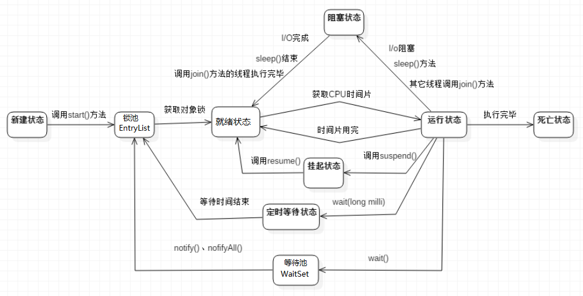

[TOC]

# 线程介绍

## 进程和线程

- 进程

  进程是资源分配的最小单位

  每个进程都有独立的代码和数据空间(进程上下文),进程间的切换会有较大的开销,一个进程包含多个线程

- 线程

  线程是cpu调度的最小单位
  
  同一类线程共享代码和数据空间,每个线程有独立的运行栈和程序计数器(PC),线程切换开销小

线程和进程一样,共分为5个阶段: 创建,就绪,运行,阻塞,终止

多进程是指操作系统能同时运行多个任务(程序)

多线程是指同一程序中有多个顺序流在执行

在java中要实现多线程,有三种方法

1. 继承Thread类
2. 实现Runnable接口
3. 实现Callable接口,并与Future类和线程池结合使用

## 并行和并发

并行: 指在同一时刻,有多条命令在多个处理器上同时执行,所以无论从微观还是从宏观上看,二者都是一起执行的


并发: 指在同一时刻只能有一条命令执行,但多个指令被快速的轮换执行,使得在宏观上具有同时执行的效果,但在微观上,只是把事情分成若干段,使得每一段能够快速的交替执行,而并不是同时执行


# 线程创建

## 继承Thread类

继承Thread类,并重写父类的run()方法

通过Thread类的start()方法启动线程

```java
public class Thread1 extends Thread {
    @Override
    public void run() {
        for(int i=0;i<100;i++){
            System.out.println(i);
        }
    }
    public static void main(String[] args) {
        new Thread1().start();
    }
}
```

## 实现Runnable接口

实现Runnable接口,并实现run()方法

将实现了Runnable接口的类传入Thread构造函数中,并调用start()方法启动线程

```java
public class RunnableThread implements Runnable {
    @Override
    public void run() {
        for(int i=0;i<100;i++){
            System.out.println(i);
        }
    }
    public static void main(String[] args) {
        new Thread(new RunnableThread()).start();
    }
}
```

## 实现Callable接口

略

# 线程状态转换

## 状态转换图



## 线程的5种状态

1. 新建状态(New)

   创建后尚未启动(未调用start()方法)

2. 就绪状态(Runnable)

   可以被运行,等待cpu分配时间片

3. 运行状态(Running)

   正在运行

4. 阻塞状态(Blocked)

   1. 等待阻塞: 线程位于等待池中,该线程已经释放了锁,等待被调用notify()方法来唤醒,从而进入锁池中
   2. 同步阻塞: 线程位于锁池中,和锁池中的线程争夺对象锁,争夺到锁后会进入到就绪状态
   3. 其他阻塞: 当调用sleep,join或者I/O请求时,会发生该种阻塞,该阻塞不会释放锁

5. 死亡状态(Dead)

   线程运行完毕或发生异常后终止

## 线程的生命周期

1. 当使用Thread构造函数创建线程后,该线程就会处于**新建状态**

2. 在**新建状态**时调用该线程的start()方法后,该线程会进入到锁池中,开始和锁池中的线程争夺锁,如果争夺到锁了,就会进入到**就绪状态**

   > 锁池指的是对象锁的锁池,每个对象都会有对应的一个锁池(如果把该对象当作一把锁,一般使用Object对象)
   >
   > 调用start()方法后,进入到锁池,一般来说是没有锁的,那么该线程就会直接进入到就绪状态,如果有锁,但是锁池中只有该线程,那么该线程会直接拿到锁,并进入到就绪状态,等到分配cpu时间片

3. 当线程处于**就绪状态**时,且系统调度选中了该线程(即将cpu的时间片分配给了该线程),则该线程就会进入到运行状态,那么该线程的run()方法中的代码也就被执行了

4. 当线程位于**运行状态**时

   1. 当时间片使用完,则重新变为**就绪状态**,该线程不会释放锁
   2. 当**调用sleep()**方法时,该线程进入**阻塞状态**(其他阻塞状态),该线程不会释放锁,等到sleep时间到达后,该线程又会从阻塞状态变为**就绪状态**,往复执行
   3. 当**调用join()**方法时,该线程进入**阻塞状态**(其他阻塞状态),该线程不会释放锁,等待加入的线程运行完毕之后,该线程会从**阻塞状态**变为**就绪状态**,往复执行
   4. 当**发生I/O请求**时,该线程进入**阻塞状态**(其他阻塞状态),该线程不会释放锁,当I/O请求完成后,该线程会从**阻塞状态**变为**就绪状态**,往复执行
   5. 当对象锁**调用wait()**方法时,该线程会进入到该对象锁的等待池中,该线程会释放锁,当再次调用该对象锁的notify()或notifyAll()时,该线程会从该对象锁的等待池进入到该对象锁的锁池,开始和锁池中的线程争夺该对象锁
   6. 当对象锁**调用wait(Long millis)**方法时,该线程会进入到该对象锁的等待池中,该线程会释放锁,等到等待的时间到达后,该线程会自动的从该对象锁的等待池中进入到该对象的锁池中,开始和锁池中的线程争夺该对象锁
   7. 当run()方法中代码执行完毕后,线程进入**死亡状态**

# 线程调度

在java中,实现线程的调度有6种方式:

1. 设置线程的优先级: thread.setPriority()

2. 线程睡眠: Thread.sleep(1000)

3. 线程等待: Object类中的wait()方法

4. 线程让步: Thread.yield()方法

5. 线程加入: thread.join()方法

6. 线程唤醒: Object类中的notify()方法


## 设置线程的优先级-setPriority()

调整线程的优先级,优先级高的线程会获得比较多的运行机会

java线程的优先级用整数表示,取值范围是1~10,Thread类有以下三个静态常量:

```java
//线程可以具有的最高优先级，取值为10
static int MAX_PRIORITY
//线程可以具有的最低优先级，取值为1
static int MIN_PRIORITY
//分配给线程的默认优先级，取值为5  
static int NORM_PRIORITY        
```

Thread类的setPriority()和getPriority()方法分别用来设置和获取线程的优先级

每个线程都有默认的优先级,主线程的默认优先级为Thread.NORM_PRIORITY(即为5)

线程的优先级有继承关系,比如A线程中创建了B线程,那么B将和A具有相同的优先级

## 线程睡眠-sleep()

使用Thread.sleep(long millis)方法,可以使得线程从运行状态转到阻塞状态; 当睡眠时间结束之后,该线程的状态就会从阻塞状态变为就绪状态

当调用sleep()方法后,当前的线程不会释放锁

## 线程等待-wait()

当对象锁调用wait()方法

- 当调用wait()方法后,线程会进入到对象锁的等待池中,直到该对象锁调用notify或notifyAll方法时,才会从等待池中进入到锁池中

- 当调用wait(long millis)方法后,,线程会进入到对象锁的等待池中,直到等待时间到达后,该线程会自动的从等待池中进入到锁池中

当被调用wait()方法后,线程会释放掉当前的锁

```java
public class Test1 {
    public static void main(String[] args) throws Exception {
        Object lock=new Object();//对象锁
        //创建并启动线程
        new Thread(()->{
            for(int i=0;i<6;i++){
                synchronized (lock){
                    if(i==3){//当i等于3的时候线程等待
                        try {
                            lock.wait();
                        } catch (InterruptedException e) {
                            e.printStackTrace();
                        }
                    }
                    System.out.println("thread1:"+i);
                }
            }
        }).start();

        Thread.sleep(1000);
        synchronized (lock){//延时1秒后唤醒lock对象的所有等待的线程
            lock.notifyAll();
        }

    }
}
```

## 线程让步-yield()

调用yield()方法的线程会让出cpu,即把当前正处于运行状态的线程变为就绪状态,给其他线程执行的机会

> 但是让出cpu后,不一定就会让其他线程执行,这个要看系统的调度,有可能该线程调用yield()方法让出cpu后,下一次的系统调用还是选中了该cpu(即又是该cpu获得了cpu的时间片),那么就又是该线程执行

## 线程加入-join()

让调用join()方法的线程加入到该线程中,该线程进入到阻塞状态,直到加入的线程执行完毕之后,该线程的状态由阻塞状态变为就绪状态,等待cpu时间片的分配

> 即等到加入的线程执行完毕后再继续执行

```java
public class Runnable3 implements Runnable{
    int b=0;

    @Override
    public void run() {
        try {
            Thread.sleep(1000);
        } catch (InterruptedException e) {
            e.printStackTrace();
        }
        System.out.println("线程执行结束,结果是:"+ b++);
    }

    public static void main(String[] args) throws InterruptedException {
        Runnable3 runnable3 = new Runnable3();
        Thread thread = new Thread(runnable3);
        thread.start();

        thread.join();//使用join使得子线程合并到主线程,直到子线程执行完毕之后主线程再继续执行
        System.out.println("main获取到的结果是:"+runnable3.b);
    }
}
```

> 运行结果: 
>
> 线程执行结束,结果是:0
>
> main获取到的结果是:1

## 线程唤醒-notify(),notifyAll()

对象锁调用notify()方法,唤醒该对象锁的等待池中的任意一个线程; 如果对象锁调用notifyAll()方法,则唤醒该对象锁的等待池中的所有线程

唤醒后的线程会从该对象锁的等待池进入到该对象锁的锁池

# 锁的分类

## 分类概览

从宏观上分:

- 乐观锁
- 悲观锁

从类型上分:

- 自旋锁(升级后变为自适应自旋锁)
- Synchronized的三种状态锁
  1. 偏向锁(默认状态)
  2. 轻量级锁
  3. 重量级锁

## 按宏观分类

### 乐观锁

### 悲观锁

## 按类型分类

### 自旋锁

### 自适应自旋锁

### synchronized的三种锁

#### 偏向锁

#### 轻量级锁

#### 重量级锁

# 关键字

## synchronized

## volatile

## atomic

# 线程通讯

# 线程池

# 参考文档

[Java多线程学习（吐血超详细总结）](https://blog.csdn.net/Evankaka/article/details/44153709)

https://blog.csdn.net/qq_41665476/article/details/80225592


# 备份

## Synchronized(线程同步)

- synchronized关键字
             [线程同步代码例程](onenote:#线程同步&section-id={9DEC1835-7FFA-4B37-A1A2-2ABC4043EFC6}&page-id={B8661B57-C646-4674-AE9E-7848C363E1B1}&object-id={D1B781DA-B910-01F3-2781-B439B3B22BAF}&DB&base-path=https://d.docs.live.net/07d36f4cf86fad8e/Documents/知识结构/java/java高级/多线程.one)

- - 线程安全问题的主要原因

  - - 存在共享数据（也称临界资源）
    - 存在多个线程共同操作这些共享数据

  - 解决方法

  - - 同一时刻有且只有一个线程在操作共享数据，其他线程必须等到该线程处理完数据之后再对共享数据进行操作

- 互斥锁的特性

- - 互斥性
                       即在同一时间只允许一个线程持有某个对象锁，通过这种特性来实现多线程的协调机制，这样在同一时间只有一个线程对需要同步的代码块(复合操作)进行访问;互斥性也成为操作的原子性
  - 可见性
                       必须确保在锁被释放之前,对共享变量所做的修改,对于随后获得该锁的另一个线程是可见的(即在获得锁时应获得最新共享变量的值),否则另一个线程可能实在本地缓存的某个副本上继续操作,从而引起不一致.

- **synchronized锁的不是代码,锁的都是对象**

- - 获取对象锁的两种方法

  - - 同步代码块(synchronized        (this){}或synchronized (lock){}),锁是小括号()中的实例对象.
    - 同步非静态方法(public synchronized        void m1()),锁是当前对象的实例对象(就是调用该方法的对象)

  - 获取类锁的两种方法

  - - 同步代码块(synchronized        (类.class){}),锁是小括号()中的类对象(Class对象)
    - 同步静态方法(public static        synchronized void m1()),锁是当前对象的类对象(Class对象)

  - 注意点
                 **对象锁如果是不同的对象,是锁不住的;而类锁只要是同一个类,就能够锁住**

- volatile关键字
             private volatile boolean      flag=true;//加上volatile关键字之后,该flag变量的改变,会马上同步到其他线程中(如果其他线程用到了该变量)

- 死锁
             [线程死锁](onenote:#线程同步&section-id={9DEC1835-7FFA-4B37-A1A2-2ABC4043EFC6}&page-id={B8661B57-C646-4674-AE9E-7848C363E1B1}&object-id={32E5CAE0-3087-08A2-36B7-E3674D1952DF}&3B&base-path=https://d.docs.live.net/07d36f4cf86fad8e/Documents/知识结构/java/java高级/多线程.one)

- 对象锁和类锁的总结

- - 属于不同锁的情况

  - - 类锁

    - - 在方法中直接使用synchronized(如public         synchronized void m1())时，这个时候是类锁
      - 在synchronized(this){}中的this代表的是这个类,也属于类锁
      - public static Object lock=new Object();//如果加上static关键字的话
                         synchronized(lock){} 
                         当中的lock就是类锁(因为static的变量对于一个类来说只有一个,所以当new不同实例时,每个对象中对应的这个lock都是一样的,所以能够锁住)

    - 对象锁

    - - Object lock=new         Object();
                         synchronized(lock){} 
                         当中的lock就是对象锁(当new不同的该实例对象时,这个lock对于每个对象来说都是局部变量,都是各不相同的,那么这个锁就没有作用了)

  - 类锁和对象锁的同步情况

  - - 类锁

    - - 当new了不同对象(当都属于一个类)时,类锁还能够保持同步的性质(因为这些不同的对象的类锁都是同一把锁)

    - 对象锁

    - - 当new了不同对象时,每个对象中都会有一个对象锁,那么线程争夺的就不是同一把锁,那么同步性质就会失效

  - 争夺锁的情况

  - - **类锁和对象锁** 锁的不是代码,而是对象
    - 每把锁都对应的一个锁池和等待池,当多个线程访问时,这些线程都会存在锁池中,只有一个线程可以从锁池中出来进行执行,当调用这把锁的wait()方法是,那么就会进入到这把锁对应的等待池中;(如果还有一把锁,那么这把锁的锁池和等待池和上一把锁的锁池和等待池是不同的)

- volatile和synchronized的区别

- - volatile本质是在告诉jvm当前变量在寄存器(工作内存)中的值是不确定的,需要从主存中读取;synchronized则是锁定当前变量,只有当前线程可以访问该变量,其他线程被阻塞住则到该线程完成变量操作为止
  - volatile仅能使用在变量级别;synchronized则可以使用在变量,方法和类级别
  - volatile仅能实现变量的修改可见性,不能保证原子性;而synchronized则可以保证变量修改的可见性和原子性
  - volatile不会造成线程的阻塞,而synchronized可能会造成线程的阻塞.
  - volatile标记的变量不会被编译器优化,synchronized标记的变量可以被编译器优化

```java
//线程不同步的例程(错误示范)
public class Test1 implements Runnable {
    
    public static int num=0;
    
    public static void main(String[] args) {
        Test1 test1 = new Test1();
        new Thread(test1).start();
        new Thread(test1).start();
    }

    @Override
    public void run() {
        num++;
        try {
            Thread.sleep(1);
        } catch (InterruptedException e) {
            e.printStackTrace();
        }
        System.out.println(Thread.currentThread().getName()+",num:"+num);
    }
}
//执行结果:
//Thread-0,num:2
//Thread-1,num:2

//线程同步的例程(正确示范)
public class Test1 implements Runnable {

    public static int num=0;

    public static void main(String[] args) {
        Test1 test1 = new Test1();
        new Thread(test1).start();
        new Thread(test1).start();
    }

    @Override
    public void run() {
        synchronized (this){
            num++;
            try {
                Thread.sleep(1);
            } catch (InterruptedException e) {
                e.printStackTrace();
            }
            System.out.println(Thread.currentThread().getName()+",num:"+num);
        }
    }
}
//执行结果:
//Thread-0,num:1
//Thread-1,num:2

//返回

```

```java
//线程死锁的例程
public class Test1 implements Runnable {

    public int flag=0;
    public static Object lock1=new Object();//锁必须是static的,否则就不能创建两个Test1类
    public static Object lock2=new Object();

    public Test1(int flag) {
        this.flag = flag;
    }

    @Override
    public void run() {
        if(flag==0){
            synchronized (lock1){//锁住lock1,并睡100毫秒,等待lock2被其他线程占用
                try {
                    Thread.sleep(100);
                } catch (InterruptedException e) {
                    e.printStackTrace();
                }
                synchronized (lock2){
                    System.out.println(Thread.currentThread().getName());
                }
            }
        }
        if(flag==1){
            synchronized (lock2){//锁住lock2,并睡200毫秒,等待lock1被其他线程占用
                try {
                    Thread.sleep(200);
                } catch (InterruptedException e) {
                    e.printStackTrace();
                }
                synchronized (lock1){
                    System.out.println(Thread.currentThread().getName());
                }
            }
        }
    }

    public static void main(String[] args) {
        new Thread(new Test1(0)).start();
        new Thread(new Test1(1)).start();
    }

}

//返回

```

## 锁的分类和底层原理

1. 锁的分类

2. 1. 从宏观上分:

   2. 1. [乐观锁](onenote:#锁的分类和底层原理&section-id={9DEC1835-7FFA-4B37-A1A2-2ABC4043EFC6}&page-id={C1C27330-6949-4920-A25C-31600460FC7F}&object-id={A06C269B-EED8-0708-2269-44359B97B88E}&C5&base-path=https://d.docs.live.net/07d36f4cf86fad8e/Documents/知识结构/java/java高级/多线程.one)
      2. [悲观锁](onenote:#锁的分类和底层原理&section-id={9DEC1835-7FFA-4B37-A1A2-2ABC4043EFC6}&page-id={C1C27330-6949-4920-A25C-31600460FC7F}&object-id={A06C269B-EED8-0708-2269-44359B97B88E}&CD&base-path=https://d.docs.live.net/07d36f4cf86fad8e/Documents/知识结构/java/java高级/多线程.one)

   3. 从类型上分:

   4. 1. [自旋锁](onenote:#锁的分类和底层原理&section-id={9DEC1835-7FFA-4B37-A1A2-2ABC4043EFC6}&page-id={C1C27330-6949-4920-A25C-31600460FC7F}&object-id={FA6BDD71-F90A-0EF5-2981-9DA494FD8A07}&B1&base-path=https://d.docs.live.net/07d36f4cf86fad8e/Documents/知识结构/java/java高级/多线程.one)(升级之后有[自适应自旋锁](onenote:#锁的分类和底层原理&section-id={9DEC1835-7FFA-4B37-A1A2-2ABC4043EFC6}&page-id={C1C27330-6949-4920-A25C-31600460FC7F}&object-id={7767419B-FAC6-03A4-3720-FE406FAF415A}&11&base-path=https://d.docs.live.net/07d36f4cf86fad8e/Documents/知识结构/java/java高级/多线程.one))

      2. Synchronized的四种状态(默认是偏向锁,jvm会自动的改变锁的类型)

      3. 1. 无锁
         2. [偏向锁](onenote:#锁的分类和底层原理&section-id={9DEC1835-7FFA-4B37-A1A2-2ABC4043EFC6}&page-id={C1C27330-6949-4920-A25C-31600460FC7F}&object-id={7820CD09-2020-06C0-380F-B5FDEF774574}&A3&base-path=https://d.docs.live.net/07d36f4cf86fad8e/Documents/知识结构/java/java高级/多线程.one)
         3. [轻量级锁](onenote:#锁的分类和底层原理&section-id={9DEC1835-7FFA-4B37-A1A2-2ABC4043EFC6}&page-id={C1C27330-6949-4920-A25C-31600460FC7F}&object-id={7767419B-FAC6-03A4-3720-FE406FAF415A}&7D&base-path=https://d.docs.live.net/07d36f4cf86fad8e/Documents/知识结构/java/java高级/多线程.one)
         4. [重量级锁](onenote:#锁的分类和底层原理&section-id={9DEC1835-7FFA-4B37-A1A2-2ABC4043EFC6}&page-id={C1C27330-6949-4920-A25C-31600460FC7F}&object-id={7767419B-FAC6-03A4-3720-FE406FAF415A}&AE&base-path=https://d.docs.live.net/07d36f4cf86fad8e/Documents/知识结构/java/java高级/多线程.one)
         5. [锁的比较(偏向锁,轻量级锁,重量级锁)](onenote:#锁的分类和底层原理&section-id={9DEC1835-7FFA-4B37-A1A2-2ABC4043EFC6}&page-id={C1C27330-6949-4920-A25C-31600460FC7F}&object-id={B1593776-09CF-0B5C-2AB6-B030B923D6AC}&1B&base-path=https://d.docs.live.net/07d36f4cf86fad8e/Documents/知识结构/java/java高级/多线程.one)

1. [锁在内存上的体现](onenote:#锁的分类和底层原理&section-id={9DEC1835-7FFA-4B37-A1A2-2ABC4043EFC6}&page-id={C1C27330-6949-4920-A25C-31600460FC7F}&object-id={8AF2EBBE-18B7-0CBE-210B-12175BAA3E77}&D0&base-path=https://d.docs.live.net/07d36f4cf86fad8e/Documents/知识结构/java/java高级/多线程.one)

2. 1. [锁的重入](onenote:#锁的分类和底层原理&section-id={9DEC1835-7FFA-4B37-A1A2-2ABC4043EFC6}&page-id={C1C27330-6949-4920-A25C-31600460FC7F}&object-id={2333B7DB-C680-054A-107F-A77166E99A7D}&F&base-path=https://d.docs.live.net/07d36f4cf86fad8e/Documents/知识结构/java/java高级/多线程.one)

1. 锁的优化

2. 1. [锁消除](onenote:#锁的分类和底层原理&section-id={9DEC1835-7FFA-4B37-A1A2-2ABC4043EFC6}&page-id={C1C27330-6949-4920-A25C-31600460FC7F}&object-id={BCBF1A6B-F326-02C9-1867-EC6A864A6A40}&2B&base-path=https://d.docs.live.net/07d36f4cf86fad8e/Documents/知识结构/java/java高级/多线程.one)
   2. [锁粗化](onenote:#锁的分类和底层原理&section-id={9DEC1835-7FFA-4B37-A1A2-2ABC4043EFC6}&page-id={C1C27330-6949-4920-A25C-31600460FC7F}&object-id={BCBF1A6B-F326-02C9-1867-EC6A864A6A40}&40&base-path=https://d.docs.live.net/07d36f4cf86fad8e/Documents/知识结构/java/java高级/多线程.one)

1. [java内存模型JMM](onenote:#锁的分类和底层原理&section-id={9DEC1835-7FFA-4B37-A1A2-2ABC4043EFC6}&page-id={C1C27330-6949-4920-A25C-31600460FC7F}&object-id={2333B7DB-C680-054A-107F-A77166E99A7D}&23&base-path=https://d.docs.live.net/07d36f4cf86fad8e/Documents/知识结构/java/java高级/多线程.one)

2. 1. [内存交互操作](onenote:#锁的分类和底层原理&section-id={9DEC1835-7FFA-4B37-A1A2-2ABC4043EFC6}&page-id={C1C27330-6949-4920-A25C-31600460FC7F}&object-id={0532D82D-3323-0870-2B94-58E84F06CFA7}&77&base-path=https://d.docs.live.net/07d36f4cf86fad8e/Documents/知识结构/java/java高级/多线程.one)
   2. [Happen-Before](onenote:#锁的分类和底层原理&section-id={9DEC1835-7FFA-4B37-A1A2-2ABC4043EFC6}&page-id={C1C27330-6949-4920-A25C-31600460FC7F}&object-id={0532D82D-3323-0870-2B94-58E84F06CFA7}&9C&base-path=https://d.docs.live.net/07d36f4cf86fad8e/Documents/知识结构/java/java高级/多线程.one)

### 乐观锁

总是假设最好的情况，每次去拿数据的时候都认为别人不会修改，所以不会上锁，但是在更新的时候会判断一下在此期间别人有没有去更新这个数据，可以使用版本号机制和CAS算法实现。乐观锁适用于多读的应用类型，这样可以提高吞吐量，像数据库提供的类似于write_condition机制，其实都是提供的乐观锁。在Java中java.util.concurrent.atomic包下面的原子变量类就是使用了乐观锁的一种实现方式CAS实现的。

 

CAS(compare and swap)

- 一种高效实现线程安全性的方法


- CAS多数情况下对开发者来说是透明的


- 缺点


 

### 悲观锁

总是假设最坏的情况，每次去拿数据的时候都认为别人会修改，所以每次在拿数据的时候都会上锁，这样别人想拿这个数据就会阻塞直到它拿到锁（共享资源每次只给一个线程使用，其它线程阻塞，用完后再把资源转让给其它线程）。传统的关系型数据库里边就用到了很多这种锁机制，比如行锁，表锁等，读锁，写锁等，都是在做操作之前先上锁。Java中synchronized和ReentrantLock等独占锁就是悲观锁思想的实现。

 

两种锁的使用场景 

从上面对两种锁的介绍，我们知道两种锁各有优缺点，不可认为一种好于另一种，像乐观锁适用于写比较少的情况下（多读场景），即冲突真的很少发生的时候，这样可以省去了锁的开销，加大了系统的整个吞吐量。但如果是多写的情况，一般会经常产生冲突，这就会导致上层应用会不断的进行retry，这样反倒是降低了性能，所以一般多写的场景下用悲观锁就比较合适。

 

### 自旋锁

首先，内核态与用户态的切换上不容易优化。但**通过自旋锁，可以减少线程阻塞造成的线程切换**（包括挂起线程和恢复线程）。

如果锁的粒度小，那么**锁的持有时间比较短**（尽管具体的持有时间无法得知，但可以认为，通常有一部分锁能满足上述性质）。那么，对于竞争这些锁的而言，因为锁阻塞造成线程切换的时间与锁持有的时间相当，减少线程阻塞造成的线程切换，能得到较大的性能提升。具体如下：

- 当前线程竞争锁失败时，打算阻塞自己
- 不直接阻塞自己，而是自旋（空等待，比如一个空的有限for循环）一会
- 在自旋的同时重新竞争锁
- 如果自旋结束前获得了锁，那么锁获取成功；否则，自旋结束后阻塞自己

*如果在自旋的时间内，锁就被旧owner释放了，那么当前线程就不需要阻塞自己*（也不需要在未来锁释放时恢复），减少了一次线程切换。

“锁的持有时间比较短”这一条件可以放宽。实际上，只要锁竞争的时间比较短（比如线程1快释放锁的时候，线程2才会来竞争锁），就能够提高自旋获得锁的概率。这通常发生在**锁持有时间长，但竞争不激烈**的场景中。

 

**Java如何实现自旋锁**


lock（)方法利用的CAS，当第一个线程A获取锁的时候，能够成功获取到，不会进入while循环，如果此时线程A没有释放锁，另一个线程B又来获取锁，此时由于不满足CAS，所以就会进入while循环，不断判断是否满足CAS，直到A线程调用unlock方法释放了该锁。

 

**自旋锁存在的问题**

1. 单核处理器上，不存在实际的并行，当前线程不阻塞自己的话，旧owner就不能执行，锁永远不会释放，此时不管自旋多久都是浪费；进而，如果线程多而处理器少，自旋也会造成不少无谓的浪费。
2. 自旋锁要占用CPU，如果是计算密集型任务，这一优化通常得不偿失，减少锁的使用是更好的选择。
3. 如果锁竞争的时间比较长，那么自旋通常不能获得锁，白白浪费了自旋占用的CPU时间。这通常发生在锁持有时间长，且竞争激烈的场景中，此时应主动禁用自旋锁。

**自旋锁的优点**
```java
public class SpinLock {
    private AtomicReference<Thread> cas = new AtomicReference<Thread>();
    public void lock() {
        Thread current = Thread.currentThread();
        // 利用CAS
        while (!cas.compareAndSet(null, current)) {
            // DO nothing
        }
    }
    public void unlock() {
        Thread current = Thread.currentThread();
        cas.compareAndSet(current, null);
    }
}
```
1. 自旋锁不会使线程状态发生切换，一直处于用户态，即线程一直都是active的；不会使线程进入阻塞状态，减少了不必要的上下文切换，执行速度快
2. 非自旋锁在获取不到锁的时候会进入阻塞状态，从而进入内核态，当获取到锁的时候需要从内核态恢复，需要线程上下文切换。      （线程被阻塞后便进入内核（Linux）调度状态，这个会导致系统在用户态与内核态之间来回切换，严重影响锁的性能）

 

 

### 自适应自旋锁

自适应意味着自旋的时间不再固定了，而是由前一次在同一个锁上的自旋时间及锁的拥有者的状态来决定：

- 如果在同一个锁对象上，自旋等待刚刚成功获得过锁，并且持有锁的线程正在运行中，那么虚拟机就会认为这次自旋也很有可能再次成功，进而它将允许自旋等待持续相对更长的时间，比如100个循环。
- 相反的，如果对于某个锁，自旋很少成功获得过，那在以后要获取这个锁时将可能减少自旋时间甚至省略自旋过程，以避免浪费处理器资源。

**自适应自旋解决的是“锁竞争时间不确定”的问题**。JVM很难感知到确切的锁竞争时间，而交给用户分析就违反了JVM的设计初衷。*自适应自旋假定不同线程持有同一个锁对象的时间基本相当，竞争程度趋于稳定，因此，可以根据上一次自旋的时间与结果调整下一次自旋的时间*。

**缺点**

然而，自适应自旋也没能彻底解决该问题，*如果默认的自旋次数设置不合理（过高或过低），那么自适应的过程将很难收敛到合适的值*。

 

 

### 偏向锁

在没有实际竞争的情况下，还能够针对部分场景继续优化。如果不仅仅没有实际竞争，自始至终，使用锁的线程都只有一个，那么，维护轻量级锁都是浪费的。**偏向锁的目标是，减少无竞争且只有一个线程使用锁的情况下，使用轻量级锁产生的性能消耗**。轻量级锁每次申请、释放锁都至少需要一次CAS，但偏向锁只有初始化时需要一次CAS。

“偏向”的意思是，*偏向锁假定将来只有第一个申请锁的线程会使用锁*（不会有任何线程再来申请锁），因此，*只需要在Mark Word中CAS记录owner（本质上也是更新，但初始值为空），如果记录成功，则偏向锁获取成功*，记录锁状态为偏向锁，*以后当前线程等于owner就可以零成本的直接获得锁；否则，说明有其他线程竞争，膨胀为轻量级锁*。

偏向锁无法使用自旋锁优化，因为一旦有其他线程申请锁，就破坏了偏向锁的假定。

- 减少同一线程获取锁的代价

- 大多数情况下,锁不存在多线程竞争,总是由同一线程多次获得

- 核心思想

- - 如果一个线程获得了锁,那么锁就进入偏向模式,此时Mark       Word的结构也变为偏向锁结构,当该线程再次请求锁时,无需再做任何同步操作,即获取锁的过程只需要检查Mark       Word的锁标志位为偏向锁以及当前线程Id等于Mark Word的ThreadId即可,这样就省去了大量有关锁申请的操作

- 不适用于锁竞争比较激烈的多线程场合

**缺点**

同样的，如果明显存在其他线程申请锁，那么偏向锁将很快膨胀为轻量级锁。

 

### 轻量级锁

自旋锁的目标是降低线程切换的成本。如果锁竞争激烈，我们不得不依赖于重量级锁，让竞争失败的线程阻塞；如果完全没有实际的锁竞争，那么申请重量级锁都是浪费的。**轻量级锁的目标是，减少无实际竞争情况下，使用重量级锁产生的性能消耗**，包括系统调用引起的内核态与用户态切换、线程阻塞造成的线程切换等。

顾名思义，轻量级锁是相对于重量级锁而言的。使用轻量级锁时，不需要申请互斥量，仅仅*将Mark Word中的部分字节CAS更新指向线程栈中的Lock Record，如果更新成功，则轻量级锁获取成功*，记录锁状态为轻量级锁；*否则，说明已经有线程获得了轻量级锁，目前发生了锁竞争（不适合继续使用轻量级锁），接下来膨胀为重量级锁*。

- 轻量级锁是由偏向锁升级得到,偏向锁运行在一个线程进入同步块的情况下,当的第二个线程加入锁争用的时候,偏向锁就会升级为轻量级锁

- 适应场景

- - 线程交替执行同步块
  - 若存在同一时间访问同一锁的情况,就会导致轻量级锁膨胀为重量级锁

 

### 重量级锁

内置锁在Java中被抽象为监视器锁（monitor）。在JDK 1.6之前，监视器锁可以认为直接对应底层操作系统中的互斥量（mutex）。这种同步方式的成本非常高，包括系统调用引起的内核态与用户态切换、线程阻塞造成的线程切换等。因此，后来称这种锁为“重量级锁”。

 

**底层实现**

java通过java对象头和Monitor来实现synchronized的同步功能

- 对象头


 


- Monitor

- - 每个java对象天生自带了一把看不见的锁


 

### 锁的比较(偏向锁,轻量级锁,重量级锁)


 


 

 

### 锁在内存上的体现

- 当线程释放锁时,java内存模式会把该线程对应的本地内存中的共享变量刷新到主内存中;
- 而当线程获取锁时,java内存模型会吧该线程对应的本地内存置为无效,从而使得被监视器保护的临界区代码必须从主内存中读取共享变量,从而更新了最新的数据

 

### 锁的重入


synchronized可重入性

同一线程在调用自己类中其他synchronized方法/块或调用父类的synchronized方法/块都不会阻碍该线程的执行，就是说同一线程对同一个对象锁是可重入的，而且同一个线程可以获取同一把锁多次，也就是可以多次重入。

 

 

### 锁消除

- 更彻底的优化
- JIT编译时,对运行上下文进行扫描,去除不可能存在竞争的锁(去掉毫无意义的锁)

 

锁消除是发生在编译器级别的一种锁优化方式。

有时候我们写的代码完全不需要加锁，却执行了加锁操作。

 

比如，StringBuffer类的append操作：

```java
@Override
public synchronized StringBuffer append(String str) {
    toStringCache = null;
    super.append(str);
    return this;
}
```


从源码中可以看出，append方法用了synchronized关键词，它是线程安全的。但我们可能仅在线程内部把StringBuffer当作局部变量使用：

```java
package com.leeib.thread;
public class Demo {
    public static void main(String[] args) {
        long start = System.currentTimeMillis();
        int size = 10000;
        for (int i = 0; i < size; i++) {
            createStringBuffer("Hyes", "为分享技术而生");
        }
        long timeCost = System.currentTimeMillis() - start;
        System.out.println("createStringBuffer:" + timeCost + " ms");
    }
    public static String createStringBuffer(String str1, String str2) {
        StringBuffer sBuf = new StringBuffer();
        sBuf.append(str1);// append方法是同步操作
        sBuf.append(str2);
        return sBuf.toString();
    }
}

```


代码中createStringBuffer方法中的局部对象sBuf，就只在该方法内的作用域有效，不同线程同时调用createStringBuffer()方法时，都会创建不同的sBuf对象，因此此时的append操作若是使用同步操作，就是白白浪费的系统资源。

 

 

### 锁粗化

通常情况下，为了保证多线程间的有效并发，会要求每个线程持有锁的时间尽可能短，但是大某些情况下，一个程序对同一个锁不间断、高频地请求、同步与释放，会消耗掉一定的系统资源，因为锁的请求、同步与释放本身会带来性能损耗，这样高频的锁请求就反而不利于系统性能的优化了，虽然单次同步操作的时间可能很短。**锁粗化就是告诉我们任何事情都有个度，有些情况下我们反而希望把很多次锁的请求合并成一个请求，以降低短时间内大量锁请求、同步、释放带来的性能损耗。**

 

- 通过扩大加锁的范围,避免反复加锁和解锁

 

一种极端的情况如下：

```java
public void doSomethingMethod(){
    synchronized(lock){
        //do some thing
    }
    //这是还有一些代码，做其它不需要同步的工作，但能很快执行完毕
    synchronized(lock){
        //do other thing
    }
}

```


上面的代码是有两块需要同步操作的，但在这两块需要同步操作的代码之间，需要做一些其它的工作，而这些工作只会花费很少的时间，那么我们就可以把这些工作代码放入锁内，将两个同步代码块合并成一个，以降低多次锁请求、同步、释放带来的系统性能消耗，合并后的代码如下:

```java
public void doSomethingMethod(){
    //进行锁粗化：整合成一次锁请求、同步、释放
    synchronized(lock){
        //do some thing
        //做其它不需要同步但能很快执行完的工作
        //do other thing
    }
}

```


另一种需要锁粗化的极端的情况是：

```java
for(int i=0;i<size;i++){
    synchronized(lock){
    }
}

```


上面代码每次循环都会进行锁的请求、同步与释放，看起来貌似没什么问题，且在jdk内部会对这类代码锁的请求做一些优化，但是还不如把加锁代码写在循环体的外面，这样一次锁的请求就可以达到我们的要求，除非有特殊的需要：循环需要花很长时间，但其它线程等不起，要给它们执行的机会。

锁粗化后的代码如下：

```java
synchronized(lock){
    for(int i=0;i<size;i++){
    }
}

```


 

 

### java内存模型JMM

**什么是****JMM**

JMM即为JAVA 内存模型（java memory model）。因为在不同的硬件生产商和不同的操作系统下，内存的访问逻辑有一定的差异，结果就是当你的代码在某个系统环境下运行良好，并且线程安全，但是换了个系统就出现各种问题。Java内存模型，就是为了屏蔽系统和硬件的差异，让一套代码在不同平台下能到达相同的访问结果。JMM从java 5开始的JSR-133发布后，已经成熟和完善起来。

**内存划分**

JMM规定了内存主要划分为主内存和工作内存两种。此处的主内存和工作内存跟JVM内存划分（堆、栈、方法区）是在不同的层次上进行的，如果非要对应起来，主内存对应的是Java堆中的对象实例部分，工作内存对应的是栈中的部分区域，从更底层的来说，主内存对应的是硬件的物理内存，工作内存对应的是寄存器和高速缓存。


JVM在设计时候考虑到，如果JAVA线程每次读取和写入变量都直接操作主内存，对性能影响比较大，所以每条线程拥有各自的工作内存，工作内存中的变量是主内存中的一份拷贝，线程对变量的读取和写入，直接在工作内存中操作，而不能直接去操作主内存中的变量。但是这样就会出现一个问题，当一个线程修改了自己工作内存中变量，对其他线程是不可见的，会导致线程不安全的问题。因为JMM制定了一套标准来保证开发者在编写多线程程序的时候，能够控制什么时候内存会被同步给其他线程。

 

jvm会为每个线程创建一个工作内存,用来存储线程的私有的数据,而java内存模型中规定所有变量都存储在主内存中,主内存是共享内存区域,所有线程都可以访问,当线程对主内存中的变量的操作(读取,赋值等),必须在线程的私有空间中进行,首先要将变量拷贝到私有的工作空间中,然后对变量进行操作,操作完成之后,再将变量写回主内存,线程不能直接操作主内存中的共享变量;线程不能访问其他线程的私有工作空间.线程间的传值必须要通过主内存才能实现 

 

- JMM中的主内存

- - 存储java实例对象
  - 包括成员变量,类信息,常量,静态变量等
  - 属于数据共享的区域,多线程并发操作时会引发线程安全问题

- JMM中的工作内存(线程的私有栈空间)

- - 存储当前方法的所有本地变量信息,本地变量对其他线程不可见
  - 字节码行号指示器.Native方法信息
  - 属于线程私有数据区域,不存在线程安全问题

 

JMM中的主内存和工作内存的区别

- JMM和java内存区域划分的不同层次

- - JMM描述的是一组规则,围绕原子性,有序性,可见性展开
  - 相似点: 存在共享区域和私有区域

- 主内存和工作内存的数据存储类型以及操作方式归纳

- - 方法里的基本数据类型本地变量间直接存储在工作内存的栈帧结构中
  - 引用类型的本地变量: 引用存储在工作内存中,实例存储在主内存中
  - 成员变量,static变量,类信息均被存储在主内存中
  - 主内存共享的方式是线程各拷贝一份数据到工作内存,操作完成后刷新回主内存

 

### 内存交互操作

 内存交互操作有8种，虚拟机实现必须保证每一个操作都是原子的，不可在分的（对于double和long类型的变量来说，load、store、read和write操作在某些平台上允许例外）

- lock          （锁定）：作用于主内存的变量，把一个变量标识为线程独占状态
- unlock （解锁）：作用于主内存的变量，它把一个处于锁定状态的变量释放出来，释放后的变量才可以被其他线程锁定
- read         （读取）：作用于主内存变量，它把一个变量的值从主内存传输到线程的工作内存中，以便随后的load动作使用
- load          （载入）：作用于工作内存的变量，它把read操作从主存中变量放入工作内存中
- use           （使用）：作用于工作内存中的变量，它把工作内存中的变量传输给执行引擎，每当虚拟机遇到一个需要使用到变量的值，就会使用到这个指令
- assign       （赋值）：作用于工作内存中的变量，它把一个从执行引擎中接受到的值放入工作内存的变量副本中
- store         （存储）：作用于主内存中的变量，它把一个从工作内存中一个变量的值传送到主内存中，以便后续的write使用
- write （写入）：作用于主内存中的变量，它把store操作从工作内存中得到的变量的值放入主内存的变量中

JMM对这八种指令的使用，制定了如下规则：

- 不允许read和load、store和write操作之一单独出现。即使用了read必须load，使用了store必须write
- 不允许线程丢弃他最近的assign操作，即工作变量的数据改变了之后，必须告知主存
- 不允许一个线程将没有assign的数据从工作内存同步回主内存
- 一个新的变量必须在主内存中诞生，不允许工作内存直接使用一个未被初始化的变量。就是怼变量实施use、store操作之前，必须经过assign和load操作
- 一个变量同一时间只有一个线程能对其进行lock。多次lock后，必须执行相同次数的unlock才能解锁
- 如果对一个变量进行lock操作，会清空所有工作内存中此变量的值，在执行引擎使用这个变量前，必须重新load或assign操作初始化变量的值
- 如果一个变量没有被lock，就不能对其进行unlock操作。也不能unlock一个被其他线程锁住的变量
- 对一个变量进行unlock操作之前，必须把此变量同步回主内存

 

JMM对这八种操作规则和对volatile的一些特殊规则就能确定哪里操作是线程安全，哪些操作是线程不安全的了。但是这些规则实在复杂，很难在实践中直接分析。所以一般我们也不会通过上述规则进行分析。更多的时候，使用java的happen-before规则来进行分析。

 

**模型特征**

**原子性：**例如上面八项操作，在操作系统里面是不可分割的单元。被synchronized关键字或其他锁包裹起来的操作也可以认为是原子的。从一个线程观察另外一个线程的时候，看到的都是一个个原子性的操作。


例如一个线程观察另外一个线程执行上面的代码，只能看到a、b都被赋值成功结果，或者a、b都尚未被赋值的结果。

**可见性：**每个工作线程都有自己的工作内存，所以当某个线程修改完某个变量之后，在其他的线程中，未必能观察到该变量已经被修改。volatile关键字要求被修改之后的变量要求立即更新到主内存，每次使用前从主内存处进行读取。因此volatile可以保证可见性。除了volatile以外，synchronized和final也能实现可见性。synchronized保证unlock之前必须先把变量刷新回主内存。final修饰的字段在构造器中一旦完成初始化，并且构造器没有this逸出，那么其他线程就能看到final字段的值。

**有序性：**java的有序性跟线程相关。如果在线程内部观察，会发现当前线程的一切操作都是有序的。如果在线程的外部来观察的话，会发现线程的所有操作都是无序的。因为JMM的工作内存和主内存之间存在延迟，而且java会对一些指令进行重新排序。volatile和synchronized可以保证程序的有序性，很多程序员只理解这两个关键字的执行互斥，而没有很好的理解到volatile和synchronized也能保证指令不进行重排序。

 

**volatile和synchronized的区别**


 

**JMM****如何解决可见性问题**


 

### Happen-Before

(先行发生规则),在常规的开发中，如果我们通过上述规则来分析一个并发程序是否安全，估计脑壳会很疼。因为更多时候，我们是分析一个并发程序是否安全，其实都依赖Happen-Before原则进行分析。Happen-Before被翻译成先行发生原则，意思就是当A操作先行发生于B操作，则在发生B操作的时候，操作A产生的影响能被B观察到，“影响”包括修改了内存中的共享变量的值、发送了消息、调用了方法等。

Happen-Before的规则有以下几条

- 程序次序规则（Program      Order Rule）：在一个线程内，程序的执行规则跟程序的书写规则是一致的，从上往下执行。
- 管程锁定规则（Monitor Lock      Rule）：一个Unlock的操作肯定先于下一次Lock的操作。这里必须是同一个锁。同理我们可以认为在synchronized同步同一个锁的时候，锁内先行执行的代码，对后续同步该锁的线程来说是完全可见的。
- volatile变量规则（volatile      Variable Rule）：对同一个volatile的变量，先行发生的写操作，肯定早于后续发生的读操作
- 线程启动规则（Thread Start      Rule）：Thread对象的start()方法先行发生于此线程的没一个动作
- 线程中止规则（Thread      Termination Rule）：Thread对象的中止检测（如：Thread.join()，Thread.isAlive()等）操作，必行晚于线程中所有操作
- 线程中断规则（Thread      Interruption Rule）：对线程的interruption（）调用，先于被调用的线程检测中断事件(Thread.interrupted())的发生
- 对象中止规则（Finalizer      Rule）：一个对象的初始化方法先于一个方法执行Finalizer()方法
- 传递性（Transitivity）：如果操作A先于操作B、操作B先于操作C,则操作A先于操作C

 

**Happen-Before****的概念**


## 线程池

1. [什么是线程池](onenote:#线程池&section-id={9DEC1835-7FFA-4B37-A1A2-2ABC4043EFC6}&page-id={918F12AF-41D6-4CF2-B1B6-BF441BD8D3D2}&object-id={6B8DB11E-031B-0D74-154D-2863F581AD2E}&69&base-path=https://d.docs.live.net/07d36f4cf86fad8e/Documents/知识结构/java/java高级/多线程.one)

2. [为什么要用线程池](onenote:#线程池&section-id={9DEC1835-7FFA-4B37-A1A2-2ABC4043EFC6}&page-id={918F12AF-41D6-4CF2-B1B6-BF441BD8D3D2}&object-id={6B8DB11E-031B-0D74-154D-2863F581AD2E}&85&base-path=https://d.docs.live.net/07d36f4cf86fad8e/Documents/知识结构/java/java高级/多线程.one)

3. [线程池的作用](onenote:#线程池&section-id={9DEC1835-7FFA-4B37-A1A2-2ABC4043EFC6}&page-id={918F12AF-41D6-4CF2-B1B6-BF441BD8D3D2}&object-id={6B8DB11E-031B-0D74-154D-2863F581AD2E}&91&base-path=https://d.docs.live.net/07d36f4cf86fad8e/Documents/知识结构/java/java高级/多线程.one)

4. [线程池的状态及转换](onenote:#线程池&section-id={9DEC1835-7FFA-4B37-A1A2-2ABC4043EFC6}&page-id={918F12AF-41D6-4CF2-B1B6-BF441BD8D3D2}&object-id={6B484DEF-3B2A-02FC-0134-B44C73E32A51}&B5&base-path=https://d.docs.live.net/07d36f4cf86fad8e/Documents/知识结构/java/java高级/多线程.one)

5. [线程池的大小如何选定](onenote:#线程池&section-id={9DEC1835-7FFA-4B37-A1A2-2ABC4043EFC6}&page-id={918F12AF-41D6-4CF2-B1B6-BF441BD8D3D2}&object-id={9829CCF9-FB45-03A4-1C96-FD249EC48E06}&D4&base-path=https://d.docs.live.net/07d36f4cf86fad8e/Documents/知识结构/java/java高级/多线程.one)

6. [Executor框架](onenote:#线程池&section-id={9DEC1835-7FFA-4B37-A1A2-2ABC4043EFC6}&page-id={918F12AF-41D6-4CF2-B1B6-BF441BD8D3D2}&object-id={BC7D6D20-9E3E-0D0C-2EC2-BCC00D18AB99}&86&base-path=https://d.docs.live.net/07d36f4cf86fad8e/Documents/知识结构/java/java高级/多线程.one)

7. 1. [利用Executors创建不同的线程池](onenote:#线程池&section-id={9DEC1835-7FFA-4B37-A1A2-2ABC4043EFC6}&page-id={918F12AF-41D6-4CF2-B1B6-BF441BD8D3D2}&object-id={6B8DB11E-031B-0D74-154D-2863F581AD2E}&A1&base-path=https://d.docs.live.net/07d36f4cf86fad8e/Documents/知识结构/java/java高级/多线程.one)

 

 

### 什么是线程池

​    线程池是指在初始化一个多线程应用程序过程中创建一个线程集合，然后在需要执行新的任务时重用这些线程而不是新建一个线程（提高线程复用，减少性能开销）。线程池中线程的数量通常完全取决于可用内存数量和应用程序的需求。然而，增加可用线程数量是可能的。线程池中的每个线程都有被分配一个任务，一旦任务已经完成了，线程回到池子中然后等待下一次分配任务。 

### 为什么要用线程池

概括

- 降低资源消耗
- 提高线程的可管理性

 

  基于以下几个原因在多线程应用程序中使用线程池是必须的：

1. 线程池改进了一个应用程序的响应时间。由于线程池中的线程已经准备好且等待被分配任务，应用程序可以直接拿来使用而不用新建一个线程。
2. 线程池节省了CLR      为每个短生存周期任务创建一个完整的线程的开销并可以在任务完成后回收资源。
3. 线程池根据当前在系统中运行的进程来优化线程时间片。
4. 线程池允许我们开启多个任务而不用为每个线程设置属性。
5. 线程池允许我们为正在执行的任务的程序参数传递一个包含状态信息的对象引用。
6. 线程池可以用来解决处理一个特定请求最大线程数量限制问题。

本质上来讲，我们使用线程池主要就是为了减少了创建和销毁线程的次数，每个工作线程都可以被重复利用，可执行多个任务；节约应用内存（线程开的越多，消耗的内存也就越大，最后死机）

 

### 线程池的作用

​    线程池作用就是限制系统中执行线程的数量。根据系统的环境情况，可以自动或手动设置线程数量，达到运行的最佳效果；少了浪费了系统资源，多了造成系统拥挤效率不高。用线程池控制线程数量，其他线程排队等候。一个任务执行完毕，再从队列中取最前面的任务开始执行。若队列中没有等待进程，线程池的这一资源处于等待。当一个新任务需要运行时，如果线程池中有等待的工作线程，就可以开始运行了；否则进入等待队列。

 

### 线程池的状态及转换


 


 

### 线程池的大小如何选定


### Executor框架

**JUC****包下的三个****Executor****接口**

1. Executor: 运行新任务的简单接口,将任务提交和任务执行细节解耦
2. ExecutorService: 具备管理执行器和任务生命周期的方法,提交任务机制更完善
3. ScheduleExecutorService:      支持Future和定期执行任务


 

**新任务提交****execute****执行后的判断**

- 如果运行的线程少于corePoolSize,则创建新线程来处理任务,即使线程池中的其他线程是空闲的
- 如果线程池中的线程数量大于等于corePoolSize且小于maximumPoolSize,则只有当workQueue满时才创建新的线程去处理任务
- 如果设置的corePoolSize和maximumPoolSize相同,则创建的线程池的大小是固定的,这是如果有新任务提交,若workQueue未满,则将请求放入workQueue中,等待有空闲的线程去从workQueue中取任务并处理
- 如果运行的线程数据大于maximumPoolSize,这是如果workQueue已经满了,则通过handler所指定的策略来处理任务

流程图


 

**ThreadPoolExecutor**


 

### 利用Executors创建不同的线程池

1. newFixedThreadPool(int      nThreads)
              指定工作线程数量的线程池

2. newCachedThreadPool()
              处理大量短时间工作任务的线程池

3. 1. 试图缓存线程并重用,当无缓存线程可用时,就会创建新的工作线程
   2. 如果线程闲置的时间超过阈值,则会被终止并移除缓存
   3. 系统长时间闲置的时候,不会消耗什么资源

1. newSingleThreadExecutor()
              创建唯一的工作者线程来执行任务,如果线程异常结束,会有另一个线程取代他

2. newSingleThreadScheduleExecutor()与newScheduleThreadPool(int      corePoolSize)
              定时货值周期性的工作调度,两者的区别在于单一工作线程还是多个线程

3. newWorkStealingPool()
              内部会构建ForkJoinPool,利用working-stealing算法,并行的处理任务,不保证处理顺序

4. 1. Fork/Join框架
                   把大任务分割成若干个小任务并行的执行,最终汇总每个小任务结果后得到大任务结果的框架
                    


 

 

 