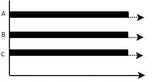

[TOC]

# 线程介绍

## 进程和线程

- 进程

  进程是资源分配的最小单位

  每个进程都有独立的代码和数据空间(进程上下文),进程间的切换会有较大的开销,一个进程包含多个线程

- 线程

  线程是cpu调度的最小单位
  
  同一类线程共享代码和数据空间,每个线程有独立的运行栈和程序计数器(PC),线程切换开销小

线程和进程一样,共分为5个阶段: 创建,就绪,运行,阻塞,终止

多进程是指操作系统能同时运行多个任务(程序)

多线程是指同一程序中有多个顺序流在执行

在java中要实现多线程,有三种方法

1. 继承Thread类
2. 实现Runnable接口
3. 实现Callable接口,并与Future类和线程池结合使用

## 并行和并发

并行: 指在同一时刻,有多条命令在多个处理器上同时执行,所以无论从微观还是从宏观上看,二者都是一起执行的



并发: 指在同一时刻只能有一条命令执行,但多个指令被快速的轮换执行,使得在宏观上具有同时执行的效果,但在微观上,只是把事情分成若干段,使得每一段能够快速的交替执行,而并不是同时执行


# 线程创建

## 继承Thread类

继承Thread类,并重写父类的run()方法

通过Thread类的start()方法启动线程

```java
public class Thread1 extends Thread {
    @Override
    public void run() {
        for(int i=0;i<100;i++){
            System.out.println(i);
        }
    }
    public static void main(String[] args) {
        new Thread1().start();
    }
}
```

## 实现Runnable接口

实现Runnable接口,并实现run()方法

将实现了Runnable接口的类传入Thread构造函数中,并调用start()方法启动线程

```java
public class RunnableThread implements Runnable {
    @Override
    public void run() {
        for(int i=0;i<100;i++){
            System.out.println(i);
        }
    }
    public static void main(String[] args) {
        new Thread(new RunnableThread()).start();
    }
}
```

## 实现Callable接口

略

# 线程状态转换

## 状态转换图


## 线程的5种状态

1. 新建状态(New)

   创建后尚未启动(未调用start()方法)

2. 就绪状态(Runnable)

   可以被运行,等待cpu分配时间片

3. 运行状态(Running)

   正在运行

4. 阻塞状态(Blocked)

   1. 等待阻塞: 线程位于等待池中,该线程已经释放了锁,等待被调用notify()方法来唤醒,从而进入锁池中
   2. 同步阻塞: 线程位于锁池中,和锁池中的线程争夺对象锁,争夺到锁后会进入到就绪状态
   3. 其他阻塞: 当调用sleep,join或者I/O请求时,会发生该种阻塞,该阻塞不会释放锁

5. 死亡状态(Dead)

   线程运行完毕或发生异常后终止

## 线程的生命周期

1. 当使用Thread构造函数创建线程后,该线程就会处于**新建状态**

2. 在**新建状态**时调用该线程的start()方法后,该线程会进入到锁池中,开始和锁池中的线程争夺锁,如果争夺到锁了,就会进入到**就绪状态**

   > 锁池指的是对象锁的锁池,每个对象都会有对应的一个锁池(如果把该对象当作一把锁,一般使用Object对象)
   >
   > 调用start()方法后,进入到锁池,一般来说是没有锁的,那么该线程就会直接进入到就绪状态,如果有锁,但是锁池中只有该线程,那么该线程会直接拿到锁,并进入到就绪状态,等到分配cpu时间片

3. 当线程处于**就绪状态**时,且系统调度选中了该线程(即将cpu的时间片分配给了该线程),则该线程就会进入到运行状态,那么该线程的run()方法中的代码也就被执行了

4. 当线程位于**运行状态**时

   1. 当时间片使用完,则重新变为**就绪状态**,该线程不会释放锁
   2. 当**调用sleep()**方法时,该线程进入**阻塞状态**(其他阻塞状态),该线程不会释放锁,等到sleep时间到达后,该线程又会从阻塞状态变为**就绪状态**,往复执行
   3. 当**调用join()**方法时,该线程进入**阻塞状态**(其他阻塞状态),该线程不会释放锁,等待加入的线程运行完毕之后,该线程会从**阻塞状态**变为**就绪状态**,往复执行
   4. 当**发生I/O请求**时,该线程进入**阻塞状态**(其他阻塞状态),该线程不会释放锁,当I/O请求完成后,该线程会从**阻塞状态**变为**就绪状态**,往复执行
   5. 当对象锁**调用wait()**方法时,该线程会进入到该对象锁的等待池中,该线程会释放锁,当再次调用该对象锁的notify()或notifyAll()时,该线程会从该对象锁的等待池进入到该对象锁的锁池,开始和锁池中的线程争夺该对象锁
   6. 当对象锁**调用wait(Long millis)**方法时,该线程会进入到该对象锁的等待池中,该线程会释放锁,等到等待的时间到达后,该线程会自动的从该对象锁的等待池中进入到该对象的锁池中,开始和锁池中的线程争夺该对象锁
   7. 当run()方法中代码执行完毕后,线程进入**死亡状态**

# 线程调度

在java中,实现线程的调度有6种方式:

1. 设置线程的优先级: thread.setPriority()

2. 线程睡眠: Thread.sleep(1000)

3. 线程等待: Object类中的wait()方法

4. 线程让步: Thread.yield()方法

5. 线程加入: thread.join()方法

6. 线程唤醒: Object类中的notify()方法


## 设置线程的优先级-setPriority()

调整线程的优先级,优先级高的线程会获得比较多的运行机会

java线程的优先级用整数表示,取值范围是1~10,Thread类有以下三个静态常量:

```java
//线程可以具有的最高优先级，取值为10
static int MAX_PRIORITY
//线程可以具有的最低优先级，取值为1
static int MIN_PRIORITY
//分配给线程的默认优先级，取值为5  
static int NORM_PRIORITY        
```

Thread类的setPriority()和getPriority()方法分别用来设置和获取线程的优先级

每个线程都有默认的优先级,主线程的默认优先级为Thread.NORM_PRIORITY(即为5)

线程的优先级有继承关系,比如A线程中创建了B线程,那么B将和A具有相同的优先级

## 线程睡眠-sleep()

使用Thread.sleep(long millis)方法,可以使得线程从运行状态转到阻塞状态; 当睡眠时间结束之后,该线程的状态就会从阻塞状态变为就绪状态

当调用sleep()方法后,当前的线程不会释放锁

## 线程等待-wait()

当对象锁调用wait()方法

- 当调用wait()方法后,线程会进入到对象锁的等待池中,直到该对象锁调用notify或notifyAll方法时,才会从等待池中进入到锁池中

- 当调用wait(long millis)方法后,,线程会进入到对象锁的等待池中,直到等待时间到达后,该线程会自动的从等待池中进入到锁池中

当被调用wait()方法后,线程会释放掉当前的锁

```java
public class Test1 {
    public static void main(String[] args) throws Exception {
        Object lock=new Object();//对象锁
        //创建并启动线程
        new Thread(()->{
            for(int i=0;i<6;i++){
                synchronized (lock){
                    if(i==3){//当i等于3的时候线程等待
                        try {
                            lock.wait();
                        } catch (InterruptedException e) {
                            e.printStackTrace();
                        }
                    }
                    System.out.println("thread1:"+i);
                }
            }
        }).start();

        Thread.sleep(1000);
        synchronized (lock){//延时1秒后唤醒lock对象的所有等待的线程
            lock.notifyAll();
        }

    }
}
```

## 线程让步-yield()

调用yield()方法的线程会让出cpu,即把当前正处于运行状态的线程变为就绪状态,给其他线程执行的机会

> 但是让出cpu后,不一定就会让其他线程执行,这个要看系统的调度,有可能该线程调用yield()方法让出cpu后,下一次的系统调用还是选中了该cpu(即又是该cpu获得了cpu的时间片),那么就又是该线程执行

## 线程加入-join()

让调用join()方法的线程加入到该线程中,该线程进入到阻塞状态,直到加入的线程执行完毕之后,该线程的状态由阻塞状态变为就绪状态,等待cpu时间片的分配

> 即等到加入的线程执行完毕后再继续执行

```java
public class Runnable3 implements Runnable{
    int b=0;

    @Override
    public void run() {
        try {
            Thread.sleep(1000);
        } catch (InterruptedException e) {
            e.printStackTrace();
        }
        System.out.println("线程执行结束,结果是:"+ b++);
    }

    public static void main(String[] args) throws InterruptedException {
        Runnable3 runnable3 = new Runnable3();
        Thread thread = new Thread(runnable3);
        thread.start();

        thread.join();//使用join使得子线程合并到主线程,直到子线程执行完毕之后主线程再继续执行
        System.out.println("main获取到的结果是:"+runnable3.b);
    }
}
```

> 运行结果: 
>
> 线程执行结束,结果是:0
>
> main获取到的结果是:1

## 线程唤醒-notify(),notifyAll()

对象锁调用notify()方法,唤醒该对象锁的等待池中的任意一个线程; 如果对象锁调用notifyAll()方法,则唤醒该对象锁的等待池中的所有线程

唤醒后的线程会从该对象锁的等待池进入到该对象锁的锁池

# 锁的分类

## 分类概览

从宏观上分:

- 乐观锁
- 悲观锁

从类型上分:

- 自旋锁(升级后变为自适应自旋锁)
- Synchronized的三种状态锁
  1. 偏向锁(默认状态)
  2. 轻量级锁
  3. 重量级锁

## 按宏观分类

### 乐观锁

总是假设最好的情况,每次去按数据的时候都认为别人不会修改,所以不会上锁,但是在更新的时候会判断以下在此期间别人有没有去更新此数据,可以使用版本号机制或者CAS算法实现; 乐观锁使用关于多读的应用类型,这样可以提高吞吐量,像数据库提供的类似于write_condition机制,其实都是乐观锁; 在java.util.concurrent.atomic包下面的原子变量类就是使用了乐观锁的一种CAS的实现;

#### 版本号机制

为了实现乐观锁,可以引入一个版本号的概念,来巧妙的解决这个问题

示例:

假设账号信息表中有一个version字段,当前值为1,账户余额balance为100

1. 操作员A准备修改数据,将余额变为50,则先从数据中读取数据,此时得到了数据{version:1,balacne:100}

2. 此时操作员B也读取了数据,数据为{version:1,balacne:100}

3. 操作员A修改数据,将数据修改为{version:2,balacne:50},并提交到了数据库完成了更新,更新条数返回1,表示更新成功

   A的update语句:`update table set version=version+1,balace=50 where version=1`

4. 此时操作员B也要修改数据,将账户余额修改为20,此时数据库中的指已经变为{version:2,balacne:50},当B执行下面的update语句时,更新条数返回0,因为此时版本已经变为2,所以更新无效,B只能再去数据库中读取最新的数据,在重复上述操作

   B的update语句:`update table set version=version+1,balace=20 where version=1`

总结: 

更新数据前先去数据库读取最新数据,修改时在版本号中+1,条件是version等于之前查询的version

- 如果更新条数为1,则更新成功,表示之前没有人更新过数据(即没有冲突),此时的版本就会递增1,对于其他人来说,他们之前读取的数据就已经不是最新的,那么他们再更新时就会失败,需要重新读取数据;
- 如果更新条数为0,则更新失败,表示之前有人更新数据,版本号已经被递增了,所以需要重新读取最新数据后再做更新操作

#### CAS算法实现

CAS即Compare And Swap(比较与交换),是一种著名的无锁算法; 无锁编程,即不使用锁(没有线程被阻塞)的情况下实现多线程之间的变量同步,所以也叫非阻塞同步(Non-blocking Synchronization); 

CAS算法涉及到三个操作数:


#### CAS 算法

即 **compare and swap（比较与交换）**，是一种有名的**无锁算法**。无锁编程，即不使用锁（没有线程被阻塞）的情况下实现多线程之间的变量同步，所以也叫非阻塞同步（Non-blocking Synchronization）。**CAS 算法**涉及到三个操作数：

- 需要读写的内存值 V
- 进行比较的值 A
- 拟写入的新值 B

当且仅当 V 的值等于 A 时，CAS 通过原子方式用新值 B 来更新 V 的值，否则不会执行任何操作（**比较和替换是一个 native 原子操作**）。一般情况下，这是一个**自旋操作**，即**不断的重试**。

关于自旋锁，可以看下这篇文章：[《面试必备之深入理解自旋锁》](https://links.jianshu.com/go?to=https%3A%2F%2Fblog.csdn.net%2Fqq_34337272%2Farticle%2Fdetails%2F81252853)


### 悲观锁

## 按类型分类

### 自旋锁

### 自适应自旋锁

### synchronized的三种锁

#### 偏向锁

#### 轻量级锁

#### 重量级锁

# 关键字

## synchronized

## volatile

## atomic

# 线程通讯

# 线程池

# 参考文档

[Java多线程学习（吐血超详细总结）](https://blog.csdn.net/Evankaka/article/details/44153709)

https://blog.csdn.net/qq_41665476/article/details/80225592


 