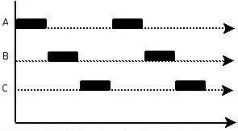

[TOC]

# 线程介绍

## 进程和线程

- 进程

  进程是资源分配的最小单位

  每个进程都有独立的代码和数据空间(进程上下文),进程间的切换会有较大的开销,一个进程包含多个线程

- 线程

  线程是cpu调度的最小单位
  
  同一类线程共享代码和数据空间,每个线程有独立的运行栈和程序计数器(PC),线程切换开销小

线程和进程一样,共分为5个阶段: 创建,就绪,运行,阻塞,终止

多进程是指操作系统能同时运行多个任务(程序)

多线程是指同一程序中有多个顺序流在执行

在java中要实现多线程,有三种方法

1. 继承Thread类
2. 实现Runnable接口
3. 实现Callable接口,并与Future类和线程池结合使用

## 并行和并发

并行: 指在同一时刻,有多条命令在多个处理器上同时执行,所以无论从微观还是从宏观上看,二者都是一起执行的


并发: 指在同一时刻只能有一条命令执行,但多个指令被快速的轮换执行,使得在宏观上具有同时执行的效果,但在微观上,只是把事情分成若干段,使得每一段能够快速的交替执行,而并不是同时执行



# 线程创建

## 继承Thread类

继承Thread类,并重写父类的run()方法

通过Thread类的start()方法启动线程

```java
public class Thread1 extends Thread {
    @Override
    public void run() {
        for(int i=0;i<100;i++){
            System.out.println(i);
        }
    }
    public static void main(String[] args) {
        new Thread1().start();
    }
}
```

## 实现Runnable接口

实现Runnable接口,并实现run()方法

将实现了Runnable接口的类传入Thread构造函数中,并调用start()方法启动线程

```java
public class RunnableThread implements Runnable {
    @Override
    public void run() {
        for(int i=0;i<100;i++){
            System.out.println(i);
        }
    }
    public static void main(String[] args) {
        new Thread(new RunnableThread()).start();
    }
}
```

## 实现Callable接口

1. 创建Callable接口的实现类,并实现call()方法,该方法将作为线程执行体,并且具有返回值
2. 创建Callable实现类的实例,使用FutrueTask类进行包装Callable对象,FutrueTask对象封装了Callable对象的call()方法的返回值
3. 使用FutreTask对象作为Thread对象启动新线程
4. 调用FutreTask对象的get()方法获取子线程执行结束后的返回值

> FutreTask的get()方法是阻塞的

# 线程状态转换

## 线程状态转化图


## 线程的5种状态

1. 新建状态(New)

   新创建一个线程对象

2. 就绪状态(Runnable)

   线程对象创建后,调用了该线程的start()方法后,该状态的线程将位于可运行线程池中,变得可运行,等待获取cpu的使用权

3. 运行状态(Running)

   就绪状态的线程获取了cpu,执行程序代码

4. 阻塞状态(Blocked)

   阻塞状态是线程因为某种原因放弃cpu使用权,暂时停止运行; 直到线程进入就绪状态,才有机会转到运行状态; 

   阻塞的状态分为3中情况:

   1. 等待阻塞:运行的线程执行wait()方法,JVM会把该线程放入到等待池中(wait()方法会让该线程释放持有的锁)

   2. 同步阻塞: 运行的线程在获取对象的同步锁时,若该同步锁被别的线程占用,则JVM会把该线程放入锁池中,直到同步锁被释放,然后从锁池中根据条件挑选一个线程,让其获得该同步锁

   3. 其他阻塞: 运行的线程执行sleep()或join()方法,或者发出了I/O请求时,JVM会把该线程状态设置为阻塞状态; 当sleep()状态超市,join()等待线程终止或超时,或者I/O处理完毕时,线程重新转为就绪状态

      > 注意: sleep是不会释放持有的锁的

5. 死亡状态(Dead)

   线程执行完了或者因异常退出了run()方法,该线程结束生命周期

# 线程调度

在java中,实现线程的调度有6种方式:

1. 设置线程的优先级

2. 线程睡眠

   Thread.sleep(1000)

3. 线程等待

   Object类中的wait()方法

4. 线程让步

   Thread.yield()方法

5. 线程加入

   join()方法

6. 线程唤醒

   Object类中的notify()方法

## 设置线程的优先级-setPriority()

调整线程的优先级,优先级高的线程会获得比较多的运行机会

java线程的优先级用整数表示,取值范围是1~10,Thread类有以下三个静态常量:

```java
//线程可以具有的最高优先级，取值为10
static int MAX_PRIORITY
//线程可以具有的最低优先级，取值为1
static int MIN_PRIORITY
//分配给线程的默认优先级，取值为5  
static int NORM_PRIORITY        
```

Thread类的setPriority()和getPriority()方法分别用来设置和获取线程的优先级

每个线程都有默认的优先级,主线程的默认优先级为Thread.NORM_PRIORITY(即为5)

线程的优先级有继承关系,比如A线程中创建了B线程,那么B将和A具有相同的优先级

## 线程睡眠-sleep()

使用Thread.sleep(long millis)方法,可以使得线程从运行状态转到阻塞状态; millis参数设定睡眠的时间,以毫秒为单位; 当睡眠时间结束之后,该线程的状态就会从阻塞状态变为就绪状态

> 即sleep()方法,可以让运行状态的线程进入阻塞状态一定时间(让出cpu的时间片,但是不会释放锁,如果有锁的化,下一次执行还是该线程,如果没锁,则可能会轮到给其他线程执行),时间到后就从阻塞状态变为就绪状态,再等待获取cpu的时间片

当调用sleep()方法后,当前的线程不会释放锁

## 线程等待-wait()

Object类中的wait()方法,一般是锁对象调用的wait()方法

该wait()方法可以使得当前线程等待(即进入等待阻塞状态,该线程会进入到等待池中),直到其他线程调用此对象的notify()方法或者调用notifyAll()方法进行唤醒; 这两个唤醒方法也是Object类中的方法;当线程被唤醒后,就会从等待状态变为就绪状态,等待cpu分配时间片

> wait(long millis)方法可以设置等待的时间参数,如果设置了时间参数,则等待的时间到后,不需要notify或notifyAll()就可以自动的被唤醒,从等待阻塞状态变为就绪状态,等到cpu分配时间片
>
> notify()方法是从对象的等待池中随机唤醒一个线程
>
> notifyAll()方法将对象的等待池中的所有线程全部唤醒

当被调用wait()方法后,线程会释放掉当前的锁

当锁对象调用了wait方法后,该线程就会登入到该锁对象等待池就,只有当调用该锁对象的notify()方法或者notifyAll(),才会从该锁对象的等待池中随机唤醒一个线程或唤醒全部的线程,将他们的状态变成就绪状态

```java
public class Test1 {
    public static void main(String[] args) throws Exception {
        Object lock=new Object();//对象锁
        //创建并启动线程
        new Thread(()->{
            for(int i=0;i<6;i++){
                synchronized (lock){
                    if(i==3){//当i等于3的时候线程等待
                        try {
                            lock.wait();
                        } catch (InterruptedException e) {
                            e.printStackTrace();
                        }
                    }
                    System.out.println("thread1:"+i);
                }
            }
        }).start();

        Thread.sleep(1000);
        synchronized (lock){//延时1秒后唤醒lock对象的所有等待的线程
            lock.notifyAll();
        }

    }
}
```

## 线程让步-yield()

Thread.yield()方法,暂停当前正在执行的线程对象,把执行机会让给相同或者更高优先级的进程

让步的意思就是将当前的线程的运行状态变成就绪状态,从而让出cpu的使用权,让出后再等到下一次cpu的时间片分配

## 线程加入-join()

等待其他线程终止;在当前线程中调用另一个线程的join()方法,则当前线程转入阻塞状态,直到另一个线程运行结束后,当前线程再有阻塞状态转化为就绪状态,等待cpu的时间片分配

> 字面意思即让其他线程加入,并等待其运行结束之后再继续运行当前线程

## 线程唤醒-notify(),notifyAll()

Object类中的notify()方法,唤醒在对象监视器上等待的单个线程; 如果所有线程都在此对象上等待,则会选择唤醒其中一个线程,这个选择是任意的; 线程通过调用其中一个wait方法,在对象的监视器上等待,即从运行状态变为等待阻塞状态; 线程只有当调用对象的notify或notifyAll方法时才能被唤醒,其状态才能从等待阻塞状态变为就绪状态;

# synchronized


## Java虚拟机对synchronized的优化

### 偏向锁

### 轻量级锁

### 重量级锁

# volatile

# atomic

# 常见的锁

## volatile

## 自旋锁

## 可重入锁

## 乐观锁/悲观锁


# 线程数据传递

# 线程池

# 参考文档

[Java多线程学习（吐血超详细总结）](https://blog.csdn.net/Evankaka/article/details/44153709)

https://blog.csdn.net/qq_41665476/article/details/80225592