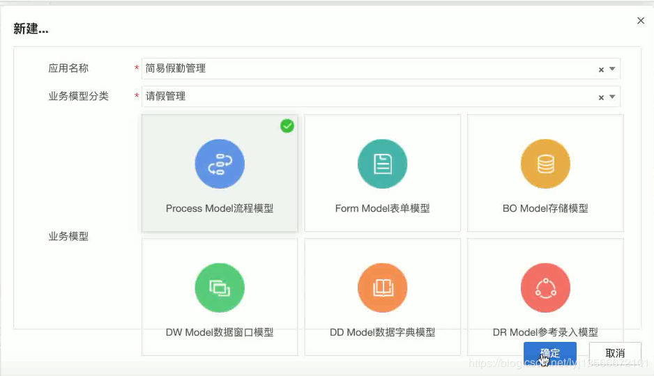

[TOC]

# AWS平台链接
- 测试平台:http://10.190.64.27:8088/portal/console
- 开发平台:http://10.190.64.22:8088/portal/console/
- BPM(炎黄版-未上线):http://10.190.64.24:7000/new/#/login

用户名:admin
密码:123456

# AWS平台目录
- apps
`主要存放平台所有的安装应用`
	- dist
	`主要存放分发下来的应用(就是自己上传的应用)`
	- history
	`历史文件夹,主要存放历史安装,历史卸载,历史更新的数据`
	- install
	`存放现有平台下面所有正在运行的应用`
		- lib
		`在该文件夹下会存放我们自己打的jar包,jar包的名字就是这个应用的名字.jar`
		- tempalte
			- form
			`存放平台生成的表单的html页面`
			- page
			`存放自己写的html文件`
			- repository
			`存放bo,form,process(流程)的一些配置文件`
			- web
			`存放自己写的css,js和img`
				- action.xml
				`主要在开发cmd进行前后台参数交替的一个配置文件`
	- tmp
	`存储一些临时性的文件`
	- uninstall
	`存放待卸载的应用文件`
	- upload
	`存放上传应用后的应用文件`
	- app-platform.xml
	`存放配置开发小组的配置信息`
- aws_lib
`存放平台用到的所有jar,二次开发时需要将所有的jar加到项目中并作为依赖`
- bin
`主要存放平台的一些配置文件和运行脚本,还有平台开发源码的包`
	- conf
		- server.xml
			> - 主要修改端口号
			> - 以及一些平台的配置,包括数据库的连接,制定文件的存储路径
		- aws-portal.xml
			> - 主要配置的是访问的url,如[http://localhost:8088/portal](http://localhost:8088/portal)
			> - 一些前端的一些配置
	- jdbc
	`平台数据的连接的一些lib包`
	- lib
	`存放平台所用到的所有jar包`
	- startup.bat
	`启动AWS Server`
	- httpd-startup.bat
	`启动AWS Web Server`
	- licensekey.bat
		`采集授权机器码	`
	- passwd.bat
	`可以对一些密码进行加密`
- db_script
`在手动安装平台的时候需要执行里面对应的数据库的脚本`
- doc
`平台的一些介绍文档`
- doccenter
`存放平台中一些应用产生的一些附件,图片,以及上传的html`
- jdk1.8
`平台使用jdk的版本`
- licenses
`平台引用的一些配置文件,不需要去动`
- logs
`平台的日志`
	- aws.log
	`aws server端的日志`
	- web.log
	`web服务端的日志`
- Uninstaller
`保存在平台卸载的时候会调用的jar包`
- upgrade
`升级平台所需要的东西`
- webserver
`相当于一个tomcat服务器,是AWS平台自己封装了一个`
	- work
	`存放平台的缓存,在重启平台之后会自动刷新work文件夹`
	- webapps/portal
	`存放我们的前端应用(页面)`
		- commons
		`存放平台的一些文档`

# 修改平台端口号
需要修改端口号的一些路径
- /bin/conf/server.xml
- \webserver\webapps\portal\WEB-INF\classes\aws-server.xml
- webserver/conf/server.xml

# AWS平台数据库表结构

# 表单模型

## 新建表单

### 创建表单

1. 点击左侧菜单“应用开发 > 业务建模”，点击左上角的新建图标。

2. 填写“应用名称”和“业务模型分类”

3. 选择“业务模型”类型为`Form Model表单模型`

4. 点击“确定”按钮

   

---

### 设置表单模型基本信息

- URL表单类型是直接挂接一个URL的外部表单，详细参见[URL表单](https://docs.awspaas.com/user-manual/aws-pass-console-user-manual-form/url/README.html)章节

- `表单名称`同一个应用内不允许重复。支持`%分类名%_%表单名%`格式，例如:‘主表_企业基本情况’。当流程节点绑定多个表单时，可按照分类名分组显示

- BO模型列表仅显示当前用户有权限访问的BO模型，第一条记录类型会默认为主表，其它记录为子表

  

  之后一路next即可

---


## 表单js事件

## 表单规则

## 配置字表


# 流程节点模型
## 新建流程步骤
新建流程节点


- 先画出大致的归类流程图

- 画出具体的流程


## bpm的节点模型

### 开始事件
- 普通开始事件
- 消息开始事件
- 时间开始事件
- 信号开始事件

### 人工任务
`设置该节点是由哪个人来进行审批`
双击对应的节点可以编辑节点属性
- 基本属性
	`可以让该节点的审批人拥有下列的一些功能权限`
	- 允许传阅
		`将该节点通知到其他人`
	- 允许批量办理任务
		`设置该节点在任务中心中批量办理`
	- 转办
		`将该任务节点转交给其他人`
	- 特事特批
		`可以直接跳转到任意节点`
	- 任务到达邮件通知
		`任务到达后已经设置进行邮件通知`
	- 审核菜单
		`选择同意或者不同意,同意会进入下一个节点,不同意可以选择多种操作动作,如退回,等待...`
- 参与者
	`方案库:`一般设置为`账户/与流程申请人相关`
	`执行人来自特定的账户`
- 表单应用
- 扩展按钮
- 事件触发器
- 时限
- 通知
- 扩展属性

## bpm的流程模型

# 运行项目
## 在本地运行AWS平台
- 解压AWS提供的压缩包
- 运行`bin`目录下的`startup.bat`脚本,启动本地服务器
- 打开对应的工程代码,将`aws_lib`文件夹下的所有jar包都添加到项目中作为依赖
- 设置启动类
	> - 添加Application启动项
	> - 设置工作目录为`F:\bpmAWS\bin(平台的bin目录)`
	> - 指定启动类为`StartUp`即可启动


# 项目代码

添加监听器


# 文档

- [@公式](https://docs.awspaas.com/reference-guide/aws-paas-at-reference-guide/index.html)
- [AWS UI组件参考指南](https://docs.awspaas.com/reference-guide/aws-paas-ui-reference-guide/index.html)
- [存储模型](https://docs.awspaas.com/user-manual/aws-pass-console-user-manual-bo/index.html)

# 其他

- > #### 获取扩展列值
  >
  > API获取
  >
  > ```java
  > //根据表名、字段名、扩展属性名获得属性值
  > SDK.getRepositoryAPI().getBOItemPropValue("表名", "字段名", "属性名称");
  > 
  > //根据表名、扩展属性名、扩展属性值获得满足条件的字段定义模型列表
  > SDK.getRepositoryAPI().getBOItemsOfProp( "表名",  "属性名称",  "属性值");
  > ```
  >
  > @公式获取
  >
  > ```js
  > //根据表名、字段名、扩展属性名获得属性值
  > @boItemPropVal(*boName,*fieldName,*prop)
  > ```

