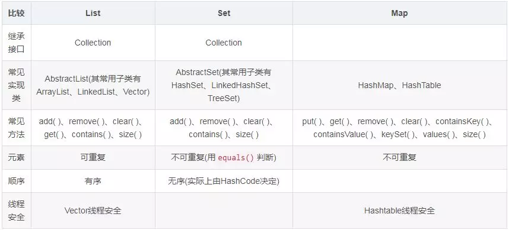
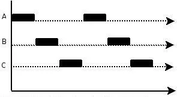

[TOC]

# java

## java基础

https://link.zhihu.com/?target=https%3A//mp.weixin.qq.com/s/IBbD3CmVWsTL9ymHg6gGGA

### JDK和JRE的区别

- JDK: java Develpment Kit的简称,java开发工具包,提供了java的开发环境和运行环境
- JRE: Java Runtime Environment的简称,java运行环境,为java的运行提供了所需环境

具体来说JDK其实包含了JRE.同时还包含了编译java源码的编译器javac,还包含了很多java程序调试和分析的工具; 简单来说: 如果你需要运行Java程序,只需要安扎u那个JRE就可以了,如果你需要编写java程序,需要安扎u那个JDK(因为你需要javac进行编译)

### ==和equals的区别

#### ==的理解

对于基本类型和引用类型,==的作用效果是不同的,如下所示

- 基本类型: 比较的是值是否相同
- 引用类型: 比较的是引用是否相同

代码示例

```java
String x = "string";
String y = "string";
String z = new String("string");
System.out.println(x==y); // true
System.out.println(x==z); // false
System.out.println(x.equals(y)); // true
System.out.println(x.equals(z)); // true
```

> 因为x和y指向的时同一个引用,所以`==`也是true,而new String()方法则重新开辟了内存空间,所以`==`结果为false,而equals比较的一直是值,所以结果都为true

#### equals解读

equals本质上就是==,只不过Sring和Integer等类重写了equals方法,把它变成了值比囧啊; 看如下代码:

首先看默认情况下equals比较一个有相同值的对象

```java
class Cat {
    public Cat(String name) {
        this.name = name;
    }
    private String name;
}

Cat c1 = new Cat("王磊");
Cat c2 = new Cat("王磊");
System.out.println(c1.equals(c2)); // false
```

> 结果为false,接下来去看一下equals源码就知道了

equals源码如下:

```java
public boolean equals(Object obj) {
    return (this == obj);
}
```

> 所以equals本质上就是==

那么问题来了,两个相同值的String的equals方法为什么返回的是true呢,接下来看一下String类中对equals方法的重写

```java
public boolean equals(Object anObject) {
    if (this == anObject) {//如果引用相等,则肯定相等
        return true;
    }
    if (anObject instanceof String) {//如果是字符串,则继续比较
        String anotherString = (String)anObject;//获取要比较字符串
        int n = value.length;
        if (n == anotherString.value.length) {//如果长度相等,则继续比较
            char v1[] = value;
            char v2[] = anotherString.value;
            int i = 0;
            while (n-- != 0) {//比较每个字符是否相等
                if (v1[i] != v2[i])
                    return false;
                i++;
            }
            return true;
        }
    }
    return false;
}
```

> 因为String类重写了Object的equals方法,所以把引用比较改成了值比较

#### 总结

==对于基本类型来说是值比较,对于引用类型来说比较的是引用; 而equals默认情况下是引用比较,只是很多类重写了equals方法,比如String,Integer等,把从引用比较改成了值比较,所以一般情况下equals比较的是值是否相等

### 两个对象的hashCode()相同,则equals()也一定为true,对吗

不对,两个对象的hashCode()相同,equals()不一定为true

代码示例: 

```java
String str1 = "通话";
String str2 = "重地";
System.out.println(String.format("str1：%d | str2：%d", 
                     str1.hashCode(),str2.hashCode()));
System.out.println(str1.equals(str2));
```

> 执行结果:
>
> str1：1179395 | str2：1179395
>
> false

代码解读: 很显然"通话"和"重地"的hashCode()相同,然而equals()则为false,因为在散列表中,hashCode相等即为两个键值对的哈希值想到等,然而哈希值相等,并不一定能得出键值对相等

### final在java中有什么作用

- final修饰的类叫最终类,该类不能被继承
- final修饰的方法不能被重写
- final修饰的变量叫常量,常量必须初始化,初始化之后值就不能被修改

### java中的Math.round(-1.5)等于多少

等于-1,因为在数轴上取值时,中间值(0.5)向右取整,所以正0.5是往上取整

代码示例

```java
public static void main(String[] args) {
        long round1 = Math.round(-1.5);
        long round2 = Math.round(-0.5);
        long round3 = Math.round(0.5);
        long round4 = Math.round(1.5);
        System.out.println(round1); // -1
        System.out.println(round2); // 0
        System.out.println(round3); // 1
        System.out.println(round4); // 2
}
```

### String属于基础的数据类型吗

String不属于基础类型

基础类型有8中: byte,boolean,char,short,int,float,long,double

而String属于对象

### java中操作字符串都有哪些类?他们之间的区别?

操作字符串的类有: String,StringBuffer,StringBuilder

String,StringBuffer和StringBuilder的区别在于:

- String声名的是不可变的对象,每次操作都会生成新的String对象,然后将指针指向新的String对象
- StringBuffer和StringBuilder可以在原有对象的基础上进行操作,所以在经常改变字符串内容的情况下最好不要使用String
- `StringBuffer`和`StringBuilder`最大的区别在于: `StringBuffer`是线程安全的,而`StringBuilder`是非线程安全的,但`StringBuilder`的性能却高于`StringBuffer`,但在单线程环境下推荐使用`StringBuilder`,多线程环境下推荐使用`StringBuffer`

### String str="i"与String str=new String("i")一样吗?

不一样,因为内存的非配方式一样; `String str="i"`的方式,java虚拟机会将其分配到常量池中; 而`String str=new String("i")`则会被分到堆内存中

### 如何将字符串反转

使用`StringBuilder`或者`StringBuffer`的`reverse()`方法

示例代码

```java
// StringBuffer reverse
StringBuffer stringBuffer = new StringBuffer();
stringBuffer.append("abcdefg");
System.out.println(stringBuffer.reverse()); // gfedcba
// StringBuilder reverse
StringBuilder stringBuilder = new StringBuilder();
stringBuilder.append("abcdefg");
System.out.println(stringBuilder.reverse()); // gfedcba
```

### String类的常用方法都有哪些

- indexOf(): 返回指定字符的索引
- charAt(): 返回指定索引处的字符
- replace(): 字符串替换
- split(): 分割字符串,返回一个分割后的字符串数组
- getBytes(): 返回字符串的byte类型数组
- length(): 返回字符串长度
- toLowerCase(): 将字符串转化成小写字母
- substring(): 截取字符串
- equals(): 字符串比较

### 抽象类必须要有抽象方法吗

不需要,抽象类不一定要有抽象方法

示例代码

```java
abstract class Cat {
    public static void sayHi() {
        System.out.println("hi~");
    }
}
```

> 上述代码,抽象类并没有抽象方法但完全可以正常运行

### 普通类和抽象类有哪些区别

- 普通类不能包含抽象方法,抽象类可以包含抽象方法
- 抽象类怒能直接实例化,普通类可以直接实例化

### 抽象类能使用final修饰吗

不能,定义抽象类就是让其他类继承的,如果定义为final,该类就不能被继承,这样彼此就会产生矛盾,所以final不能修饰抽象类

### 接口和抽象类有什么区别

- 实现: 子类使用extends来继承父类; 接口必须使用implements来实现接口

- 构造函数: 抽象类可以有构造函数; 接口不能有;

  > 抽象类虽然不能实例化,但是他是可以拥有构造函数的;
  >
  > 其一般用来初始化抽象类的一些字段,而这一切都在抽象类的子类类实例化之前发生的;
  >
  > 所以抽象类的构造函数还有一种巧妙的应用,就是实现该抽象类的子类实例化前必须要先执行抽象类的构造函数,所以我们可以在抽象类的构造函数中执行一些必须执行的一些代码
  >
  > 如果我们没有为抽象类编写构造函数,编译器还会为我们生成一个默认的保护级别的构造函数

- main方法: 抽象类可以有main方法,并且我们能运行他; 接口不能有main方法;

- 实现数量: 类可以实现很多个接口; 但是只能继承一个抽象类

- 访问修饰符: 接口中的方法默认使用public修饰; 抽象类中的方法可以是任意访问修饰符;

### java中IO流分为几种

按功能来分: 输入流`input`,输出流`output`

按类型来分: 字节流和字符流

> 字节流和字符流的区别是: 字节流按8为传输,以字节为单位输入输出数据; 字符流按16为传输,以字符为单位输入输出数据

### BIO,NIO,AIO有什么区别

- BIO: Block IO,同步阻塞式IO,就是我们平常使用的传统IO,他的特点式模式简单,使用方便,并发处理能力低
- NIO: New IO,同步非阻塞IO,是传统IO的升级,客户端和服务器端通过Channel(通道)通讯,实现了多路复用
- AIO: Asynchronous IO,是NIO的升级,也叫NIO2,实现了异步非阻塞IO,异步IO的操作基于事件和回调机制

### Files的常用方法都有哪些

- Files.exist(): 检查文件路径是否存在
- Files.createFile(): 创建文件
- Files.createDirectory(): 创建文件夹
- Files.delete(): 删除一个文件或目录
- Files.copy(): 复制文件
- Files.move(): 移动文件
- Files.size(): 查看文件个数
- Files.read(): 读取文件
- Files.write(): 写入文件

## 容器

https://mp.weixin.qq.com/s/Yl9pTaQYKwf0rZ6InG9OZg

### java容器都有哪些

常用容器:


### Collection和Collections有什么区别

- java.util.Collection是要给集合接口(集合类的一个顶级接口); 他提供了对集合对象进行基本操作的通用接口方法; Collection接口在java类库中有很多具体的实现; Collection接口的意义是为各种具体的集合提供了最大化的统一操作方法,其直接继承的接口有List和Set
- Collections则是集合类的一个工具类,其中提供了一些列静态方法,用于对集合中元素进行排序,搜索以及线程安全等各种操作

### List,Set,Map之间的区别是什么



### HashMap和Hashtable有什么区别

- hashMao去掉了HashTable的contains()方法,但是加上了containsValue()和containsKey()方法

- hashTable是线程同步的,而HashMap是非同步的,效率上比hashTable要高

- hashMap允许空键值,而hashTable不可以

  > HashTable不能接受null的键和值的原因时equals()方法需要对象,而HashMap是后出的API经过处理才可以的

### 如何决定使用HashMap还是TreeMap

对于在Map中插入,删除和定位元素这类操作,HashMap是最好的选择; 然而,假如你需要对一个有序的key集合进行遍历,TreeMap是更好的选择; 基于你的collection的大小,也许向HashMap中添加元素会更快,将map转换为TreeMap进行有序key的遍历

```java
TreeMap treeMap=new TreeMap();
treeMap.put("a",1);
treeMap.put("c",1);
treeMap.put("b",1);
treeMap.put("r",1);
Set set = treeMap.keySet();
Iterator iterator = set.iterator();
while (iterator.hasNext()){
    System.out.print(iterator.next()+" ");
}
System.out.println();
//结果: a b c r(有序)

HashMap hashMap=new HashMap();
hashMap.put("a",1);
hashMap.put("c",1);
hashMap.put("b",1);
hashMap.put("r",1);
Set set1 = hashMap.keySet();
Iterator iterator1 = set1.iterator();
while (iterator1.hasNext()){
    System.out.print(iterator1.next()+" ");
}
//结果: a b r c(无序)
```

### 说一下HashMap的实现原理

- HashMap概述:

  HashMap是基于哈希表的Map接口的非同步实现; 此实现提供所有可选的映射操作,并允许使用null值和null键; 此类不保证映射的顺序,特别是他不保证顺序永久不变

- HashMap的数据结构:

  在java中,最基本的结构就是两种,一个是数组,另一个是链表(引用),所有的数据结构都可以用这两个基本结构来构造,HashMap也不例外; HashMap实际上是一个"链表散列"的数据结构,即数据和链表的结合体

当我们往HashMap中put元素时,首先更具key的hashcode重新计算hash值,根据hash值得到这个元素在数据中的位置(下标),如果该数组在该位置上已经存放了其他元素,那么在这个位置上的元素将以链表的形式存放,新加入的放在链头,最后加入的放在链尾; 如果数组中该位置没有元素,就直接将该元素放到数组的该位置上

需要注意jdk1.8中对HashMap的实现做了优化,当链表中的节点数据超过8个之后,该链表会展位红黑树来提高查询效率,从原来的O(n)到O(logn)

### 说一下HashSet的实现原理

- HashSet底层有HashMap实现
- HashSet的值存放于HashMap的key上(即HashSet仅仅使用了HashMap的key的散列数组)
- HashSet使用的HashMap对象的value统一设置为`present`

存储原理

往HashSet添加元素时,HashSet会先调用元素的hashCode()方法得到元素的哈希值,然后通过元素的哈希值经过位移等运算,就可以算出该元素在哈希表中的存储位置

- 情况1

  如果算出元素存储的位置目前没有任何元素存储,那么该元素可以直接存储到该位置上

- 情况2

  如果算出该元素的存储目前已经存在有其他的元素了,那么会调用该元素的equals方法与该位置的元素再比较一次,如果equals方法返回的是false,那么该元素运行添加,如果返回true,则不做任何操作

### HashMap和HashSet的区别

- HashMap实现了Map接口,而HashSet实现类了Set接口
- HashMap存储键值对,而HashSet仅仅存储对象
- HashMap使用put()方法将元素放入map中,而HashSet使用add()方法将元素放入set中
- HashMap中使用键来计算hashcode值,而HashSet使用成员对象来计算hashcode值,对于两个对象来说,hashcode可能相同,所以equals()方法用来判断对象的相等性,如果两个对象不同,则返回false,那么执行添加操作,如果相等,则不做任何操作
- HashMap比较块,因为是使用唯一键来获取对象,而HashSet较HashMao来说比较慢,因为他再添加时还做了一次hashcode运算和比较

### ArrayList和LinkedList的区别是什么

最明显的区别时ArrayList底层的数据结构是数组,支持随机访问,而LinkedList的底层数据结构是双向循环链表,不支持随机访问; 使用下标访问一个元素,ArrayList的时间复杂度是O(1),而LinkedList是O(n)

### 如何实现数组和List之间的转化

- List转换成为数组: 调用ArrayList的toArray方法
- 数组转换成为List: 调用Arrays的asList方法

### ArrayList和Vector的区别是什么

- Vector是同步的,而ArrayList不是; 而然,如果你寻求再迭代的时候对列表进行改变,你应该使用CopyOnWriteArrayList
- ArrayList比Vector快,Vector因为有同步,不会过载
- ArrayList更加通用,因为我们可以使用Collections工具类轻易的获取同步列表和只读列表

### Array数组和ArrayList有何区别

- Array可以容纳基本类型和对象,而ArrayList只能容纳对象
- Array数组是指定大小的,而ArryaList大小是可变的
- Array数组没有提供ArrayList那么多功能,比如addAll(),removeAll()和iterator()等

### 在Queue中poll()和remove()有什么区别

poll()和remove()都是从队列中取出一个元素,poll()在获取元素在失败的时候会返回空,但是是remove()失败的时候会抛出异常

### 哪些集合类是线程安全的

- Vector: 就比ArrayList多了一个同步化机制(线程安全),因为效率较低,现在已经不太建议使用; 在web应用中,特别是前台页面,往往效率(页面响应速度)是优先考虑的
- stack: 堆栈类,先进后出
- HashTable: 就比HashMap多了一个线程安全
- enumeration: 枚举,相当于迭代器

### 迭代器Iterator是什么

迭代器是一种设计模式,他是要给对象,他可以遍历并选择序列中的对象,而开发人员不需要了解该序列的底层结构; 迭代器通常被成为"轻量级"对象,因为创建他的代价小

### Iterator怎么使用?有什么特点

java中的Iterator功能比较简单,并且只能单向移动:

1. 使用方法iterator()要求容器返回一个Iterator对象; 第一次调用Iterator的next()方法时,他返回序列的第一个元素; 注意: iterator()方法是java.lang.Iterable接口提供的,被Collecion继承
2. 使用next()虎丘序列中的下一个元素
3. 使用hasNext()检查序列中是否还有元素
4. 使用remove()将迭代器新返回的元素删除

Iterator是java迭代器最简单的实现,为List设计的ListIterator具有更多的功能,他可以从两个方向遍历List,也可以从List中插入和删除元素

### Iterator和ListIterator有什么区别

- Iterator可用来遍历Set和List集合,但是ListIterator只能用来遍历List
- Iterator对集合只能是向后遍历,ListIterator既可以向前也可以向后
- ListIterator实现了Iterator接口,并包含其他的功能,比如: 增加元素,替换元素,获取前一个和后一个元素的索引等

## 多线程

https://mp.weixin.qq.com/s/ywOwdXuMG5rhEXMH_OXKEQ

### 并行和并发有什么区别

- 并行是指两个或者多个事件在同一时刻发生; 而并发是指两个或多个事件在同意时间间隔发生
- 并行是在不同实体上的多个事件,而并发是在同一实体上的多个事件
- 在一台处理器上"同时"处理多个任务,在多台处理器上同时处理多个任务; 如hadoop分布式集群

所以并发编程的目标是充分的利用处理器的每个核,以达到最高的处理性能

---

更易于理解的解释:

**并行**: 指在同一时刻,有多条执行在多个处理器上同时执行, 所以无论从微观还是从宏观来看,二者都是一起执行的


**并发**: 指在同一时刻只能有一条执行执行,但多个进程指令被快速的轮换执行,使得在宏观上具有多个进程同时执行的效果,但在微观上并不是同时执行的,只是把事件分成若干段,使得多个进程快速交替的执行



并行在多处理器系统中存在,而并发可以在单处理器和多处理器系统中都存在,并发能够在单处理器系统中存在是因为并发是并行的假象,并行要求程序能够同时执行多个操作,而并发只是要求程序假装同时执行多个操作(每个小时间片执行一个操作,多个操作快速切换执行

### 线程和进程的区别

简而言之,进程时程序运行和资源分配的基本单元,一个程序至少有一个线程,一个进程至少有一个线程; 进程在执行过程中拥有独立的内存单元,而多个线程共享内存资源,减少切换次数,从而效率更高; 线程是进程的一个实体,是cpu调度和分派的基本单位,是比程序更小的独立运行的基本单位; 同一进程中的多个线程之间可以并发执行;

### 守护线程是什么

守护线程,是个服务线程,准确的说就是服务其他线程

### 创建线程有哪几种方式

1. 继承Thread类创建线程类
   1. 定义Thread类的子类,并重写该类的run方法
   2. 创建Thread子类的实例,即创建了线程对象
   3. 调用线程对象的start()方法来启动该线程
2. 通过Runnable接口创建线程类
   1. 定义Runnable接口的实现类,并重写该接口的run()方法
   2. 创建Runnable实现类的实例,再创建Thread类并将实现了Runnable接口的实现类传入
   3. 条用线程对象的start()方法来启动该线程
3. 通过Callable和Futre创建线程
   1. 创建Callable接口的实现类,并实现call()方法,该call()方法将作为线程执行体,并且有返回值
   2. 创建Callable实现类的实例.使用FutrueTask类来包装Callable对象,该FutrueTask对象封装了该Callable对象的call()方法的返回值
   3. 使用FutrueTask对象作为构造参数传入Thread的构造函数中
   4. 调用FutrueTask对象的get()方法来获得子线程执行结束后的返回值

### 说一下runnable和callable的区别

这个问题有点深,也可以看出一个java程序员学习知识的广度

- Runnable接口中的run()方法的返回值是void,它做的事情知识纯粹的去执行run()方法中的代码而已
- Callable接口中的call()方法是有返回值的,是一个泛型,和Futrue,FutrueTask配合可以用来获取异步执行的结果

### 线程有哪些状态

线程通常都有五种状态: 创建,就绪,运行,阻塞和死亡

- 创建状态: 在创建线程对象后,并没有调用该对象的start()方法,该线程就处于创建状态
- 就绪状态: 当调用了线程对象的start()方法之后,该线程就进入了就绪状态,但是此时线程调用程序还没有把该线程设置为当前线程,此时处于就绪状态,在线程运行之后,从等待或者睡眠中回来之后,也会处于就绪准状态
- 运行状态: 线程调用程序将处理就绪状态的线程设置为当前线程,此时线程就进入了运行状态,开始运行run()方法
- 阻塞状态: 线程正在运行的时候被暂停,通常时为了等待某个事件的发生(比如谁某项资源就绪等)之后再继续运行; sleep,suspend,wait等方法都可以导致线程阻塞
- 死亡状态:  如果一个线程的run方法执行结束或者调用stop方法后,该线程就会死亡; 对于已经死亡的线程,无法再使用start方法令再进入就绪状态

### sleep()和wait()有什么区别

sleep()方法是线程类Thread的静态方法,让调用线程进入睡眠状态,让出执行机会给其他线程,等到休眠时间结束后,线程进入就绪状态和其他线程一起竞争cpu的执行时间; 因为sleep()是static静态的方法,它不能改变对象的机锁,当一个synchronized块中掉哟过了sleep()方法,线程虽然进入休眠,但是对象的机锁没有被释放,其他线程依然无法访问这个对象

wait()方式是Object类的一个方法,当以线程执行到wait()方法时,它就进入到一个和该对象相关的等待池,同时释放对象的机锁,使得其他线程能够访问,可以通过notify,notifyAll方法来唤醒等待的线程

### notify()和notifyAll()有什么区别

- 如果线程调用了对象的wait()方法,那么线程便会处于该**对象的等待池中**,等待池中的线程不会去竞争该对象的锁
- 当有线程调用了对象的notifyAll()方法(唤醒所有wait线程)或notify()方法(只随机唤醒一个wait线程),被唤醒的线程便会进入该对象的锁池中,锁池中的线程便会去竞争该对象锁; 也就是说,调用了notify后只有一个线程会由等待池进入锁池,而notifyAll会将该对象等待池内的所有线程移动到所持中,等待锁竞争
- 优先级高的线程竞争到对象锁的概率大,假若某线程没有竞争到该对象锁,它还会留在锁池中,唯有线程再次调用wait()方法,它才会重新回到等待池中; 而竞争到对象锁的线程则继续往下执行,知道执行完了synchronized代码块,它会释放掉该对象锁,这时锁池中的线程会继续竞争该对象锁

### 线程的run()和start()有什么区别

每个线程都是通过某个特定Thread对象所对应的run方法来完成器操作的,run()方法称为线程体; 通过调用Thread类的start()方法来启动一个线程

start()方法来启动一个线程,真正实现了多线程运行; 这是无需等待run方法代码执行完毕,可以直接继续执行下面的代码; 这时此线程是处于就绪状态,并没有运行; 然后通过系统调度,并由此Thread类调用其run方法来运行; run()方法运行结束,此线程终止,然后cpu再调度其他线程

run()方法是在本线程里的,只是线程里的一个函数,而不是多线程的; 如果直接调用run()方法,其实就是相当于是调用了一个普通函数而已,直接调用run()方法就导致必须要等待run()方法执行完毕后才能再执行下面的代码,所以执行路径还是只有一条,根本就没有线程的特征,所以在多线成执行时要使用start()方法而不是run()方法

### 创建线程池有哪几种方式

1. newFixedThreadPool(int nThreads)

   创建一个固定长度的线程池,每当提交一个任务就创建一个线程,直到达到线程池的最大数量,这是线程规模将不再变化,当线程发生未预期的错误而结束时,线程池会补充一个新的线程

2. newCachedThreadPool()

   创建一个可缓存的线程池,如果线程池的规模超过了处理需求,将自动回收空闲线程,而当需求增加时,则可以自动添加新线程,线程池的规模不存在任何限制

3. newSingleThreadExecutor()

   这是一个单线程的Executor,它创建单个工作线程来执行任务,如果这个线程异常结束,会创建一个新的来代替它; 它的特点是能确保依照任务在队列中的顺序来串行执行

4. newScheduleThreadPool(int corePoolSize)

   创建了一个固定长度的线程池,而且以延迟或定时的方式来执行任务,类似于Timer

### 线程池都有哪些状态

线程池有5种状态: Running,ShutDown,Stop,Tidying,Terminated

线程池各个状态切换框架图:


### 线程池中的submit()和execute()方法有什么区别

- 接受的参数不一样
- submit有返回值,而execute没有
- submit方便处理Exception

### 在java程序中怎么保证多线程的运行安全

线程安全在三个方面体现:

1. 原子性

   提供互斥访问,同一时刻只能有一个线程对数据进行操作(atomic,synchronized)

2. 可见性

   一个线程对主内存的修改可以及时的被其他线程看到(synchronized,volatile)

3. 有序性

   一个线程观察其他线程种的指令执行顺序,由于指令重排序,该观察结果一般杂乱无序(happens-before原则)

### 多线程锁的升级原理是什么

在java种,锁共有4种状态,级别从低到高依此为: 无状态锁,偏向锁,轻量级锁和重量级锁, 这几个状态会随着竞争情况逐渐升级; 锁可以升级但不能降级;

锁升级的图示过程:


### 什么是死锁

死锁是指两个或两个以上的进程在执行过程中,由于竞争资源或者有意彼此通信而造成的一种阻塞的现象,若无外力作用,他们都将无法推进下去, 此时称系统处理死锁状态或系统产生了死锁,这是永远在相互等待的进程称为死锁进程,这是操作系统层面的一个错误,是进程死锁的简称; 它是计算机系统乃至整个并发程序设计领域最难处理的问题之一

### 怎么防止死锁

死锁的四个必要条件:

1. 互斥条件

   进程对所分配到的资源不允许其他进程进行访问,若其他进程访问该资源,只能等待,直至占有该资源的进程使用完成后释放该资源

2. 请求和保持条件

   进程获得一定的资源之后,又对其他资源发出请求,但是该资源可能被其他进程占有,此事件请求阻塞,但又对自己获得的资源保持不放

3. 不可剥夺条件

   是指进程已获得的资源,在未完成使用之前,不可被剥夺,只能在使用完成后自己释放

4. 环路等待条件

   是指进程发生死锁后,若干进程之间形成一种头尾相接的循环等待资源关系

这四个条件是死锁的必要条件,只要系统发生死锁,这些条件必然程里,而只要上述条件之一不满足,就不会发生死锁

理解了死锁的原因,尤其是产生死锁的四个必要条件,就可以最大可能的避免,预防和理解死锁

所以,在系统设计,进程调度等方面注意如何不让这四个必要条件成立,如何确定资源的合理分配算法,避免进程永久占据系统资源

此外,也要防止进程在处于等待状态的情况下占用资源; 因此,对资源的分配要给予合理的规划

### ThreadLocal是什么?有哪些使用场景

线程局部变量是局限线程内部的变量,属于线程自身所有,不在多个线程间共享; java提供ThreadLocal类来支持线程局部变量,是一种实现线程安全的方式,但是在管理环境下(如web服务器)使用线程局部变量的时候要特别小心,在这种情况下,工作线程的声明周期比任何应用变量的声明周期都要长; 任何线程局部变量一旦在工作完成后没有释放,java应用就存在内存泄漏的风险

### 说一下synchronized底层实现原理

synchronized可以保证方法或者代码块在运行时,同一时刻只有一个方法可以进入到临界区,同时它还可以保证共享变量的内存可见性

java中每个对象都可以作为锁,这是synchronized实现同步的基础:

- 普通同步方法,锁是当前实例对象
- 静态同步方法,锁是当前类的class对象
- 同步方法块,锁是括号里的对象

### synchronized和volatile的区别是什么

- volatile本质就是告诉jvm当前变量在寄存器(工作内存)中的值是不确定的,需要从主存中读取; synchronized则是锁定当前变量,只有当前线程可以访问该变量,其他线程被阻塞住
- volatile仅能使用在变量级别; synchronized则可以使用在变量,方法和类级别
- volatile仅能实现便来那个的修改可见性,不能保证原子性; 而synchronized则可以保证变量的修改可见性和原子性
- volatile不会造成线程的阻塞; synchronized可能会造成线程的阻塞
- volatile标记的变量不会被编译器优化; synchronized标记的变量可以被编译器优化

### synchronized和Lock区别是什么

- 首选synchronized是java内置关键字,在jvm层面,Lock是一个java类
- synchronized无法判断是否获取锁的状态,Lock可以判断是否获取到锁
- synchronized会自动释放锁(a线程执行完同步代码会释放锁,b线程执行过程中发生异常会释放锁),Lock需要在finally中手动释放锁(unlock()方法释放锁),否则容易造成线程死锁;
- 用synchronized关键字的两个线程1和线程2,如果当前线程1获得锁,线程2等待; 如果线程1阻塞,线程2则会一直等待下去,而Lock锁不一定会等待下去,如果尝试获取不到锁,线程可以不用一直等待就结束了
- synchronized的锁可重入,不可判断,非公平,而Lock锁可重入,可判断,可公平
- Lock锁适合大量同步的代码的同步问题,synchronized锁适合代码少量的同步问题

### synchronized和ReentrantLock区别是什么

synchronized关键字,ReentrantLock是类,这是二者本质的区别

ReentrantLock提供了比synchronized更多更灵活的特性,可以被继承,可以有方法,可以有各种各样的类变量,ReentrantLock比synchronized的扩展性体现在几点上:

- ReentrantLock可以对获取锁的等待时间进行设置,这样就避免了死锁
- ReentrantLock可以获取各种锁的信息
- ReentrantLock可以灵活的实现多路通知

另外,二者的锁机制其实也是不一样的:

- ReentrantLock底层调用的Unsage的patk方法加锁
- synchronized操作的是对象头中的mark word

### 说一下atomic原理

Atomic包中的类基本的特性就是在多线程环境下,当有多个线程同时对单个(包括基本类型及引用类型)变量进行操作时,具有排他性,即当多个线程同时对该变量的值进行更新时,仅有一个线程能成功,而未成功的线程可以向自旋锁一样,继续尝试,一直等待执行成功

Atomic系列的类中的核心方法都会调用unsafe类中的几个本地方法; 我们需要先直到Unsafe类,全名为sun.misc.Unsafe,这个类包含了大量的对C代码的操作,包括很多直接内存分配以及原子操作的调用,而它之所以标记未非安全,是告诉你这个里面大量的方法调用都会存在安全隐患,需要小心调用,否则会导致严重的后果,例如在通过unsafe分配内存的时候,如果自己指定某些区域可能会导致一些类似C++一样的指针越界到其他进程的问题

## 反射

https://mp.weixin.qq.com/s/QzwyYexI6v6sDb9h5tQxKA

### 什么是反射

反射主要是指程序可以访问,检测和修改它本身状态或行为的一种能力

java反射:

在Java运行时环境中,对于任意一个类,能够知道这个类有哪些属性和方法?对于任意一个对象,能否调用它的任意一个能够

Java反射机制主要提供了以下功能:

- 在运行时判断任意一个对象所属的类
- 在运行时构造任意一个类的对象
- 在运行时判断任意一个类所具有的成员变量和方法
- 在运行时调用任意一个对象的方法

### 什么是java序列化?什么情况下需要序列化?

简单说就是为了保存在内存中的各种对象的状态(也就是实例变量,不是方法),并且可以把保存的对象状态再次读出来; 虽然你看可以用你自己的各种各样的方法来保存都对象的状态,但是java给你提供一种应该比你实现更好的保存对象状态的机制,那就是序列化

什么情况下需要序列化:

1. 当你想把内存中的对象状态保存到一个文件中或者数据库中时
2. 当你想用套接字在网络上传送对象的时候
3. 当你想通过RMI传输对象的时候

### 动态代理是什么?有哪些应用?

动态代理:

当想要给实现了某个接口的类中的方法,加一些额外的处理,比如说加日志,加事务等,可以给这个类创建一个代理,顾名思义就是创建一个新的类,这个类不仅包含原来类方法的功能,而且还在原来的基础上添加了额外处理的方法; 这个代理类并不是定义好的,是动态生成的; 其具有解耦意义,灵活,扩展性强

动态代理的应用:

- spring的AOP
- 加事务
- 加权限
- 加日志

### 怎么实现动态代理?

首先必须定义一个接口,还要有一个InvocationHandler(将实现接口的类的对象传递给它)处理类; 在有一个工具类Proxy(习惯性的将其称为代理类,因为调用它的newInstance()可以代理对象,其实它只是一个生产代理对象的工具类), 利用InvocationHandler接口,拼接代理类源码,将其编译生成代理类的二进制码,利用类加载器加载,并将其实例化生成代理对象,最后返回

## 对象拷贝

https://mp.weixin.qq.com/s/w1s1PbsHrZEU7e04pUkDOg

### 为什么要使用克隆

想对一个对象进行处理,又想保留原有的数据进行接下来的操作,就需要克隆了,java语言中克隆针对的是类的实例

### 如何实现对象克隆

有两种方式:

1. 实现Cloneable接口并重写Object类中的clone()方法

2. 实现Serializable接口,通过对象的序列化和反序列化实现克隆,可以实现正真的深度克隆,代码如下

   ```java
   import java.io.ByteArrayInputStream;
   import java.io.ByteArrayOutputStream;
   import java.io.ObjectInputStream;
   import java.io.ObjectOutputStream;
   import java.io.Serializable;
   
   public class MyUtil {
       private MyUtil() {
           throw new AssertionError();
       }
       @SuppressWarnings("unchecked")
       public static <T extends Serializable> T clone(T obj) 
                                     throws Exception {
           ByteArrayOutputStream bout = new ByteArrayOutputStream();
           ObjectOutputStream oos = new ObjectOutputStream(bout);
           oos.writeObject(obj);
   
           ByteArrayInputStream bin = 
                       new ByteArrayInputStream(bout.toByteArray());
           ObjectInputStream ois = new ObjectInputStream(bin);
           return (T) ois.readObject();
   
           // 说明：调用ByteArrayInputStream
           //或ByteArrayOutputStream对象的close方法没有任何意义
           // 这两个基于内存的流只要垃圾回收器清理对象就能够释放资源，
           //这一点不同于对外部资源（如文件流）的释放
       }
   }
   ```

注意: 基于序列化和反序列化实现的克隆不仅仅是深度克隆,更重要的是通过泛型限定,可以检查出要克隆的对象是否支持序列化,这项检查是编译器完成的,不是在运行时抛出异常,这种方案明显优于使用Object的clone方法克隆对象; 让问题在编译的时候暴露出来总是好过在问题留到运行时;

### 深拷贝和浅拷贝区别是什么?

- 浅考雷只是复制了对象的引用地址,两个对象指向同一个内存地址,所以修改其中任意的值,另一个值都会随之变化,这就是浅拷贝(例如:assign())
- 深拷贝是将对象及值复制过来,两个对象修改其中任意的值,另一个值不会给i阿扁,这就是深拷贝(例如: JSON.parse()和JSON.stringify(),但是此方法无法复制函数类型)

## java web

https://mp.weixin.qq.com/s/3C3LimAv7Zt7V2ZxCT-MsQ

### jsp和servlet有什么区别

1. jsp经编译后就变成了Servlet(jsp的本质就是servlet,jvm只能识别java类,不能识别jsp的代码,web容器将jsp的代码编译成jvm能够识别的java类)
2. jsp更擅长表现于页面显示,servlet更擅长于逻辑控制
3. servlet中没有内置对象,jsp中的内置对象都是必须通过HttpServletRequest对象,HttpServletReesponse对象以及HttpServlet对象得到
4. jsp是servlet的一种简化,使用jsp只需要完成程序员需要输出到客户端的内容,jsp中的java脚本如何镶嵌到一个类中,由jsp编译的时候自动完成; 而servlet则是个完整的java类,这个类的service方法用于生成对客户端的响应

### jsp有哪些内置对象?作用分别是什么?

JSP有9个内置对象:

- request: 封装客户端的请求,其中包含来自get和post的请求的参数
- response: 封装服务器对客户端的响应
- pageContext: 通过该对象可以获取其他对象
- session: 封装用户会话的对象
- out: 输出服务器响应的输出流对象
- config: web应用的配置对象
- page: jsp页面本身(相当于java程序中的this)
- exception: 封装页面抛出异常的对象

### 说一下jsp的4中作用域

jsp中的四种作用域: 

- page

  代表与一个页面相关的对象和属性

- request

  代表与web客户端发出的一个请求相关的对象和属性; 一个请求可能跨越多个页面,涉及多个web组件, 需要在页面显示的临时数据可以置于此用作域中

- session

  代表某个用户与整个web应用程序相关的对象和属性,它是指上是跨越整个web应用程序,包括多个页面,请求和会话的一个全局作用域

### session和cookied有什么区别

- 由于Http协议是无状态的协议,所以服务端需要记录用户的状态时,就需要用某种机制来识别具体的用户,这个机制就是Session; 典型的场景比如购物车,当你点击下单按钮时,由于http协议无状态,所以并不知道是哪个用户操作的,所以服务端要为特定的用户创建特定的session,用于标识这个用户,并且耿总用户,这样才知道购物车里面有几本书; 这个session是保存在服务器端的,有一个唯一标识; 在服务端保存session的方法很多,如内存,数据库,文件都有; 集群的时候也要考虑session转移,在大型的网站,一般会有专门的session服务器集群,用于保存用户会话,则个时候session信息都是放在在内存中,使用一些缓存服务比如Memcahed之类的来存放session
- 思考一下服务端如何识别特定的客户?这个时候cookies就登场了,每次http请求的时候,客户端都会发送相应的cookie信息到服务端; 实际上大多数的应用都是用Cookie来显示session耿总的,第一次创建session的时候,服务端会在http协议中告诉客户端,需要在cookie里记录一个session ID,以后每次请求把这个会话ID发送到服务器,我就知道你是谁了; 有人问,如果客户端的浏览器禁用cookie怎么办?一般这种情况下,会使用一种叫做URL重写的技术来进行会话跟踪,及每次http交互,url后面都会被附加上一个注入sid=xxxx这样的参数,服务器根据此来识别用户
- cookie其实还可以用在一些方便用户的场景下,设想你某次登入过一个网站,下次登入的时候不想再次输入账号了,怎么办?这个信息可以写到cookie中,访问网站的时候,网站页面的脚本可以读取这个信息,就自动帮你把用户名给填写了,能够方便用户,这也是cookie名称的由来,给用户的一点甜头; 所以,总结一下,session是再服务端保存的一个数据结构,用来跟踪用户的状态,这个数据可以保存在集群,数据库或文件中; cookie是客户端保存用户信息的一种机制,用来记录用户的一些信息,也是实现session的一种方式

### 说一下session的工作原理

其实session是一个存在服务器上的类似于一个散列表格的文件; 里面存有我们需要的信息,在我们需要用的时候从里面取出来,类似于一个大号的map,里面的减存储的是用户的sessionID,用户向服务器发送请求的时候会带上这个sessionID,这时就可以从中取出对应的值了

### 如何客户端禁止cookie能实现session还能使用吗?

cookie与session,一般认为是两个独立的东西,session采用的是在服务端保持状态的方案,而cookie采用的是在客户端保持状态的方案,但为什么禁用cookie就不能得到session呢?因为session是用sessionID来确定当前所对应的服务器session,而sessionID是通过cookie来传递的,禁用cookie相当于失去sessionID,也就得不到session了

假定用户关闭cookie的情况下使用session,可以手动通过url传值的方式传递sessionID

### springmvc和struts的区别是什么?

1. 拦截机制的不同

   struts2是类级别的拦截,每次请求就会创建一个action,和spring整合时struts2的ActionBean注入作用域时原型模式prototype,然后通过setter,getter把request数据注入到属性中; struts2中,一个Action对应一个request,response上下文,在接收参数时,可以通过属性接收,这说明属性参数是让多个方法共享的; struts2中Action的一个方法可以对应一个url,而其类属性却被所有方法共享,这也就无法用注解或其他方式标识其所属方法了,只能设计为多例

   springmvc是方法级别的拦截,一个方法对应一个request上下文,所有方法基本上是独立的,独享request,response数据; 而每个方法同时又有一个url对应,参数的传递时直接注入到方法中的,是方法所独有的; 处理结果通过ModeMap返回给框架; 在spring整合时,springmvc的ControllerBean默认单例模式,所以默认对所有请求只会创建一个Controller,所以时线程安全的,如果要改变默认的作用域,需要添加@Scope注解修改

   Struts2有自己的拦截Interceptor机制,springmvc使用的是AOP方式,这样导致Struts2的配置文件量比springmvc大

2. 底层框架的不同

   struts2采用Filter实现,而springmvc则采用servle(DispatchServlet)实现; Filter在容器启动之后即初始化, 服务器停止以后销毁,晚于servlet; servlet则是在调用时初始化,咸鱼Filter调用,服务停止后销毁

3. 性能方面

   struts2是类级别的拦截,每次请求对应实例一个新的Action,需要加载所有的属性值注入,springmvc实现了零配置,由于springmvc基于方法的拦截,有加载一次单例模式bean注入,所以,springmvc开发效率和性能高于struts2

4. 配置方面

   springmvc和spring是无缝的,从整个项目的管理和安全上也比struts2高

### 如何避免sql注入?

- PreparedStatement(简单又有效的方法)
- 使用正则表达式过滤传入的参数
- 字符串过滤
- JSP中调用该函数检查是否包含非法字符
- JSP页面判断代码

### 什么是XSS攻击,如何避免?

XSS攻击又称CSS,全称Cross Site Scrip(跨站脚本攻击),其原理式攻击者向有XSS漏洞的网站中输入恶意的html代码,当用户浏览该网站时,这段html代码会自动执行,从而达到攻击的目的; XSS攻击类似于sql注入攻击,sql注入攻击中以sql语句作为用户输入,从而达到查询/修改/删除数据的目的,而在XSS攻击中,通过插入恶意脚本,实现对用户浏览器的控制,获取用户的一些信息; XSS时web程序中常见的漏洞,XSS属于被动式且用于客户端的攻击方式

XSS防范的总体思路是: 对输入(和URL参数)进行过滤,对输出进行编码

### 什么是CSRF攻击,如何比避免?

CSRF(Cross-site request forgery)也称为one-click attack或者session riding,中文名叫跨站请求伪造; 一般来说,攻击者通过伪造用户的浏览器的请求,向访问一个用户自己曾经认证访问过的网站发出请求,是目标网站接收并误以为是用户的真实操作而去执行命令; 常用于盗取账号,转账,发送虚假消息等; 攻击者利用网站对请求的验证漏洞而实现这样的攻击行为,网站能够确认请求来源于用户的浏览器,却不能验证请求是否源于用户的真实意愿下的操作行为

如何避免:

1. 验证http referer字段

   http头中的referer字段记录了该http请求的来源地址了在通常情况下,访问一个安全受限页面的请求来自于用一个网站,而如果黑客要对其实施CSRF攻击,它一般只能在他自己的网站构造请求,因此,可以通过验证referer值来预防CSRF攻击

2. 使用验证码

   关键操作页面上加上验证码,后台收到请求后通过判断验证码可以防御CSFR; 但这种方式对用户不太友好

3. 在请求地址中添加token并验证

   CSRF攻击之所以能成功,是因为黑客可以完成伪造用户的请求,该请求i中所有的用户验证信息都是存在于cookie中,因此黑客可以在不知道这些验证信息的情况个下直接利用用户自己的cookie来通过安全验证; 要抵御CSRF,关键在于在请求中放入黑客不能伪造的信息,并且该信息不存在于cookie之中; 可以在http请求中以参数的形式加入一个随机产生的token,并在服务器端建立一个拦截器来验证这个token,如果请求中没有token或者token内容不正确,则认为可能是CSRF攻击而拒绝该请求; 这种方式要比检查referer要安全一些,token可以在用户登入后产生并存放在session中,然后每次请求时吧token从session中取出,与请求中的token进行比对,但这种方法的难点在于如何把token以参数的形式加入到请求中;

4. 在http头中自定义属性并验证

   这种方法也时使用token并进行验证,和商议中方法不同的是,这里并不是把token以参数的形式至于http请求之中,而是把它 放到http头中自定义的属性里,通过XMLHttpRequest这个类,可以一次性给所有该类请求加上csrftoken这个http头属性,并把toke值放入其中,这样解决了上中方式在请求中加入token的不便,同时,通过XMLHttpRequest请求的地址不会被记录到浏览器的地址栏,也不用担心token会透过referer泄露到其他网站中去

## 异常

https://mp.weixin.qq.com/s/CHq5BcH9AtdV0emCQ5naLw

### throw和throws的区别

throws是用来声明一个方法可能抛出的所有异常信息,throws是将异常声明但是不处理,而实将异常往上抛,谁调用我就交给谁处理

throw则是排除的一个具体的异常类型

```java
public void a() throws Exception {  
    throw new Exception("aaa");
}
```

### final,finally,finalize有什么区别

- final

  final可以修饰类,变量和方法,修饰类表示该类不能被继承,修饰方法表示该方法不能被重写,修饰变量表示该变量是一个常量不能被重新赋值

- finally

  finally一般作用在try-catch代码块中,在处理异常的时候,通常我们将一定要执行的代码放在finally代码块中,表示不管是否出现异常,该代码块都会执行,一般用来存放一些关闭资源的代码

- finalize

  finalize是一个属于Object类的方法,该方法一般由垃圾回收器来调用,当我们调用System的gc()方法的时候,由垃圾回收期调用finalize()方法,回收垃圾

### try-catch-finally中哪个部分可以省略

catch可以省略

更为严格的说法其实是: try只适合处理运行时异常,try+catch适合处理运行时异常+普通异常; 也就是说,如果你只用try去处理普通异常却不加以catch处理,编译是通不过的,因为编译器硬性规定,普通异常如果选择捕获,则必须用catch显示声明以便进一步处理,而运行时异常在编译时没有如此规定,所以catch可以省略,你加上catch编译器也觉得无可厚非

理论上,编译器看任何代码都不顺眼,都觉得可能有潜在的问题,所以你即使对所有代码加上try,代码在运行时期也只不过是在正常运行的基础上加一层皮,但是你一旦对一段代码加上try,就等于显示的承诺编译器,对这段代码可以能抛出的异常进行捕获而非向上抛出处理; 如果是普通异常,编译器要求必须用catch捕获以便进一步处理; 如果运行时异常,捕获然后丢弃并且加上finally扫尾处理,或加上catch捕获以便进一步处理

至于加上finally,则是在不管有没有捕获异常,都要进行的扫尾处理

### try-catch-finally中,如果 catch中return了,finally还会执行吗?

会执行,在return前执行

### 常见的异常类有哪些?

- NullPointerException: 空指针异常
- SQLEXception: 数据库异常
- IndexOutOfBoundException: 数组越界异常
- NumberFormatException: 将字符串格式化转为数字时发生的异常
- FileNotFoundException: 打开指定路径名但是文件找不到时抛出的异常
- IOException: IO异常,此类是失败或中断的IO操作生成的异常的通用类
- ClassCastException: 将对象强转为不是实例的子类时抛出的异常
- ArrayStoreException: 试图将错误类型的对象存储到一个对象数据时抛出的异常
- IllegalArgumentException: 向方法传递了一个不合法或不正确的参数抛出的异常
- ArithmeticException: 运算异常,若除以0
- NegativeArraySizeException: 如果应用程序试图大小为负的数组时抛出该异常
- NoSuchMethodException: 无法找到某一特定方法时,抛出该异常
- UnsupportedOperationException: 当不支持请求的操作时,抛出该异常
- RuntimeException: 那些可能在java虚拟机正常运行期间抛出的异常的超类

## 网络

https://mp.weixin.qq.com/s/F201iO7TQNkZz8yAh3PILg

### http响应码301和302代表的是什么?有什么区别

301和302都是http状态的编码,都代表者某个url发生了转移

区别

- 301: 表示永久性转移
- 302: 表示暂时性转移

### forward和redirect的区别

Forward:

直接转发,客户端和浏览器只发出一次请求,Servlet,html,jsp或其他信息资源,由第二个信息资源相应请求,在请求对象request中,保存的对象对于每个信息资源是共享

Redirct:

间接转发,实际是两次http请求,服务器端在响应第一次请求的时候,让浏览器再向另外一个url发出请求,从而达到转发的目的

### 简述tcp和udp的区别

- tcp面向连接(如打电话要先拨号建立连接); udp是无连接的,即发送数据之前不需要建立连接
- tcp提供可靠的服务,也就是说,通过tcp连接传送的数据,无差错,不丢失,不重复,且按需到达; udp尽最大努力交付,即不保证可靠交付
- tcp通过校验和,重传控制,序号标识,滑动窗口,确认应答实现可靠传输,如丢包时的重发控制,还可以对次序乱掉的分包进行顺序控制
- udp具有较好的实时性,工作效率比tcp高,适用于对高速传输和实时性有较高的通信或广播通信
- 每一条tcp连接只能时点到点; udp支持一对一,一对多,多对一和多对多的交互通信
- tcp对系统资源要求较多, udp对系统资源要求较少

### tcp为什么要三次握手,两次不行吗?为什么?

为了实现可靠数据传输,tcp协议的通信双发,都必须维护一个序列号,以标识发送出去的数据包中国,那些时已经被对方收到的; 三次握手的过程即使通信双方相互告知序列号起始值,并确认对方已经收到了序列号起始值的必经步骤

如果只是两次握手,至多只有连接发起方的起始序列号能被确认,另一方选择的序列号则得不到确认

### 说一下tcp粘包是怎么产生的?

1. 发送法产生粘包

   采用tcp协议传输数据的客户端与服务器经常时保持一个长连接的状态(一次连接发生一次数据不存在粘包),双方在连接不断开的情况下,可以一直传输数据,但当发生的数据包过于的小时,那么tcp协议默认的会启动Nagle算法,将这些较小的数据包继续合并发送(缓冲区数据发送是一个堆压的过程); 这个合并过程就是在发送缓冲区中进行的,也就是说数据发送出来它已经是粘包的状态了

   

2. 接收方产生粘包

   接收方采用tcp协议接收数据时的过程是这样的: 数据到达接收方,从网络模型的下方传递至传输层,传输层的tcp协议处理时将其放置接收缓冲区,然后由应用层来主动获取,这时会痴线一个问题,就是我们在程序中调用的读取数据函数不能及时的把缓冲区中的数据拿出来,而下一个数据又到来并有一部分放入到缓冲区末尾,等我们读取数据时就是一个粘包(放数据的速度>应用层拿数据的速度)

   

### OSI的七层模型都有哪些?

1. 应用层: 网络服务与最终用户的一个接口
2. 表示层: 数据的表示,安全,压缩
3. 会话层: 建立,管理,终止会话
4. 传输层: 定义传输数据的协议端口号,以及流控和差错校验
5. 网络层: 进行逻辑地址寻址,实现不同网络之间的路径选择
6. 数据链路层: 建立逻辑连接,进行硬件地址寻址,差错校验等功能
7. 物理层: 建立,维护,断开物理连接

### get和post请求有哪些区别

- get在浏览器回退时是无害的,而post会再次提交请求
- get产生的url地址可以被bookmark,而post不可以
- get请求会被浏览器主动cache,而post不会
- get请求只能进行url编码,而post支持多种编码方式
- get请求参数会显示在url连接上,而post不会
- get请求在url中传送的参数是有长度限制的,而post没有
- 对参数的数据类型,get只接收ASCII字符,而没有限制
- get参数通过url传递,而post放在Request body中

### 如何实现跨域?

1. 使用JSONP跨域

   JSONP(JSON with Padding)是数据格式JSON的一种"使用模式",可以让网页从别的网域奥数据; 根据XmlHttpRequest对象收到同源策略的影响,而利用`<script>`元素的这个开放策略,网页可以得到从其他来源动态产生的json数据,而这种使用模式就是所谓的JSONP; 用JSONP抓到的数据并不是json,而是任意的JavaScript,用JavaScript解释器运行而不是用json解析器解析; 所以,通过chrome查看所有JSONP发送的get请求都是js类型,而非XHR

   缺点:

   - 只能使用get请求
   - 不能注册success,error等事件监听函数,不能很容易的确定JSONP请求是否失败
   - JSONP是从其他域中加载代码执行,容易收到跨站请求伪造的攻击,其安全性无法保证

2. CORS

   Cross-Origin Resource Sharing,跨域资源共享是一份浏览器技术的规范,提供了web服务从不同域传来沙盒脚本的方法,以避开浏览器的同源策略,确保安全的跨域数据传输; 现在浏览器使用CORS在API容器如XMLHttpRequest来减少Http请求的风险来源; 与JSONP不同,CORS处理get请求还支持其他http请求; 服务器一般需要增加如下响应头的一种或几种:

   ```java
   Access-Control-Allow-Origin: *
   Access-Control-Allow-Methods: POST, GET, OPTIONS
   Access-Control-Allow-Headers: X-PINGOTHER, Content-Type
   Access-Control-Max-Age: 86400
   ```

   跨域请求默认不会携带cookie信息,如需携带,要配置如下参数

   ```js
   "Access-Control-Allow-Credentials": true
   // Ajax设置
   "withCredentials": true
   ```

3. window.name+iframe

   window.name通过在iframe(一般动态创建)中加载跨域html文件来起作用,然后html文件将传递给请求者的字符串内容赋值给window.name,然后请求者可以检索window.name值作为响应

   - iframe标签的跨域能力
   - window.name属性值在文档刷新后依旧存在的能力(且最大允许2M左右)

   每个iframe都有包括它的window,而这个window是top window的子窗口,contentWindow属性返回`<iframe>`元素的window对象,你可以使用这个window对象来访问iframe的文档及其内部dom

4. webSocket

   webSocket protocol是html5一种新的协议,它实现了浏览器与服务器全双工通信,同时允许跨域通信,是server push技术的一种很棒的实现,相关文章,请查看: WebSocket、WebSocket-SockJS

5. 使用代理

   同源策略是针对浏览器端进行的限制,可以通过服务器端来解决该问题

   DomainA客户端(浏览器) ==> DomainA服务器 ==> DomainB服务器 ==> DomainA客户端(浏览器)

### 说一下JSONP实现原理

jsonp即json+padding,动态创建script标签,利用script标签的src属性可以获取任何域下的js脚本,通过这个特性(也可以说是漏洞),服务器端不再返回json格式,而实返回一段调用某个函数的js代码,在src中进行了调用,这样实现的跨域

## 设计模式

https://mp.weixin.qq.com/s/Wahq4TnCm4Pzb6VshWma1Q

### 单例模式

简单点说,就是一个应用程序中,某个类的实例对象只有一个,你没有办法去new,因为构造器是被private修饰的,一般通过getInstance()方法来获取他们的实例

getInstance()的返回值是一个对象的引用,并不是一个新的实例,所以医药错误的理解成多个对象,单例模式实现起来也很容易

线程安全(双重校验锁)-懒汉式

```java
//线程安全(双重校验锁)
public class Singleton2 {
    public static volatile Singleton2 singleton2;
    private Singleton2 (){
    }
    public static Singleton2 getInstance(){
        if(singleton2==null){
            synchronized (Singleton2.class){
                if(singleton2==null){
                    singleton2=new Singleton2();
                }
            }
        }
        return singleton2;
    }
}
```

饿汉式

```java
public class Singleton {  
   private static Singleton instance = new Singleton();  
   private Singleton (){}  
   public static Singleton getInstance() {  
   		return instance;  
   }  
}
```

### 观察者模式

对象间一对多的依赖关系,当一个对象的状态发生变化时,所有依赖于它的对象都得到通知并被自动更新


举个例子: 假设有三个人,小美(女,22),小王和小李,小美很漂亮,小王和小李是两个程序员,时刻关注着小美的一举一动; 有一天,小美说了一句:"谁来陪我打游戏啊?",这句话被小王和小李听到了,乐坏了,噌噌噌,没一会儿,小王就冲到小美家门口了,在这里,小美是被观察者,小王和小李是观察者,被观察者发出一条信息,然后观察者们进行相应的处理,接下来是代码:

```java
public interface Person {
   //小王和小李通过这个接口可以接收到小美发过来的消息
   void getMessage(String s);
}
```

这个接口相当于小王和小李的电话号码,小美发送通知的时候就会调用getMessage方法,拨打了小王和小李的电话

下面是小王和小李的代码:

```java
public class LaoWang implements Person {
   private String name = "小王";
   @Override
   public void getMessage(String s) {
       System.out.println(name + "接到了小美打过来的电话，电话内容是：" + s);
   }
}

public class LaoLi implements Person {
   private String name = "小李";
   @Override
   public void getMessage(String s) {
       System.out.println(name + "接到了小美打过来的电话，电话内容是：->" + s);
   }
}
```

小美的代码:

```java
public class XiaoMei {
   	List<Person> list = new ArrayList<Person>();
	
    //小美会先调用addPerson将小王和小李加入到list中
    //即小美会将小王和小李的电话存在通讯录中
    public void addPerson(Person person){
        list.add(person);
    }

    //遍历list，把自己的通知发送给所有暗恋自己的人
    //即小美遍历通讯录,给通讯录中的每个人都打了一个电话
    public void notifyPerson() {
        for(Person person:list){
            person.getMessage("你们过来吧，谁先过来谁就能陪我一起玩儿游戏!");
        }
    }
}
```

测试类:

```java
public class Test {
   public static void main(String[] args) {
       XiaoMei xiao_mei = new XiaoMei();
       LaoWang lao_wang = new LaoWang();
       LaoLi lao_li = new LaoLi();

       //小王和小李在小美那里都注册了一下
       //即保存电话号码到通讯录中
       xiao_mei.addPerson(lao_wang);
       xiao_mei.addPerson(lao_li);

       //小美向小王和小李发送通知
       xiao_mei.notifyPerson();
   }
}
```

### 装饰者模式

对已有的业务逻辑进一步的封装,使其增加额外的功能,如java中的io流就是使用了装饰者模式,用户在使用的使用,可以任意组装,达到自己想要的效果; 举个例子,我想吃三明治.首先我需要一根大大的香肠,然后在香肠上加一点奶油,再方一点蔬菜,最后再用两片面包加一下,就做完了一个三明治,接下来使制作三明治的代码:

```java
public class Food {
   private String food_name;
   public Food(String food_name) {
       this.food_name = food_name;
   }
   public String make() {
       return food_name;
   };
}
```

创建子类继承food

```java
//面包类
public class Bread extends Food {
   private Food basic_food;
   public Bread(Food basic_food) {
       this.basic_food = basic_food;
   }
   public String make() {
       return basic_food.make()+"+面包";
   }
}

//奶油类
public class Cream extends Food {
   private Food basic_food;
   public Cream(Food basic_food) {
       this.basic_food = basic_food;
   }
   public String make() {
       return basic_food.make()+"+奶油";
   }
}

//蔬菜类
public class Vegetable extends Food {
   private Food basic_food;
   public Vegetable(Food basic_food) {
       this.basic_food = basic_food;
   }
   public String make() {
       return basic_food.make()+"+蔬菜";
   }
}
```

这几个子类都差不多,构造方法中传入一个Food类型的参数(此处用到了多态),然后在make方法中加入一些自己的逻辑

测试类:

```java
public class Test {
   public static void main(String[] args) {
       //面包夹着蔬菜,蔬菜夹着奶油,奶油夹着香肠
       Food food = new Bread(new Vegetable(new Cream(new Food("香肠"))));
       System.out.println(food.make());
   }
}
```

> 运行结果: 香肠+奶油+蔬菜+面包

### 适配器模式

将两种完全不同的事物联系到一起,就像现实生活中的变压器; 假设一个手机充电器需要的电压是5v,但是正常的电压是220V,这时候就需要一个变压器,将220V的电压转化为5V的电压,这样,变压器就将5V的电压和手机联系在一起了

```java
// 变压器
class VoltageAdapter {
   	Phone phone;
    VoltageAdapter(Phone phone){
        this.phone=phone;
    }
    public void charge(){
    	return this.phone.charge-205;//得到5V电压
    }
}

// 手机类
class Phone {
   public static final int V = 220;// 正常电压220v，是一个常量
   // 充电
   public int charge() {
       return V;
   }
}
```

测试类:

```java
public class Test {
   public static void main(String[] args) {
       Phone phone = new Phone();
       VoltageAdapter adapter = new VoltageAdapter(phone);
       adapter.charge();//返回5V的电压
       //如果是phone.charge()则返回220V电压,做了适配后就能返回5V
   }
}
```

### 工厂模式

#### 简单工厂模式:

一个抽象的接口,多个抽象接口的实现类,一个工厂类,用来实例化抽象类的接口

```java
// 抽象产品类
abstract class Car {
   public void run();
   public void stop();
}
```

```java
// 多个具体的实现类
class Benz implements Car {
   public void run() {
       System.out.println("Benz开始启动了。。。。。");
   }
   public void stop() {
       System.out.println("Benz停车了。。。。。");
   }
}

class Ford implements Car {
   public void run() {
       System.out.println("Ford开始启动了。。。");
   }
   public void stop() {
       System.out.println("Ford停车了。。。。");
   }
}
```

```java
// 工厂类
class Factory {
   public static Car getCarInstance(String type) {
       Car c = null;
       if ("Benz".equals(type)) {
           c = new Benz();
       }
       if ("Ford".equals(type)) {
           c = new Ford();
       }
       return c;
   }
}
```

```java
//测试类
public class Test {
   public static void main(String[] args) {
       Car c = Factory.getCarInstance("Benz");
       if (c != null) {
           c.run();
           c.stop();
       } else {
           System.out.println("造不了这种汽车。。。");
       }
   }
}
```

> 普通工厂的缺陷是: 我们需要在工厂类中手动的判断传入的参数对应的是哪个类,那么当我们在新增加一种汽车类别时,我们就需要去修改工厂类中的代码,添加上对应的判断,这样就不易于维护,耦合度高

#### 工厂方法模式

有四个角色,抽象工厂模式,具体工厂模式,抽象产品模式,具体产品模式

不再是有一个工厂类去实例化具体的产品,而实有抽象工厂的子类去实例化产品

```java
// 抽象产品角色
public interface Moveable {
   void run();
}
```

```java
// 具体产品角色
public class Plane implements Moveable {
   @Override
   public void run() {
       System.out.println("plane....");
   }
}

public class Broom implements Moveable {
   @Override
   public void run() {
       System.out.println("broom.....");
   }
}
```

```java
// 抽象工厂
public abstract class VehicleFactory {
   abstract Moveable create();
}
```

```java
// 具体工厂
public class PlaneFactory extends VehicleFactory {
   public Moveable create() {
       return new Plane();
   }
}

public class BroomFactory extends VehicleFactory {
   public Moveable create() {
       return new Broom();
   }
}
```

```java
// 测试类
public class Test {
   public static void main(String[] args) {
       VehicleFactory factory = new BroomFactory();//实例化一个Broom工厂
       Moveable m = factory.create();//工厂创建Broom
       m.run();
       
       VehicleFactory factory2 = new PlaneFactory();//实例化一个Plane工厂
       Moveable m2 = factory2.create();//工厂创建Plane
       m2.run();
   }
}
```

这种方式解决了普通工厂模式的需要手动判断的问题,但是该模式的缺陷是,如果当要生产的种类非常多的时候,那么具体工厂的类将会泛滥,也会变得很难维护

#### 抽象工厂模式

与工厂方法模式不同的是,工厂方法模式中的工厂只生产单一的产品,而抽象工厂模式中的工厂将生产多个产品

```java
/抽象工厂类
public abstract class AbstractFactory {
   public abstract Vehicle createVehicle();
   public abstract Weapon createWeapon();
   public abstract Food createFood();
}
```

```java
//具体工厂类，其中Food,Vehicle，Weapon是抽象类，
public class DefaultFactory extends AbstractFactory{
   @Override
   public Food createFood() {
       return new Apple();
   }
   @Override
   public Vehicle createVehicle() {
       return new Car();
   }
   @Override
   public Weapon createWeapon() {
       return new AK47();
   }
}
```

```java
//测试类
public class Test {
   public static void main(String[] args) {
       AbstractFactory f = new DefaultFactory();
       Vehicle v = f.createVehicle();
       v.run();
       Weapon w = f.createWeapon();
       w.shoot();
       Food a = f.createFood();
       a.printName();
   }
}
```

### 代理模式

代理模式有两种: 静态代理和动态代理;

静态代理

...

动态代理

...

### 简单工厂和抽象工厂有什么区别

#### 简单工厂模式

这个模式本身很简单而且使用在业务比较简单的情况下; 一般用于小项目或者具体产品很少扩展的情况下

它由三种角色组成:

1. 工厂类: 这是本模式的核心,含有一定的商业逻辑和判断逻辑,根据逻辑不同,产生具体的工厂产品
2. 抽象产品: 它一般是具体产品抽象(一般为抽象类或接口)
3. 具体产品: 工厂类所创建的对象

使用类图表示他们之间的关系


#### 抽象工厂

先来认识下什么是产品族： 位于不同产品等级结构中，功能相关联的产品组成的家族。


> 图中的BmwCar和BenzCar就是两个产品树（产品层次结构）；而如图所示的BenzSportsCar和BmwSportsCar就是一个产品族。他们都可以放到跑车家族中，因此功能有所关联。同理BmwBussinessCar和BenzBusinessCar也是一个产品族。

可以这么说,他和工厂方法模式的却别就在于需要创建对象的复杂程度上,而且抽象工厂模式是三个里面最为抽象,最具一般性的; 抽象工厂模式用意为: 给客户端提供一个接口,可以创建多个产品族中的产品对象

使用抽象工厂模式还要满足以下条件:

1. 系统中有多个产品族,而系统一次只可能消费其中一族产品
2. 同属于同一个产品族的产品一起使用

抽象工厂模式的角色组成:

- 抽象工厂: 这个是抽象工厂模式的核心,他与应用程序无关,是具体工厂角色必须实现的接口或者必须继承的父类(一般为抽象类或接口)
- 具体的工厂: 他含有和具体业务逻辑相关的代码,由应用程序调用以创建对应的具体产品的对象
- 抽象产品: 定义了产品的一些接口
- 具体产品: 具体工厂角色所创建的对象,该对象的类需要继承或实现抽象产品的接口

# 框架

## spring

https://mp.weixin.qq.com/s/eHK5wqAv5UgYoYUnpFCxzA

### 为什么要使用spring?

#### 简介

- 目的: 解决企业应用开发的复杂性
- 功能: 使用基本的javabean代替EJB,并提供了个呢个多的企业应用功能
- 范围: 任何java应用

简单来说,spring是一个轻量级的控制反转IOC和面向切面AOP的容器框架

#### 轻量

从大小与开销两方面而言spring都是轻量的; 完整的spring框架可以在一个大小为1MB多的jar文件里发布, 并且spring所需要处理的开销也是微不足道的; 此外,spring是非侵入式的,spring应用中的对象不依赖于spring的特定类

#### 控制反转IOC

spring通过一种吃呢各位控制反转IOC的技术促进了松耦合; 当应用了IOC,一个对象依赖的其他对象会通过被动的方式传递进来,而不是这个对象自己创建或者查找依赖对象; 你可以认为IOC与JNDI相反,他不是对象从同期中查找依赖,而是容器在对象初始化时不等对象请求就主动将依赖传递给它

#### 面向切面AOP

spring提供了面向切面编程的丰富支持,允许通过分离应用的业务逻辑与系统服务进行内聚性的开发,应用对象只实现他们应该做的,如完成业务逻辑,仅此而已,他们并不负责其他的系统级的关注点,例如日志或者事务

#### 容器

spring包含并管理应用对象的配置和生命周期,在这个意义上它是一种容器,你可以配置你的每个bean如何被创建,基于一个可配置原型,你的bean可以创建一个单独的实例或者每次需要时都生成一个新的实例(以及他们是如何相互关联的),然而,spring不应该被混同于传统的重量级的EJB容器

#### 框架

spring可以将简单的组件配置,组合称为复杂的应用; 在spring中,应用对象被声明式的组合,典型的式在一个xml文件中; spring也提供了很多基础功能(事务管理,持久化框架集成等),将用用逻辑的开发留给你

所有spring的这些特征使你能够编写更干净,更可管理,并且更易于测试的代码,他们也为spring中的各种模块提供了基础支持

### 解释一下什么是AOP

AOP(Aspect-Oriented Programming,面向切面编程),可以说是OOP(Object-Oriented Programming,面向对象编程)的补充和完善; OOP引入封装,继承和多态性等概念来建立一种对象层次结构,用以模拟公共行为的一个集合; 当我们需要为分散的对象引入公共行为的时候,OOP则显得无能为力,也就是说,OOP允许你定义从上到下的关系,但并不适合定义从左到由的关系,如日志功能; 日志代码往往水平的散布在所有对象层次中,而与它所散布到的对象的核心功能毫无关系; 对于其他类型的代码,如安全性,异常处理和透明的持续性也是如此; 这种散布在各处的无关的代码被称为横切(cross-cutting)代码,在OOP设计中,它导致了大量代码的重复,而不利于各个模块的重用

而AOP技术则恰恰相反,它利用一种称为"横切"的技术,剖解来封装的对象内部,并将那些影响了多个类的公共行为封装到一个可重用模块,并将其命名为"Aspect",即方面,简单的说,就是将那些与业务无关,却为业务模块所共同调用的逻辑封装起来,便于减少系统的重复代码,降低模块间的耦合度,并有利于未来的可操作性和可维护性; AOP代表的是一个横向的关系,如果说"对象"是一个空心的圆柱体,其中封装的是对象的属性和行为,那么面向切面编程就仿佛一把利刃,将这些空心圆柱切开,以获得其内部的消息;而剖开的切面,也就是所谓的"切面"了,然后它又以巧夺天工的手法将这些剖开的切面复原,不留任何痕迹

使用"横切"技术,AOP把软件系统分为两个部分: 核心关注点和横切关注点; 业务处理的主要流程是核心关注点,与之关系不大的部分是横切关注点; 横切关注点的一个特点是,他们经常发生在核心关注点的多处,而各处都基本相似; 比如权限认证,日志,事务处理等; AOP的作用就是在于分离系统中的各种关注点,将核心关注点和横切关注点分离开来

### 解释一下什么是IOC

Inversion Of Control(控制反转或被称为自动注入)

IOC理论提出的观点大体时这样的: 借助于"第三方"实现居于依赖关系的对象之间的解耦,如下图所示:


由于引入了中间位置的"第三方",也就是IOC容器,使得A,B,C,D这4个对象没有了耦合关系,齿轮之间的传动全部依靠IOC容器了,全部对象的控制权全部上缴给IOC容器,所以,IOC容器称为了整个系统的关键核心,它起到了一种类似于"粘合剂"的作用,把系统中的所有对象粘合在一起发挥作用,如果没有这个"粘合剂",对象于对象之间会彼此失去联系

我们再来做个实验: 就是把上图中的IOC容器拿掉,然后再来看看这套系统


我们看到,这时A,B,C,D这4个对象之间已经没有了耦合关系,彼此毫无联系,这样的话,当你在实现A的时候,就根本无需再去考虑B,C,D了,对象之间的依赖关系已经降低到了最低程度; 

系统在没有引入IOC容器之前,对象A依赖对象B,那么对象A在初始化或者运行到某一点的时候,自己必须要主动去创建对象B或者使用已经创建的对象B,无论是创建还是使用对象B,控制权都在自己手上

在系统引入IOC容器之后,这样情况就发生变化了; 由于IOC容器的加入,对象A与对象B之间失去了直接联系,所以,当对象A与运行到需要对象B的时候,IOC容器会主动创建一个对象B注入到对象A需要的地方,此时,对象B的创建已经不是由我们自己决定,而是由IOC容器决定,我们的决定权已经反转到了IOC容器手上,即对象A获得依赖对象B的过程,由主动行为变为了被动行为,控制权颠倒过来了

### spring有哪些主要模块

spring框架至今已集成20多个模块; 这些模块主要分为和核心容器,数据访问,web,aop,工具,消息和测试模块


### spring常用的注入方式有哪些?

spring通过依赖注入DI实现了IOC控制反转,常用的注入方式主要有三种:

1. 构造方法注入
2. setter注入
3. 基于注解的注入

### spring中的bean是线程安全的吗

spring容器本身并没有提供bean的线程安全策略,因此可以说spring容器中的bean本身不具备线程安全的特性,但是具体还是要结合具体的scope的bean去研究

### spring支持几种bean的作用域?

当通过spring容器创建一个bean实例时,不仅可以完成bean的实例化,还可以为bean指定特定的作用域,spring支持如下5种作用域:

1. singleton: 单例模式,在整个spring ioc容器中,使用singleton定义的bean将只有一个实例
2. prototype: 原型模式,每次通过容器的getBean方法获取prototype定义的bean时,都将产生一个新的bean实例
3. request: 对于每次http请求,使用request定义的bean都将产生一个新实例,即每次http请求将会产生不同的bean实例,只有在web应用中使用spring时,该作用域才有效
4. session: 对于每次http session,使用session定义的bean产生一个新实例,同样只有在web应用中使用spring时,该作用域才有效
5. globalsession: 每个全局的http session,使用session定义的bean都将产生一个新实例; 典型情况下,仅在使用portlet context的时候有效; 同样只有在web应用中使用spring时,该作用域才有效

其中比较常用的时singleton和prototype两种作用域; 对于singleton作用域的bean,每次请求该bean都将获得相同的实例,容器负责跟踪bean实例的状态,负责维护bean实例的生命周期行为; 如果一个bean被设置成prototype作用域,程序每次请求该id的bean,spring都会新创建一个bean实例,然后返回给程序,在这种情况下,spring仅仅使用new关键字创建bean实例,一旦创建成功,容器不再跟踪实例,也不会维护bean实例的状态

如果不指定bean的作用域,spring默认使用singleton作用域; java在创建java实例时,需要进行内存申请; 销毁实例时,需要完成垃圾回收,这些工作都会导致系统开销的增加, 因此,prototype作用域bean的创建,销毁代价比较大; 而singleton作用域的bean实例一旦创建成功,可以重复使用,因此,除非必要,否则尽量避免将bean设置成prototype作用域

### spring自动装配bean有哪些方式?

- 隐式的bean发现机制和自动装配(即注解方式)
- 在java代码中或者xml中进行显示配置

当然这些方式可以配合使用

### spring事务实现方式有哪些?

1. 编程式事务管理对于基于POJO的应用来说是唯一选择, 我们需要在代码中调用beginTransaction(),commit(),rollback()等事务管理相关的方法,这就是编程式事务管理
2. 基于TransactionProxyFactoryBean的声明式事务管理
3. 基于@Transactional的声明式事务管理
4. 基于Aspectj AOP配置事务

### 说一下spring的事务隔离?

事务隔离级别指的是一个事务对数据的修改与另一个并行的事务的隔离程度,当多个事务同时访问相同数据时,如果没有采取必要的隔离机制,就可能发生以下问题:

1. 脏读: 一个事务读到另一个事务未提交的更新数据
2. 幻读: 例如第一个事务对一个表中的数据进行了修改,比如这种修改涉及到表中的"全部数据行",同时,第二个事务也修改这个表中的数据,这种修改时向表中插入"一行新数据",那么,以后就会发生操作第一个事务的用户发现表中还存在没有修改的数据行,就好像发生了幻觉一样
3. 不可重复读: 比方说在同一个事务中先后执行两条一摸一样的select语句,期间在此事务中没有执行过任何ddl语句,但先后得到的结果不一致,这就是不可重复读

## springmvc

https://mp.weixin.qq.com/s/eHK5wqAv5UgYoYUnpFCxzA

### 说一下springmvc运行流程

运行流程图:


运行流程描述:

1. 用户向服务器发送请求,请求被spring前端控制器Servlet DispatchServlet捕获
2. DispatchServlet对请求url进行解析,得到请求资源标识符(URI),然后根据该URI,调用HandlerMapping获得该Handler(Controller映射)配置的所有相关的对象(包括Handler对象以及Handler对象对应的拦截器),最后以HandlerExecutionChain对象的形式返回
3. DispatchServlet根据获得的Handler(Controller映射),选择一个合适的HandlerAdapter(如果成功获得HandlerAdapter后,此时将开始执行拦截器的preHandler方法)
4. 提取Request中的模型数据,填充Handler入参,开始执行Handler(Controller),在填充Handler的入参过程中,根据你的配置,spring将帮你做一些额外的工作
   - HttpMessageConveter: 将请求消息(如json,xml等数据)转化称为一个对象,将对象转化为指定的响应信息
   - 数据转化: 对请求消息进行数据转化,如String转换成Integer,Double等
   - 数据格式转化: 对请求消息进行数据格式化,如将字符串格式化为日期等
   - 数据验证: 验证数据的有效性(长度,格式等),验证结果存储到BindingResult或Error中
5. Handler(对应的Controller)执行完成之后,向DispatchServlet返回一个ModelAndView对象
6. 根据返回的ModelAndView,选择一个合适的ViewResolver(必须时已经注册到spring容器中的VieResolver)返回给DispatchServlet
7. ViewResolver结合Model和View,来渲染视图
8. 将渲染结果返回给客户端

### springmvc有哪些组件

springmvc的核心组件:

1. DispatchServlet: 中央控制器,把请求给转发到具体的控制类
2. Controller: 具体处理请求的控制器
3. HandlerMapping: 映射处理器,负责映射中将处理器转发给Controller时的映射策略
4. ModelAndView: 服务层返回的数据和视图层的封装类
5. ViewResolver: 视图解析器,解析具体的视图
6. Interceptors: 拦截器,负责拦截我们定义的请求然后做处理工作

### @RequestMapping的作用是什么?

RequestMapping是一个用来处理地址映射的注解,可用于类或方法上; 用于类上,表示类中的所有响应请求的方法都是以该地址作为父路径

RequestMapping注解有6个属性,下面分为3类进行说明:

1. value和method
   - value: 指定请求的实际地址,指定的地址可以是URL Template模式
   - method: 指定请求的method类型,如get,post,put等
2. consumes和produces
   - consumes: 指定处理请求的接收内容类型(Content-Type),例如application/json,text/html等
   - produces: 指定返回的内容类型,仅当request请求头中的(Accept)类型中包含该指定类型才返回
3. params和headers
   - params: 指定request中必须包含某些参数值时,才让该方法处理
   - headers: 指定request中必须包含某些指定的header值时,才让该方法处理请求

### @Autowired的作用是什么?

详细见http://blog.csdn.net/u013257679/article/details/52295106

## springboot

https://mp.weixin.qq.com/s/UscOEtOBq5qjy1-SJLYtaw

### 什么是springboot

springboot是一个框架,一种全新的编程规范,它的产生简化了框架的使用,所谓简化是指简化了spring众多框架中所需要的大量且繁琐的配置文件,所以springboot是一个服务于框架的框架,服务范围是简化配置文件

### 为什么要用springboot

- 使得编码变简单
- 使得配置变简单
- 使得部署变简单
- 使得监控变简单
- spring的不足

### springboot核心配置文件是什么

两种常用的配置文件

- properties文件
- yml文件

### springboot配置文件有哪几种类型?它们有什么区别?

配置文件有两种: properties和yml; 相对于properties文件而言,yml文件更年轻,也有很多的坑,yml通过空格来确定层级关系,是配置文件结构更清晰,但也会因为微不足道的空格而破坏层级关系

### springboot有哪些方式可以实现热部署?

1. 使用spring loaded

   在pom文件中添加如下代码

   ```java
   <build>
           <plugins>
               <plugin>
                   <!-- springBoot编译插件-->
                   <groupId>org.springframework.boot</groupId>
                   <artifactId>spring-boot-maven-plugin</artifactId>
                   <dependencies>
                       <!-- spring热部署 -->
                       <!-- 该依赖在此处下载不下来，可以放置在build标签外部下载完成后再粘贴进plugin中 -->
                       <dependency>
                           <groupId>org.springframework</groupId>
                           <artifactId>springloaded</artifactId>
                           <version>1.2.6.RELEASE</version>
                       </dependency>
                   </dependencies>
               </plugin>
           </plugins>
       </build>
   ```

   添加完毕后需要是哟个mvn指令运行

   - 首先找到IDEA中的Edit configurations,在左上角点击加号,选择maven,输入项目名

     

   - 点击保存将会在IDEA项目运行位置出现,点击绿色箭头运行即可

     

2. 使用spring-boot-devtools

   在项目的pom文件中添加依赖

   ```java
    <!--热部署jar-->
    <dependency>
        <groupId>org.springframework.boot</groupId>
        <artifactId>spring-boot-devtools</artifactId>
    </dependency>
   ```

   然后使用shift+ctrl+alt+/ 选择"Registry",然后勾选compiler.automake.allow.when.app.running

### jpa和hibernate有什么区别?

- JPA,java Persistence API,是java ee5的标准ORM接口,特使ejb3规范的一部分
- Hibernate,当今很流行的orm框架,是JPA的一个实现,但是器功能是JPA的超集
- JPA和Hibernate之间的关系,可以简单的理解为JPA是标准接口,Hibernate是实现; 那么Hibernate是如何实现于JPA的这种关系的呢?Hibernate主要是通过三个组件来实现的,即hibernate-annotation,hibernate-entitymanager和hibernate-core
  - hibernate-annotation: 是hibernate支持annotation方式配置的基础,它包括了标准的JPA annotation以及hibernate的核心实现,提供了hibernate所有的核心功能
  - hibernate-entitymanager: 实现了标准的JPA,可以把它看成hibernate-core和JPA之间的适配器,它并不直接提供ORM的功能,而实对hibernate-core进行封装,使得Hibernate符合JPA的规范
  - hibernate-core: 是hibernate的核心实现,提供了Hibernate所有核心功能

## springcloud

https://mp.weixin.qq.com/s/UscOEtOBq5qjy1-SJLYtaw

### 什么是springcloud

从字面理解,spring cloud就是致力于分布式系统,云服务的框架

springcloud为开发人员提供了快速构建分布式系统中一些常见模式的工具,例如:

- 配置管理
- 服务注册与发现
- 断路器
- 智能路由
- 服务间调用
- 负载均衡
- 控制总线
- 一次性令牌
- 全局锁
- 领导选举
- 分布式会话
- 集群状态
- 分布式消息
- ...

使用springcloud,开发人员可以开箱即用的实现这些模式的服务和应用程序; 这些服务可以在任何环境下运行,包括分布式环境,也包括开发人员自己的电脑

### springcloud断路器的作用是什么

在springcloud中国你使用Hystrix来实现断路器的功能,断路器可以防止一个应用程序多次视图执行一个操作,即很可能失败,允许它继续而不等待故障恢复会浪费CPU,而它确定该故障是持久的; 断路器模式也使因公程序能够检测古装是否已经解决,如果问题四核已经得到纠正,应用程序可以尝试调用操作

断路器增加了稳定性和灵活性,以一个系统,提供稳定性,而系统从故障恢复,并尽量减少此故障对性能的影响,它可以榜之快速的拒绝对一个请求的操作,即很可能失败,而不是等待操作超时(或不返回)的请求,以保持系统的响应事件,如果断路器提高每次改变状态的时间的事件,该信息可以被用来检测由断路器保护系统的部件的健康状况,或以提醒管理员当断路器跳闸,以在打开状态

### springcloud的核心组件有哪些?

1. 服务发现-Netflix Eureka
2. 客户端负载均衡-Nerflix Ribbon
3. 断路器-Netflix Hystrix
4. 服务网关-Netflix Zuul
5. 分布式配置-springcloud Config

## mybatis

https://mp.weixin.qq.com/s/teI5po4wHfIScppMXiU-Bg

### mybatis中#{}和${}的区别是什么

- `#{}`是预编译处理,`${}`是字符串替换
- mybatis在处理`#{}`时,会将sql中的`#{}`替换为?号,调用PreparedStatement的set方法来赋值
- mybatis在处理`${}`时,就是把`${}`替换成变量的值
- 使用`#{}`可以有效的防止sql注入,提高系统安全性

### mybatis有几种分页方式?

1. 数组分页
2. sql分页
3. 拦截器分页
4. RowBounds分页

### mybatis逻辑分页和物理分页的区别是什么

- 物理分页速度上并不一定快于逻辑分页,逻辑分页速度上也并不一定快于物理分页
- 物理分页总是优于逻辑分页: 没有必要将属于数据库端的压力加诸到应用的端来,就算速度上存在一定优势,然后其他性能上的有点足以弥补这个缺点

### mybatis是否支持延迟加载?延迟加载的原理是什么?

mybaits仅支持association关联对象和collection关联集合对象的延迟加载,assocation指的就是一对一,collection指的就是一对多查询,在mybatis配置文件中,可以配置是否启动延迟加载lazyLoadingEnabled=true|false

它的原理时,使用CGLIB创建目标对象的代理对象,当调用目标方法时,进入拦截器方法,比如调用a.getB().getName(),拦截器invoke()方法发现a.getB()为null,那么就会单独发送实现保存好的查询关联B对象的sql,把B查询出来后,然后调用a.setB(b),于是a的对象b属性就有值l,接着完成a.getB().getName()方法的调用,这就是延迟加载的基本原理

当然了,不光时mybatis,几乎所有的包括hibernate,支持延迟加载的原理都是一样

### 说一下mybatis的一级缓存和二级缓存?

一级缓存: 基于PrepetualCache的HashMap本地缓存,器存储作用域为Session,当Session flush或者close之后,该Session中的所有Cache就将清空,默认打开一级缓存

二级缓存: 与一级缓存机制相同,默认也是采用PrepetualCache的HashMap存储,不同在于其存储作用域为Mapper(Namespace),并且可自定义存储源,如Ehcache; 默认不打开二级缓存,要开启二级缓存,使用二级缓存属性类需要实现Serializable序列化接口(可用来保存对象的状态),可在它的映射文件中配置`<cache/>`

对于缓存数据更新机制,当某一个作用域(一级缓存Session/二级缓存Namespace)的进行了C/U/D操作后,默认该作用域下所有select中的缓存将被clear

### mybatis和hibernate的区别有哪些?

1. mybaits和hibernate不同,它不完全是一个ORM框架,因为mybatis需要程序员自己编写sql语句
2. mybatis直接编写原生态sql,可以严格控制sql执行性能,灵活度高,非常适合对关系数据模型要求不高的软件开发,因为这类软件需求变化频繁,一旦需求变化要求迅速输出成果,但是灵活的前提是mybatis无法左到数据库无关性,如果需要实现支持多种数据库的软件,则需要自定义多套sql映射文件,工作量大
3. hibernate对象/关系映射能力强,数据无关性好,对于关系模型要求高的软件,如果用hibernate开发可以节省很多代码,提高效率

### mybatis有哪些执行器(Executor)

1. SimpleExecutor: 每次执行一次update或select,就开启一个Statement对象,用完立刻关闭Statement对象
2. ReuseExecutor: 执行update或select,以sql作为key查找Statement对象,存在就是用,不存在就创建,用完后,不关闭Statement对象,而是放置于Map中,供下一次使用,简而言之,就是重复使用Statement对象
3. BatchExecutor: 执行update(没有select,JDBC批处理不支持select),将所有sql都添加到批处理中(addBatch()),等待统一执行(executeBatch()),它缓存了多个statement对象,每个statement对象都是addBatch()完毕后,等待逐一执行executeBatch()批处理,于JDBC批处理相同

### mybatis分页插件的实现原理是什么?

分页插件的基本原理是使用mybatis提供的插件接口,实现自定义插件,在插件的拦截方法内拦截待执行的sql,然后重写sql,根据dialect方法,添加对应的物理分页语句和物理分页参数

### mybatis如何编写一个自定义插件

Mybatis自定义插件针对Mybatis四大对象（Executor,StatementHandler ,ParameterHandler ,ResultSetHandler ）进行拦截，具体拦截方式为： 

- Executor：拦截执行器的方法(log记录) 
- StatementHandler ：拦截Sql语法构建的处理 
- ParameterHandler ：拦截参数的处理 
- ResultSetHandler ：拦截结果集的处理 

Mybatis自定义插件必须实现Interceptor接口:    

```java
public interface Interceptor {
    Object intercept(Invocation invocation) throws Throwable;
    Object plugin(Object target);
    void setProperties(Properties properties);
}
```

> intercept方法：拦截器具体处理逻辑方法 
>
> plugin方法：根据签名signatureMap生成动态代理对象 
>
> setProperties方法：设置Properties属性

自定义插件demo：

```java
// ExamplePlugin.java
@Intercepts({@Signature(
      type= Executor.class,
      method = "update",
      args = {MappedStatement.class,Object.class})})
public class ExamplePlugin implements Interceptor {
      public Object intercept(Invocation invocation) throws Throwable {
          Object target = invocation.getTarget(); //被代理对象
          Method method = invocation.getMethod(); //代理方法
          Object[] args = invocation.getArgs(); //方法参数
          // do something ...... 方法拦截前执行代码块
          Object result = invocation.proceed();
          // do something .......方法拦截后执行代码块
          return result;
      }
      public Object plugin(Object target) {
        	return Plugin.wrap(target, this);
      }
      public void setProperties(Properties properties) {
      }
}
```

一个@Intercepts可以配置多个@Signature，@Signature中的参数定义如下： 

- type：表示拦截的类，这里是Executor的实现类；
- method：表示拦截的方法，这里是拦截Executor的update方法；
- args：表示方法参数。

## rabbitmq

https://mp.weixin.qq.com/s/P2orZB_aS4bQit8ACrmHAw

### rabbitmq的使用场景有哪些

### rabbitmq有哪些重要的角色?

### rabbitmq有哪些重要的组件?

### rabbitmq中vhost的作用是什么?

### rabbitmq的消息是怎么发送的?

### rabbitmq怎么保证消息的稳定性

### rabbitmq怎么避免消息丢失?

### 要保证消息持久化成功的条件有哪些?

### rabbitmq持久化有什么缺点?

### rabbitmq有集中广播类型

### rabbitmq怎么实现延迟消息队列

### rabbitmq集群有什么用

### rabbitmq节点的类型有哪些

### rabbitmq集群搭建需要主要哪些问题

### rabbitmq每个节点是其他节点的完整拷贝吗?为什么?

### rabbitmq集群中唯一一个磁盘节点崩毁了会发生什么情况?

### rabbitmq对集群节点停止顺序有要求吗

## kafka

https://mp.weixin.qq.com/s/vW_NtOsh5Sv8n3WVmR08eA

### kafka可以脱离zookeeper单独使用吗?为什么

### kafka有几种数据保留的策略

### kafka同时设置了7天和10G清除数据,到第5天的时候消息达到了10G,这个时候kafka将如何处理?

### 什么情况会导致kafka运行变慢

### 使用kafka集群需要注意什么?

## zookeeper

https://mp.weixin.qq.com/s/ZI86U4r3ZppYE3KkmKLNWw

### zookeeper是什么

zookeeper是一个分布式的,开放源码的风不是应用程序协调服务,是google chubby的开源实现,是hadoop和hbase的重要组件; 它是一个为分布式应用提供一致性服务的软件,提供的功能包括: 配置维护,域名服务,分布式同步,组服务等

### zookeeper都有哪些功能

- 集群管理: 监控节点存活状态,运行请求等
- 主节点选举: 主节点挂掉之后可以从备用的节点开始新一轮选主,主节点选举说的就是这个选举的过程,使用zookeeper可以协助完成这个过程
- 分布式锁: zookeeper提供两种锁:独占锁和共享锁; 独占锁即一次只能有一个线程使用资源,共享锁是读锁共享,读写互斥,即可以有多线程同时读一个资源,如果要使用写锁也只能有一个线程使用,zookeeper可以对分布式锁进行控制
- 命名服务: 在分布式系统种,通过使用命名服务,客户端应用能够根据执行名字来获取资源或者服务的地址,提供者等信息

### zookeeper有几种部署模式?

三种部署模式:

1. 单机部署: 一台集群上运行
2. 集群部署: 多台集群运行
3. 伪集群部署: 一台集群启动多个zookeeper实例运行

### zookeeper怎么保证主从节点的状态同步?

zookeeper的核心是原子官博,这个机制保证了各个server之间的同步,实现这个机制的协议叫做zab协议; zab协议有两种模式,分别是恢复模式(选主)和广播模式(同步); 当服务启动或者在领导者崩溃后,zab就进入恢复模式,当领导者被选举出来,且大多数server完成了和leader的状态同步以后,恢复模式就结束了; 状态同步保证了leader和server具有相同的系统状态

### 集群中为什么要有主节点?

在分布式环境中,有些业务逻辑只需要在集群中的某一台机器进行执行,其他的机器可以共享这个结果,这样可以大大减少重复计算,提高性能,所以就需要主节点

### 集群中有3台服务器,其中一个节点宕机,这个时候zookeeper还可以使用吗?

可以继续使用,单数服务器只要没超过一般的服务器宕机就可以继续使用

### 说一下zookeeper的通知机制?

客户端会对某个znode建立一个watcher事件,当该znode发生变化时,这些客户端会收到zookeeper的通知,然后客户端可以根据znoode变化来做出业务上的改变

## mysql

https://mp.weixin.qq.com/s/BXSfeO1B_uaPy2tSdEvp-A

### 数据库的三范式是什么?

- 第一范式: 强调的是列的原子性,即数据库表的每一列都是不可分割的原子数据项
- 第二范式: 要求实体的属性完全依赖于关键字; 所谓完全依赖是指不能存在仅依赖主关键字一部分的属性
- 第三范式: 任何非主属性不依赖于其他非主属性

### 一张自增表里面总共有17条数据,删除了最后2条数,重启mysql数据库,有插入了一条数据,此时id是几?

- 表引擎是MyISAM,那么id就是18
- 表引擎是InnoDB,那么id就是15

InnoDB表只会把自增主键的最大id记录在内存中,所有重启之后会导致最大id丢失

### 如何获取当前数据库版本?

使用select version()获取当前mysql数据库版本

### 说一下ACID是什么

- Atomicity(原子性): 一个事务中的所有操作,或者全部完成,或者全部不完成,不会结束在中间某个环节; 事务在执行过程中发生错误,会被恢复(Rollback)到事务开始前的状态,就像这个事务从来没有执行过一样,即事务不可分割
- Consistency(一致性): 在书屋开始之前和事务结束以后,数据库的完整性没有被破坏,这表示写入的资料必须完全符合所有的预设约束,触发器,级联回滚等
- Isolation(隔离性): 数据库允许多个并发事务同时对数据进行读写和修改的能力,隔离性可以防止多个事务并发执行时由于交叉执行而导致数据的不一致; 事务隔离分为不同级别,包括读未提交(Read uncommitted),读提交(read committed),可重复读(repeatable read)和序列化(Serializable)
- Durability(持久性): 事务处理结束后,对数据的修改就是永久的,即便系统故障也不会丢失

### char和varchar的区别是什么

char(n): 固定长度类型,比如设置为char(10),当你输入"abc"三个字符的时候,他们占用的空间还是10个字节,其他7个是空字节

char优点: 效率高; 缺点: 占用空间; 使用场景: 存储密码的md5值,固定长度的,使用char非常合适

---

varchar(n): 可变长度,存储的值是每个值占用的字节在加上一个用来记录其长度的字节的长度

所以,从空间上考虑varchar比较合适,从效率上考虑char比较合适

### float和double的区别是什么

- float最多可以存储8为的十进制数,并在内存中占4个字节
- double最多可以存储16为的十进制数,并在内存中占8个字节

### mysql的内连接,左连接,右连接有什么区别

- 内连接

  inner join,把匹配的关联数据显示出来

- 左连接

  left join,左边的表全部显示出来,右边的表显示出符合条件的数据,如果没有则对应的字段显示为null

- 右连接

  right join,和左连接相反

### mysql索引是怎么实现的

索引是满足某种特定查找算法的数据结构,而这些数据结构会以某种方式指向数据,从而实现高效查找数据

具体来说mysql中的索引,不同的数据引擎实现有所不同,但目前主流的数据库引擎的索引都是B+树实现的,B+树的搜索效率,可以达到二分法的性能,找到数据区域之后就找到了完整的数据结构了,所有索引的性能也是更好的

### 怎么验证mysql的索引是否满足需求?

使用explain查看sql是如何执行查询语句的,从而分析你的所以是否满足需求

只需要在sql语句前面加上explain关键字即可

### 说一下数据库的事务隔离?

mysql的事务隔离是在MySQL.ini配置文件里添加的,在文件的最后添加: transaction-isolation=REPEATABLE-READ

可用的配置值:READ-UNCOMMITTED、READ-COMMITTED、REPEATABLE-READ、SERIALIZABLE

- READ-UNCOMMITTE

  未提交读,最低隔离级别,事务未提交前,就可被其他书屋读取(会出现幻读,脏读,不可重复读)

- READ-COMMITTED

  提交读,一个事务提交后才能被其他事务读取到(会造成幻读,不可重复读)

- REPEATABLE-READ

  可重复度,默认级别,保证多次读取同一个数据时,其值都和事务开始的内容时一直,禁止读取到别的事务未提交的数据(会造成幻读)

- SERIALIZABLE

  序列化,代价最高最可靠的隔离级别,该隔离级别能防止脏读,不可重复读,幻读

> - 脏读
>
>   表示一个书屋能够读取另一个事务中还未提交的数据,比如,某个事务尝试插入记录A,此时该事务还未提交,然后另一个事务尝试读取了记录A
>
> - 不可重复读
>
>   指在一个事务内,多次读同一数据
>
> - 幻读
>
>   指同一事务内多次查询返回的结果集不一样; 比如同一个事务A第一次查询时候有n条记录,但是第二次同等条件下查询却有n+1条记录,这就好像产生了幻觉; 发生幻读的原因也是另外一个事务新增或者删除或修改了第一个事务结果集里面的数据,同一个记录的数据内容被修改了,所有数据行的记录就变多或变少了

### 说一下mysql常用的引擎?

InnoDB引擎: InnoDB引擎提供给了对数据库acid事务的支持,并且还提供了行级锁和外键的约束,它的设计的目标就是处理大数据容量的数据库系统; mysql的时候,InnoDB会在内存中建立缓冲池,用于缓冲数据和索引,但是该引擎时不持支全文搜索,同时启动也比较慢,它时不会保存表的行数的,所有当进行select count(*) from table执行的时候,需要进行扫描全表,由于锁的粒度小,写操作时不会锁定全表的,所以在并发度较高的场景下使用会提升效率

MyIASM引擎: 不提供事务的支持,也不支持行级锁和外键; 因此当执行插入和更新语句时,即执行写操作的时候需要锁定整个表,所有会导致效率较低,不过和InnoDB不同的时,MyIASM引擎时保存了表的行数,于是当进行select count(*) from table语句时,可以直接的读取已经保存的值而不需要进行扫描全表;所以如果表的读操作远远多于写操作时,并且不需要事务的支持,可以使用该引擎

### 说一下mysql的行锁和表锁

MyISAM只支持表锁,InnoDB支持表锁和行锁,默认为行锁

- 表锁: 开销小,加锁快,不会出现死锁; 锁定力度大,发生冲突的概率最高,并发量最低
- 行锁: 开销大,加锁慢,会出现死锁; 锁定力度小,发生锁冲突的概率小,并发度高

### 说一下乐观锁和悲观锁?

- 乐观锁: 每次去拿数据的时候都认为别人不会修改数据,所以不会上锁,但是在提交更新的时候会判断一下在此期间别人有没有去更新这个数据
- 悲观锁: 每次去拿数据的时候都认为别人会修改数据,所有每次在拿数据的时候都会上锁,这样别人想拿这个数据就会被阻止,直到这个锁被释放

数据库的乐观锁需要自己实现,在表里面添加一个version字段,每次修改成功值加1,这样每次修改的时候先对比一下,自己拥有的version和数据现在的version是否一致,如果不一致就不修改,这样就实现了乐观锁

### mysql问题排查都有哪些手段?

- 使用show processlist命令查看当前所有连接信息
- 使用explain命令查询sql语句执行计划
- 开启慢查询日志,查看慢查询的sql

### 如何做mysql的性能优化?

- 为搜索字段创建索引
- 避免使用select *,列出需要查询的字段
- 垂直分割分表
- 选择正确的存储引擎

## redis

https://mp.weixin.qq.com/s/5I1Y77GN76h_OkVH1TisvA

### redis是什么?都有哪些使用场景?

redis时一个开源的使用ANSI C语言编写,支持网络,可基于内存也可持久化的日志型,key-value数据库,并提供多种语言的API

Redis的使用场景:

- 数据高并发的读写
- 海量数据的读写
- 对扩展性要求高的数据

### redis有哪些功能?

- 数据缓存功能
- 分布式锁的功能
- 支持数据持久化
- 支持事务
- 支持消息队列

### redis和memecache有什么区别

- memecache所有的值军事简单的字符串,redis作为其替代者,支持更为丰富的数据类型
- redis的速度比memecache快很多
- redis可以持久化数据

### redis为什么是单线程的?

因为cpu不是redis的瓶颈,redis的瓶颈最有可能是机器内存或者网络戴娟; 既然单线程容易实现,而且cpu又不会成为瓶颈,那么就顺理成章的采用单线程的方案了

关于redis的性能,官方网站也有,普通笔记本轻松处理每秒几十万的请求

而且单线程并不代表就慢,nginx和nodehs也都是高性能单线程的代表

### 什么是缓存穿透?怎么解决?

缓存穿透: 指查询一个一定不存在的数据,由于缓存是不命中时需要从数据库查询,查不到数据则不写入缓存,这将导致这个不存在的数据每次请求都要到数据库查询,造成缓存穿透

解决方案: 最简单粗暴的方法是如果一个查询返回的数据为空(不管是数据不存在,还是系统故障),我们就把这个空结果进行缓存,但它的过期时间会很短,最长不超过5分钟

### redis支持的数据类型有哪些?

string,list,hash,set,zset

### redis支持的java客户端都有哪些?

Redisson,Jedis,lettuce等,官方推荐使用Redisson

### jedis和redisson有哪些区别

Jedis是Redis的java实现的客户端,其API提供了比较全面的redis命令的支持

Redisson实现了分布式的可扩展的java数据结构,和Jedis相比,功能较为简单,不支持字符串操作,不支持排序,事务,管道,分区等redis特性; Redisson的宗旨是促进使用者对redis的关注分离,从而让使用者能够将精力更集中的放在处理业务逻辑上

### 怎么保证缓存和数据库的一致性?

- 合理设置缓存的过期时间
- 新增,更改,删除数据库操作时同步更新redis,可以使用事务机制来保证数据的一致性

### redis持久化有几种方式?

Redis的持久化有两种方式

- RDB(Redis Database): 指定的时间间隔能对你的数据进行快照存储
- AOF(Append Only File): 每个收到的写命令都通过write函数追加到文件中

### redis怎么实现分布式锁?

redis分布式锁其实就是在系统里面占一个"坑",其它程序也要占"坑"的时候,占用成功了就可以继续执行,失败了就只能放弃或者稍后再试

占坑一般使用setnx(set if not exists)指令,值允许被一个程序占有,使用完调用del是否释放锁

### redis分布式锁有什么缺陷?

redis分布式锁不能解决超时的问题,分布式锁有一个超时时间,程序的执行如果超出了锁的超时时间就会出现问题

### redis如何做内存优化?

尽可能使用散列表(hash),散列表使用的内存非常小,所以你应该尽可能的将你的数据模型抽象到一个散列表里面

比如你的web系统中有一个用户对象,不要为这个用户的名称,姓氏,邮箱,密码设置单独的key,而实应该把这个用户的所有信息存储到一张散列表里里面

### redis淘汰策略有哪些?

- volatile-lru: 从已设置过期时间的数据集中挑选最近最少使用的数据淘汰
- volatile-ttl: 从已设置过期时间的数据集中挑选将要过期的数据淘汰
- volatile-randow: 从已设置过期时间的数据集中任意选择数据淘汰
- allkeys-lru: 从数据集中挑选最近最少使用的数据淘汰
- allkeys-random: 从数据集中挑选最近最少使用的数据淘汰
- no-envication: 禁止驱逐数据

### redis常见的性能问题有哪些?该如何解决?

- 主服务器写内存快照,会阻塞主线程的工作,当快照比较大时对性能影响非常大.会间断性暂停服务,所以主服务器最好不要写内存快照

- redis主从复制的性能问题,为了主从复制的速度和连接的稳定性,主从库最好在同一个局域网内

## Oracle

...

# JVM

https://mp.weixin.qq.com/s/OcJvAuRG_mG9S3EYPcItCg

### 说一下jvm的主要组成部分?及其作用?

- 类加载器(ClassLoader)
- 运行时数据区(Runtime Data Area)
- 执行引擎(Execution Engine)
- 本地库接口(Native Interface)

组件的作用: 首先通过类加载器(ClassLoader)会把java代码转化成字节码,运行时数据区(Runtime Data Area)再把字节码加载到内存中,而字节码文件只是JVM的一套指令集规范,并不能直接交给底层操作系统去执行,因此需要特定的命令解析器执行引擎(Executor Engine),将字节码翻译成底层系统指令,再交由CPU去执行,而这个过程中需要调用其他语言的本地库接口(Native Interface)来实现整个程序的功能

### 说一下jvm运行时数据区?

- 程序计数器
- 虚拟机栈
- 本地方法栈
- 堆
- 方法区

有的区域随着虚拟机进程的启动而存在,有的区域则依赖用户进程的启动和结束而创建和销毁


### 说一下堆和栈的区别?

1. 栈内存存储的时局部变量,而堆内存存储的是实体
2. 栈内存的更新速度要快于堆内存,因为局部的声明周期很短
3. 栈内存存放的变量声明周期一旦结束就会被释放,而堆内存够存放的实体会被垃圾回收机制不定时的回收

### 队列和栈是什么?有什么区别?

- 队列和栈都是被用来预存储数据的
- 队列允许先进先出检索元素,但也有例外的情况,Deque接口允许从两端检索元素
- 栈和队列很相似,但它运行对元素进行后进后出进行检索

### 什么是双亲委派模型?

在接受啊双亲委派模型之前先说下类加载器; 对于任意一个类,都需要由加载它的类加载器和这个类本身一同确立在JVM中的唯一性,每个类加载器,都有一个独立的名称空间; 类加载器就是根据指定全限定名称将class文件加载到JVM内存,然后再转化为class对象

类加载器分类:

- 启动类加载器(Bootstrap ClassLoader),是虚拟机自身的一部分,用来加载JAVA_HOME/lib目录中的,或者被-Xbootclasspath参数所指定的路径中并且被虚拟机识别的类库
- 其他类加载器
- 扩展类加载器
- 应用程序类加载器(Application ClassLoader): 负责加载用户类路径(classpath)下的指定类库,我么可以直接使用这个类加载器,一般情况下,如果我们没有定义类加载器默认就是用这个加载器

双亲委派模型: 如果一个类加载器收到了类加载的请求,它首先不会自己去加载这个类,而是把这个请求委派给父类加载器去完成,每一层的类加载器都是如此,这样所有的加载请求都会被传送到顶层的启动类加载器中,中有当父类加载无法完成加载请求(它的搜索范围中没有找到需要的类)时,子加载器才会尝试去加载类

### 说一下类加载的执行过程?

类加载分为以下5个步骤:

1. 加载: 根据查找路径找到相应的class文件然后导入
2. 检查: 检查加载的class文件的正确性
3. 准备: 给类中的静态变量分配内存空间
4. 解析: 虚拟机将常量池中的符号引用替换成直接引用的过程; 符号引用就理解为一个标识,而在直接引用直接指向内存中的地址
5. 初始化: 对静态变量和静态代码块执行初始化工作

### 怎么判断对象是否可以被回收?

一般有两种方法来判断:

- 引用计数器: 为每个对象创建一个引用技术,有对象引用时计数器+1,引用被释放时计数器-1,当计数器为0时就可以被回收,它有一个缺点不能解决循环引用的问题
- 可达性分析: 从GC Roots开始向下搜索,搜索所走过的路径称为引用链,当一个对象到达GC Roots没有任何引用链相连时,则证明此对象是可以被回收的

### java中都有哪些引用类型?

- 强引用
- 软引用
- 弱引用
- 虚引用

### 说一下jvm有哪些垃圾回收算法?

- 标记-清除算法
- 标记-整理算法
- 复制算法
- 分代算法

### 说一下jvm有哪些垃圾回收器?

- Serial：最早的单线程串行垃圾回收器。
- Serial Old：Serial 垃圾回收器的老年版本，同样也是单线程的，可以作为 CMS 垃圾回收器的备选预案。
- ParNew：是 Serial 的多线程版本。
- Parallel 和 ParNew 收集器类似是多线程的，但 Parallel 是吞吐量优先的收集器，可以牺牲等待时间换取系统的吞吐量。
- Parallel Old 是 Parallel 老生代版本，Parallel 使用的是复制的内存回收算法，Parallel Old 使用的是标记-整理的内存回收算法。
- CMS：一种以获得最短停顿时间为目标的收集器，非常适用 B/S 系统。
- G1：一种兼顾吞吐量和停顿时间的 GC 实现，是 JDK 9 以后的默认 GC 选项。

### 详细介绍一下CMS垃圾回收器

CMS是英文Concurrent Mark-Sweep的简称,是以牺牲吞吐量为代价来获得最短回收停顿时间的垃圾回收器,对于要求服务器响应速度的应用上,这种垃圾回收期非常适合,在启动JVM的参数加上"-XX:+UseConcMarkSweepGC"来指定使用CMS垃圾回收器

CMS使用的是标记-清除的算法实现的,所以在gc的时候会大量的内存碎片,当剩余内存不能满足程序运行要求是,系统会将出现Concurrent Mode Failure,临时CMS会采用Serial Old回收器进行垃圾清除,此时的性能将会被降低

### 新生代垃圾回收器和老生代垃圾回收器都有哪些?有什么区别?

- 新生代回收器：Serial、ParNew、Parallel Scavenge
- 老年代回收器：Serial Old、Parallel Old、CMS
- 整堆回收器：G1

新生代垃圾回收器一般采用的是复制算法,复制算法的优点就是效率高,缺点是内存利用率低;

老年代回收器一般采用标记-整理算法进行垃圾回收

### 简述分代垃圾回收器是怎么工作的?

分代回收器有两个分区: 老年代和新生代,新生代默认的空间占总空间的1/3,老年代默认占比为2/3

新生代使用的是复制算法,新生代有3个分区: Eden, To Survivor ,From Survivor,他们的默认占比是8:1:1,它们的执行流程如下

- 把Eden+From Survivor存活的对象放入To Survivor区
- 清空Eden和From Survivor分区
- From Survivor和To Survivor分区交换,From Survivor变To Survivor,To Survivor变From Survivor

每次在From Survivor到To Survivor移动时都存活的对象,年龄就+1,当年龄到达15(默认配置是15)时,升级为老年代,大对象也会直接进入老年代

老年代当空间占用到达某个值之后就会触发全局垃圾收回,一般使用标记整理的执行算法,以上这些循环往复就构成了整个分代垃圾回收的整体执行流程

### 说一下jvm调优的工具

JDK自带了很多监控工具,都位于JDK的bin目录下,其中最常用的是jconsole和jvisualvm这两款视图监控工具

- jconsole: 用于对JVM中的内存,线程和类等进行监控
- jvisualvm: JDK自带的全能分析工具,可以分析: 内存快照,线程快照,程序死锁,监控内存的变化,gc变化等

### 常见的jvm调优的参数都有哪些?

- -Xms2g: 初始化堆大小为2g
- -Xmx2g: 堆最大内存为2g
- -XX:NewRatio=4: 设置新生代和老年代的内存比例是1:4
- -XX:SurvivorRatio=8: 设置新生代中Eden和Survivor的比例是8:1
- -XX:+UseParNewGC: 指定使用ParNew+Serial Old垃圾回收器组合
- -XX:+UseParallelOldGC：指定使用 ParNew + ParNew Old 垃圾回收器组合
- -XX:+UseConcMarkSweeoGC: 指定使用CMS+Serial Old垃圾回收器组合
- -XX:+PrintGC: 开启打印gc信息
- -XX:+PrintGCDetails: 打印gc详细信息

# 参考文档

- https://www.zhihu.com/question/27858692/answer/787505434

  > 第一个回答