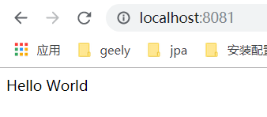

[TOC]

# 介绍 

node.js就是运行在服务端的javascript

node.js是一个基于chrome JavaScript运行是建立的一个平台

node.js是一个事件驱动I/O服务端JavaScript环境,基于Google的V8引擎,性能非常好

# API文档

[node.js中文网](http://nodejs.cn/api/path.html)

# 安装

在Windows下安装

- 直接去[官网](https://nodejs.org/en/download/)上下载.exe文件,安装即可使用

- 检查是否安装成功

  ```cmd
  node --version
  ```

在linux下安装

- 下载直接解压即可

  ```cmd
  wget https://nodejs.org/dist/v10.9.0/node-v10.9.0-linux-x64.tar.xz    # 下载
  tar xf  node-v10.9.0-linux-x64.tar.xz       # 解压
  cd node-v10.9.0-linux-x64/                  # 进入解压目录
  ./bin/node -v                               # 执行node命令 查看版本
  ```

# helloworld

在命令行中输入命令

- 在命令行中输入node,即可进入node环境
- 输入`console.log("Hello World")`即可运行输出结果

在命令行中运行js

- 编写hello.js

  ```js
  console.log("Hello World")
  ```

- 运行hello.js

  ```cmd
  node hello.js # 使用node运行js
  ```

# 创建web应用

- 创建一个server.js文件

- 引入需要用到的模块

  使用`require`指令来载入其他用到的模块

  ```js
  var http = require("http");
  ```

- 创建服务器

  ```js
  http.createServer(function (request, response) {
      // 发送 HTTP 头部 
      // HTTP 状态值: 200 : OK
      // 内容类型: text/plain
      response.writeHead(200, {'Content-Type': 'text/plain'});
  
      // 发送响应数据 "Hello World"
      response.end('Hello World\n');
  }).listen(8888);
  
  // 终端打印如下信息
  console.log('Server running at http://127.0.0.1:8888/');
  ```

- 运行server.js

  ```cmd
  node server.js
  ```

# npm包管理工具

npm是随同nodejs一起安装的包管理工具

当需要使用到其他模块的使用,可以是使用npm来方便的下载对应的模块

npm的教程可见笔记[npm.md](./npm.md)

# 回调函数

node.js 异步编程的直接体现就是回调。node使用了大量的回调函数，node所有 API 都支持回调函数,这就大大提高了 Node.js 的性能，可以处理大量的并发请求

回调函数一般作为函数的最后一个参数出现

```js
function foo1(name, age, callback) { }
function foo2(value, callback1, callback2) { }
```

示例

- 读取文件

  ```js
  var fs = require("fs");
  
  fs.readFile('input.txt', function (err, data) {
      if (err) return console.error(err);
      console.log(data.toString());
  });
  
  console.log("程序执行结束!");
  ```

  运行结果

  ```js
  程序执行结束!
  菜鸟教程官网地址：www.runoob.com
  ```

# 事件循环

node.js是单进程单线程应用程序,但是V8引擎提供了异步执行回调接口,通过这些接口可以处理大量的并发

node.js中基本上所有的事件机制都是用设计模式中的观察者模式实现的

node.js单线程类似进入一个while(true)的事件循环,直到没有事件观察者退出,每个异步事件都生成一个事件观察者,如果有事件发生就调用该回调函数

# EventEmitter

EventEmitter属于events模块,通过示例化EventEmitter类来绑定和监听事件

步骤

- 引入events模块,创建EventEmitter对象

  ```js
  // 引入 events 模块
  var events = require('events');
  // 创建 eventEmitter 对象
  var eventEmitter = new events.EventEmitter();
  ```

- 绑定事件处理程序

  ```js
  // 绑定事件及事件的处理程序
  eventEmitter.on('eventName', eventHandler);
  ```

- 触发事件,从而触发回调函数

  ```js
  // 触发事件
  eventEmitter.emit('eventName');
  ```

示例

- 创建event.js文件

  ```js
  var EventEmitter = require('events').EventEmitter; 
  var event = new EventEmitter();
  // 绑定回调事件
  event.on('some_event', function() { 
      console.log('some_event 事件触发'); 
  }); 
  setTimeout(function() { 
      //触发回调事件
      event.emit('some_event'); 
  }, 1000); 
  ```

# Buffer

缓冲区,专门存放二进制数据的缓冲区

# Stream

Stream 是一个抽象接口，Node 中有很多对象实现了这个接口; 例如，对http 服务器发起请求的request 对象就是一个 Stream，还有stdout（标准输出）。

四种类型

- Readable - 可读操作。
- Writable - 可写操作。
- Duplex - 可读可写操作.
- Transform - 操作被写入数据，然后读出结果。

所有的Stream对象都是EventEmitter 的实例,常用的事件有:

- data - 当有数据可读时触发。
- end - 没有更多的数据可读时触发。
- error - 在接收和写入过程中发生错误时触发。
- finish - 所有数据已被写入到底层系统时触发。

示例

- 从流中读取数据

  读取文本

  ```js
  var fs = require("fs");
  var data = '';
  
  // 创建可读流
  var readerStream = fs.createReadStream('input.txt');
  
  // 设置编码为 utf8。
  readerStream.setEncoding('UTF8');
  
  // 处理流事件 --> data, end, and error
  readerStream.on('data', function(chunk) {
     data += chunk;
  });
  readerStream.on('end',function(){
     console.log(data);
  });
  readerStream.on('error', function(err){
     console.log(err.stack);
  });
  
  console.log("程序执行完毕");
  ```

- 写入流

  写入文本

  ```js
  var fs = require("fs");
  var data = '菜鸟教程官网地址：www.runoob.com';
  
  // 创建一个可以写入的流，写入到文件 output.txt 中
  var writerStream = fs.createWriteStream('output.txt');
  
  // 使用 utf8 编码写入数据
  writerStream.write(data,'UTF8');
  
  // 标记文件末尾
  writerStream.end();
  
  // 处理流事件 --> finish and error
  writerStream.on('finish', function() {
      console.log("写入完成。");
  });
  writerStream.on('error', function(err){
     console.log(err.stack);
  });
  
  console.log("程序执行完毕");
  ```

- 管道流

  管道提供了一个输出流到输入流的机制。通常我们用于从一个流中获取数据并将数据传递到另外一个流中。一般可用在复制文件等

  ```js
  var fs = require("fs");
  
  // 创建一个可读流
  var readerStream = fs.createReadStream('input.txt');
  
  // 创建一个可写流
  var writerStream = fs.createWriteStream('output.txt');
  
  // 管道读写操作
  // 读取 input.txt 文件内容，并将内容写入到 output.txt 文件中
  readerStream.pipe(writerStream);
  
  console.log("程序执行完毕");
  ```

- 链式流

  链式是通过连接输出流到另外一个流并创建多个流操作链的机制。链式流一般用于管道操作。

  接下就是用管道和链式来压缩和解压文件。

  ```js
  var fs = require("fs");
  var zlib = require('zlib');
  
  // 压缩 input.txt 文件为 input.txt.gz
  fs.createReadStream('input.txt')
    .pipe(zlib.createGzip())
    .pipe(fs.createWriteStream('input.txt.gz'));
    
  console.log("文件压缩完成。");
  ```

# js模块系统

为了让Node.js的文件可以相互调用，Node.js提供了一个简单的模块系统。

## 简单的引入

- 创建a.js文件

  ```js
  //该变量只能在内部使用
  var test = "test";
  console.log(test);
  //函数只能内部使用
  function print(name) {
    console.log(name);
  }
  print("sdfsdf");
  ```

- 创建index.js文件(和a.js是同级目录)

  ```js
  var a=require(./a); //直接运行a.js中的代码
  ```

- 运行index.js

  ```js
  运行结果:
  test
  sdfsdf
  ```

- 总结

  可以把a.js当作是一个执行某个任务是所需要的模块,a.js本身就能执行完成,index.js就是单纯的调用了a.js而已

## 创建模块

- 创建a.js模块

  ```js
  //该变量只能在内部使用
  var test = "test";
  //导出变量
  exports.sss = 111;
  //导出函数
  exports.hello = function(name) {
    console.log(test + name);
  };
  //通过 exports 对象把 world 作为模块的访问接口
  //将其当作模块引入其他文件之后就可以将world当作是成员函数使用了
  ```

- 创建index.js文件(和a.js是同级目录)

  ```js
  var a = require("./a"); //获取a模块
  a.hello("jjj");//调用a模块中的hello函数
  console.log(a.sss);//打印a模块中的sss变量(a模块中的test变量只能内部使用)
  ```

- 运行index.js

  ```js
  运行结果:
  testjjj
  111
  ```

- 总结

  a.js相当于是一个模块,模块中导出的变量和函数可以被重复的使用(其中模块中导出的变量可以被修改),导出的模块只有一份,如果调用两次require("./a"),获取到的模块对象是同一个

## 封装一个对象

- 创建a.js文件

  ```js
  function Hello() { 
      var name; //对象的成员变量
      this.setName = function(thyName) { //set方法
          name = thyName; 
      }; 
      this.sayHello = function() { //sayHello方法
          console.log('Hello ' + name); 
      }; 
  }; 
  module.exports = Hello;//导出对象
  //将Hello直接赋值给module.exports,那么通过require获取到的就是一个对象,使用时需要new一个对象
  ```

- 创建index.js文件(和a.js是同级目录)

  ```js
  var a = require("./a"); //引入一个类
  var hello = new a(); //new了这个类的一个对象
  hello.setName("1");
  hello.sayHello();
  ```

- 运行index.js

  ```js
  运行结果:
  Hello 1
  ```

- 总结

  a.js就相当于是一个类,获取模块后就获取了类模板,可以实例化出多个类实例,每个实例都保存着自己的一份数据和函数,互不冲突,和上一个`创建模块`是完全两种概念

## 系统模块

- 先安装

  `cnpm i fs -S`

- 使用

  `var fs = require("fs");`

- 总结

  直接使用,没毛病

## js模块总结

- exports 和 module.exports 的使用

  如果要对外暴露属性或方法，就用 exports 就行
  
  要暴露对象(类似class，包含了很多属性和方法)，就用 module.exports。

# 函数

在JavaScript中，一个函数可以作为另一个函数的参数; 我们可以先定义一个函数，然后传递，也可以在传递参数的地方直接定义函数。

示例

- 声明函数

  ```js
  function say(word) {
    console.log(word);
  }
  
  function execute(value , someFunction) {
    someFunction(value);
  }
  
  execute("Hello" , say);
  ```

- 匿名函数

  ```js
  function execute(value , someFunction) {
    someFunction(value);
  }
  
  execute("Hello",function(word){ 
      console.log(word) 
  });
  ```

# 全局对象

全局对象的所有属性都可以在程序的任何地方访问

 Node.js 中的全局对象是 global

- __filename

  表示当前正在执行的脚本的文件名, 他将输出文件所在位置的绝对路径

  示例

  - `console.log( __filename );`

- __dirname

  表示当前执行脚本所在的目录

  示例

  - `console.log( __dirname );`

- setTimeout(cb, ms)

  全局函数,在指定的毫秒(ms)数后执行指定函数(cb); setTimeout() 只执行一次指定函数; 返回一个代表定时器的句柄值。

  示例

  - ```js
    function printHello(){
       console.log( "Hello, World!");
    }
    // 两秒后执行以上函数
    setTimeout(printHello, 2000);
    ```

- clearTimeout(t)

  全局函数,用于停止一个之前通过 setTimeout() 创建的定时器; 参数 t 是通过 setTimeout() 函数创建的定时器。

  示例

  - ```js
    function printHello(){
       console.log( "Hello, World!");
    }
    // 两秒后执行以上函数
    var t = setTimeout(printHello, 2000);
    
    // 清除定时器
    clearTimeout(t);
    ```

- setInterval(cb, ms)

  全局函数,在指定的毫秒(ms)数后执行指定函数(cb)。setInterval() 方法会不停地调用函数，直到 clearInterval() 被调用或窗口被关闭。

  示例

  - `setInterval(printHello, 2000);`

- console

  用于提供控制台标准输出

  示例

  - ```js
    console.log('Hello world'); 
    console.log('byvoid%diovyb', 1991); 
    ```

    > 结果
    >
    > ```js
    > Hello world 
    > byvoid1991iovyb 
    > ```

- [process](https://www.runoob.com/nodejs/nodejs-global-object.html)

  用于描述当前Node.js 进程状态的对象，提供了一个与操作系统的简单接口

  - 事件

    - 示例

      ```js
      process.on('exit', function(code) {  
        console.log('退出码为:', code);
      });
      console.log("程序执行结束");
      ```

      结果

      ```js
      程序执行结束
      退出码为: 0
      ```

  - 退出状态码

    - 很多...

  - 属性

    - 示例

      ```js
      // 获取执行路径
      console.log(process.execPath);
      ```

  - 方法

    - 示例

      ```js
      // 输出当前目录
      console.log('当前目录: ' + process.cwd());
      
      // 输出当前版本
      console.log('当前版本: ' + process.version);
      
      // 输出内存使用情况
      console.log(process.memoryUsage());
      ```

# [fs模块](https://www.runoob.com/nodejs/nodejs-fs.html)

标准的文件操作API,文件系统模块(fs)

`var fs = require("fs")`

示例

- 读取文件

  - 异步读取文件

    ```js
    var fs = require("fs");
    
    // 异步读取
    fs.readFile('input.txt', function (err, data) {
       if (err) {
           return console.error(err);
       }
       console.log("异步读取: " + data.toString());
    });
    ```

  - 同步读取文件

    ```js
    var fs = require("fs");
    
    // 同步读取
    var data = fs.readFileSync('input.txt');
    console.log("同步读取: " + data.toString());
    ```

- 写入文件

  ```js
  var fs = require("fs");
  
  fs.writeFile('input.txt', '我是通 过fs.writeFile 写入文件的内容',  function(err) {
     if (err) {
         return console.error(err);
     }
     console.log("数据写入成功！");
  });
  ```

- 关闭文件

  `fs.close(fd, callback)`

  参数

  - fd - 通过 fs.open() 方法返回的文件描述符。
  - callback - 回调函数，没有参数。

- 删除文件

  `fs.unlink(path, callback)`

  > 回调函数，没有参数。

- 创建目录

  `fs.mkdir(path[, options], callback)`

  参数

  - path - 文件路径。
  - options 参数可以是：
    - recursive - 是否以递归的方式创建目录，默认为 false。
    - mode - 设置目录权限，默认为 0777。
  - callback - 回调函数，没有参数。

- 读取目录

  `fs.readdir(path, callback)`

  > 回调函数带有两个参数err, files，err 为错误信息，files 为 目录下的文件数组列表。

- 删除目录

  `fs.rmdir(path, callback)`
  
  > 回调函数，没有参数。

# web模块

 http 模块

- GET/POST请求

  - 示例

    - 获取url参数

      ```js
      var http = require('http');
      var url = require('url');
      var util = require('util');
       
      http.createServer(function(req, res){
          res.writeHead(200, {'Content-Type': 'text/plain'});
       
          // 解析 url 参数
          var params = url.parse(req.url, true).query;
          res.write("网站名：" + params.name);
          res.write("\n");
          res.write("网站 URL：" + params.url);
          res.end();
       
      }).listen(3000);
      ```

    - 获取post请求

      ```js
      var http = require('http');
      var querystring = require('querystring');
      var util = require('util');
       
      http.createServer(function(req, res){
          // 定义了一个post变量，用于暂存请求体的信息
          var post = '';     
       
          // 通过req的data事件监听函数，每当接受到请求体的数据，就累加到post变量中
          req.on('data', function(chunk){    
              post += chunk;
          });
       
          // 在end事件触发后，通过querystring.parse将post解析为真正的POST请求格式，然后向客户端返回。
          req.on('end', function(){    
              post = querystring.parse(post);
              res.end(util.inspect(post));
          });
      }).listen(3000);
      ```

# [shelljs模块](https://www.npmjs.com/package/shelljs)

## 安装

```js
npm install shelljs  --save
```

## shelljs基本使用

```js
var shell=require('shelljs');
shell.mkdir("-p",'/tmp/a/b/c/d');//递归创建目录
shell.mkdir('-p', '/tmp/a/b/c/d', '/tmp/e/f/g');//递归创建多个目录

shell.rm('-rf', 'out/Release');//强制删除目录或文件

shell.cp('-R', 'stuff/', 'out/Release');//递归复制文件夹(将stuff目录复制为out/Release目录)

shell.cd('lib');//进入目录

shell.ls('*.js').forEach(function (file) {});//使用ls命令并遍历文件

shell.sed('-i', 'PROGRAM_VERSION', 'v0.1.3', 'source.js');//直接将souce.js中的PROGRAM_VERSION替换成v0.1.3(支持正则表达式)

shell.exec('git commit -am "Auto-commit"');//执行git命令
```

## shelljs使用全局模式

```js
require('shelljs/global');

mkdir('-p', '/var/log');
cp('-R', '/var/log/*', '/home/zhangzhi/logs/');

cd('/home/zhangzhi/logs');
//在shelljs 使用下,第一种方式必须使用 exec 方法,通过把 shell 脚本以参数形式传递给 exec 方法来运行即可.
//在全局模式下,可以直接在 node.js 代码中书写 shell 脚本,比如上面的 mkdir ,cp ,cd 等等.
```

## shelljs 实时获取输入输出流

- 输出流

  ```js
  var child = exec('ls', {async:true});
  child.stdout.on('data', function(data) {
    /* ... do something with data ... */
    这里可以拦截标准输出流
  });
  ```

- 输入流

  ```js
  var userName='zhangzhi';
  var password='pwd';
  
  exec("adduser "+userName);
  var child= exec("passwd " + userName,{async:true});
  child.stdin.write(password+'\n'); //这里输入密码
  child.stdin.write(password+'\n'); //这里输入确认密码
  child.stdin.end();
  ```

# [Express 框架](https://www.runoob.com/nodejs/nodejs-express-framework.html)

Express 是一个简洁而灵活的 node.js Web应用框架, 提供了一系列强大特性帮助你创建各种 Web 应用，和丰富的 HTTP 工具。

使用 Express 可以快速地搭建一个完整功能的网站。

Express 框架核心特性：

- 可以设置中间件来响应 HTTP 请求。
- 定义了路由表用于执行不同的 HTTP 请求动作。
- 可以通过向模板传递参数来动态渲染 HTML 页面。

## 安装

安装express

`cnpm install express --save`

再安装其他的相关模块

- body-parser - node.js 中间件，用于处理 JSON, Raw, Text 和 URL 编码的数据。

- cookie-parser - 这就是一个解析Cookie的工具。通过req.cookies可以取到传过来的cookie，并把它们转成对象。

- multer - node.js 中间件，用于处理 enctype="multipart/form-data"（设置表单的MIME编码）的表单数据。

  ```js
  cnpm install body-parser --save
  cnpm install cookie-parser --save
  cnpm install multer --save
  ```

## demo实例

- 创建一个demo.js

  ```js
  var express = require('express');//导入express模块 
  var app = express();//获取app对象
   
  //当'/'请求时的回调(request 和 response 对象来处理请求和响应的数据)
  app.get('/', function (req, res) {
     res.send('Hello World');
  })
   
  //启动server并监听再8081端口
  var server = app.listen(8081, function () {
    var host = server.address().address;
    var port = server.address().port;
    console.log("应用实例，访问地址为 http://%s:%s", host, port);
  })
  ```

- 执行demo.js

  `node demo.js`

- 访问网址http://localhost:8081/

  

- request 和 response的属性见[参考文档](https://www.runoob.com/nodejs/nodejs-express-framework.html)

## 路由

分别对应不同的url请求

- 访问主页

  `app.get('/', function (req, res){})`

- 普通的url请求

  `app.get('/del_user', function (req, res) {})`

- 使用正则来匹配url请求

  `app.get('/ab*cd', function(req, res) {})`

## 静态资源

Express 提供了内置的中间件 express.static 来设置静态文件

- 设置public目录为静态资源文件路径

  ```js
  var express = require('express');
  var app = express();
  app.use('/public', express.static('public'));
  ```

- 在public目录下放`logo.png`图片并访问

  `http://localhost:8081/public/logo.png`即可看到图片

## 表单处理

- js发送get请求

  ```js
  //发送get请求
  function ajaxGetUtil(url,handleFunction){
  	var httpRequest = new XMLHttpRequest();//第一步：建立所需的对象
  	httpRequest.open('GET', url, true);//第二步：打开连接  将请求参数写在url中  ps:"./Ptest.php?name=test&nameone=testone"
  	httpRequest.send();//第三步：发送请求  将请求参数写在URL中
  
  	httpRequest.onreadystatechange = function () {
  		if (httpRequest.readyState == 4 && httpRequest.status == 200) {
  			handleFunction(JSON.stringify(httpRequest.responseText));//获取到json字符串，还需解析
  		}
  	};
  }
  ```

- js发送post请求

  ```js
  //发送get请求
  function ajaxPostUtil(url,dataObj,handleFunction){
  	var httpRequest = new XMLHttpRequest();//第一步：创建需要的对象
  	httpRequest.open('post', url); //第二步：打开连接/***发送json格式文件必须设置请求头 ；如下 - */
      httpRequest.setRequestHeader("Content-type","application/x-www-form-urlencoded");//设置普通类型数据,如(a=1&b=2)
  	httpRequest.setRequestHeader("Content-type","application/json");//设置json类型数据,如({a:1,b:2})
  	httpRequest.send(JSON.stringify(dataObj));//发送请求 将json写入send中
  
  	httpRequest.onreadystatechange = function () {//请求后的回调接口，可将请求成功后要执行的程序写在其中
  		if (httpRequest.readyState == 4 && httpRequest.status == 200) {//验证请求是否发送成功
  			handleFunction(JSON.stringify(httpRequest.responseText));//获取到json字符串，还需解析
  		}
  	};
  }
  ```

- 获取get请求的数据

  ```js
  //获取todoList的数据
  app.get("/getTodoList", function(req, res) {
      res.send(todoListData);
  });
  ```

- 获取post请求的数据(普通数据)

  ```js
  var express = require("express"); //导入express模块
  var bodyParser = require('body-parser');
  // 创建 application/x-www-form-urlencoded 编码解析
  var urlencodedParser = bodyParser.urlencoded({ extended: false });
  var app = express(); //获取app对象
  
  //获取todoList的数据
  app.post("/saveTodoList",urlencodedParser, function(req, res) {
      console.log(req.body)
      res.send({'code':1,"data":''});
  });
  ```

- 获取post请求的数据(json类型数据)

  ```js
  var express = require("express"); //导入express模块
  var bodyParser = require('body-parser');
  var app = express(); //获取app对象
  
  //获取todoList的数据
  app.post("/saveTodoList",bodyParser.json(), function(req, res) {
      console.log(req.body)
      res.send({'code':1,"data":''});
  });
  ```

  

[详细文档](https://www.runoob.com/nodejs/nodejs-express-framework.html): 关键词搜索`process_get`

# 遇到的问题

- 在linux中如何后台运行nodejs程序

  1. 安装forever进行管理

     `npm install -g forever`

  2. 运行

     `forever start index.js`

  3. 日志文件位置

     默认会放在`~/.forever/forever.log`中

  4. 关闭应用

     - 关闭一个应用

       `forever stop index.js`

     - 关闭所有应用

       `forever stopall`

# 参考文档

[node.js教程](https://www.runoob.com/nodejs/nodejs-tutorial.html)


