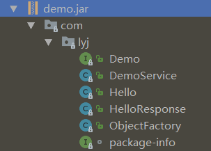
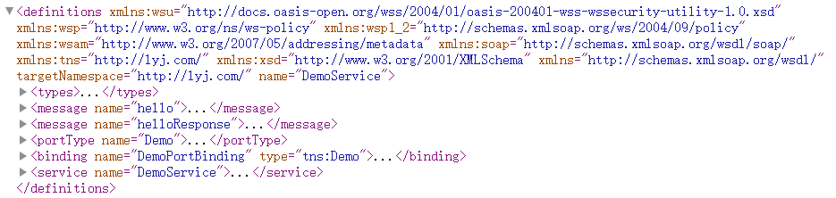
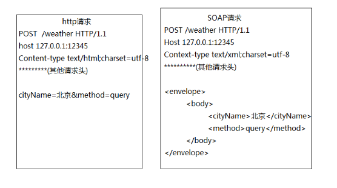

[TOC]

# 简介

webService是一种使用http传输SOAP协议数据的rpc远程调用技术

webService实现了跨应用程序通讯和跨平台通讯

> 因为他们之间的通讯协议是一样的,都是soap协议

三要素

- SOAP: 规范XML标签

  > 应用程序之间的一种通信协议,soap基于xml和http,通过xml来显示消息的描述,通过http实现消息传输

- WSDL: 服务端的接口使用说明

  > Web Services Description Language(即web服务描述语言)
  >
  > 服务提供者通过web服务描述将接口规范告知服务请求者,用户只需要知道怎么使用,而不需要知道其实现的底层平台,编程语言等
  >
  > wsdl告知了用户服务所提供的操作,如何访问服务,服务位于何处(通过url定位)

- UDDI: 目录

  > Universal Description，Discovery and Integration(通用的描述,发现及整合)
  >
  > 相当于是一个目录,其中存放了webService的接口信息,它提供了注册和搜索功能

# 创建webService服务

创建webService非常的简单,在jdk中就带了@WebService注解,只要在类上标注即可

> 类中的public方法会被发布为服务,而其他private,protect,static和final都不会被发布为服务

- 创建一个简单的webService服务

  ```java
  import javax.jws.WebService;
  
  @WebService
  public class Demo {
      public String hello(String str){
          System.out.println(str);
          return "hello";
      }
  }
  ```

- 发布创建的webService服务

  ```java
  import javax.xml.ws.Endpoint;
  
  public class Main {
      public static void main(String[] args) {
          Endpoint.publish("http://localhost/demo",new Demo()); //发布webService服务
          System.out.println("服务端接口说明访问地址:"+"http://localhost/demo?wsdl");
      }
  }
  ```

  > 访问服务接口说明地址`http://localhost/demo?wsdl`即可看到接口服务的说明

- 生成提供给服务调用者的jar包

  1. 打开命令行,使用java提供的`wsimport`命令生成客户端代码(class文件)

     ```shell
     wsimport http://localhost/demo?wsdl
     ```

     > 该命令会将.class生成在当前目录下

     > wsimport常用参数
     >
     > - `-d`: 默认参数,用于生成.class文件
     > - `-s`: 生成.java文件
     > - `-p`: 指定生成java文件的包名,不指定则为WSDL说明书中namespace值的倒写

  2. 使用`jar`命令将生成的class文件打成jar包

     ```shell
     jar -cvf demo.jar com   	//将com文件夹打成demo.jar
     jar -cvf demo.jar *.class   //将所有.class文件打成demo.jar
     ```

     生成的文件概要

     

  3. 将打好的jar提供给服务调用者

     - 将jar包添加到类路径下

     - 调用服务

       ```java
        public static void main(String[] args) {
            Demo demo = new DemoService().getDemoPort(); //获取对应的接口实例
            String response = demo.hello("hi"); //调用方法
            System.out.println(response); //输出结果
        }
       ```

# webService三要素详解

## WSDL(服务说明书)

WSDL即web服务描述语言,它是服务接口的使用说明书,是xml格式的文档,说明服务地址,服务的类、方法、参数和返回值,是伴随服务发布成功后自动生成的

文档结构



- `<types>`: 定义webService使用的全部数据类型
- `<message>`: 定义一个操作(方法)的数据参数(可有多个参数)
- `<portType>`: 服务端点,描述webService可被执行的操作方法,以及相关的消息,通过binding执行portType
- `<binding>`: 为每个服务端点定义消息格式和协议细节
- `<service>`: 服务视图,webService的服务节点,它包括了服务端点

## SOAP(通讯协议)

SOAP是一种基于xml和http的通讯协议

### 原理



### 协议格式

- `Envelope`：必须有，此元素将整个 XML 文档标识为一条SOAP消息

- `Header`：可选元素，包含头部信息

- `Body`：必须有，包含所有调用和响应信息

- `Fault`：可选元素，提供有关在处理此消息时所发生的错误信息

### SOAP版本

- SOAP1.1

  请求

  ```xml
  POST /weather HTTP/1.1  
  Accept: text/xml, multipart/related  
  Content-Type: text/xml; charset=utf-8  
  SOAPAction: "http://jaxws.ws.itcast.cn/WeatherInterfaceImpl/queryWeatherRequest"  
  User-Agent: JAX-WS RI 2.2.4-b01  
  Host: 127.0.0.1:54321  
  Connection: keep-alive  
  Content-Length: 211  
    
  <?xml version="1.0" ?>  
  <S:Envelope xmlns:S="http://schemas.xmlsoap.org/soap/envelope/">  
      <S:Body>
          <!-- hello是wsdl文档中<portType>标签下的<operation>中name等于'hello'标签下的<input>标签中message的属性值 -->
  		<!-- http://lyj.com/是wsdl文档中<definitions>标签中的targetNamespace属性 -->
          <ns2:hello xmlns:ns2="http://lyj.com/">
          	<arg0>北京</arg0>
          </ns2:hello>  
      </S:Body>  
  </S:Envelope>
  ```

  响应

  ```xml
  HTTP/1.1 200 OK  
  Transfer-encoding: chunked  
  Content-type: text/xml; charset=utf-8  
  Date: Fri, 04 Dec 2015 03:45:56 GMT  
    
  <?xml version="1.0" ?>  
  <S:Envelope xmlns:S="http://schemas.xmlsoap.org/soap/envelope/">  
      <S:Body>  
          <!-- helloResponse是wsdl文档中是wsdl文档中<portType>标签下的<operation>中name等于'hello'标签下的<output>标签中message的属性值 -->
  		<!-- http://lyj.com/是wsdl文档中<definitions>标签中的targetNamespace属性 -->
      	<ns2:helloResponse xmlns:ns2="http://lyj.com/">
          	<return>晴</return>
          </ns2:helloResponse>  
      </S:Body>  
  </S:Envelope>
  ```

- SOAP1.2

  请求

  ```xml
  POST /weather HTTP/1.1  
  Accept: application/soap+xml, multipart/related  
  Content-Type: application/soap+xml; charset=utf-8;  
  action="http://jaxws.ws.itcast.cn/WeatherInterfaceImpl/queryWeatherRequest"  
  User-Agent: JAX-WS RI 2.2.4-b01  
  Host: 127.0.0.1:54321  
  Connection: keep-alive  
  Content-Length: 209  
    
  <?xml version="1.0" ?>  
  <S:Envelope xmlns:S="http://www.w3.org/2003/05/soap-envelope">  
      <S:Body>
          <!-- hello是wsdl文档中<portType>标签下的<operation>中name等于'hello'标签下的<input>标签中message的属性值 -->
  		<!-- http://lyj.com/是wsdl文档中<definitions>标签中的targetNamespace属性 -->
          <ns2:hello xmlns:ns2="http://lyj.com/">
              <arg0>北京</arg0>
          </ns2:hello>  
      </S:Body>  
  </S:Envelope> 
  ```

  响应

  ```xml
  HTTP/1.1 200 OK  
  Transfer-encoding: chunked  
  Content-type: application/soap+xml; charset=utf-8  
  Date: Fri, 04 Dec 2015 03:55:49 GMT  
    
  <?xml version='1.0' encoding='UTF-8'?>  
  <S:Envelope xmlns:S="http://www.w3.org/2003/05/soap-envelope">  
      <S:Body>  
          <!-- helloResponse是wsdl文档中是wsdl文档中<portType>标签下的<operation>中name等于'hello'标签下的<output>标签中message的属性值 -->
  		<!-- http://lyj.com/是wsdl文档中<definitions>标签中的targetNamespace属性 -->
          <ns2:helloResponse xmlns:ns2="http://lyj.com/">
              <return>晴</return>
          </ns2:helloResponse>  
      </S:Body>  
  </S:Envelope> 
  ```

SOAP的1.1和1.2版本的区别

- 相同点

  1. 请求方式都是post
  2. 协议格式都一样,都有envelope和body

- 不同点

  1. 数据格式不同

     > `SOAP1.1`：Content-type: text/xml;charset=utf-8
     > `SOAP1.2`：Content-type: application/soap+xml;charset=utf-8

  2. 命名空间不同

     > `SOAP1.1`：xmlns:S="http://schemas.xmlsoap.org/soap/envelope/"
     > `SOAP1.2`：xmlns:S="http://www.w3.org/2003/05/soap-envelope"

## UUDI(目录)

Universal Description，Discovery and Integration(通用的描述,发现及整合)

相当于是一个目录,其中存放了webService的接口信息,它提供了注册和搜索功能

# webService注解

## @WebService

该注解标注在类上,标识该类是一个webService服务

参数

- `serviceName`

  wsdl文档中`<service>`标签中的`name`属性值

  对外发布的服务名,指定webService的服务名称

  > 缺省值为 类名+"Service"

- `endpointInterface`

  服务接口全路径,指定服务端点接口

- `name`

  wsdl文档中`<portType>`标签的`name`属性值

  > 缺省值为类名或接口名

- `portName`

  wsdl文档中`<service >`标签中的`<port>`标签的`name`属性

  > 缺省值为 类名 +"Port"

- `targetNamespace`

  指定名称空间

  > 缺省值为接口实现类的包名的反缀

- `wsdlLocation`

  指定wsdl文档的访问地址

## @WebMethod

定义发布的方法名称

- `operationName`

  指定webService发布接口方法的名称

  即`<portType>`标签下的`<operation>`标签的`name`属性值

  > 缺省值为java方法名

- `action`

  定义此操作的行为,此值指定SOAPAction头的值

  > 缺省值为java方法名

- `exclude`

  指定是否从webService中排除该方法

  > 缺省值为false

## @WebParam

用于指定接收参数的名称(即webService中方法定义的参数和xml元素参数的映射)

- `name`

  参数的名称,

  1. 如果操作是远程过程调用(RPC)类型并且未指定partName属性,那么这个用于表示wsdl文档中`<part>`标签中的`name`属性
  2. 如果操作时文档类型或者参数映射至某个头,那么则用于表示该参数的xml元素的局部名称
  3. 如果操作是文档类型,参数类型未`bare`并且方式为`out`或`inout`,那么必须指定此属性

- `partName`

  指定wsdl文档中的`<part>`标签的`name`属性值

  > 仅当操作类型为RPC或操作时文档类型并且参数类型为bare时才使用此参数

- `targetNamespace`

  指定xml名称空间, 当属性映射至xml元素时,仅应用于文档绑定

  > 缺省值为接口实现类的包名的反缀

- `mode`

  表示此方法的参数流的方向, 有效值为`in`,`inout`和`out`

- `header`

  指定参数是在消息头还是消息体中

  > 缺省值为false

## @WebResult

指定返回值的映射(即wsdl文档和xml元素的映射关系)

- `name`

  当返回值列示在wsdl文档中并且在收到的xml消息中找到该返回值时,指定该返回值的名称

  1. 对于RPC绑定,这是用于表示返回值的wsdl文档中`<part>`标签的`name`属性值
  2. 对于文档绑定,该参数用于表示返回值的xml元素的局部名
  3. 对于RPC和document/wrapped绑定,缺省值为return
  4. 对于document/bare绑定,缺省值为 方法名 + "Response"

- `targetNamespace`

  指定返回值的xml名称空间

  > 仅当操作类型为RPC或者操作是文档类型并且参数类型为bare时才使用此参数

- `header`

  指定头部是否附带结果

  > 缺省值为false

- `partName`

  指定RPC或document/bare操作的结果的名称

  > 缺省值为@WebResult.name

## webService注解-示例

```java
import javax.jws.WebMethod;  
import javax.jws.WebParam;  
import javax.jws.WebResult;  
import javax.jws.WebService;  
import javax.xml.ws.BindingType;  
import javax.xml.ws.soap.SOAPBinding;  
  
@WebService(  
        targetNamespace="http://service.itcast.cn",  
        name="WeatherWSSoap",  
        portName="WeatherWSSoapPort",  
        serviceName="WeatherWS"  
        )  
@BindingType(SOAPBinding.SOAP12HTTP_BINDING)  //指定SOAP1.2版本
public class WeatherInterfaceImpl implements WeatherInterface {  
    
    @Override  
    @WebResult(name="result")
    @WebMethod(operationName="getWeather", exclude=false  ) 
    public String queryWeather(@WebParam(name="cityName")String cityName) {  
        System.out.println("from client: "+cityName);  
        String weather = "晴";  
        return weather;  
    }   
}
```

# 调用webService

## QName调用-推荐使用

使用QName调用webService接口的时候,客户端只需要保留一个接口类即可

```java
import javax.jws.WebService;

@WebService
public interface Demo {
    public String hello(String str);
}
```

> 接口上必须要有`@WebService`注解

调用过程

```java
public class Main {
    public static void main(String[] args) throws Exception {
        //创建一个连接（地址对应的就是webservice服务器中的地址）
        URL wsdlDocumentLocation = new URL("http://localhost/demo?wsdl");
        
        //第一个参数是wsdl文档中的<definitions>标签中的targetNamespace属性值
        //第二个参数是wsdl文档中的<definitions>标签中的name属性值
        QName serviceName = new QName("http://lyj.com/","DemoService");
        
        //Service创建视图  
        //参数：  
        //1.wsdlDocumentLocation - 使用说明书地址  
        //2.serviceName - 服务名称 
        Service service = Service.create(wsdlDocumentLocation , serviceName );
        
        //获取到调用的对象内容(传入接口即可)
        Demo port = service.getPort(Demo.class);
        
        //方法的调用
        String result = port.hello("hi");
        System.out.println(result);
    }
}
```

## 普通的客户端调用

拿到服务端接口生成的jar后,加入到项目的类路径下,便可直接使用

```java
public static void main(String[] args) {
    //获取webservice服务器对象（这里的类名，其实是从wsdl文件中的servicename标签中进行获取的）
    DemoService demoService = new DemoService();
    //获取到我们自定义的webservice的对象
    Demo demoPort = demoService.getDemoPort();
    //调用service服务器中的方法
    demoPort.hello("hi"); 
}
```

## URLConnection调用

使用URLConnection需要注意的几个点

- 发送方式`POST`必须要大写
- 在创建soap的请求体时
  1. `ns2:hello`是wsdl文档中`<portType>`标签下的`<operation>`中`name`等于'hello'标签下的`<input>`标签中message的属性值
  2. `xmlns:ns2=http://lyj.com/`是wsdl文档中`<definitions>`标签中的`targetNamespace`属性

```java
public class Main {
    //HttpURLConnection调用
    public static void main(String[] args) throws Exception {
        //1：创建服务地址(soap:address标签下的location属性)
        URL url = new URL("http://localhost/demo");
        //2：打开到服务地址的一个连接
        HttpURLConnection connection = (HttpURLConnection) url.openConnection();
        //3：设置连接参数
        //3.1设置发送方式：POST必须大写
        connection.setRequestMethod("POST");
        //3.2设置数据格式：Content-type
        connection.setRequestProperty("content-type", "text/xml;charset=utf-8");
        //3.3设置输入输出，新创建的connection默认是没有读写权限的，
        connection.setDoInput(true);
        connection.setDoOutput(true);

        //4：组织SOAP协议数据，发送给服务端
        String soapXML = getXML("hi");//创建soapXml消息体
        OutputStream os = connection.getOutputStream();
        os.write(soapXML.getBytes());

        //5：接收服务端的响应
        int responseCode = connection.getResponseCode();
        if(200 == responseCode){//表示服务端响应成功
            InputStream is = connection.getInputStream();
            InputStreamReader isr = new InputStreamReader(is);
            BufferedReader br = new BufferedReader(isr);

            StringBuilder sb = new StringBuilder();
            String temp = null;
            while(null != (temp = br.readLine())){
                sb.append(temp);
            }
            System.out.println(sb.toString());

            is.close();
            isr.close();
            br.close();
        }
        os.close();
    }

    /**
     <?xml version="1.0" ?>  
     <S:Envelope xmlns:S="http://schemas.xmlsoap.org/soap/envelope/">  
         <S:Body>
             <ns2:hello xmlns:ns2="http://lyj.com/">
                <arg0>北京</arg0>
             </ns2:hello>  
         </S:Body>  
     </S:Envelope>
     */
    //创建soap的请求体
    public static String getXML(String param){
        String soapXML =
                "<?xml version=\"1.0\" ?>  \n" +
                "<S:Envelope xmlns:S=\"http://schemas.xmlsoap.org/soap/envelope/\">  \n" +
                "    <S:Body>\n" +
                "        <ns2:hello xmlns:ns2=\"http://lyj.com/\">\n" +
                "            <arg0>"+param+"</arg0>\n" +
                "        </ns2:hello>  \n" +
                "    </S:Body>  \n" +
                "</S:Envelope> ";

        return soapXML;
    }
}
```

## ajax调用

和URLConnection的用法基本相似,创建soap请求体,发送请求,接受返回值

# 参考文档

[java调用webservice接口](https://blog.csdn.net/qq_35124535/article/details/62226585)

[如何玩转WebService-csdn](https://blog.csdn.net/cs_hnu_scw/article/details/80181762)

[WebService注解](https://www.cnblogs.com/zhao-shan/p/5515174.html)