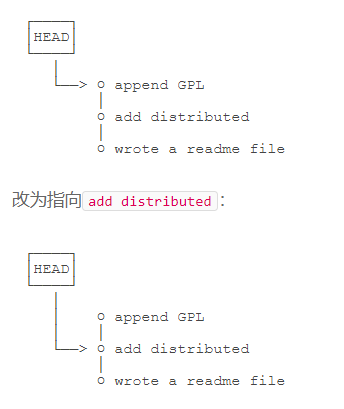
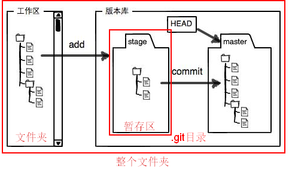
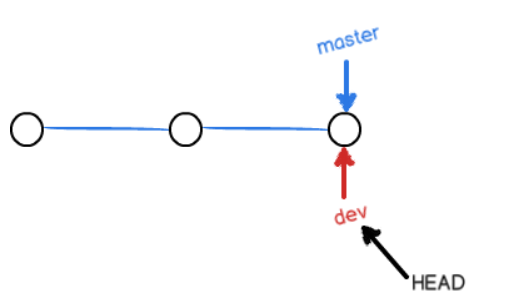
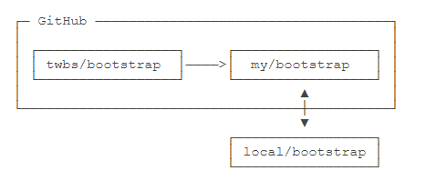

[TOC]


# 介绍

Git是目前世界上最先进的分布式版本控制系统


# 安装git

## windows安装git

从Git官网直接[下载安装程序](https://git-scm.com/downloads)

安装完成后，在开始菜单里找到“Git”->“Git Bash”，蹦出一个类似命令行窗口的东西，就说明Git安装成功！

安装完成后，还需要最后一步设置，在命令行输入：

```cmd
git config --global user.name "Your Name"
git config --global user.email "email@example.com"
```

## linux安装git

`sudo apt-get install git`

# 创建版本库

版本库又名仓库，英文名**repository**，你可以简单理解成一个目录，这个目录里面的所有文件都可以被Git管理起来，每个文件的修改、删除，Git都能跟踪，以便任何时刻都可以追踪历史，或者在将来某个时刻可以“还原”。

## 初始化目录使之称为可以管理的仓库

`git init`

> 初始化好git仓库之后,会在文件夹下多出一个`.git`的目录，这个目录是Git来跟踪管理版本库的，没事千万不要手动修改这个目录里面的文件，不然改乱了，就把Git仓库给破坏了。

## 把文件添加到版本库

- 将改动或者新增的文件**添加到仓库**

  > 添加单一文件
  >
  > `git add readme.md`
  >
  > 添加全部文件
  >
  > `git add .`

- 将文件**提交到仓库**

  `git commit -m 'init'`

  > `-m`后面输入的时本次提交的说明

# 版本管理

## 版本的概念

一次`git commit`提交就对应着一个版本

## 查看当前仓库的状态

`git status`

示例:

```cmd
$ git status
On branch master
Changes not staged for commit:
  (use "git add <file>..." to update what will be committed)
  (use "git checkout -- <file>..." to discard changes in working directory)

	modified:   readme.txt

no changes added to commit (use "git add" and/or "git commit -a")
```

## 查看文件的修改对比

`git diff readme.md`

示例:

```cmd
$ git diff readme.txt 
diff --git a/readme.txt b/readme.txt
index 46d49bf..9247db6 100644
--- a/readme.txt
+++ b/readme.txt
@@ -1,2 +1,2 @@
-Git is a version control system.
+Git is a distributed version control system.
 Git is free software.
```

## 查看git提交日志

`git log`

> 命令显示从最近到最远的提交日志，我们可以看到3次提交

示例:

```cmd
$ git log
commit 1094adb7b9b3807259d8cb349e7df1d4d6477073 (HEAD -> master)
Author: Michael Liao <askxuefeng@gmail.com>
Date:   Fri May 18 21:06:15 2018 +0800

    append GPL

commit e475afc93c209a690c39c13a46716e8fa000c366
Author: Michael Liao <askxuefeng@gmail.com>
Date:   Fri May 18 21:03:36 2018 +0800

    add distributed

commit eaadf4e385e865d25c48e7ca9c8395c3f7dfaef0
Author: Michael Liao <askxuefeng@gmail.com>
Date:   Fri May 18 20:59:18 2018 +0800

    wrote a readme file
```

---

提交日志的版本状态图


> 目前的版本指针指向的是最顶上的最新节点

## 版本回退

`git reset --hard HEAD^`

> 在Git中，用`HEAD`表示当前版本，上一个版本就是`HEAD^`，上上一个版本就是`HEAD^^`,往上100个版本就是`HEAD~100`

版本状态图



---

#### 如果回退版本后又想恢复回退之前的版本怎么办?

`git reflog`

> Git提供了一个命令`git reflog`用来记录你的每一次命令：

示例:

```cmd
$ git reflog
e475afc HEAD@{1}: reset: moving to HEAD^
1094adb (HEAD -> master) HEAD@{2}: commit: append GPL
e475afc HEAD@{3}: commit: add distributed
eaadf4e HEAD@{4}: commit (initial): wrote a readme file
```

可以通过`git reflog`命令获取到回退之前的版本的commit id(`1094adb`)

然后可以通过回退命令进行回退

`git reset --hard 1094adb`

## 工作区和暂存区(重要)

### 工作区（Working Directory）

就是电脑上能够看到的目录,比如`learngit`文件夹就是一个工作区：


### 版本库（Repository）-包含了暂存区

工作区有一个隐藏目录`.git`，这个不算工作区，而是Git的版本库。**版本库中包含着暂存区**

Git的版本库里存了很多东西，其中最重要的就是称为**stage（或者叫index）的暂存区**，还有Git为我们自动创建的第一个分支`master`，以及指向`master`的一个指针叫`HEAD`。



> 在`git add .`后,当前修改的文件都会加入到暂存区,在`git commit`后,会把暂存区添加当前分支(默认是master分支)的head节点

### git提交的具体细节

- 第一步: 添加文件 `git add`

  > 实际上就是**把文件修改添加到暂存区**

- 第二步:  提交更改 `git commit`

  > 实际上就是**把暂存区的所有内容提交到当前分支**

因为我们创建Git版本库时，Git自动为我们创建了唯一一个`master`分支，所以，现在，`git commit`就是往`master`分支上提交更改。

你可以简单理解为，需要提交的文件修改通通放到暂存区，然后，一次性提交暂存区的所有修改。

## 管理修改

给`git`设计的最优秀的就是其**跟踪并管理的是修改,而非文件**

> 如果没有将工作区的内容添加到暂存区,那么直接执行`git commit`之后,git只会将暂存区的内容提交到仓库(当前分支),而工作区的修改并不会提交,只有当执行`git add .`将工作区的修改提交到暂存区之后生效

## 撤销修改

`git checkout -- readme.md`

> `--`参数很重要,如果没有`--`参数,就会变成了'切换到另一个分支'的命令

执行命令后会有两种情况:

- readme.md自修改后还没有被放到暂存区

  > 那么,撤销修改就回到和版本库一模一样的状态

- readme.md已经添加到暂存区,但是又做了修改

  > 那么,撤销修改就回到添加到暂存区后的状态

## 删除文件

`git rm readme.md`

> `git rm`命令只能删除暂存区和当前分支中的文件,**还在工作区但是没有添加到暂存区的文件是不能够被删除的**
>
> 当要删除暂存区的文件时,需要加上参数`-f`,如`git rm -f readme.md`
>
> 使用`git rm`删除后的文件,会直接消失在工作区中

示例:

```cmd
$ git rm test.txt
rm 'test.txt'

$ git commit -m "remove test.txt"
[master d46f35e] remove test.txt
 1 file changed, 1 deletion(-)
 delete mode 100644 test.txt
```

现在，文件就从版本库中被删除了。

---

### 如果删错,怎么恢复

`git checkout -- readme.md`

> `git checkout`其实是用版本库里的版本替换工作区的版本，无论工作区是修改还是删除，都可以“一键还原”
>
> 注意：从来没有被添加到版本库就被删除的文件，是无法恢复的！


# 远程仓库

## 关联远程仓库

`git remote add origin git@github.com:michaelliao/learngit.git`

> 这样就直接让本地关联上了远程的仓库,但是本地的内容还没有同步到远程仓库,所以还需要将本地仓库推送到远程
>
> 使用以下命令进行提交即可
>
> `git push -u origin master`
>
> > 加上了`-u`参数,Git不但会把本地的`master`分支内容推送的远程新的`master`分支，还会把本地的`master`分支和远程的`master`分支关联起来，在以后的推送或者拉取时就可以简化命令。

## 拉取远程仓库

`git clone https://github.com/shiniaxiaomi/note.git`

> 直接从拉取远程仓库到本地,并直接做好关联,就可以直接使用了


# 分支管理

分支在实际中有什么用呢？假设你准备开发一个新功能，但是需要两周才能完成，第一周你写了50%的代码，如果立刻提交，由于代码还没写完，不完整的代码库会导致别人不能干活了。如果等代码全部写完再一次提交，又存在丢失每天进度的巨大风险。

现在有了分支，就不用怕了。你创建了一个属于你自己的分支，别人看不到，还继续在原来的分支上正常工作，而你在自己的分支上干活，想提交就提交，直到开发完毕后，再一次性合并到原来的分支上，这样，既安全，又不影响别人工作。

## 创建与合并分支

### 分支原理

每次提交,`git`都会把它们串成一条时间线,这条时间线就是一个分支

`HEAD`严格来说不是指向提交，而是指向`master`，`master`才是指向提交的，所以，`HEAD`指向的就是当前分支。如下图所示:


每次提交，`master`分支都会向前移动一步，这样，随着你不断提交，`master`分支的线也越来越长。


当我们创建新的分支，例如`dev`时，Git新建了一个指针叫`dev`，指向`master`相同的提交，再把`HEAD`指向`dev`，就表示当前分支在`dev`上：



所以,Git创建一个分支很快，因为除了增加一个`dev`指针，改改`HEAD`的指向，工作区的文件都没有任何变化！


从现在开始，对工作区的修改和提交就是针对`dev`分支了，比如新提交一次后，`dev`指针往前移动一步，而`master`指针不变：


假如我们在`dev`上的工作完成了，就可以把`dev`合并到`master`上。Git怎么合并呢？最简单的方法，就是直接把`master`指向`dev`的当前提交，就完成了合并：


合并完分支后，甚至可以删除`dev`分支。删除`dev`分支就是把`dev`指针给删掉，删掉后，我们就剩下了一条`master`分支：


### 代码实战

#### 创建并切换分支(dev)

`git checkout -b dev`

> `-b`参数表示创建并切换分支

#### 创建分支(dev)

`git branch dev`

#### 切换分支(dev)

`git checkout dev`

#### 查看分支(当前分支)

`git branch`

示例:

```cmd
$ git branch
* dev
  master
```

> `git branch`命令会列出所有分支，当前分支前面会标一个`*`号。

#### 合并分支

`git merge dev`

> `git merge`命令用于合并**指定分支**到**当前分支**,上述命令中`dev`属于指定分支,而当前分支为`master`

示例:

```cmd
$ git merge dev
Updating d46f35e..b17d20e
Fast-forward
 readme.txt | 1 +
 1 file changed, 1 insertion(+)
```


#### 删除分支

`git branch -d dev`

合并完成后，就可以放心地删除`dev`分支了：

```cmd
$ git branch -d dev
Deleted branch dev (was b17d20e).
```

删除后，查看`branch`，就只剩下`master`分支了：

```cmd
$ git branch
* master
```

### 命令小结

- 查看分支：`git branch`

- 创建分支：`git branch <name>`

- 切换分支：`git checkout <name>`

- 创建+切换分支：`git checkout -b <name>`

- 合并某分支到当前分支：`git merge <name>`
- 删除分支：`git branch -d <name>`

## 解决冲突

### 手动解决冲突

合并分支时产生冲突,需要手动解决

示例:

```cmd
$ git merge feature1
Auto-merging readme.txt
CONFLICT (content): Merge conflict in readme.txt
Automatic merge failed; fix conflicts and then commit the result.
```

> 当两个合并冲突时,git会默认的为我们进行`Auto-merging `自动合并,但是`Auto-merging`之后工作区的内容会被修改
>
> `Auto-merging`会将两个分支冲突的部分都保留,然后我们可以去自行的选择需要保留哪些内容(也可以全部都保留),这个过程被称为手动的解决冲突;
>
> **解决完冲突之后**,最新的内容是在工作区的,所以我们就需要**将修改冲突后的文件进行提交**


查看冲突的文件

```cmd
$ git status
On branch master
Your branch is ahead of 'origin/master' by 2 commits.
  (use "git push" to publish your local commits)

You have unmerged paths.
  (fix conflicts and run "git commit")
  (use "git merge --abort" to abort the merge)

Unmerged paths:
  (use "git add <file>..." to mark resolution)

	both modified:   readme.txt

no changes added to commit (use "git add" and/or "git commit -a")
```

> `both modified:   readme.txt`
>
> 两个分支上都对readme.md做了修改,所以我们需要对冲突进行解决


直接查看有冲突的readme.md文件

```cmd
Git is a distributed version control system.
Git is free software distributed under the GPL.
Git has a mutable index called stage.
Git tracks changes of files.
<<<<<<< HEAD
Creating a new branch is quick & simple.
=======
Creating a new branch is quick AND simple.
>>>>>>> feature1
```

> Git用`<<<<<<<`，`=======`，`>>>>>>>`标记出不同分支的内容


我们将冲突的内容修改为如下后保存：

```cmd
Creating a new branch is quick and simple.
```

**再提交：**

```cmd
$ git add readme.txt 
$ git commit -m "conflict fixed"
[master cf810e4] conflict fixed
```

现在，`master`分支和`feature1`分支变成了下图所示：


### 查看分支合并情况

`git log --graph --pretty=oneline --abbrev-commit `

示例:

```cmd
$ git log --graph --pretty=oneline --abbrev-commit
*   cf810e4 (HEAD -> master) conflict fixed
|\  
| * 14096d0 (feature1) AND simple
* | 5dc6824 & simple
|/  
* b17d20e branch test
* d46f35e (origin/master) remove test.txt
* b84166e add test.txt
* 519219b git tracks changes
* e43a48b understand how stage works
* 1094adb append GPL
* e475afc add distributed
* eaadf4e wrote a readme file
```


最后，删除`feature1`分支：

```cmd
$ git branch -d feature1
Deleted branch feature1 (was 14096d0).
```


### 小结

**当Git无法自动合并分支时，就必须首先解决冲突。解决冲突后，再提交，合并完成。**

解决冲突就是把Git合并失败的文件手动编辑为我们希望的内容，再提交。

用`git log --graph`命令可以看到分支合并图。

## 分支管理策略

在实际开发中，我们应该按照几个基本原则进行分支管理：

首先，`master`分支应该是非常稳定的，也就是仅用来发布新版本，平时不能在上面干活；

那在哪干活呢？干活都在`dev`分支上，也就是说，`dev`分支是不稳定的，到某个时候，比如1.0版本发布时，再把`dev`分支合并到`master`上，在`master`分支发布1.0版本；

你和你的小伙伴们每个人都在`dev`分支上干活，每个人都有自己的分支，时不时地往`dev`分支上合并就可以了。

所以，团队合作的分支看起来就像这样：


## Bug分支

软件开发中，bug就像家常便饭一样。有了bug就需要修复，在Git中，由于分支是如此的强大，所以，每个bug都可以通过一个新的临时分支来修复，修复后，合并分支，然后将临时分支删除。

当你接到一个修复一个代号101的bug的任务时，很自然地，你想创建一个分支`issue-101`来修复它，但是，等等，当前正在`dev`上进行的工作还没有提交：

```cmd
$ git status
On branch dev
Changes to be committed:
  (use "git reset HEAD <file>..." to unstage)

	new file:   hello.py

Changes not staged for commit:
  (use "git add <file>..." to update what will be committed)
  (use "git checkout -- <file>..." to discard changes in working directory)

	modified:   readme.txt
```

并不是你不想提交，而是工作只进行到一半，还没法提交，预计完成还需1天时间。但是，必须在两个小时内修复该bug，怎么办？


幸好，Git还提供了一个`stash`功能，可以把当前工作现场“储藏”起来，等以后恢复现场后继续工作：

```cmd
$ git stash
Saved working directory and index state WIP on dev: f52c633 add merge
```

现在，用`git status`查看工作区，就是干净的（除非有没有被Git管理的文件），因此可以放心地创建分支来修复bug。


首先确定要在哪个分支上修复bug，假定需要在`master`分支上修复，就从`master`创建临时分支：

```cmd
$ git checkout master
Switched to branch 'master'
Your branch is ahead of 'origin/master' by 6 commits.
  (use "git push" to publish your local commits)

$ git checkout -b issue-101
Switched to a new branch 'issue-101'
```


当bug修复完之后,切换到`master`分支，并完成合并，最后删除`issue-101`分支：

```cmd
$ git checkout master
Switched to branch 'master'
Your branch is ahead of 'origin/master' by 6 commits.
  (use "git push" to publish your local commits)

$ git merge --no-ff -m "merged bug fix 101" issue-101
Merge made by the 'recursive' strategy.
 readme.txt | 2 +-
 1 file changed, 1 insertion(+), 1 deletion(-)
```


接着回到`dev`分支继续干活了！

```cmd
$ git checkout dev
Switched to branch 'dev'

$ git status
On branch dev
nothing to commit, working tree clean
```

工作区是干净的，刚才的工作现场存到哪去了？用`git stash list`命令看看：

```cmd
$ git stash list
stash@{0}: WIP on dev: f52c633 add merge
```

工作现场还在，Git把stash内容存在某个地方了，但是需要恢复一下，有两个办法：

 - 一是用`git stash apply`恢复，但是恢复后，stash内容并不删除，你需要用`git stash drop`来删除；

   ```cmd
   $ git stash apply stash@{0}
   ```

 - 另一种方式是用`git stash pop`，恢复的同时把stash内容也删了

   ```cmd
   $ git stash pop
   On branch dev
   Changes to be committed:
     (use "git reset HEAD <file>..." to unstage)
   
   	new file:   hello.py
   
   Changes not staged for commit:
     (use "git add <file>..." to update what will be committed)
     (use "git checkout -- <file>..." to discard changes in working directory)
   
   	modified:   readme.txt
   
   Dropped refs/stash@{0} (5d677e2ee266f39ea296182fb2354265b91b3b2a)
   ```

### 小结

修复bug时，我们会通过创建新的bug分支进行修复，然后合并，最后删除；

当手头工作没有完成时，先把工作现场`git stash`一下，然后去修复bug，修复后，再`git stash pop`，回到工作现场。

## 强制删除没有合并的分支

`git branch -d issue-101`

> 可以使用`-d`参数强制删除分支,如果没有合并,将会丢失掉修改过的数据

## 多人协作

当你从远程仓库克隆时，实际上Git自动把本地的`master`分支和远程的`master`分支对应起来了，并且，远程仓库的默认名称是`origin`。

### 查看远程库

`git remote`

> 用`git remote -v`显示更详细的信息：
>
> 示例:
>
> ```cmd
> $ git remote -v
> origin  git@github.com:michaelliao/learngit.git (fetch)
> origin  git@github.com:michaelliao/learngit.git (push)
> ```
>
> 上面显示了可以抓取(fetch)和推送(push)的`origin`的地址。如果没有推送权限，就看不到push的地址。

### 推送分支

推送分支，就是把该分支上的所有本地提交推送到远程库。推送时，要指定本地分支，这样，Git就会把该分支推送到远程库对应的远程分支上：

```cmd
$ git push origin master
```

如果要推送远程的其他分支，比如`dev`，就改成：

```cmd
$ git push origin dev
```

如果当前分支只有一个远程分支，那么主机名都可以省略

```cmd
$ git push
```

### 抓取分支

`git clone git@github.com:michaelliao/learngit.git`

>  默认情况下只能拉取到mster分支上的内容


现在，你的小伙伴要在`dev`分支上开发，就必须创建远程`origin`的`dev`分支到本地，于是他用这个命令创建本地`dev`分支：

```cmd
$ git checkout -b dev origin/dev
```

> `git checkout -b dev`表示创建并切换分支dev,`origin/dev`表示从远程的dev分支进行拉取


### 多人协作的工作模式

因此，多人协作的工作模式通常是这样：

1. 首先，可以试图用`git push origin <branch-name>`推送自己的修改；
2. 如果推送失败，则因为远程分支比你的本地更新，需要先用`git pull`试图合并；
3. 如果合并有冲突，则解决冲突，并在本地提交；
4. 没有冲突或者解决掉冲突后，再用`git push origin <branch-name>`推送就能成功！

如果`git pull`提示`no tracking information`，则说明本地分支和远程分支的链接关系没有创建，用命令`git branch --set-upstream-to <branch-name> origin/<branch-name>`。

### 小结

- 查看远程库信息，使用`git remote -v`；
- 本地新建的分支如果不推送到远程，对其他人就是不可见的；
- 从本地推送分支，使用`git push origin branch-name`，如果推送失败，先用`git pull`抓取远程的新提交；
- 在本地创建和远程分支对应的分支，使用`git checkout -b <branch-name> origin/<branch-name>`，本地和远程分支的名称最好一致；
- 建立本地分支和远程分支的关联，使用`git branch --set-upstream <branch-name> origin/<branch-name>`；
- 从远程抓取分支，使用`git pull`，如果有冲突，要先处理冲突。

# 标签管理

发布一个版本时，我们通常先在版本库中打一个标签（tag），这样，就唯一确定了打标签时刻的版本。将来无论什么时候，取某个标签的版本，就是把那个打标签的时刻的历史版本取出来。所以，标签也是版本库的一个快照。

Git的标签虽然是版本库的快照，但其实它就是指向某个commit的指针（跟分支很像对不对？但是分支可以移动，标签不能移动），所以，创建和删除标签都是瞬间完成的。


Git有commit，为什么还要引入tag？

因为commit号是一串乱七八糟的数字不好找,所以引入了tag的概念,tag就是一个让人容易记住的有意义的名字，它跟某个commit绑在一起。

## 创建标签

`git tag <name>`

> 还可以创建带有说明的标签，用`-a`指定标签名，`-m`指定说明文字：
>
> ```cmd
> $ git tag -a v0.1 -m "version 0.1 released" 1094adb
> ```


在Git中打标签非常简单，首先，切换到需要打标签的分支上：

```cmd
$ git branch
* dev
  master
$ git checkout master
Switched to branch 'master'
```

然后，敲命令`git tag <name>`就可以打一个新标签：

```cmd
$ git tag v1.0
```

可以用命令`git tag`查看所有标签：

```cmd
$ git tag
v1.0
```

> 默认标签是打在最新提交的commit上的。有时候，如果忘了打标签,怎么办?
>
> 方法是找到历史提交的commit id，然后打上就可以了：
>
> ```cmd
> $ git log --pretty=oneline --abbrev-commit
> 12a631b (HEAD -> master, tag: v1.0, origin/master) merged bug fix 101
> 4c805e2 fix bug 101
> e1e9c68 merge with no-ff
> f52c633 add merge
> ```
>
> 比方说要对`add merge`这次提交打标签，它对应的commit id是`f52c633`，敲入命令：
>
> ```cmd
> $ git tag v0.9 f52c633
> ```
>
> 再用命令`git tag`查看标签：
>
> ```cmd
> $ git tag
> v0.9
> v1.0
> ```

## 查看标签

`git tag`

示例:

```cmd
$ git tag
v0.9
v1.0
```


用命令`git show <tagname>`可以看到说明文字：

```cmd
$ git show v0.9
commit f52c63349bc3c1593499807e5c8e972b82c8f286 (tag: v0.9)
Author: Michael Liao <askxuefeng@gmail.com>
Date:   Fri May 18 21:56:54 2018 +0800

    add merge

diff --git a/readme.txt b/readme.txt
...
```

> 注意：标签总是和某个commit挂钩。如果这个commit既出现在master分支，又出现在dev分支，那么在这两个分支上都可以看到这个标签。

## 操作标签

### 删除本地标签

```cmd
$ git tag -d v0.1
Deleted tag 'v0.1' (was f15b0dd)
```

###  删除远程标签:

 - 先从本地删除

   ```cmd
   $ git tag -d v0.9
   Deleted tag 'v0.9' (was f52c633)
   ```

 - 在从远程删除

   ```cmd
   $ git push origin :refs/tags/v0.9
   To github.com:michaelliao/learngit.git
    - [deleted]         v0.9
   ```

### 将标签推送到远程:

`git push origin <tagname>`

> 一次性推送全部尚未推送到远程的本地标签：
>
> ```cmd
> $ git push origin --tags
> Total 0 (delta 0), reused 0 (delta 0)
> To github.com:michaelliao/learngit.git
>  * [new tag]         v0.9 -> v0.9
> ```

## 小结

- 命令`git tag <tagname>`用于新建一个标签，默认为`HEAD`，也可以指定一个commit id；
- 命令`git tag -a <tagname> -m "blablabla..."`可以指定标签信息；
- 命令`git tag`可以查看所有标签。
- 命令`git push origin <tagname>`可以推送一个本地标签；
- 命令`git push origin --tags`可以推送全部未推送过的本地标签；
- 命令`git tag -d <tagname>`可以删除一个本地标签；
- 命令`git push origin :refs/tags/<tagname>`可以删除一个远程标签。

# fork仓库

在github中先选择要fork的仓库,比如人气极高的bootstrap项目,点`Fork`就在自己的账号下克隆了一个bootstrap仓库,然后，从自己的账号下clone

> 一定要从自己的账号下clone仓库，这样你才能推送修改。如果从bootstrap的作者的仓库地址`git@github.com:twbs/bootstrap.git`克隆，因为没有权限，你将不能推送修改。

Bootstrap的官方仓库`twbs/bootstrap`、你在GitHub上克隆的仓库`my/bootstrap`，以及你自己克隆到本地电脑的仓库，他们的关系就像下图显示的那样：



如果你想修复bootstrap的一个bug，或者新增一个功能，立刻就可以开始干活，干完后，往自己的仓库推送。

如果你希望bootstrap的官方库能接受你的修改，你就可以在GitHub上发起一个pull request。当然，对方是否接受你的pull request就不一定了。

## 小结

- 在GitHub上，可以任意Fork开源仓库；
- 自己拥有Fork后的仓库的读写权限；
- 可以推送pull request给官方仓库来贡献代码。

# 自定义git

## 忽略文件

在Git工作区的根目录下创建一个特殊的`.gitignore`文件，然后把要忽略的文件名填进去，Git就会自动忽略这些文件。

忽略文件的原则是：

1. 忽略操作系统自动生成的文件，比如缩略图等；
2. 忽略编译生成的中间文件、可执行文件等，也就是如果一个文件是通过另一个文件自动生成的，那自动生成的文件就没必要放进版本库，比如Java编译产生的`.class`文件；
3. 忽略你自己的带有敏感信息的配置文件，比如存放口令的配置文件。


示例:

```cmd
# Python:
*.py[cod]
*.so
*.egg-info
dist
build

# 过滤文件设置，表示过滤这个文件夹
/target/

# 表示指定过滤某个文件下具体文件
/mtk/do.c

# 通配符
*.txt
```

> 配置语法:
>
> - 以斜杠“/”开头表示目录；
> - 以星号“*”通配多个字符；
> - 以问号“?”通配单个字符
> - 以方括号“[]”包含单个字符的匹配列表；
> - 以叹号“!”表示不忽略(跟踪)匹配到的文件或目录。
>
> 注意： git 对于 .gitignore配置文件是按行从上到下进行规则匹配的

最后一步就是把`.gitignore`也提交到Git，就完成了

### 小结

- 忽略某些文件时，需要编写`.gitignore`；
- `.gitignore`文件本身要放到版本库里，并且可以对`.gitignore`做版本管理！

## 配置别名

`git config --global alias.st status`

> `--global`参数是全局参数，也就是这些命令在这台电脑的所有Git仓库下都有用。


有没有经常敲错命令？比如`git status`？`status`这个单词真心不好记。

如果敲`git st`就表示`git status`那就简单多了，当然这种偷懒的办法我们是极力赞成的。

我们只需要敲一行命令，告诉Git，以后`st`就表示`status`：

```cmd
$ git config --global alias.st status
```

现在就可以在命令行中执行`git st`,和执行`git status`的效果是一样的


当然还有别的命令可以简写，很多人都用`co`表示`checkout`，`ci`表示`commit`，`br`表示`branch`：

```cmd
$ git config --global alias.co checkout
$ git config --global alias.ci commit
$ git config --global alias.br branch
```


### 配置文件

配置Git的时候，加上`--global`是针对当前用户起作用的，如果不加，那只针对当前的仓库起作用。

配置文件放哪了？每个仓库的Git配置文件都放在`.git/config`文件中：

```cmd
$ cat .git/config 
[core]
    repositoryformatversion = 0
    filemode = true
    bare = false
    logallrefupdates = true
    ignorecase = true
    precomposeunicode = true
[remote "origin"]
    url = git@github.com:michaelliao/learngit.git
    fetch = +refs/heads/*:refs/remotes/origin/*
[branch "master"]
    remote = origin
    merge = refs/heads/master
[alias]
    last = log -1
```

别名就在`[alias]`后面，要删除别名，直接把对应的行删掉即可。

而当前用户的Git配置文件放在用户主目录下的一个隐藏文件`.gitconfig`中：

```cmd
$ cat .gitconfig
[alias]
    co = checkout
    ci = commit
    br = branch
    st = status
[user]
    name = Your Name
    email = your@email.com
```


# 参考文档

[廖雪峰的git教程](https://www.liaoxuefeng.com/wiki/896043488029600)


