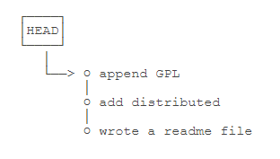
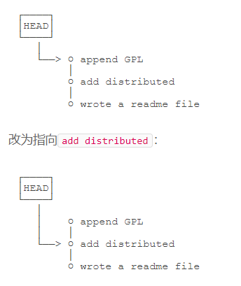
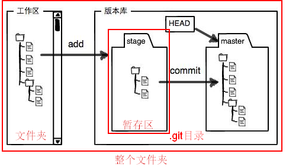

[TOC]


# 介绍

Git是目前世界上最先进的分布式版本控制系统


# 安装git

## windows安装git

从Git官网直接[下载安装程序](https://git-scm.com/downloads)

安装完成后，在开始菜单里找到“Git”->“Git Bash”，蹦出一个类似命令行窗口的东西，就说明Git安装成功！

安装完成后，还需要最后一步设置，在命令行输入：

```cmd
git config --global user.name "Your Name"
git config --global user.email "email@example.com"
```

## linux安装git

`sudo apt-get install git`

# 创建版本库

版本库又名仓库，英文名**repository**，你可以简单理解成一个目录，这个目录里面的所有文件都可以被Git管理起来，每个文件的修改、删除，Git都能跟踪，以便任何时刻都可以追踪历史，或者在将来某个时刻可以“还原”。

## 初始化目录使之称为可以管理的仓库

`git init`

> 初始化好git仓库之后,会在文件夹下多出一个`.git`的目录，这个目录是Git来跟踪管理版本库的，没事千万不要手动修改这个目录里面的文件，不然改乱了，就把Git仓库给破坏了。

## 把文件添加到版本库

- 将改动或者新增的文件**添加到仓库**

  > 添加单一文件
  >
  > `git add readme.md`
  >
  > 添加全部文件
  >
  > `git add .`

- 将文件**提交到仓库**

  `git commit -m 'init'`

  > `-m`后面输入的时本次提交的说明

# 版本管理

## 版本的概念

一次`git commit`提交就对应着一个版本

## 查看当前仓库的状态

`git status`

示例:

```cmd
$ git status
On branch master
Changes not staged for commit:
  (use "git add <file>..." to update what will be committed)
  (use "git checkout -- <file>..." to discard changes in working directory)

	modified:   readme.txt

no changes added to commit (use "git add" and/or "git commit -a")
```

## 查看文件的修改对比

`git diff readme.md`

示例:

```cmd
$ git diff readme.txt 
diff --git a/readme.txt b/readme.txt
index 46d49bf..9247db6 100644
--- a/readme.txt
+++ b/readme.txt
@@ -1,2 +1,2 @@
-Git is a version control system.
+Git is a distributed version control system.
 Git is free software.
```

## 查看git提交日志

`git log`

> 命令显示从最近到最远的提交日志，我们可以看到3次提交

示例:

```cmd
$ git log
commit 1094adb7b9b3807259d8cb349e7df1d4d6477073 (HEAD -> master)
Author: Michael Liao <askxuefeng@gmail.com>
Date:   Fri May 18 21:06:15 2018 +0800

    append GPL

commit e475afc93c209a690c39c13a46716e8fa000c366
Author: Michael Liao <askxuefeng@gmail.com>
Date:   Fri May 18 21:03:36 2018 +0800

    add distributed

commit eaadf4e385e865d25c48e7ca9c8395c3f7dfaef0
Author: Michael Liao <askxuefeng@gmail.com>
Date:   Fri May 18 20:59:18 2018 +0800

    wrote a readme file
```

---

提交日志的版本状态图




> 目前的版本指针指向的是最顶上的最新节点

## 版本回退

`git reset --hard HEAD^`

> 在Git中，用`HEAD`表示当前版本，上一个版本就是`HEAD^`，上上一个版本就是`HEAD^^`,往上100个版本就是`HEAD~100`

版本状态图



---

#### 如果回退版本后又想恢复回退之前的版本怎么办?

`git reflog`

> Git提供了一个命令`git reflog`用来记录你的每一次命令：

示例:

```cmd
$ git reflog
e475afc HEAD@{1}: reset: moving to HEAD^
1094adb (HEAD -> master) HEAD@{2}: commit: append GPL
e475afc HEAD@{3}: commit: add distributed
eaadf4e HEAD@{4}: commit (initial): wrote a readme file
```

可以通过`git reflog`命令获取到回退之前的版本的commit id(`1094adb`)

然后可以通过回退命令进行回退

`git reset --hard 1094adb`

## 工作区和暂存区

### 工作区（Working Directory）

就是电脑上能够看到的目录,比如`learngit`文件夹就是一个工作区：


### 版本库（Repository）-包含了暂存区

工作区有一个隐藏目录`.git`，这个不算工作区，而是Git的版本库。**版本库中包含着暂存区**

Git的版本库里存了很多东西，其中最重要的就是称为**stage（或者叫index）的暂存区**，还有Git为我们自动创建的第一个分支`master`，以及指向`master`的一个指针叫`HEAD`。



### git提交的具体细节

- 第一步: 添加文件 `git add`

  > 实际上就是**把文件修改添加到暂存区**

- 第二步:  提交更改 `git commit`

  > 实际上就是**把暂存区的所有内容提交到当前分支**

因为我们创建Git版本库时，Git自动为我们创建了唯一一个`master`分支，所以，现在，`git commit`就是往`master`分支上提交更改。

你可以简单理解为，需要提交的文件修改通通放到暂存区，然后，一次性提交暂存区的所有修改。

## 管理修改


# 问题

## 解决git提交代码需要重复输入账号和密码

git bash进入你的项目目录，输入：

`git config --global credential.helper store`

然后你会在你本地生成一个文本，上边记录你的账号和密码。

然后你使用上述的命令配置好之后，再操作一次`git pull`，然后它会提示你输入账号密码，这一次之后就不需要再次输入密码了。

