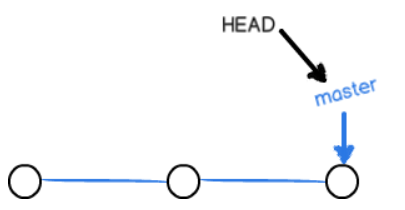

[TOC]


# 介绍

Git是目前世界上最先进的分布式版本控制系统


# 安装git

## windows安装git

从Git官网直接[下载安装程序](https://git-scm.com/downloads)

安装完成后，在开始菜单里找到“Git”->“Git Bash”，蹦出一个类似命令行窗口的东西，就说明Git安装成功！

安装完成后，还需要最后一步设置，在命令行输入：

```cmd
git config --global user.name "Your Name"
git config --global user.email "email@example.com"
```

## linux安装git

`sudo apt-get install git`

# 创建版本库

版本库又名仓库，英文名**repository**，你可以简单理解成一个目录，这个目录里面的所有文件都可以被Git管理起来，每个文件的修改、删除，Git都能跟踪，以便任何时刻都可以追踪历史，或者在将来某个时刻可以“还原”。

## 初始化目录使之称为可以管理的仓库

`git init`

> 初始化好git仓库之后,会在文件夹下多出一个`.git`的目录，这个目录是Git来跟踪管理版本库的，没事千万不要手动修改这个目录里面的文件，不然改乱了，就把Git仓库给破坏了。

## 把文件添加到版本库

- 将改动或者新增的文件**添加到仓库**

  > 添加单一文件
  >
  > `git add readme.md`
  >
  > 添加全部文件
  >
  > `git add .`

- 将文件**提交到仓库**

  `git commit -m 'init'`

  > `-m`后面输入的时本次提交的说明

# 版本管理

## 版本的概念

一次`git commit`提交就对应着一个版本

## 查看当前仓库的状态

`git status`

示例:

```cmd
$ git status
On branch master
Changes not staged for commit:
  (use "git add <file>..." to update what will be committed)
  (use "git checkout -- <file>..." to discard changes in working directory)

	modified:   readme.txt

no changes added to commit (use "git add" and/or "git commit -a")
```

## 查看文件的修改对比

`git diff readme.md`

示例:

```cmd
$ git diff readme.txt 
diff --git a/readme.txt b/readme.txt
index 46d49bf..9247db6 100644
--- a/readme.txt
+++ b/readme.txt
@@ -1,2 +1,2 @@
-Git is a version control system.
+Git is a distributed version control system.
 Git is free software.
```

## 查看git提交日志

`git log`

> 命令显示从最近到最远的提交日志，我们可以看到3次提交

示例:

```cmd
$ git log
commit 1094adb7b9b3807259d8cb349e7df1d4d6477073 (HEAD -> master)
Author: Michael Liao <askxuefeng@gmail.com>
Date:   Fri May 18 21:06:15 2018 +0800

    append GPL

commit e475afc93c209a690c39c13a46716e8fa000c366
Author: Michael Liao <askxuefeng@gmail.com>
Date:   Fri May 18 21:03:36 2018 +0800

    add distributed

commit eaadf4e385e865d25c48e7ca9c8395c3f7dfaef0
Author: Michael Liao <askxuefeng@gmail.com>
Date:   Fri May 18 20:59:18 2018 +0800

    wrote a readme file
```

---

提交日志的版本状态图


> 目前的版本指针指向的是最顶上的最新节点

## 版本回退

`git reset --hard HEAD^`

> 在Git中，用`HEAD`表示当前版本，上一个版本就是`HEAD^`，上上一个版本就是`HEAD^^`,往上100个版本就是`HEAD~100`

版本状态图


---

#### 如果回退版本后又想恢复回退之前的版本怎么办?

`git reflog`

> Git提供了一个命令`git reflog`用来记录你的每一次命令：

示例:

```cmd
$ git reflog
e475afc HEAD@{1}: reset: moving to HEAD^
1094adb (HEAD -> master) HEAD@{2}: commit: append GPL
e475afc HEAD@{3}: commit: add distributed
eaadf4e HEAD@{4}: commit (initial): wrote a readme file
```

可以通过`git reflog`命令获取到回退之前的版本的commit id(`1094adb`)

然后可以通过回退命令进行回退

`git reset --hard 1094adb`

## 工作区和暂存区(重要)

### 工作区（Working Directory）

就是电脑上能够看到的目录,比如`learngit`文件夹就是一个工作区：


### 版本库（Repository）-包含了暂存区

工作区有一个隐藏目录`.git`，这个不算工作区，而是Git的版本库。**版本库中包含着暂存区**

Git的版本库里存了很多东西，其中最重要的就是称为**stage（或者叫index）的暂存区**，还有Git为我们自动创建的第一个分支`master`，以及指向`master`的一个指针叫`HEAD`。


> 在`git add .`后,当前修改的文件都会加入到暂存区,在`git commit`后,会把暂存区添加当前分支(默认是master分支)的head节点

### git提交的具体细节

- 第一步: 添加文件 `git add`

  > 实际上就是**把文件修改添加到暂存区**

- 第二步:  提交更改 `git commit`

  > 实际上就是**把暂存区的所有内容提交到当前分支**

因为我们创建Git版本库时，Git自动为我们创建了唯一一个`master`分支，所以，现在，`git commit`就是往`master`分支上提交更改。

你可以简单理解为，需要提交的文件修改通通放到暂存区，然后，一次性提交暂存区的所有修改。

## 管理修改

给`git`设计的最优秀的就是其**跟踪并管理的是修改,而非文件**

> 如果没有将工作区的内容添加到暂存区,那么直接执行`git commit`之后,git只会将暂存区的内容提交到仓库(当前分支),而工作区的修改并不会提交,只有当执行`git add .`将工作区的修改提交到暂存区之后生效

## 撤销修改

`git checkout -- readme.md`

> `--`参数很重要,如果没有`--`参数,就会变成了'切换到另一个分支'的命令

执行命令后会有两种情况:

- readme.md自修改后还没有被放到暂存区

  > 那么,撤销修改就回到和版本库一模一样的状态

- readme.md已经添加到暂存区,但是又做了修改

  > 那么,撤销修改就回到添加到暂存区后的状态

## 删除文件

`git rm readme.md`

> `git rm`命令只能删除暂存区和当前分支中的文件,**还在工作区但是没有添加到暂存区的文件是不能够被删除的**
>
> 当要删除暂存区的文件时,需要加上参数`-f`,如`git rm -f readme.md`
>
> 使用`git rm`删除后的文件,会直接消失在工作区中

示例:

```cmd
$ git rm test.txt
rm 'test.txt'

$ git commit -m "remove test.txt"
[master d46f35e] remove test.txt
 1 file changed, 1 deletion(-)
 delete mode 100644 test.txt
```

现在，文件就从版本库中被删除了。

---

### 如果删错,怎么恢复

`git checkout -- readme.md`

> `git checkout`其实是用版本库里的版本替换工作区的版本，无论工作区是修改还是删除，都可以“一键还原”
>
> 注意：从来没有被添加到版本库就被删除的文件，是无法恢复的！


# 远程仓库

## 关联远程仓库

`git remote add origin git@github.com:michaelliao/learngit.git`

> 这样就直接让本地关联上了远程的仓库,但是本地的内容还没有同步到远程仓库,所以还需要将本地仓库推送到远程
>
> 使用以下命令进行提交即可
>
> `git push -u origin master`
>
> > 加上了`-u`参数,Git不但会把本地的`master`分支内容推送的远程新的`master`分支，还会把本地的`master`分支和远程的`master`分支关联起来，在以后的推送或者拉取时就可以简化命令。

## 拉取远程仓库

`git clone https://github.com/shiniaxiaomi/note.git`

> 直接从拉取远程仓库到本地,并直接做好关联,就可以直接使用了


# 分支管理

分支在实际中有什么用呢？假设你准备开发一个新功能，但是需要两周才能完成，第一周你写了50%的代码，如果立刻提交，由于代码还没写完，不完整的代码库会导致别人不能干活了。如果等代码全部写完再一次提交，又存在丢失每天进度的巨大风险。

现在有了分支，就不用怕了。你创建了一个属于你自己的分支，别人看不到，还继续在原来的分支上正常工作，而你在自己的分支上干活，想提交就提交，直到开发完毕后，再一次性合并到原来的分支上，这样，既安全，又不影响别人工作。

## 创建与合并分支

### 分支原理

每次提交,`git`都会把它们串成一条时间线,这条时间线就是一个分支

`HEAD`严格来说不是指向提交，而是指向`master`，`master`才是指向提交的，所以，`HEAD`指向的就是当前分支。如下图所示:



每次提交，`master`分支都会向前移动一步，这样，随着你不断提交，`master`分支的线也越来越长。


当我们创建新的分支，例如`dev`时，Git新建了一个指针叫`dev`，指向`master`相同的提交，再把`HEAD`指向`dev`，就表示当前分支在`dev`上：


所以,Git创建一个分支很快，因为除了增加一个`dev`指针，改改`HEAD`的指向，工作区的文件都没有任何变化！


从现在开始，对工作区的修改和提交就是针对`dev`分支了，比如新提交一次后，`dev`指针往前移动一步，而`master`指针不变：


假如我们在`dev`上的工作完成了，就可以把`dev`合并到`master`上。Git怎么合并呢？最简单的方法，就是直接把`master`指向`dev`的当前提交，就完成了合并：


合并完分支后，甚至可以删除`dev`分支。删除`dev`分支就是把`dev`指针给删掉，删掉后，我们就剩下了一条`master`分支：


### 代码实战

#### 创建并切换分支(dev)

`git checkout -b dev`

> `-b`参数表示创建并切换分支

#### 创建分支(dev)

`git branch dev`

#### 切换分支(dev)

`git checkout dev`

#### 查看分支(当前分支)

`git branch`

示例:

```cmd
$ git branch
* dev
  master
```

> `git branch`命令会列出所有分支，当前分支前面会标一个`*`号。

#### 合并分支

`git merge dev`

> `git merge`命令用于合并**指定分支**到**当前分支**,上述命令中`dev`属于指定分支,而当前分支为`master`

示例:

```cmd
$ git merge dev
Updating d46f35e..b17d20e
Fast-forward
 readme.txt | 1 +
 1 file changed, 1 insertion(+)
```


#### 删除分支

`git branch -d dev`

合并完成后，就可以放心地删除`dev`分支了：

```cmd
$ git branch -d dev
Deleted branch dev (was b17d20e).
```

删除后，查看`branch`，就只剩下`master`分支了：

```cmd
$ git branch
* master
```

### 命令小结

- 查看分支：`git branch`

- 创建分支：`git branch <name>`

- 切换分支：`git checkout <name>`

- 创建+切换分支：`git checkout -b <name>`

- 合并某分支到当前分支：`git merge <name>`
- 删除分支：`git branch -d <name>`

## 解决冲突

### 手动解决冲突

合并分支时产生冲突,需要手动解决

示例:

```cmd
$ git merge feature1
Auto-merging readme.txt
CONFLICT (content): Merge conflict in readme.txt
Automatic merge failed; fix conflicts and then commit the result.
```

> 当两个合并冲突时,git会默认的为我们进行`Auto-merging `自动合并,但是`Auto-merging`之后工作区的内容会被修改
>
> `Auto-merging`会将两个分支冲突的部分都保留,然后我们可以去自行的选择需要保留哪些内容(也可以全部都保留),这个过程被称为手动的解决冲突;
>
> **解决完冲突之后**,最新的内容是在工作区的,所以我们就需要**将修改冲突后的文件进行提交**


查看冲突的文件

```cmd
$ git status
On branch master
Your branch is ahead of 'origin/master' by 2 commits.
  (use "git push" to publish your local commits)

You have unmerged paths.
  (fix conflicts and run "git commit")
  (use "git merge --abort" to abort the merge)

Unmerged paths:
  (use "git add <file>..." to mark resolution)

	both modified:   readme.txt

no changes added to commit (use "git add" and/or "git commit -a")
```

> `both modified:   readme.txt`
>
> 两个分支上都对readme.md做了修改,所以我们需要对冲突进行解决


直接查看有冲突的readme.md文件

```cmd
Git is a distributed version control system.
Git is free software distributed under the GPL.
Git has a mutable index called stage.
Git tracks changes of files.
<<<<<<< HEAD
Creating a new branch is quick & simple.
=======
Creating a new branch is quick AND simple.
>>>>>>> feature1
```

> Git用`<<<<<<<`，`=======`，`>>>>>>>`标记出不同分支的内容


我们将冲突的内容修改为如下后保存：

```cmd
Creating a new branch is quick and simple.
```

**再提交：**

```cmd
$ git add readme.txt 
$ git commit -m "conflict fixed"
[master cf810e4] conflict fixed
```

现在，`master`分支和`feature1`分支变成了下图所示：


### 查看分支合并情况

`git log --graph --pretty=oneline --abbrev-commit `

示例:

```cmd
$ git log --graph --pretty=oneline --abbrev-commit
*   cf810e4 (HEAD -> master) conflict fixed
|\  
| * 14096d0 (feature1) AND simple
* | 5dc6824 & simple
|/  
* b17d20e branch test
* d46f35e (origin/master) remove test.txt
* b84166e add test.txt
* 519219b git tracks changes
* e43a48b understand how stage works
* 1094adb append GPL
* e475afc add distributed
* eaadf4e wrote a readme file
```


最后，删除`feature1`分支：

```cmd
$ git branch -d feature1
Deleted branch feature1 (was 14096d0).
```


### 小结

**当Git无法自动合并分支时，就必须首先解决冲突。解决冲突后，再提交，合并完成。**

解决冲突就是把Git合并失败的文件手动编辑为我们希望的内容，再提交。

用`git log --graph`命令可以看到分支合并图。

## 分支管理策略


# 问题

## 解决需要重复输入账号和密码

git bash进入你的项目目录，输入：

`git config --global credential.helper store`

然后你会在你本地生成一个文本，上边记录你的账号和密码。

然后你使用上述的命令配置好之后，再操作一次`git pull`，然后它会提示你输入账号密码，这一次之后就不需要再次输入密码了。

## git bash 不能显示中文

`git config --global core.quotepath false`


# 参考文档

[廖雪峰的git教程](https://www.liaoxuefeng.com/wiki/896043488029600)