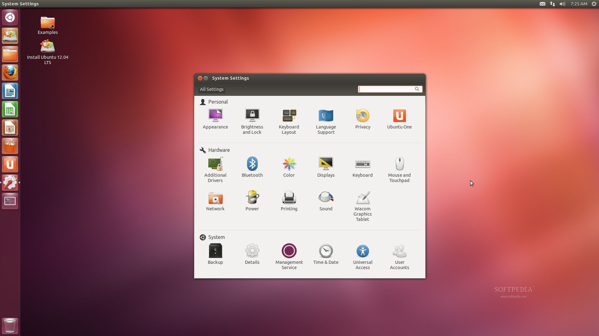
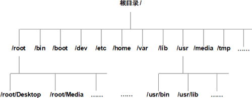
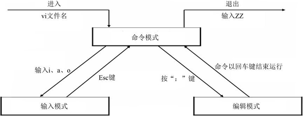

[TOC]

# linux简介

## 操作系统是什么

**操作系统（Operating System，OS）**是软件的一部分，它是硬件基础上的第一层软件，是硬件和其它软件沟通的桥梁（或者说接口、中间人、中介等）。

操作系统会控制其他程序运行，管理系统资源，提供最基本的计算功能，如管理及配置内存、决定系统资源供需的优先次序等，同时还提供一些基本的服务程序，例如：文件系统,设备驱动程序,用户接口,系统服务程序

> - 文件系统: 提供计算机存储信息的结构，信息存储在文件中，文件主要存储在计算机的内部硬盘里，在目录的分层结构中组织文件。文件系统为操作系统提供了组织管理数据的方式。
> - 设备驱动程序: 提供连接计算机的每个硬件设备的接口，设备驱动器使程序能够写入设备，而不需要了解执行每个硬件的细节。简单来说，就是让你能吃到鸡蛋，但不用养一只鸡。
> - 用户接口: 操作系统需要为用户提供一种运行程序和访问文件系统的方法。如常用的 Windows 图形界面，可以理解为一种用户与操作系统交互的方式；智能手机的 Android 或 iOS 系统，也是一种操作系统的交互方式。
> - 系统服务程序: 当计算机启动时，会自启动许多系统服务程序，执行安装文件系统、启动网络服务、运行预定任务等操作。

打个比方，操作系统就好像是一个政府，其它软件都会被它管控；操作系统在给其他软件提供各种便利的同时，还会约束其他软件不能为所欲为(不能操控硬件,软件只能通过操作系统来操作硬件)。


目前流行的服务器和 PC 端操作系统有 Linux、Windows、UNIX 等，手机操作系统有 Android、iOS、Windows Phone（简称 WP），嵌入式操作系统有 Windows CE、PalmOS、eCos、uClinux 等。


## Linux和UNIX的关系及区别

UNIX 诞生于 20 世纪 60 年代末，Windows 诞生于 20 世纪 80 年代中期，Linux 诞生于 20 世纪 90 年代初，可以说 UNIX 是操作系统中的"老大哥"，后来的 Windows 和 Linux 都参考了 UNIX。现代的 Windows 系统已经朝着“图形界面”的方向发展了，和 UNIX 系统有了巨大的差异，从表面上甚至看不出两者的关联。

### UNIX的坎坷历史

---

UNIX 操作系统由肯•汤普森（Ken Thompson）和丹尼斯•里奇（Dennis Ritchie）发明。它的部分技术来源可追溯到从 1965 年开始的 Multics 工程计划，该计划由贝尔实验室、美国麻省理工学院和通用电气公司联合发起，目标是开发一种交互式的、具有多道程序处理能力的分时操作系统，以取代当时广泛使用的批处理操作系统。

> 说明：分时操作系统使一台计算机可以同时为多个用户服务，连接计算机的终端用户交互式发出命令，操作系统采用时间片轮转的方式处理用户的服务请求并在终端上显示结果（操作系统将CPU的时间划分成若干个片段，称为时间片）。操作系统以时间片为单位，轮流为每个终端用户服务，每次服务一个时间片。

可惜，由于 Multics 工程计划所追求的目标太庞大、太复杂，以至于它的开发人员都不知道要做成什么样子，最终以失败收场。

以肯•汤普森为首的贝尔实验室研究人员吸取了 Multics 工程计划失败的经验教训，**于 1969 年实现了一种分时操作系统的雏形，1970 年该系统正式取名为 UNIX。**  Multi 是大的意思，大而且繁；而 Uni 是小的意思，小而且巧。这是 UNIX 开发者的设计初衷，这个理念一直影响至今。

有意思的是，肯•汤普森当年开发 UNIX 的初衷是运行他编写的一款计算机游戏 Space Travel，他先后在多个系统上试验，但运行效果不甚理想，于是决定自己开发操作系统，就这样，UNIX 诞生了。

自 1970 年后，UNIX 系统在贝尔实验室内部的程序员之间逐渐流行起来。1971-1972 年，肯•汤普森的同事丹尼斯•里奇发明了传说中的C语言，这是一种适合编写系统软件的高级语言，它的诞生是 UNIX 系统发展过程中的一个重要里程碑，它宣告了在操作系统的开发中，汇编语言不再是主宰。

到了 1973 年，UNIX 系统的绝大部分源代码都用C语言进行了重写，这为提高 UNIX 系统的可移植性打下了基础（之前操作系统多采用汇编语言，对硬件依赖性强），也为提高系统软件的开发效率创造了条件。可以说，UNIX 系统与C语言是一对孪生兄弟，具有密不可分的关系。

20 世纪 70 年代初，计算机界还有一项伟大的发明——TCP/IP 协议，这是当年美国国防部接手 ARPAnet 后所开发的网络协议。美国国防部把 TCP/IP 协议与 UNIX 系统、C语言捆绑在一起，由 AT&T 发行给美国各个大学非商业的许可证，这为 UNIX 系统、C语言、TCP/IP 协议的发展拉开了序幕，它们分别在操作系统、编程语言、网络协议这三个领域影响至今。肯•汤普森和丹尼斯•里奇因在计算机领域做出的杰出贡献，于 1983 年获得了计算机科学的最高奖——图灵奖。

随后出现了各种版本的 UNIX 系统，目前常见的有 Sun Solaris、FreeBSD、IBM AIX、HP-UX 等。苹果公司的 OS  X 就是基于 FreeBSD 的操作系统。

### Linux 的那些往事

---

Linux 内核最初是由李纳斯•托瓦兹（Linus Torvalds）在赫尔辛基大学读书时出于个人爱好而编写的，当时他觉得教学用的迷你版 UNIX 操作系统 Minix 太难用了，于是决定自己开发一个操作系统。第 1 版本于 1991 年 9 月发布，当时仅有 10 000 行代码。

李纳斯•托瓦兹没有保留 Linux 源代码的版权，公开了代码，并邀请他人一起完善 Linux。与 Windows 及其他有专利权的操作系统不同，Linux 开放源代码，任何人都可以免费使用它。

据估计，现在只有 2% 的 Linux 核心代码是由李纳斯•托瓦兹自己编写的，虽然他仍然拥有 Linux 内核（操作系统的核心部分），并且保留了选择新代码和需要合并的新方法的最终裁定权。现在大家所使用的 Linux，我更倾向于说是由李纳斯•托瓦兹和后来陆续加入的众多 Linux 好者共同开发完成的。

李纳斯•托瓦兹无疑是这个世界上最伟大的程序员之一，何况，他还搞出了全世界最大的程序员交友社区 [GitHub](https://github.com/) (开源代码库及版本控制系统）。

### UNIX与Linux的关系

---

二者的关系，不是大哥和小弟，"**UNIX 是 Linux 的父亲**"这个说法更怡当。

**二者的区别**

- UNIX
  - UNIX 系统大多是与硬件配套的，也就是说，大多数 UNIX 系统如 AIX、HP-UX 等是无法安装在 x86 服务器和个人计算机上的，而 Linux 则可以运行在多种硬件平台上；
  - UNIX 是商业软件，而 Linux 是开源软件，是免费、公开源代码的。
- Liunx
  - 它属于开源软件，用户不用支付可费用就可以获得它和它的源代码，并且可以根据自己的需要对它进行必要的修改，无偿使用，无约束地继续传播；
  - 它具有 UNIX 的全部功能，任何使用 UNIX 操作系统或想要学习 UNIX 操作系统的人都可以从 Linux 中获益。

**总结关系和区别**

Linux 是一个类似 Unix 的操作系统，Unix 要早于 Linux，Linux 的初衷就是要替代 UNIX，并在功能和用户体验上进行优化，所以 Linux 模仿了 UNIX（但并没有抄袭 UNIX 的源码），使得 Linux 在外观和交互上与 UNIX 非常类似。

### UNIX/Linux系统结构

---

UNIX/Linux 系统可以粗糙地抽象为 3 个层次

如图所示。底层是 UNIX/Linux 操作系统，即系统内核（Kernel）；中间层是 Shell 层，即命令解释层；高层则是应用层。


**内核层**

内核层是 UNIX/Linux 系统的核心和基础，`它直接附着在硬件平台之上，控制和管理系统内各种资源`（硬件资源和软件资源），有效地组织进程的运行，从而扩展硬件的功能，提高资源的利用效率，为用户提供方便、高效、安全、可靠的应用环境。

**shell层**

Shell 层是与用户直接交互的界面。用户可以在提示符下输入命令行，由 Shell 解释执行并输出相应结果或者有关信息，所以我们也把 Shell 称作，利用系统提供的丰富命令可以快捷而简便地完成许多工作。

**应用层**

应用层提供基于 X Window 协议的图形环境。X Window 协议定义了一个系统所必须具备的功能（就如同 TCP/IP 是一个协议，定义软件所应具备的功能），可让系统能满足此协议及符合 X 协会其他的规范，便可称为 X Window。

> X Window 与微软的 Windows 图形环境有很大的区别：
>
> - UNIX/Linux 系统与 X Window 没有必然捆绑的关系，也就是说，UNIX/Linux 可以安装 X Window，也可以不安装；而微软的 Windows 图形环境与内核捆绑密切。
>
> - UNIX/Linux 系统不依赖图形环境，依然可以通过命令行完成 100% 的功能，而且因为不使用图形环境还会节省大量的系统资源。

### Linux的优点

---

**大量的可用软件及免费软件**

Linux 系统上有着大量的可用软件，且绝大多数是免费的，比如声名赫赫的 Apache、Samba、PHP、MySQL 等，构建成本低廉，是 Linux 被众多企业青睐的原因之一。当然，这和 Linux 出色的性能是分不开的，否则，节约成本就没有任何意义。

**良好的可移植性及灵活性**

Linux 系统有良好的可移植性，它几乎支持所有的 CPU 平台，这使得它便于裁剪和定制。我们可以把 Linux 放在 U 盘、光盘等存储介质中，也可以在嵌入式领域广泛应用。

**优良的稳定性和安全性**

Linux 开放源代码，将所有代码放在网上，全世界的程序员都看得到，有什么缺陷和漏洞，很快就会被发现，从而成就了它的稳定性和安全注。

**支持几乎所有的网络协议及开发语言**

UNIX 系统是与 C 语言、TCP/IP 协议一同发展起来的，而 Linux 是 UNIX 的一种

## linux发行版

新手往往会被 Linux 众多的发行版本搞得一头雾水，我们首先来解释一下这个问题。

从技术上来说，李纳斯•托瓦兹开发的 Linux 只是一个内核`(即Linux只有一个内核)。内核指的是一个提供设备驱动、文件系统、进程管理、网络通信等功能的系统软件，内核并不是一套完整的操作系统，它只是操作系统的核心。`一些组织或厂商将 Linux 内核与各种软件和文档包装起来，并提供系统安装界面和系统配置、设定与管理工具，就构成了 Linux 的发行版本。

在 Linux 内核的发展过程中，各种 Linux 发行版本起了巨大的作用，正是它们推动了 Linux 的应用，从而让更多的人开始关注 Linux。因此，把 Red Hat、Ubuntu、SUSE 等直接说成 Linux 其实是不确切的，它们是 Linux 的发行版本，更确切地说，应该叫作“以Linux为核心的操作系统软件包”。

`Linux 的各个发行版本使用的是同一个 Linux 内核`，因此在内核层不存在什么兼容性问题，每个版本有不一样的感觉，只是在发行版本的最外层（由发行商整合开发的应用）才有所体现。

Linux 的发行版本可以大体分为两类：

- 商业公司维护的发行版本，以著名的 Red Hat 为代表；
- 社区组织维护的发行版本，以 Debian 为代表。

### 常用的liunx发行版本

---

**Red Hat Linux**

Red Hat（红帽公司）创建于 1993 年，是目前世界上资深的 Linux 厂商，也是最获认可的 Linux 品牌。

Red Hat 公司的产品主要包括 RHEL（Red Hat Enterprise Linux，收费版本）和 `CentOS`（RHEL 的社区克隆版本，免费版本）、Fedora Core（由 Red Hat 桌面版发展而来，免费版本）。

Red Hat 是在我国国内使用人群最多的 Linux 版本，资料丰富，如果你有什么不明白的地方，则容易找到人来请教，而且大多数 Linux 教程是以 Red Hat 为例来讲解的（包括本教程）。

**Ubuntu Linux**

Ubuntu 基于知名的 Debian Linux 发展而来，界面友好，容易上手，对硬件的支持非常全面，是目前最适合做桌面系统的 Linux 发行版本，而且 Ubuntu 的所有发行版本都免费提供。

Ubuntu 的创始人 Mark Shuttleworth 是非常具有传奇色彩的人物。他在大学毕业后创建了一家安全咨询公司，1999 年以 5.75 亿美元被收购，由此一跃成为南非最年轻有为的本土富翁。作为一名狂热的天文爱好者，Mark Shuttleworth 于 2002 年自费乘坐俄罗斯联盟号飞船，在国际空间站中度过了 8 天的时光。之后，Mark Shuttleworth 创立了 Ubuntu 社区，2005 年 7 月 1 日建立了 Ubuntu 基金会，并为该基金会投资 1000 万美元。他说，太空的所见正是他创立 Ubuntu 的精神之所在。如今，他最热衷的事情就是到处为自由开源的 Ubuntu 进行宣传演讲。

**SuSE Linux**

  SuSE Linux 以 Slackware Linux 为基础，原来是德国的 SuSE Linux AG 公司发布的 Linux 版本，1994 年发行了第一版，早期只有商业版本，2004 年被 Novell 公司收购后，成立了 OpenSUSE 社区，推出了自己的社区版本 OpenSUSE。

SuSE Linux 在欧洲较为流行，在我国国内也有较多应用。值得一提的是，它吸取了 Red Hat Linux 的很多特质。

SuSE Linux 可以非常方便地实现与 Windows 的交互，硬件检测非常优秀，拥有界面友好的安装过程、图形管理工具，对于终端用户和管理员来说使用非常方便。  

**Gentoo Linux**

Gentoo 最初由 Daniel Robbins（FreeBSD 的开发者之一）创建，首个稳定版本发布于 2002 年。Gentoo 是所有 Linux 发行版本里安装最复杂的，到目前为止仍采用源码包编译安装操作系统。
不过，它是安装完成后最便于管理的版本，也是在相同硬件环境下运行最快的版本。自从 Gentoo 1.0 面世后，它就像一场风暴，给 Linux 世界带来了巨大的惊喜，同时也吸引了大量的用户和开发者投入 Gentoo Linux 的怀抱。
有人这样评价 Gentoo：快速、设计干净而有弹性，它的出名是因为其高度的自定制性（基于源代码的发行版）。尽管安装时可以选择预先编译好的软件包，但是大部分使用 Gentoo 的用户都选择自己手动编译。这也是为什么 Gentoo 适合比较有 Linux 使用经验的老手使用。

> 要注意的是，由于编译软件需要消耗大量的时间，所以，如果你所有的软件都由自己编译，并安装 KDE 桌面系统等比较大的软件包，则可能需要花费很长时间。

**其他 Linux 发行版**

| 版本名称     | 网 址                                        | 特 点                                                        | 软件包管理器                |
| ------------ | -------------------------------------------- | ------------------------------------------------------------ | --------------------------- |
| Debian Linux | [www.debian.org](http://www.debian.org/)     | 开放的开发模式，且易于进行软件包升级                         | apt                         |
| Fedora Core  | [www.redhat.com](http://www.redhat.com/)     | 拥有数量庞人的用户，优秀的社区技术支持. 并且有许多创新       | up2date（rpm），yum （rpm） |
| Mandriva     | [www.mandriva.com](http://www.mandriva.com/) | 操作界面友好，使用图形配置工具，有庞大的社区进行技术支持，支持 NTFS 分区的大小变更 | rpm                         |
| KNOPPIX      | [www.knoppix.com](http://www.knoppix.com/)   | 可以直接在 CD 上运行，具有优秀的硬件检测和适配能力，可作为系统的急救盘使用 | apt                         |

### linux发行版本的选择

---

1. 如果你需要的是一个服务器系统，而且已经厌烦了各种 Linux 的配置，只是想要一个比较稳定的服务器系统，那么建议你选择 CentOS 或 RHEL。
2. 如果你只是需要一个桌面系统，而且既不想使用盗版，又不想花大价钱购买商业软件，不想自己定制，也不想在系统上浪费太多时间，则可以选择 Ubuntu。
3. 如果你想深入摸索一下 Linux 各个方面的知识，而且还想非常灵活地定制自己的 Linux 系统，那就选择 Gentoo 吧，尽情享受 Gentoo 带来的自由快感。
4. 如果你对系统稳定性要求很高，则可以考虑 FreeBSD。
5. 如果你需要使用数据库高级服务和电子邮件网络应用，则可以选择 SuSE。

> 其实 Linux 的发行版本众多，但是系统的核心——内核却系出同门，所以只要学会使用其中一种，即可触类旁通。

### 开源软件

---

Linux 是一款开源软件，我们可以随意浏览和修改它的源代码，学习 Linux，不得不谈到开源精神。Linux 本身就是开源精神的受益者，它几乎是全球最大的开源软件。

> 简单来说，开源软件就是把软件程序与源代码文件一起打包提供给用户，用户既可以不受限制地使用该软件的全部功能，也可以根据自己的需求修改源代码，甚至编制成衍生产品再次发布出去。

用户具有使用自由、修改自由、重新发布自由和创建衍生品自由，这正好符合了黑客和极客对自由的追求，因此开源软件在国内外都有着很高的人气，大家聚集在开源社区，共同推动开源软件的进步。

**开源软件的优点**

| 优点   | 说明                                                         |
| ------ | ------------------------------------------------------------ |
| 低风险 | 使用闭源软件无疑是把命运交给他人，一旦封闭的源代码没有人来维护，你将进退维谷；而且相较于商业软件公司，开源社区很少存在倒闭的问题。 |
| 高品质 | 相较于闭源软件产品，开源项目通常是由开源社区来研发及维护的，参与编写、维护、测试的用户量众多，一般的 bug 还没有等爆发就已经被修补。 |
| 低成本 | 开源工作者都是在幕后默默且无偿地付出劳动成果，为美好的世界贡献一份力量，因此使用开源社区推动的软件项目可以节省大量的人力、物力和财力。 |
| 更透明 | 没有哪个笨蛋会把木马、后门等放到开放的源代码中，这样无疑是把自己的罪行暴露在阳光之下。 |

## linux桌面环境

### KDE 桌面系统

---

KDE 是基于大名鼎鼎的 Qt 的，最初于 1996 年作为开源项目公布，并在 1998 年发布了第一个版本，现在 KDE 几乎是排名第一的桌面环境了。

许多流行的 Linux 发行版都提供了 KDE 桌面环境，比如 Ubuntu、Linux Mint、OpenSUSE、Fedora、Kubuntu、PC Linux OS 等。

KDE 和 Windows 比较类似，各位初学者相信都是 Windows 的用户，所以切换到 KDE 也不会有太大的障碍。

KDE 允许你把应用程序图标和文件图标放置在桌面的特定位置上。单击应用程序图标，Linux 系统就会运行该应用程序。单击文件图标，KDE 桌面就会确定使用哪种应用程序来处理该文件。


对 KDE 优缺点的总结：

- 优点：KDE 几乎是最先进最强大的桌面环境，它外观优美、高度可定制、兼容比较旧的硬件设备
- 缺点：Kmail 等一些组件的配置对新手来说过于复杂。

### GNOME 桌面环境

---

GNOME 于 1999 年首次发布，现已成为许多Linux发行版默认的桌面环境（不过用得最多的是 Red Hat Linux）。

GNOME 的特点是简洁、运行速度快，但是没有太多的定制选项，用户需要安装第三方工具来实现。

GNOME 甚至不包括一些简单的调整选项，比如更改主题、更改字体等，就这两种基本的调整而言，用户都需要安装第三方工具。所以，GONME 适合那些不需要高度定制界面的用户。

GNOME 被用作 Fedora 中的默认桌面环境，提供在几款流行的 Linux 发行版中，比如 Ubuntu、Debian、OpenSUSE 等。


对 GNOME 优缺点的总结：

- 优点：简单易用，可通过插件来扩展功能。
- 缺点：对插件的管理能力比较差，也缺少其它桌面环境拥有的许多功能。

### Unity

---

Unity 是由 Ubuntu 的母公司 Canonical 开发的一款外壳。之所以说它是外壳，是因为 Unity 运行在 GNOME 桌面环境之上，使用了所有 GNOME 的核心应用程序。

2010 年，Unity 第一个版本发布，此后经过数次改进，如今和其它的桌面环境一样，也可以安装到其它的 Linux 发行版上了。

Unity 很简单、运行速度快，但 Unity 在系统设置下却没有定制桌面的太多选项，要想安装主题或者定制另外不同的选项，比如系统菜单是否应该总是可见，或者“从启动器图标一次点击最小化”，用户需要安装第三方工具。



对 Unity 优缺点的总结：

- 优点：界面简洁直观，可以通过第三方工具来深度定制，而且使用了平视显示器（HUD）等新技术。
- 缺点：默认的定制功能比较差劲，通知机制一般。

### 查看桌面环境

---

我们可以通过环境变量 DESKTOP_SESSION 来查看当前 Linux 发行版使用了哪种桌面环境

例如：

```cmd
[c.biancheng.net]$ echo $DESKTOP_SESSION
gnome-classic
```

# liunx安装

**使用VMware虚拟机安装linux**

**选好镜像,一路next**

**在配置网络的时候,选择NAT模式**

> VMware 提供的网络连接有 5 种，分别是"桥接模式"、"NAT 模式"、"仅主机模式"、"自定义"和"LAN 区段"：
>
> - 桥接模式：相当于虚拟机的网卡和宿主机的物理网卡均连接到虚拟机软件所提供的 VMnet0 虚拟交换机上，因此虚拟机和宿主机是平等的，相当于一个网络中的两台计算机。这种设置既可以保证虚拟机和宿主机通信，也可以和局域网内的其他主机通信，还可以连接 Internet，是限制最少的连接方式，推荐新手使用。
> - NAT 模式：相当于虚拟机的网卡和宿主机的虚拟网卡 VMnet8 连接到虚拟机软件所提供的 VMnet8 虚拟交换机上，因此本机是通过 VMnet8 虚拟网卡通信的。在这种网络结构中，VMware 为虚拟机提供了一个虚拟的 NAT 服务器和一个虚拟的 DHCP 服务器，虚拟机利用这两个服务器可以连接到 Intemet。所以，在正常情况下，虚拟机系统只要设定自动获取 IP 地址，就能既和宿主机通信，又能连接到 Internet了。但是这种设置不能连接局域网内的其他主机。
> - 仅主机模式：宿主机和虚拟机通信使用的是 VMware 的虚拟网卡 VMnet1，但是这种连接没有 NAT 服务器为虚拟机提供路由功能，所以仅主机网络只能连接宿主机，不能连接局域网，也不能连接 Internet 网络。
> - 自定义网络：可以手工选择使用哪块虚拟机网卡。如果选择 Vmnet1，就相当于桥接网络；如果选择 VMnet8，就相当于 NAT 网络。
> - LAN 区段：这是新版 VMware 新增的功能，类似于交换机中的 VLAN（虚拟局域网），可以在多台虚拟机中划分不同的虚拟网络。

其中常用设置有以下 2 种：

1. 需要宿主机的 Windows 和虚拟机的 Linux 能够进行网络连接，使用"桥接模式"（桥接时，Linux 也可以访问互联网，只是虚拟机需要配置和宿主机 Windows 同样的联网环境）；
2. 需要宿主机的 Windows 和虚拟机的 Linux 能够进行网络连接，同时虚拟机的 Linux 可以通过宿主机的 Windows 连入互联网，使用"NAT模式"。

# linux的远程管理协议

提到远程管理，通常指的是远程管理服务器，而非个人计算机。个人计算机可以随时拿来用，服务器通常放置在机房中，用户无法直接接触到服务器硬件，只能采用远程管理的方式。

远程管理，实际上就是计算机（服务器）之间通过网络进行数据传输（信息交换）的过程，与浏览器需要 HTTP 协议（超文本传输协议）浏览网页一样，远程管理同样需要远程管理协议的支持。  

目前，常用的远程管理协议有以下 4 种：

- **RDP协议**（remote desktop protocol）

  远程桌面协议，大部分 Windows 系统都默认支持此协议，Windows 系统中的远程桌面管理就基于该协议。
- **RFB协议**（Remote FrameBuffer）

  图形化远程管理协议，VNC 远程管理工具就基于此协议。
- **Telnet**

  命令行界面远程管理协议，几乎所有的操作系统都默认支持此协议。此协议的特点是，在进行数据传送时使用明文传输的方式，也就是不对数据进行加密。
- **SSH协议**（Secure [Shell](http://c.biancheng.net/shell/)）

  命令行界面远程管理协议，几乎所有操作系统都默认支持此协议。和 Telnet 不同，该协议在数据传输时会对数据进行加密并压缩，因此使用此协议传输数据既安全速度又快。

**linux的协议选择**

介于安全性和稳定性的考虑，大部分的服务器都舍弃图形管理界面而选择命令行界面，因此远程管理 Linux 服务器常使用基于 SSH 协议的命令行管理方式。

目前，基于 SSH 协议常用的远程管理工具有 PuTTY、SecureCRT、WinSCP 、x

shell等，这些管理工具的具体使用下节给大家详细介绍。  

# linux文件和目录管理

## linux文件目录结构



为了方便管理和维护，Linux 系统采用了文件系统层次标准，也称为 FHS 标准，它规定了根目录下各个目录应该存在哪些类型的文件（或子目录），比如说，在 /bin 和 /sbin 目录中存放的应该是可执行文件，有关各个目录存放文件的类型

> FHS（Filesystem Hierarchy Standard），文件系统层次化标准，该标准规定了 Linux 系统中所有一级目录以及部分二级目录（/usr 和 /var）的用途。发布此标准的主要目的就是为了让用户清楚地了解每个目录应该存放什么类型的文件。

## 根目录(/)

FHS 认为，Linux 系统的根目录（/）最为重要（没有之一），其原因有以下 2 点：

1. 所有目录都是由根目录衍生出来的；
2. 根目录与系统的开机、修复、还原密切相关；

因此，根目录必须包含开机软件、核心文件、开机所需程序、函数库、修复系统程序等文件，如下所示。

### Linux一级目录及其作用

---

| 一级目录  | 功能（作用）                                                 |
| --------- | ------------------------------------------------------------ |
| `/bin/`   | `存放系统命令`，普通用户和 root 都可以执行。放在 /bin 下的命令在单用户模式下也可以执行 |
| `/boot/`  | `系统启动目录`，保存与系统启动相关的文件，如内核文件和启动引导程序（grub）文件等 |
| `/dev/`   | `设备文件保存位置`                                           |
| `/etc/`   | `配置文件保存位置`。系统内所有采用默认安装方式（rpm 安装）的服务配置文件全部保存在此目录中，如用户信息、服务的启动脚本、常用服务的配置文件等 |
| `/home/`  | `普通用户的主目录`（也称为家目录）。在创建用户时，每个用户要有一个默认登录和保存自己数据的位置，就是用户的主目录，所有普通用户的主目录是在 /home/ 下建立一个和用户名相同的目录。如用户 liming 的主目录就是 /home/liming |
| `/lib/`   | `系统调用的函数库保存位置`                                   |
| `/media/` | `挂载目录`。系统建议用来挂载媒体设备，如软盘和光盘           |
| `/mnt/`   | `挂载目录`。早期 Linux 中只有这一个挂载目录，并没有细分。系统建议这个目录用来挂载额外的设备，如 U 盘、移动硬盘和其他操作系统的分区 |
| `/misc/`  | `挂载目录`。系统建议用来挂载 NFS 服务的共享目录。虽然系统准备了三个默认挂载目录 /media/、/mnt/、/misc/，但是到底在哪个目录中挂载什么设备可以由管理员自己决定。例如，笔者在接触 Linux 的时候，默认挂载目录只有 /mnt/，所以养成了在 /mnt/ 下建立不同目录挂载不同设备的习惯，如 /mnt/cdrom/ 挂载光盘、/mnt/usb/ 挂载 U 盘，都是可以的 |
| `/opt/`   | `第三方安装的软件保存位置`。这个目录是放置和安装其他软件的位置，手工安装的源码包软件都可以安装到这个目录中。不过笔者还是习惯把软件放到 /usr/local/ 目录中，也就是说，/usr/local/ 目录也可以用来安装软件 |
| `/root/`  | `root 的主目录`。普通用户主目录在 /home/ 下，root 主目录直接在“/”下 |
| `/sbin/`  | `保存与系统环境设置相关的命令`，只有 root 可以使用这些命令进行系统环境设置，但也有些命令可以允许普通用户查看 |
| `/srv/`   | `服务数据目录`。一些系统服务启动之后，可以在这个目录中保存所需要的数据 |
| `/tmp/`   | `临时目录`。系统存放临时文件的目录，在该目录下，所有用户都可以访问和写入。建议此目录中不能保存重要数据，最好每次开机都把该目录清空 |


FHS 针对根目录中包含的子目录仅限于表 1，但除此之外，Linux 系统根目录下通常还包含表 2 中的几个一级目录。

| 一级目录       | 功能（作用）                                                 |
| -------------- | ------------------------------------------------------------ |
| `/lost+found/` | `当系统意外崩溃或意外关机时，产生的一些文件碎片会存放在这里`。在系统启动的过程中，fsck 工具会检查这里，并修复已经损坏的文件系统。这个目录只在每个分区中出现，例如，/lost+found 就是根分区的备份恢复目录，/boot/lost+found 就是 /boot 分区的备份恢复目录 |
| `/proc/`       | `虚拟文件系统`。该目录中的数据并不保存在硬盘上，而是保存到内存中。主要保存系统的内核、进程、外部设备状态和网络状态等。如 /proc/cpuinfo 是保存 CPU 信息的，/proc/devices 是保存设备驱动的列表的，/proc/filesystems 是保存文件系统列表的，/proc/net 是保存网络协议信息的...... |
| `/sys/`        | `虚拟文件系统`。和 /proc/ 目录相似，该目录中的数据都保存在内存中，主要保存与内核相关的信息 |

### /usr目录

---

usr（注意不是 user），全称为 Unix Software Resource，此目录用于存储系统软件资源。FHS 建议所有开发者，应把软件产品的数据合理的放置在 /usr 目录下的各子目录中，而不是为他们的产品创建单独的目录。

`Linux 系统中，所有系统默认的软件都存储在 /usr 目录下`，/usr 目录类似 Windows 系统中 C:\Windows\ + C:\Program files\ 两个目录的综合体。

**/usr 子目录及其功能**

| 子目录         | 功能（作用）                                                 |
| -------------- | ------------------------------------------------------------ |
| `/usr/bin/`    | `存放系统命令，普通用户和超级用户都可以执行`。这些命令和系统启动无关，在单用户模式下不能执行 |
| `/usr/sbin/`   | `存放根文件系统不必要的系统管理命令`，如多数服务程序，只有 root 可以使用。 |
| `/usr/lib/`    | `应用程序调用的函数库保存位置`                               |
| `/usr/XllR6/`  | 图形界面系统保存位置                                         |
| `/usr/local/`  | `手工安装的软件保存位置`。我们一般建议源码包软件安装在这个位置 |
| `/usr/share/`  | `应用程序的资源文件保存位置`，如帮助文档、说明文档和字体目录 |
| `/usr/src/`    | `源码包保存位置`。我们手工下载的源码包和内核源码包都可以保存到这里。不过笔者更习惯把手工下载的源码包保存到 /usr/local/src/ 目录中，把内核源码保存到 /usr/src/linux/ 目录中 |
| `/usr/include` | C/C++ 等编程语言头文件的放置目录                             |

**/var 目录**

/var 目录用于存储动态数据，例如缓存、日志文件、软件运行过程中产生的文件等。

| /var子目录          | 功能（作用）                                                 |
| ------------------- | ------------------------------------------------------------ |
| `/var/lib/`         | `程序运行中需要调用或改变的数据保存位置`。如 MySQL 的数据库保存在 /var/lib/mysql/ 目录中 |
| `/var/log/`         | `登陆文件放置的目录`，其中所包含比较重要的文件如 /var/log/messages, /var/log/wtmp 等。 |
| `/var/run/`         | 一些服务和程序运行后，它们的 `PID（进程 ID）保存位置`        |
| `/var/spool/`       | `里面主要都是一些临时存放`，随时会被用户所调用的数据，例如 /var/spool/mail/ 存放新收到的邮件，/var/spool/cron/ 存放系统定时任务。 |
| `/var/www/`         | RPM 包安装的 Apache 的网页主目录                             |
| `/var/nis和/var/yp` | NIS `服务机制所使用的目录`，nis 主要记录所有网络中每一个 client 的连接信息；yp 是 linux 的 nis 服务的日志文件存放的目录 |
| `/var/tmp`          | `一些应用程序在安装或执行时，需要在重启后使用的某些文件，此目录能将该类文件暂时存放起来，完成后再行删除` |

> 如果我们要做一些实验和练习，需要创建一些临时文件，应该保存在哪里呢？

答案是用户的主目录或 /tmp/ 临时目录。但是要小心有些目录中不能直接修改和保存数据，比如 /proc/fn/sys/ 目录，因为它们是保存在内存中的，如果在这里写入数据，那么你的内存会越来越小，直至死机；/boot/ 目录也不能保存额外数据，因为 /boot/ 目录会单独分区作为启动分区，如果没有空闲空间，则会导致系统不能正常启动。  

## 文件和目录的命令规范

在 Linux 系统中，一切都是文件，既然是文件，就必须要有文件名。同其他系统相比，Linux 操作系统对文件或目录命名的要求相对比较宽松。

1. 除了字符“/”之外，所有的字符都可以使用，但是要注意，在目录名或文件名中，使用某些特殊字符并不是明智之举。
2. 目录名或文件名的长度不能超过 255 个字符。
3. 目录名或文件名是区分大小写的。如 DOG、dog、Dog 和 DOg ，是互不相同的目录名或文件名，但使用字符大小写来区分不同的文件或目录，也是不明智的。
4. 与 Windows 操作系统不同，文件的扩展名对 Linux 操作系统没有特殊的含义，换句话说，Linux 系统并不以文件的扩展名开分区文件类型。例如，dog.exe 只是一个文件，其扩展名 .exe 并不代表此文件就一定是可执行文件。

**Linux硬件设备文件名称**

| 硬件设备      | 文件名称                                                     |
| ------------- | ------------------------------------------------------------ |
| IDE设备       | /dev/hd[a-d]，现在的 IDE设备已经很少见了，因此一般的硬盘设备会以 /dev/sd 开头。 |
| SCSI/SATA/U盘 | /dev/sd[a-p]，一台主机可以有多块硬盘，因此系统采用 a~p 代表 16 块不同的硬盘。 |
| 软驱          | /dev/fd[0-1]                                                 |
| 打印机        | /dev/lp[0-15]                                                |
| 光驱          | /dev/cdrom                                                   |
| 鼠标          | /dev/mouse                                                   |
| 磁带机        | /dev/st0 或 /dev/ht0                                         |

# linux基本命令

**命令提示符**

登录系统后，第一眼看到的内容是：

```cmd
[root@localhost ~]#
```

> - []：这是提示符的分隔符号，没有特殊含义。
> - root：显示的是当前的登录用户，笔者现在使用的是 root 用户登录。
> - @：分隔符号，没有特殊含义。
> - localhost：当前系统的简写主机名（完整主机名是 localhost.localdomain）。
> - ~：代表用户当前所在的目录，此例中用户当前所在的目录是家目录。
>   - 超级用户的家目录：/root。
>   - 普通用户的家目录：/home/用户名
> - \#：命令提示符，Linux 用这个符号标识登录的用户权限等级。如果是超级用户，提示符就是 #；如果是普通用户，提示符就是 $。

**命令的基本格式**

```cmd
[root@localhost ~]# 命令[选项][参数]
```

> 命令格式中的 [] 代表可选项，也就是有些命令可以不写选项或参数，也能执行

**示例**

```cmd
[root@localhost ~]# ls
anaconda-ks.cfg install.log install.log.syslog
```

**选项的作用**

> ls 命令之后不加选项和参数也能执行，不过只能执行最基本的功能，即显示当前目录下的文件名。那么加入一个选项，会出现什么结果？

```cmd
[root@localhost ~]# ls -l
总用量44
-rw-------.1 root root 1207 1 月 14 18:18 anaconda-ks.cfg
-rw-r--r--.1 root root 24772 1 月 14 18:17 install.log
-rw-r--r--.1 root root 7690 1 月 14 18:17 install.log.syslog
```

> "-l"是长格式（long list）的意思，也就是显示文件的详细信息。

**参数的作用**

参数是命令的操作对象，一般文件、目录、用户和进程等可以作为参数被命令操作

示例:

```cmd
[root@localhost ~]# ls -l anaconda-ks.cfg
-rw-------.1 root root 1207 1 月 14 18:18 anaconda-ks.cfg
```

> 命令一般都需要加入参数，用于指定命令操作的对象是谁。如果可以省略参数，则一般都有默认参数。

**总结一下：**

命令的选项用于调整命令功能，而命令的参数是这个命令的操作对象

## cd

是 Change Directory 的缩写，用来切换工作目录。

**基本格式**

```cmd
[root@localhost ~]# cd [相对路径或绝对路径]
```

cd 命令后面可以跟一些特殊符号，表达固定的含义

| 特殊符号 | 作 用                      |
| -------- | -------------------------- |
| ~        | 代表当前登录用户的主目录   |
| ~用户名  | 表示切换至指定用户的主目录 |
| -        | 代表上次所在目录           |
| .        | 代表当前目录               |
| ..       | 代表上级目录               |

## pwd

Print Working Directory （打印工作目录）的缩写，`功能是显示用户当前所处的工作目录`。

**基本格式**

```cmd
[root@localhost ~]# pwd
```

**示例**

```cmd
[root@localhost ~]# pwd
/root
```

## ls

list 的缩写，是最常见的目录操作命令，`其主要功能是显示当前目录下的内容`

**基本命令**

```cmd
[root@localhost ~]# ls [选项] 目录名称
```

**选项**

| 选项                                      | 功能                                                         |
| ----------------------------------------- | ------------------------------------------------------------ |
| `-a`                                      | 显示全部的文件，包括隐藏文件（开头为 . 的文件）也一起罗列出来，这是最常用的选项之一。 |
| -A                                        | 显示全部的文件，连同隐藏文件，但不包括 . 与 .. 这两个目录。  |
| -d                                        | 仅列出目录本身，而不是列出目录内的文件数据。                 |
| -f                                        | ls 默认会以文件名排序，使用 -f 选项会直接列出结果，而不进行排序。 |
| -F                                        | 在文件或目录名后加上文件类型的指示符号，例如，* 代表可运行文件，/ 代表目录，= 代表 [socket](http://c.biancheng.net/socket/) 文件，\| 代表 FIFO 文件。 |
| `-h`                                      | 以人们易读的方式显示文件或目录大小，如 1KB、234MB、2GB 等。  |
| -i                                        | 显示 inode 节点信息。                                        |
| `-l`                                      | 使用长格式列出文件和目录信息。                               |
| -n                                        | 以 UID 和 GID 分别代替文件用户名和群组名显示出来。           |
| -r                                        | 将排序结果反向输出，比如，若原本文件名由小到大，反向则为由大到小。 |
| `-R`                                      | 连同子目录内容一起列出来，等於将该目录下的所有文件都显示出来。 |
| -S                                        | 以文件容量大小排序，而不是以文件名排序。                     |
| `-t`                                      | 以时间排序，而不是以文件名排序。                             |
| --color=never --color=always --color=auto | never 表示不依据文件特性给予颜色显示。 always 表示显示颜色，ls 默认采用这种方式。 auto 表示让系统自行依据配置来判断是否给予颜色。 |
| --full-time                               | 以完整时间模式 （包含年、月、日、时、分）输出                |
| --time={atime,ctime}                      | 输出 access 时间或改变权限属性时间（ctime），而不是内容变更时间。 |

**示例**

```cmd
# 不加参数(默认当前路径)
[root@www ~]# ls -alh 
# 加上参数(路径)
[root@www ~]# ls -alh /
```

## mkdir

是 make directories 的缩写，`用于创建新目录`，此命令所有用户都可以使用。

**基本格式**

```cmd
[root@localhost ~]# mkdir [-mp] 目录名
```

**选项**

- -m 选项用于手动配置所创建目录的权限，而不再使用默认权限。
- -p 选项递归创建所有目录，以创建 /home/test/demo 为例，在默认情况下，你需要一层一层的创建各个目录，而使用 -p 选项，则系统会自动帮你创建 /home、/home/test 以及 /home/test/demo。

**示例**

- 使用 -p 选项递归建立目录

  ```cmd
  [root@localhost ~]# mkdir -p lm/movie/jp/cangls
  ```

- 使用 -m 选项自定义目录权限

  ```cmd
  [root@localhost ~]# mkdir -m 711 test2
  ```

## rmdir

是remove empty directories 的缩写, `命令用于删除空目录`

**基本格**

```cmd
[root@localhost ~]# rmdir [-p] 目录名
```

**选项**

- -p 选项用于递归删除空目录。

## touch

`创建文件`

**基本格式**

```cmd
[root@localhost ~]# touch [选项] 文件名
```

**选项**

- -a：只修改文件的访问时间；
- -c：仅修改文件的时间参数（3 个时间参数都改变），如果文件不存在，则不建立新文件。
- -d：后面可以跟欲修订的日期，而不用当前的日期，即把文件的 atime 和 mtime 时间改为指定的时间。
- -m：只修改文件的数据修改时间。
- -t：命令后面可以跟欲修订的时间，而不用目前的时间，时间书写格式为 `YYMMDDhhmm`。

## ln

用于给文件创建链接,链接的方式分为以下 2 种：

- 软链接：类似于 Windows 系统中给文件创建快捷方式，即产生一个特殊的文件，该文件用来指向另一个文件，此链接方式同样适用于目录。
- 硬链接：我们知道，文件的基本信息都存储在 inode 中，而硬链接指的就是给一个文件的 inode 分配多个文件名，通过任何一个文件名，都可以找到此文件的 inode，从而读取该文件的数据信息。

**基本格式**

```cmd
[root@localhost ~]# ln [选项] 源文件 目标文件
```

**选项**

- -s：建立软链接文件。如果不加 "-s" 选项，则建立硬链接文件；
- -f：强制。如果目标文件已经存在，则删除目标文件后再建立链接文件；

**示例**

- 创建硬链接

  ```cmd
  [root@localhost ~]# ln /root/cangls /tmp
  #建立硬链接文件，目标文件没有写文件名，会和原名一致
  #也就是/tmp/cangls 是硬链接文件
  ```

- 创建软连接

  ```cmd
  [root@localhost ~]# In -s /root/bols /tmp
  #建立软链接文件
  ```

## cp

主要用来复制文件和目录，同时借助某些选项，还可以实现复制整个目录

**基本格式**

```cmd
[root@localhost ~]# cp [选项] 源文件 目标文件
```

**选项**

- `-a`：相当于 -d、-p、-r 选项的集合，这几个选项我们一一介绍；
- `-d`：如果源文件为软链接（对硬链接无效），则复制出的目标文件也为软链接；
- -i：询问，如果目标文件已经存在，则会询问是否覆盖；
- -l：把目标文件建立为源文件的硬链接文件，而不是复制源文件；
- -s：把目标文件建立为源文件的软链接文件，而不是复制源文件；
- `-p`：复制后目标文件保留源文件的属性（包括所有者、所属组、权限和时间）；
- `-r`：递归复制，用于复制目录；
- -u：若目标文件比源文件有差异，则使用该选项可以更新目标文件，此选项可用于对文件的升级和备用。

**示例**

```cmd
[root@localhost ~]# cp cangls /tmp/
#把源文件不改名复制到 /tmp/ 目录下
```

```cmd
[root@localhost ~]# cp cangls /tmp/bols
#改名复制
```

## rm

`rm` 是强大的删除命令，它可以永久性地删除文件系统中指定的文件或目录,在使用 rm 命令删除文件或目录时，系统不会产生任何提示信息。

**基本格式**

```cmd
[root@localhost ~]# rm[选项] 文件或目录
```

**选项**

- `-f`：强制删除（force），和 -i 选项相反，使用 -f，系统将不再询问，而是直接删除目标文件或目录。
- `-i`：和 -f 正好相反，在删除文件或目录之前，系统会给出提示信息，使用 -i 可以有效防止不小心删除有用的文件或目录。
- `-r`：递归删除，主要用于删除目录，可删除指定目录及包含的所有内容，包括所有的子目录和文件。

**示例**

```cmd
[root@localhost ~]# rm -rf /test
#强制删除所有，一了百了
```

## mv

move 的缩写，既可以在不同的目录之间移动文件或目录，也可以对文件和目录进行重命名。

**基本格式**

```cmd
[root@localhost ~]# mv 【选项】 源文件 目标文件
```

**选项**

- -f：强制覆盖，如果目标文件已经存在，则不询问，直接强制覆盖；
- -i：交互移动，如果目标文件已经存在，则询问用户是否覆盖（默认选项）；
- -n：如果目标文件已经存在，则不会覆盖移动，而且不询问用户；
- -v：显示文件或目录的移动过程；-u：若目标文件已经存在，但两者相比，源文件更新，则会对目标文件进行升级；

**示例**

```cmd
[root@localhost ~]# mv cangls /tmp
#移动之后，源文件会被删除，类似剪切
```

```cmd
[root@localhost ~]# mv movie/ /tmp
#也可以移动目录。和 rm、cp 不同的是，mv 移动目录不需要加入 "-r" 选项
```

```cmd
[root@localhost ~]# mv -f cangls /tmp
#就算 /tmp/ 目录下已经存在同名的文件，由于"-f"选项的作用，所以会强制覆盖
```

```cmd
[root@localhost ~]# mv bols lmls
#如果源文件和目标文件在同一目录中，那就是改名;把 bols 改名为 lmls
```

# linux打包(归档)和压缩

## 打包和压缩的概念和区别

归档，也称为`打包`，指的是一个文件或目录的集合，而这个集合被存储在一个文件中。归档文件没有经过压缩，因此，它占用的空间是其中所有文件和目录的总和。

`压缩文件`也是一个文件和目录的集合，且这个集合也被存储在一个文件中，但它们的不同之处在于，压缩文件采用了不同的存储方式，使其所占用的磁盘空间比集合中所有文件大小的总和要小。

## tar

`tar`是Linux 系统中，`最常用的归档（打包）命令`; 该命令可以将许多文件一起保存到一个单独的磁带或磁盘中进行归档。不仅如此，该命令还可以从归档文件中还原所需文件，也就是打包的反过程，称为解打包。

> 使用 tar 命令归档的包通常称为 tar 包（tar 包文件都是以“.tar”结尾的）。

### 打包不压缩操作

---

**基本格式**

```cmd
[root@localhost ~]#tar [选项] 源文件或目录
```

**选项**

- `-c`: 将多个文件或目录进行打包。
- `-A`: 追加 tar 文件到归档文件。
- `-f 包名`: 指定包的文件名。包的扩展名是用来给管理员识别格式的，所以一定要正确指定扩展名；
- `-v`: 显示打包文件过程；

> 需要注意的是，在使用 tar 命令指定选项时可以不在选项前面输入“-”。例如，使用“cvf”选项和 “-cvf”起到的作用一样。

**示例**

- 打包文件或目录:

    ```cmd
    [root@localhost ~]# tar -cvf anaconda-ks.cfg.tar anaconda-ks.cfg
    #把anacondehks.cfg打包为 anacondehks.cfg.tar文件
    ```

- 打包并压缩文件或目录:

    ```cmd
    [root@localhost ~]# tar -cvf test.tar test
    [root@localhost ~]# gzip test.tar
    ```

    > 压缩命令不能直接压缩目录，必须先用 tar 命令将目录打包，然后才能用 gzip 命令或 bzip2 命令对打包文件进行压缩

### 解打包操作

---

**基本格式**

```cmd
[root@localhost ~]#tar [选项] 压缩包
```

**选项**

- `-x`: 对 tar 包做解打包操作。
- `-f`: 指定要解压的 tar 包的包名。
- `-t`: 只查看 tar 包中有哪些文件或目录，不对 tar 包做解打包操作。
- `-C 目录`: 指定解打包位置。
- `-v`: 显示解打包的具体过程。

**示例**

```cmd
[root@localhost ~]# tar -xvf anaconda-ks.cfg.tar
#解打包到当前目录下
```

### 打包压缩操作

---

实现打包和压缩两个功能

**基本格式**

```cmd
[root@localhost ~]#tar [选项] 压缩包 源文件或目录
```

**选项**

- `-z`：压缩和解压缩 ".tar.gz" 格式；
- `-j`：压缩和解压缩 ".tar.bz2"格式。

**示例**

- 压缩与解压缩 "`.tar.gz`"格式

    ```cmd
    [root@localhost ~]# tar -zcvf tmp.tar.gz /tmp/
    #把/temp/目录直接打包压缩为".tar.gz"格式，通过"-z"来识别格式，"-cvf"和打包选项一致
    ```

    ```cmd
    [root@localhost ~]# tar -zxvf tmp.tar.gz
    #解压缩与解打包".tar.gz"格式
    ```
    
- 压缩与解压缩 "`.tar.bz2`" 格式

    ```cmd
    [root@localhost ~]# tar -jcvf tmp.tar.bz2 /tmp/
    #打包压缩为".tar.bz2"格式，注意压缩包文件名
    [root@localhost ~]# tar -jxvf tmp.tar.bz2
    #解压缩与解打包".tar.bz2"格式
    ```

## zip

`.zip`格式文件是 Windows 和 Linux 系统都通用的压缩文件类型，属于几种主流的压缩格式（zip、rar等）之一，是一种相当简单的分别压缩每个文件的存储格式

**基本格式**

```cmd
[root@localhost ~]#zip [选项] 压缩包名 源文件或源目录列表
```

> 注意，zip 压缩命令需要手工指定压缩之后的压缩包名，注意写清楚扩展名，以便解压缩时使用。

**选项**

| 选项        | 含义                                                         |
| ----------- | ------------------------------------------------------------ |
| `-r`        | **递归压缩目录**，及将制定目录下的所有文件以及子目录全部压缩。 |
| `-m`        | 将文件压缩之后，删除原始文件，相当于把文件移到压缩文件中。   |
| `-v`        | 显示详细的压缩过程信息。                                     |
| `-q`        | 在压缩的时候不显示命令的执行过程。                           |
| `-压缩级别` | 压缩级别是从 1~9 的数字，-1 代表压缩速度更快，-9 代表压缩效果更好。 |
| `-u`        | 更新压缩文件，即往压缩文件中添加新文件。                     |

**示例**

- 基本使用

  ```cmd
  [root@localhost ~]# zip ana.zip anaconda-ks.cfg
  adding: anaconda-ks.cfg (deflated 37%)
  #压缩
  [root@localhost ~]# ll ana.zip
  -rw-r--r-- 1 root root 935 6月 1716:00 ana.zip
  #压缩文件生成
  ```

- 同时压缩多个文件

  ```cmd
  [root@localhost ~]# zip test.zip install.log install.log.syslog
  adding: install.log (deflated 72%)
  adding: install.log.syslog (deflated 85%)
  #同时压缩多个文件到test.zip压缩包中
  ```

- 使用 zip 命令压缩目录，需要使用“-r”选项

  ```cmd
  [root@localhost ~]# zip -r dir1.zip dir1
  adding: dir1/(stored 0%)
  #压缩目录
  ```

## unzip

unzip 命令可以`查看和解压缩 zip 文件`

**基本格式**

```cmd
[root@localhost ~]# unzip [选项] 压缩包名
```

**选项**

| 选项          | 含义                                                         |
| ------------- | ------------------------------------------------------------ |
| `-d 目录名`   | 将压缩文件解压到指定目录下。                                 |
| `-n`          | 解压时并不覆盖已经存在的文件。                               |
| `-o`          | 解压时覆盖已经存在的文件，并且无需用户确认。                 |
| `-v`          | 查看压缩文件的详细信息，包括压缩文件中包含的文件大小、文件名以及压缩比等，但并不做解压操作。 |
| `-t`          | 测试压缩文件有无损坏，但并不解压。                           |
| `-x 文件列表` | 解压文件，但不包含文件列表中指定的文件。                     |

**示例**

```cmd
[root@localhost ~]# unzip dir1.zip
```

```cmd
[root@localhost ~]# unzip -d /tmp/ ana.zip
# 使用 -d 选项手动指定解压缩位置
```

## gzip

经常用来`对文件进行压缩和解压缩的命令`，通过此命令压缩得到的新文件，其扩展名通常标记为“`.gz`”。

> 再强调一下，gzip 命令**只能用来压缩文件，不能压缩目录**，即便指定了目录，也只能压缩目录内的所有文件。

**基本格式**

```cmd
[root@localhost ~]# gzip [选项] 源文件
# 命令中的源文件，当进行压缩操作时，指的是普通文件；当进行解压缩操作时，指的是压缩文件
```

**选项**

| 选  项 | 含义                                                         |
| -------- | ------------------------------------------------------------ |
| `-c`     | 将压缩数据输出到标准输出中，并保留源文件。                   |
| `-d`     | 对压缩文件进行**解压缩**。                                   |
| `-r`     | **递归压缩**指定目录下以及子目录下的所有文件。               |
| `-v`     | 对于每个压缩和解压缩的文件，显示相应的文件名和压缩比。       |
| `-l`     | 对每一个压缩文件，显示以下字段：压缩文件的大小；未压缩文件的大小；压缩比；未压缩文件的名称。 |
| `- 数字` | 用于指定压缩等级，-1 压缩等级最低，压缩比最差；-9 压缩比最高。默认压缩比是 -6。 |

**示例**

- 基本压缩

    ```cmd
    [root@localhost ~]# gzip install.log
    #压缩instal.log 文件
    ```

- 保留源文件压缩

    ```cmd
    [root@localhost ~]# gzip -c anaconda-ks.cfg >anaconda-ks.cfg.gz
    #使用-c选项，但是不让压缩数据输出到屏幕上，而是重定向到压缩文件中，这样可以压缩文件的同时不删除源文件
    ```

# Vim文本编辑器

## Vim介绍及其安装

Vim 是一个基于文本界面的编辑工具，使用简单且功能强大。更重要的是，Vim 是所有 Linux 发行版本默认的文本编辑器。Vim 是 Vi 的增强版（在 Vi 的基础上增加了正则表达式的查找、多窗口的编辑等功能），使用 Vim 进行程序开发会更加方便。

  **vim的安装**

```cmd
yum -y install vim
```

## Vim三种工作模式



- **命令模式**

  使用 Vim 编辑文件时，默认处于命令模式。此模式下，可使用方向键（上、下、左、右键）或 k、j、h、i 移动光标的位置，还可以对文件内容进行复制、粘贴、替换、删除等操作。

- **输入模式**

  在输入模式下，Vim 可以对文件执行写操作，类似于在 Windows 系统的文档中输入内容。

  从命令模式进入输入模式进行编辑，可以按下 I、i、O、o、A、a 等键来完成，使用不同的键，光标所处的位置不同

- **编辑模式**

  编辑模式用于对文件中的指定内容执行保存、查找或替换等操作。

  使 Vim 切换到编辑模式的方法是在命令模式状态下按“`:`”键，此时 Vim 窗口的左下方出现一个“`:`”符号，这是就可以输入相关指令进行操作了。

  > 指令执行后 Vim 会自动返回命令模式。如想直接返回命令模式，按 Esc 即可。

## Vim基本操作

### Vim打开文件

---

**基本格式:**

```cmd
[root@itxdl ~]# vim [选项] 文件名
```

**选项**

| Vi 使用的选项          | 说 明                                             |
| ---------------------- | ------------------------------------------------- |
| vim filename           | 打开或新建一个文件，并将光标置于第一行的首部      |
| vim -r filename        | 恢复上次 vim 打开时崩溃的文件                     |
| vim -R filename        | 把指定的文件以只读方式放入 Vim 编辑器中           |
| vim + filename         | 打开文件，并将光标置于最后一行的首部              |
| vi +n filename         | 打开文件，并将光标置于第 n 行的首部               |
| vi +/pattern filename  | 打幵文件，并将光标置于第一个与 pattern 匹配的位置 |
| vi -c command filename | 在对文件进行编辑前，先执行指定的命令              |

示例:

```cmd
[root@itxdl ~]# vim /test/vi.test
```

### Vim编辑文件

---

#### 插入文本

使 Vim 进行输入模式的方式是在命令模式状态下输入 i、I、a、A、o、O 等插入命令（各指令的具体功能如表 所示），当编辑文件完成后按 Esc 键即可返回命令模式。

| 快捷键 | 功能描述                                                     |
| ------ | ------------------------------------------------------------ |
| `i`    | `在当前光标所在位置插入随后输入的文本`，光标后的文本相应向右移动 |
| `I`    | 在光标所在行的行首插入随后输入的文本，行首是该行的第一个非空白字符，相当于光标移动到行首执行 i 命令 |
| `o`    | `在光标所在行的下面插入新的一行`。光标停在空行首，等待输入文本 |
| `O`    | 在光标所在行的上面插入新的一行。光标停在空行的行首，等待输入文本 |
| `a`    | `在当前光标所在位置之后插入随后输入的文本`                   |
| `A`    | `在光标所在行的行尾插入随后输入的文本`，相当于光标移动到行尾再执行a命令 |

#### 查找文本

| 快捷键  | 功能描述                           |
| ------- | ---------------------------------- |
| `/abc`  | `从光标所在位置向前查找字符串 abc` |
| `/^abc` | 查找以 abc 为行首的行              |
| `/abc$` | 查找以 abc 为行尾的行              |
| `?abc`  | `从光标所在为主向后查找字符串 abc` |
| `n`     | `向同一方向重复上次的查找指令`     |
| `N`     | `向相反方向重复上次的查找指定`     |

> - 如果想忽略大小写，则输入命令 ":set ic"；调整回来输入":set noic"。
> - 如果在字符串中出现特殊符号，则需要加上转义字符 "\"。常见的特殊符号有 \、*、?、$ 等。如果出现这些字符，例如，要查找字符串 "10$"，则需要在命令模式中输入 "/10\$"。

#### 替换文本

| 快捷键          | 功能描述                                                     |
| --------------- | ------------------------------------------------------------ |
| `r`             | 替换光标所在位置的字符                                       |
| `R`             | 从光标所在位置开始替换字符，其输入内容会覆盖掉后面等长的文本内容，按“Esc”可以结束 |
| `:s/a1/a2`      | `将当前光标所在行中的第一个 a1 用 a2 替换`                   |
| `:n1,n2s/a1/a2` | 将文件中 n1 到 n2 行中第一个 a1 都用 a2 替换                 |
| `:%s/a1/a2`     | `将文件中每一行的第一个的 a1 都用 a2 替换`                   |

> 在命令后面加上`/g`参数即可替换每行所有的文本,不加该参数则是替换每行的第一个文本

**示例**

- 替换`当前行`的`第一个` vivian 为 sky 

  ```cmd
  [root@itxdl ~]# :s/vivian/sky/
  ```

- 替换`当前行`的`所有的` vivian 为 sky 

  ```cmd
  [root@itxdl ~]# :s/vivian/sky/g
  ```

-  替换`每一行`的`第一个` vivian 为 sky 

  ```cmd
  [root@itxdl ~]# :%s/vivian/sky/
  ```

- 替换`每一行`的`所有的` vivian 为 sky 

  ```cmd
  [root@itxdl ~]# :%s/vivian/sky/g
  ```

#### 删除文本

| 快捷键    | 功能描述                               |
| --------- | -------------------------------------- |
| `x`       | 删除光标所在位置的字符                 |
| `dd`      | 删除光标所在行                         |
| `ndd`     | 删除当前行（包括此行）后 n 行文本      |
| `dG`      | 删除光标所在行一直到文件末尾的所有内容 |
| `D`       | 删除光标位置到行尾的内容               |
| `:a1,a2d` | 函数从 a1 行到 a2 行的文本内容         |

> 注意，被删除的内容并没有真正删除，都放在了剪贴板中。将光标移动到指定位置处，按下 "p" 键，就可以将刚才删除的内容又粘贴到此处。

#### 复制文本

| 快捷键 | 功能描述                                                     |
| ------ | ------------------------------------------------------------ |
| `p`    | `将剪贴板中的内容复制到光标后`                               |
| `P`    | 将剪贴板中的内容复制到光标前                                 |
| `yy`   | `将光标所在行复制到剪贴板`，此命令前可以加数字 n，可复制多行 |
| `yw`   | 将光标位置的单词复制到剪贴板                                 |

#### 其他常用快捷键

| 快捷键 | 功能描述                                                     |
| ------ | ------------------------------------------------------------ |
| `u`    | `撤销`: 如果不小心误删除了文件内容，则可以通过 "u" 键来撤销刚才执行的命令。如果要撤销刚才的多次操作，可以多按几次 "u" 键。 |
| `J`    | `两行合并成一行`: 现在需要将其合并成一行（实际上就是将两行间的换行符去掉）。可以直接在命令模式中按下 "J" 键 |

### Vim保存退出文本

---

| 命令          | 功能描述                                           |
| ------------- | -------------------------------------------------- |
| `:wq`         | `保存并退出 Vim 编辑器`                            |
| `:wq!`        | `保存并强制退出 Vim 编辑器`                        |
| `:q`          | `不保存就退出 Vim 编辑器`                          |
| `:q!`         | `不保存，且强制退出 Vim 编辑器`                    |
| `:w`          | 保存但是不退出 Vim 编辑器                          |
| `:w!`         | 强制保存文本                                       |
| `:w filename` | 另存到 filename 文件                               |
| `x!`          | 保存文本，并退出 Vim 编辑器，更通用的一个 vim 命令 |
| `ZZ`          | `直接退出 Vim 编辑器`                              |

> 需要注意的是，"w!" 和 "wq!" 等类似的指令，通常用于对文件没有写权限的时候（显示 readonly，如图 12 所示），但如果你是文件的所有者或者 root 用户，就可以强制执行。

## Vim移动光标命令汇总

### 光标移动到行首或行尾

---

| 快捷键 | 功能描述                                 |
| ------ | ---------------------------------------- |
| 0 或 ^ | 光标移动至当前行的行首                   |
| $      | 光标移动至当前行的行尾                   |
| n$     | 光标移动至当前行只有 n 行的行尾，n为数字 |

### 光标移动到指定行

---

| 快捷键 | 功能描述                                                 |
| ------ | -------------------------------------------------------- |
| gg     | 光标移动到文件开头                                       |
| G      | 光标移动至文件末尾                                       |
| nG     | 光标移动到第 n 行，n 为数字                              |
| :n     | 编辑模式下使用的快捷键，可以将光标快速定义到指定行的行首 |

# linux文本处理三剑客

在 Linux 中，文本处理无非是对文本内容做查看、修改等操作。本章将介绍Linux中常用的文本处理命令，以及被称为Linux三剑客的 `grep`、`sed` 和 `awk` 命令。

## cat

cat 命令可以用来显示文本文件的内容, 也可以把几个文件内容附加到另一个文件中，即连接合并文件。

**基本格式**:

```cmd
[root@localhost ~]# cat [选项] 文件名
# 显示文档内容
或者
[root@localhost ~]# cat 文件1 文件2 > 文件3
# 合并文件
```

**选项**

| 选项 | 含义                                                     |
| ---- | -------------------------------------------------------- |
| `-A` | 相当于 -vET 选项的整合，用于列出所有隐藏符号；           |
| `-E` | 列出每行结尾的回车符 $；                                 |
| `-n` | `对输出的所有行进行编号`；                               |
| `-b` | 同 -n 不同，此选项表示只对非空行进行编号。               |
| `-T` | 把 Tab 键 ^I 显示出来；                                  |
| `-V` | 列出特殊字符；                                           |
| `-s` | 当遇到有连续 2 行以上的空白行时，就替换为 1 行的空白行。 |

> 注意，cat 命令用于查看文件内容时，不论文件内容有多少，都会一次性显示。如果文件非常大，那么文件开头的内容就看不到了。不过 Linux 可以使用`PgUp+上箭头`组合键向上翻页，但是这种翻页是有极限的，如果文件足够长，那么还是无法看全文件的内容。

因此，cat 命令适合查看不太大的文件。

## more

more `命令可以分页显示文本文件的内容`，使用者可以逐页阅读文件中内容

**基本格式**

```cmd
[root@localhost ~]# more [选项] 文件名
```

**选项**

| 选项 | 含义                                                     |
| ---- | -------------------------------------------------------- |
| `-f` | 计算行数时，以实际的行数，而不是自动换行过后的行数。     |
| `-p` | 不以卷动的方式显示每一页，而是先清除屏幕后再显示内容。   |
| `-c` | 跟 -p 选项相似，不同的是先显示内容再清除其他旧资料。     |
| `-s` | 当遇到有连续两行以上的空白行时，就替换为一行的空白行。   |
| `-u` | 不显示下引号（根据环境变量 TERM 指定的终端而有所不同）。 |
| `+n` | 从第 n 行开始显示文件内容，n 代表数字。                  |
| `-n` | 一次显示的行数，n 代表数字。                             |

**示例**

```cmd
[root@localhost ~]# more anaconda-ks.cfg
# Kickstart file automatically generated by anaconda.
#version=DEVEL
install
cdrom
…省略部分内容…
--More--(69%)
#在这里执行交互命令即可
```

**交互命令**

more 命令的执行会打开一个交互界面，因此读者有必要了解一些交互命令

| 交互指令              | 功能                         |
| --------------------- | ---------------------------- |
| `h 或 ？`             | 显示 more 命令交互命令帮助。 |
| `q 或 Q`              | `退出 more。`                |
| `v`                   | 在当前行启动一个编辑器。     |
| `:f`                  | 显示当前文件的文件名和行号。 |
| `!<命令> 或 :!<命令>` | 在子Shell中执行指定命令。    |
| `回车键`              | 向下移动一行。               |
| `空格键`              | `向下移动一页`。             |
| `Ctrl+l`              | 刷新屏幕。                   |
| `=`                   | 显示当前行的行号。           |
| `'`                   | 转到上一次搜索开始的地方。   |
| `Ctrf+f`              | `向下滚动一页`。             |
| `.`                   | 重复上次输入的命令。         |
| `/ 字符串`            | 搜索指定的字符串。           |
| `d`                   | `向下移动半页`。             |
| `b`                   | `向上移动一页`。             |

## head

可以显示指定文件前若干行的文件内容

**基本格式:**

```cmd
[root@localhost ~]# head [选项] 文件名
```

**选项**

| 选项   | 含义                                                         |
| ------ | ------------------------------------------------------------ |
| `-n K` | 这里的 K 表示行数，该选项用来显示文件前 K 行的内容；如果使用 "-K" 作为参数，则表示除了文件最后 K 行外，显示剩余的全部内容。 |
| `-c K` | 这里的 K 表示字节数，该选项用来显示文件前 K 个字节的内容；如果使用 "-K"，则表示除了文件最后 K 字节的内容，显示剩余全部内容。 |
| `-v`   | 显示文件名；                                                 |

> 注意，如不设置显示的具体行数，则默认显示 10 行的文本数据。

**示例**

```cmd
[root@localhost ~]# head anaconda-ks.cfg
```

```cmd
[root@localhost ~]# head -n 20 anaconda-ks.cfg
# 显示文件的开头 20 行内容
```

## less

less 命令的作用和 more 十分类似，都用来浏览文本文件中的内容，不同之处在于，使用 more 命令浏览文件内容时，只能不断向后翻看，而使用 less 命令浏览，`既可以向后翻看，也可以向前翻看。`

不仅如此，为了方面用户浏览文本内容，less 命令还提供了以下几个功能：

- 使用光标键可以在文本文件中前后（左后）滚屏；
- 用行号或百分比作为书签浏览文件；
- 提供更加友好的检索、高亮显示等操作；
- 兼容常用的字处理程序（如 Vim、Emacs）的键盘操作；
- 阅读到文件结束时，less 命令不会退出；
- 屏幕底部的信息提示更容易控制使用，而且提供了更多的信息。

**基本格式**

```cmd
[root@localhost ~]# less [选项] 文件名
```

**选项**

| 选项              | 选项含义                                               |
| ----------------- | ------------------------------------------------------ |
| `-N`              | 显示每行的行号。                                       |
| `-S`              | 行过长时将超出部分舍弃。                               |
| `-e`              | 当文件显示结束后，自动离开。                           |
| `-g`              | 只标志最后搜索到的关键同。                             |
| `-Q`              | 不使用警告音。                                         |
| `-i`              | 忽略搜索时的大小写。                                   |
| `-m`              | 显示类似 more 命令的百分比。                           |
| `-f`              | 强迫打开特殊文件，比如外围设备代号、目录和二进制文件。 |
| `-s`              | 显示连续空行为一行。                                   |
| `-b <缓冲区大小>` | 设置缓冲区的大小。                                     |
| `-o <文件名>`     | 将 less 输出的内容保存到指定文件中。                   |
| `-x <数字>`       | 将【Tab】键显示为规定的数字空格。                      |

**示例**

```cmd
[root@localhost ~]# less /boot/grub/grub.cfg
#
#DO NOT EDIT THIS FILE
function savedefault {
  if [ -z "${boot_once}" ]; then
:
```

可以看到，less 在屏幕底部显示一个冒号（：），等待用户输入命令，比如说，用户想向下翻一页，可以按空格键；如果想向上翻一页，可以按 b 键。

**交互指令**

在使用 less 命令查看文件内容的过程中，和 more 命令一样，也会进入交互界面，因此需要读者掌握一些常用的交互指令

| 交互指令   | 功能                                   |
| ---------- | -------------------------------------- |
| /字符串    | 向下搜索“字符串”的功能。               |
| ?字符串    | 向上搜索“字符串”的功能。               |
| n          | 重复*前一个搜索（与 / 成 ? 有关）。    |
| N          | 反向重复前一个搜索（与 / 或 ? 有关）。 |
| b          | 向上移动一页。                         |
| d          | 向下移动半页。                         |
| h 或 H     | 显示帮助界面。                         |
| q 或 Q     | 退出 less 命令。                       |
| y          | 向上移动一行。                         |
| 空格键     | 向下移动一页。                         |
| 回车键     | 向下移动一行。                         |
| 【PgDn】键 | 向下移动一页。                         |
| 【PgUp】键 | 向上移动一页。                         |
| Ctrl+f     | 向下移动一页。                         |
| Ctrl+b     | 向上移动一页。                         |
| Ctrl+d     | 向下移动一页。                         |
| Ctrl+u     | 向上移动半页。                         |
| j          | 向下移动一行。                         |
| k          | 向上移动一行。                         |
| G          | 移动至最后一行。                       |
| g          | 移动到第一行。                         |
| ZZ         | 退出 less 命令。                       |
| v          | 使用配置的编辑器编辑当前文件。         |
| [          | 移动到本文档的上一个节点。             |
| ]          | 移动到本文档的下一个节点。             |
| p          | 移动到同级的上一个节点。               |
| u          | 向上移动半页。                         |

## tail

tail 命令和 head 命令正好相反，`它用来查看文件末尾的数据`

**基本格式**

```cmd
[root@localhost ~]# tail [选项] 文件名
```

**选项**

| 选项   | 含义                                                         |
| ------ | ------------------------------------------------------------ |
| `-n K` | 这里的 K 指的是行数，该选项表示输出最后 K 行，在此基础上，如果使用 -n +K，则表示从文件的第 K 行开始输出。 |
| `-c K` | 这里的 K 指的是字节数，该选项表示输出文件最后 K 个字节的内容，在此基础上，使用 -c +K 则表示从文件第 K 个字节开始输出。 |
| `-f`   | 输出文件变化后新增加的数据。                                 |

**示例**

- 查看后几行数据

  ```cmd
  [root@localhost ~]# tail -n 3 /etc/passwd
  # 查看 /etc/passwd 文件最后 3 行的数据内容。
  ```

  或者

  ```cmd
  [root@localhost ~]# tail -3 /etc/passwd
  ```

- 监听文件的新增内容

  tail 命令有一种比较有趣的用法，可以使用 "`-f`" 选项来监听文件的新増内容

  ```cmd
  [root@localhost ~]#tail -f anaconda-ks.cfg
  @server-platform
  @server-policy
  pax
  oddjob
  sgpio
  certmonger
  pam_krb5
  krb5-workstation
  perl-DBD-SQLite
  %end
  #光标不会退出文件，而会一直监听在文件的结尾处
  ```

  > 这条命令会显示文件的最后 10 行内容，而且光标不会退出命令，每隔一秒会检查一下文件是否增加新的内容，如果增加就追加到原来的输出结果后面并显示。如果想终止输出，按【Ctrl+c】键中断 tail 命令即可。

## grep

很多时候，我们并不需要列出文件的全部内容，而是`从文件中找到包含指定信息的那些行`，要实现这个目的，可以使用 grep 命令。

grep命令能够在一个或多个文件中，搜索某一特定的字符模式（也就是正则表达式），此模式可以是单一的字符、字符串、单词或句子。

**基本格式**

```cmd
[root@localhost ~]# grep [选项] 模式 文件名
```

**选项**

| 选项 | 含义                                                       |
| ---- | ---------------------------------------------------------- |
| `-c` | 仅列出文件中`包含模式的行数`。                             |
| `-i` | 忽略模式中的字母大小写。                                   |
| `-l` | 列出带有匹配行的文件名。                                   |
| `-n` | 在每一行的最前面列出行号。                                 |
| `-v` | 列出没有匹配模式的行。                                     |
| `-w` | 把表达式当做一个完整的单字符来搜寻，忽略那些部分匹配的行。 |

**示例**

- 例1

  假设有一份 emp.data 员工清单，现在要搜索此文件，找出职位为 CLERK 的所有员工，则执行命令如下：

  ```cmd
  [root@localhost ~]# grep CLERK emp.data
  #忽略输出内容
  ```

  而在此基础上，如果只想知道职位为 CLERK 的员工的人数，可以使用“`-c`”选项，执行命令如下：

  ```cmd
  [root@localhost ~]# grep -c CLERK emp.data
  #忽略输出内容
  ```

- 例2

  搜索 emp.data 文件，使用正则表达式找出以 78 开头的数据行，执行命令如下：

  ```cmd
  [root@localhost ~]# grep ^78 emp.data
  #忽略输出内容
  ```

  > **正则表达式**是描述一组字符串的一个模式，正则表达式的构成模仿了数学表达式，通过使用操作符将较小的表达式组合成一个新的表达式。正则表达式可以是一些纯文本文字，也可以是用来产生模式的一些特殊字符。为了进一步定义一个搜索模式，grep 命令支持如表  所示的这几种正则表达式的元字符（也就是通配符）。
  >
  > | 通配符   | 功能                                                |
  > | -------- | --------------------------------------------------- |
  > | `c*`     | 将匹配 0 个（即空白）或多个字符 c（c 为任一字符）。 |
  > | `.`      | 将匹配任何一个字符，且只能是一个字符。              |
  > | `[xyz]`  | 匹配方括号中的任意一个字符。                        |
  > | `[^xyz]` | 匹配除方括号中字符外的所有字符。                    |
  > | `^`      | 锁定行的开头。                                      |
  > | `$`      | 锁定行的结尾。                                      |
  >
  > > 需要注意的是，在基本正则表达式中，如通配符 *、+、{、|、( 和 )等，已经失去了它们原本的含义，而若要恢复它们原本的含义，则要在之前添加反斜杠 \，如 \*、\+、\{、\|、\( 和 \)。

# linux系统的软件安装

## linux的安装包

**源码包**

实际上，源码包就是一大堆源代码程序，是由程序员按照特定的格式和语法编写出来的。由于源码包的安装需要把源代码编译为二进制代码，因此安装时间较长。为了解决使用源码包安装方式的这些问题，Linux 软件包的安装出现了使用二进制包的安装方式

**二进制包**

二进制包，也就是源码包经过成功编译之后产生的包。由于二进制包在发布之前就已经完成了编译的工作，因此用户安装软件的速度较快（同 Windows下安装软件速度相当），且安装过程报错几率大大减小。

二进制包是 Linux 下默认的软件安装包，因此二进制包又被称为默认安装软件包。

目前主要有以下 2 大主流的二进制包管理系统：

- `RPM 包管理系统`：`功能强大，安装、升级、査询和卸载非常简单方便`，因此很多 Linux 发行版都默认使用此机制作为软件安装的管理方式，例如 Fedora、CentOS、SuSE 等。
- `DPKG 包管理系统`：由 Debian Linux 所开发的包管理机制，通过 DPKG 包，Debian Linux 就可以进行软件包管理，主要应用在 Debian 和 Ubuntu 中。

### 源码包和二进制包的区别

---

源码包一般包含多个文件，为了方便发布，通常会将源码包做打包压缩处理，Linux 中最常用的打包压缩格式为“tar.gz”

**使用源码包安装软件**

- 优点
  - 开源。如果你有足够的能力，则可以修改源代码。
  - 可以自由选择所需的功能。
  - 因为软件是编译安装的，所以更加适合自己的系统，更加稳定，效率也更高。
  - 卸载方便。
- 缺点
  - 安装过程步骤较多，尤其是在安装较大的软件集合时（如 LAMP 环境搭建），容易出现拼写错误。
  - 编译时间较长，所以安装时间比二进制安装要长。
  - 因为软件是编译安装的，所以在安装过程中一旦报错，新手很难解决。

**使用rpm包管理安装软件**

- 优点
  - 包管理系统简单，只通过几个命令就可以实现包的安装、升级、査询和卸载。
  - 安装速度比源码包安装快得多。
- 缺点
  - 经过编译，不能在看到源代码。
  - 功能选择不如源码包灵活。
  - 依赖性。有时我们会发现，在安装软件包 a 时需要先安装 b 和 c，而在安装 b 时需要先安装 d 和 e。这就需要先安装 d 和 e，再安装 b 和 c，最后才能安装 a

**两者如何选择**

- 如果只是安装软件,选择rpm包管理工具进行安装
- 如果要定义,可以选择进行源码安装

## rpm包统一命令规则

rpm二进制包的命名需遵守统一的命名规则，用户通过名称就可以直接获取这类包的版本、适用平台等信息。

**二进制包命令的一般格式**

```cmd
包名-版本号-发布次数-发行商-Linux平台-适合的硬件平台-包扩展名
```

**示例**

RPM 包的名称是`httpd-2.2.15-15.el6.centos.1.i686.rpm`

- httped：软件包名。这里需要注意，httped 是包名，而 httpd-2.2.15-15.el6.centos.1.i686.rpm 通常称为包全名，包名和包全名是不同的，在某些 Linux 命令中，有些命令（如包的安装和升级）使用的是包全名，而有些命令（包的查询和卸载）使用的是包名，一不小心就会弄错。

- 2.2.15：包的版本号，版本号的格式通常为`主版本号.次版本号.修正号`。

- 15：二进制包发布的次数，表示此 RPM 包是第几次编程生成的。

- el*：软件发行商，el6 表示此包是由 Red Hat 公司发布，适合在 RHEL 6.x (Red Hat Enterprise Unux) 和 CentOS 6.x 上使用。

- centos：表示此包适用于 CentOS 系统。

- i686：表示此包使用的硬件平台，目前的 RPM 包支持的平台如表 所示：

  > | 平台名称 | 适用平台信息                                                 |
  > | -------- | ------------------------------------------------------------ |
  > | i386     | 386 以上的计算机都可以安装                                   |
  > | i586     | 686 以上的计算机都可以安装                                   |
  > | i686     | 奔腾 II 以上的计算机都可以安装，目前所有的 CPU 是奔腾 II 以上的，所以这个软件版本居多 |
  > | x86_64   | 64 位 CPU 可以安装                                           |
  > | noarch   | 没有硬件限制                                                 |

- rpm：RPM 包的扩展名，表明这是编译好的二进制包，可以使用 rpm 命令直接安装。此外，还有以 src.rpm 作为扩展名的 RPM 包，这表明是源代码包，需要安装生成源码，然后对其编译并生成 rpm 格式的包，最后才能使用 rpm 命令进行安装。

## 使用rpm进行软件的安装、卸载和升级

### 使用rpm安装软件时的默认安装路径

---

通常情况下，RPM 包采用系统默认的安装路径，所有安装文件会按照类别分散安装到表 所示的目录中。

| 安装路径          | 含 义                      |
| ----------------- | -------------------------- |
| `/etc/`           | 配置文件安装目录           |
| `/usr/bin/`       | 可执行的命令安装目录       |
| `/usr/lib/`       | 程序所使用的函数库保存位置 |
| `/usr/share/doc/` | 基本的软件使用手册保存位置 |
| `/usr/share/man/` | 帮助文件保存位置           |

RPM 包的默认安装路径是可以通过命令查询的。

### 使用rpm安装软件

---

**rpm安装软件的命令格式**

```cmd
[root@localhost ~]# rpm -ivh 包全名
```

**选项**

- -i：安装（install）;
- -v：显示更详细的信息（verbose）;
- -h：打印 #，显示安装进度（hash）;

> 注意一定是包全名。涉及到包全名的命令，一定要注意路径，可能软件包在光盘中，因此需提前做好设备的挂载工作。

**示例**

- 使用此命令安装 apache 软件包

  ```cmd
  [root@localhost ~]# rpm -ivh /mnt/cdrom/Packages/httpd-2.2.15-15.el6.centos.1.i686.rpm
  Preparing...
  ####################
  [100%]
  1:httpd
  ####################
  [100%]
  ```

  > 注意，直到出现两个 100% 才是真正的安装成功，第一个 100% 仅表示完成了安装准备工作。

- 一次性安装多个安装包,仅需将包全名用空格分开即可

  ```cmd
  [root@localhost ~]# rpm -ivh a.rpm b.rpm c.rpm
  ```

- 如果还有其他安装要求（比如强制安装某软件而不管它是否有依赖性），可以通过以下选项进行调整

  - `-nodeps`：不检测依赖性安装。软件安装时会检测依赖性，确定所需的底层软件是否安装，如果没有安装则会报错。如果不管依赖性，想强制安装，则可以使用这个选项。注意，这样不检测依赖性安装的软件基本上是不能使用的，所以不建议这样做。
  - `-replacefiles`：替换文件安装。如果要安装软件包，但是包中的部分文件已经存在，那么在正常安装时会报"某个文件已经存在"的错误，从而导致软件无法安装。使用这个选项可以忽略这个报错而覆盖安装。
  - `-replacepkgs`：替换软件包安装。如果软件包已经安装，那么此选项可以把软件包重复安装一遍。
  - `-force`：强制安装。不管是否已经安装，都重新安装。也就是 -replacefiles 和 -replacepkgs 的综合。
  - `-test`：测试安装。不会实际安装，只是检测一下依赖性。
  - `-prefix`：指定安装路径。为安装软件指定安装路径，而不使用默认安装路径。

**安装完成后关于软件的相关操作命令**

---

**基本格式:**

```cmd
[root@localhost ~]# service 服务名 start|stop|restart|status
```

**各参数含义**

- start：启动服务；
- stop：停止服务；
- restart：重启服务；
- status: 查看服务状态；

**示例**

```cmd
[root@localhost ~]# service httpd start 
#启动apache服务
```

服务启动后，可以查看端口号 80 是否出现。命令如下：

```cmd
[root@localhost ~]# netstat -tlun | grep 80
tcp 0 0 :::80:::* LISTEN
```

访问localhost,出现apache的页面,则表示安装并启动成功!

### 使用rpm升级软件

---

**命令格式**

```cmd
[root@localhost ~]# rpm -Uvh 包全名
```

> `-U`（大写）选项的含义是：如果该软件没安装过则直接安装；若没安装则升级至最新版本。

```cmd
[root@localhost ~]# rpm -Fvh 包全名
```

>  `-F`（大写）选项的含义是：如果该软件没有安装，则不会安装，必须安装有较低版本才能升级。

### 使用rpm卸载软件

---

**基本格式**

```cmd
[root@localhost ~]# rpm -e 包名
```

**选项**

- `-e` 选项表示卸载，也就是 erase 的首字母。

**卸载时的依赖性问题**

RPM 软件包的卸载要考虑包之间的依赖性。

例如，我们先安装的 httpd 软件包，后安装 httpd 的功能模块 mod_ssl 包，那么在卸载时，就必须先卸载 mod_ssl，然后卸载 httpd，否则会报错。

> 软件包卸载和拆除大楼是一样的，本来先盖的 2 楼，后盖的 3 楼，那么拆楼时一定要先拆除 3 楼。

如果卸载 RPM 软件不考虑依赖性，执行卸载命令会包依赖性错误，例如：

```cmd
[root@localhost ~]# rpm -e httpd
error: Failed dependencies:
httpd-mmn = 20051115 is needed by (installed) mod_wsgi-3.2-1.el6.i686
httpd-mmn = 20051115 is needed by (installed) php-5.3.3-3.el6_2.8.i686
httpd-mmn = 20051115 is needed by (installed) mod_ssl-1:2.2.15-15.el6.
centos.1.i686
httpd-mmn = 20051115 is needed by (installed) mod_perl-2.0.4-10.el6.i686
httpd = 2.2.15-15.el6.centos.1 is needed by (installed) httpd-manual-2.2.
15-15.el6.centos.1 .noarch
httpd is needed by (installed) webalizer-2.21_02-3.3.el6.i686
httpd is needed by (installed) mod_ssl-1:2.2.15-15.el6.centos.1.i686
httpd=0:2.2.15-15.el6.centos.1 is needed by(installed)mod_ssl-1:2.2.15-15.el6.centos.1.i686
```

### 使用rpm查询软件

---

#### 查询软件包是否安装

---

**基本格式**

```cmd
[root@localhost ~]# rpm -q 包名
```

**选项**

- -q 表示查询，是 query 的首字母。

**示例**

- 查看 Linux 系统中是否安装 apache

  ```cmd
  [root@localhost ~]# rpm -q httpd
  httpd-2.2.15-15.el6.centos.1.i686
  ```

  > 注意这里使用的是包名，而不是包全名。因为已安装的软件包只需给出包名，系统就可以成功识别（使用包全名反而无法识别）。

#### 查询系统中所有安装的软件包

---

**查询 Linux 系统中所有已安装软件包**

```cmd
[root@localhost ~]# rpm -qa
libsamplerate-0.1.7-2.1.el6.i686
startup-notification-0.10-2.1.el6.i686
gnome-themes-2.28.1-6.el6.noarch
fontpackages-filesystem-1.41-1.1.el6.noarch
gdm-libs-2.30.4-33.el6_2.i686
gstreamer-0.10.29-1.el6.i686
redhat-lsb-graphics-4.0-3.el6.centos.i686
…省略部分输出…
```

**可以使用管道符查找出需要的内容**

```cmd
[root@localhost ~]# rpm -qa | grep httpd
httpd-devel-2.2.15-15.el6.centos.1.i686
httpd-tools-2.2.15-15.el6.centos.1.i686
httpd-manual-2.2.15-15.el6.centos.1.noarch
httpd-2.2.15-15.el6.centos.1.i686
```

#### 查询软件包的详细信息

---

**基本格式**

```cmd
[root@localhost ~]# rpm -qi 包名
```

**选项**

- -i 选项表示查询软件信息，是 information 的首字母。

**示例**

- 想查看 apache 包的详细信息

  ```cmd
  [root@localhost ~]# rpm -qi httpd
  Name : httpd Relocations:(not relocatable)
  #包名
  Version : 2.2.15 Vendor:CentOS
  #版本和厂商
  Release : 15.el6.centos.1 Build Date: 2012年02月14日星期二 06时27分1秒
  #发行版本和建立时间
  Install Date: 2013年01月07日星期一19时22分43秒
  Build Host:
  c6b18n2.bsys.dev.centos.org
  #安装时间
  Group : System Environment/Daemons Source RPM:
  httpd-2.2.15-15.el6.centos.1.src.rpm
  #组和源RPM包文件名
  Size : 2896132 License: ASL 2.0
  #软件包大小和许可协议
  Signature :RSA/SHA1,2012年02月14日星期二 19时11分00秒，Key ID
  0946fca2c105b9de
  #数字签名
  Packager：CentOS BuildSystem <http://bugs.centos.org>
  URL : http://httpd.apache.org/
  #厂商网址
  Summary : Apache HTTP Server
  #软件包说明
  Description:
  The Apache HTTP Server is a powerful, efficient, and extensible web server.
  #描述
  ```

**查询未安装软件包的详细信息**

- 基本格式

  ```cmd
  [root@localhost ~]# rpm -qip 包全名
  ```

- 选项

  -p 选项表示查询未安装的软件包，是 package 的首字母。

  > 注意，这里用的是包全名，且未安装的软件包需使用“绝对路径+包全名”的方式才能确定包。

#### 查询软件相关的文件和路径

---

rpm 软件包通常采用默认路径安装，各安装文件会分门别类安放在适当的目录文件下。使用 rpm 命令`可以查询到已安装软件包中包含的所有文件及各自安装路径`

**基本格式**

```cmd
[root@localhost ~]# rpm -ql 包名
```

**选项**

- -l 选项表示列出软件包所有文件的安装目录。

**示例**

- 查看 apache 软件包中所有文件以及各自的安装位置

  ```cmd
  [root@localhost ~]# rpm -ql httpd
  /etc/httpd
  /etc/httpd/conf
  /etc/httpd/conf.d
  /etc/httpd/conf.d/README
  /etc/httpd/conf.d/welcome.conf
  /etc/httpd/conf/httpd.conf
  /etc/httpd/conf/magic
  …省略部分输出…
  ```

**查询未安装软件包中包含的所有文件以及打算安装的路径**

- 命令格式

  ```cmd
  [root@localhost ~]# rpm -qlp 包全名
  ```

- 选项

  -p 选项表示查询未安装的软件包信息，是 package 的首字母。

  > 注意，由于软件包还未安装，因此需要使用“绝对路径+包全名”的方式才能确定包。

- 示例

  我们想查看 bing 软件包（未安装，绝对路径为：/mnt/cdrom/Packages/bind-9.8.2-0.10.rc1.el6.i686.rpm）中的所有文件及各自打算安装的位置

  ```cmd
  [root@localhost ~]# rpm -qlp /mnt/cdrom/Packages/bind-9.8.2-0.10.rc1.el6.i686.rpm
  /etc/NetworkManager/dispatcher.d/13-named
  /etc/logrotate.d/named
  /etc/named
  /etc/named.conf
  /etc/named.iscdlv.key
  /etc/named.rfc1912.zones
  …省略部分输出…
  ```

#### 查询系统文件属于哪个软件

---

rpm 支持反向查询，即查询某系统文件所属哪个 RPM 软件包

**基本格式**

```cmd
[root@localhost ~]# rpm -qf 系统文件名
```

**选项**

- -f 选项的含义是查询系统文件所属哪个软件包，是 file 的首字母。

  > 注意，只有使用 RPM 包安装的文件才能使用该命令，手动方式建立的文件无法使用此命令。

**示例**

- 查询 ls 命令所属的软件包

  ```cmd
  [root@localhost ~]# rpm -qf /bin/ls
  coreutils-8.4-19.el6.i686
  ```

#### 查询软件包的依赖关系

---

使用 rpm 命令安装 RPM 包，需考虑与其他 RPM 包的依赖关系。rpm -qR 命令就用来查询某已安装软件包依赖的其他包

**基本格式**

```cmd
[root@localhost ~]# rpm -qR 包名
```

**选项**

- -R（大写）选项的含义是查询软件包的依赖性，是 requires 的首字母。

**示例**

- 查询 apache 软件包的依赖性

  ```cmd
  [root@localhost ~]# rpm -qR httpd
  /bin/bash
  /bin/sh
  /etc/mime.types
  /usr/sbin/useradd
  apr-util-ldap
  chkconfig
  config(httpd) = 2.2.15-15.el6.centos.1
  httpd-tods = 2.2.15-15.el6.centos.1
  initscripts >= 8.36
  …省略部分输出…
  ```

- 在此命令的基础上增加 -p 选项，即可实现查找未安装软件包的依赖性

  ```cmd
  [root@localhost ~]# rpm -qRp /mnt/cdrom/Packages/bind-9.8.2-0.10.rc1.el6.i686.rpm
  /bin/bash
  /bin/sh
  bind-libs = 32:9.8.2-0.10.rc1.el6
  chkconfig
  chkconfig
  config(bind) = 32:9.8.2-0.10.rc1.el6
  grep
  libbind9.so.80
  libc.so.6
  libc.so.6(GLIBC_2.0)
  libc.so.6(GLIBC_2.1)
  …省略部分输出…
  ```

  > 注意，这里使用的也是“绝对路径+包全名”的方式。

### rpm包验证和数字证书


---

### 提取rpm包

---

### srpm源码包安装

---

### yum源及配置

---

### yum命令

---

### yum管理软件组

---

### linux源码包安装和卸载

---

### linux源码包摄功能及

---


