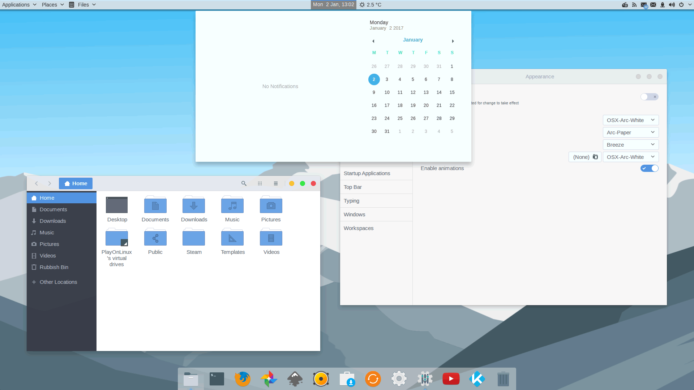

[TOC]

# linux简介

## 操作系统是什么

> Linux是一个操作系统

**操作系统（Operating System，OS）**是软件的一部分，它是硬件基础上的第一层软件，是硬件和其它软件沟通的桥梁（或者说接口、中间人、中介等）。

操作系统会控制其他程序运行，管理系统资源，提供最基本的计算功能，如管理及配置内存、决定系统资源供需的优先次序等，同时还提供一些基本的服务程序，例如：文件系统,设备驱动程序,用户接口,系统服务程序

> - 文件系统: 提供计算机存储信息的结构，信息存储在文件中，文件主要存储在计算机的内部硬盘里，在目录的分层结构中组织文件。文件系统为操作系统提供了组织管理数据的方式。
> - 设备驱动程序: 提供连接计算机的每个硬件设备的接口，设备驱动器使程序能够写入设备，而不需要了解执行每个硬件的细节。简单来说，就是让你能吃到鸡蛋，但不用养一只鸡。
> - 用户接口: 操作系统需要为用户提供一种运行程序和访问文件系统的方法。如常用的 Windows 图形界面，可以理解为一种用户与操作系统交互的方式；智能手机的 Android 或 iOS 系统，也是一种操作系统的交互方式。
> - 系统服务程序: 当计算机启动时，会自启动许多系统服务程序，执行安装文件系统、启动网络服务、运行预定任务等操作。

打个比方，操作系统就好像是一个政府，其它软件都会被它管控；操作系统在给其他软件提供各种便利的同时，还会约束其他软件不能为所欲为(不能操控硬件,软件只能通过操作系统来操作硬件)。


目前流行的服务器和 PC 端操作系统有 Linux、Windows、UNIX 等，手机操作系统有 Android、iOS、Windows Phone（简称 WP），嵌入式操作系统有 Windows CE、PalmOS、eCos、uClinux 等。


## Linux和UNIX的关系及区别

UNIX 与 Linux 之间的关系是一个很有意思的话题。在目前主流的服务器端操作系统中，UNIX 诞生于 20 世纪 60 年代末，Windows 诞生于 20 世纪 80 年代中期，Linux 诞生于 20 世纪 90 年代初，可以说 UNIX 是操作系统中的"老大哥"，后来的 Windows 和 Linux 都参考了 UNIX。

> 现代的 Windows 系统已经朝着“图形界面”的方向发展了，和 UNIX 系统有了巨大的差异，从表面上甚至看不出两者的关联。

### UNIX的坎坷历史

UNIX 操作系统由肯•汤普森（Ken Thompson）和丹尼斯•里奇（Dennis Ritchie）发明。它的部分技术来源可追溯到从 1965 年开始的 Multics 工程计划，该计划由贝尔实验室、美国麻省理工学院和通用电气公司联合发起，目标是开发一种交互式的、具有多道程序处理能力的分时操作系统，以取代当时广泛使用的批处理操作系统。

> 说明：分时操作系统使一台计算机可以同时为多个用户服务，连接计算机的终端用户交互式发出命令，操作系统采用时间片轮转的方式处理用户的服务请求并在终端上显示结果（操作系统将CPU的时间划分成若干个片段，称为时间片）。操作系统以时间片为单位，轮流为每个终端用户服务，每次服务一个时间片。

可惜，由于 Multics 工程计划所追求的目标太庞大、太复杂，以至于它的开发人员都不知道要做成什么样子，最终以失败收场。

以肯•汤普森为首的贝尔实验室研究人员吸取了 Multics 工程计划失败的经验教训，**于 1969 年实现了一种分时操作系统的雏形，1970 年该系统正式取名为 UNIX。**  Multi 是大的意思，大而且繁；而 Uni 是小的意思，小而且巧。这是 UNIX 开发者的设计初衷，这个理念一直影响至今。

有意思的是，肯•汤普森当年开发 UNIX 的初衷是运行他编写的一款计算机游戏 Space Travel，他先后在多个系统上试验，但运行效果不甚理想，于是决定自己开发操作系统，就这样，UNIX 诞生了。

自 1970 年后，UNIX 系统在贝尔实验室内部的程序员之间逐渐流行起来。1971-1972 年，肯•汤普森的同事丹尼斯•里奇发明了传说中的C语言，这是一种适合编写系统软件的高级语言，它的诞生是 UNIX 系统发展过程中的一个重要里程碑，它宣告了在操作系统的开发中，汇编语言不再是主宰。

到了 1973 年，UNIX 系统的绝大部分源代码都用C语言进行了重写，这为提高 UNIX 系统的可移植性打下了基础（之前操作系统多采用汇编语言，对硬件依赖性强），也为提高系统软件的开发效率创造了条件。可以说，UNIX 系统与C语言是一对孪生兄弟，具有密不可分的关系。

20 世纪 70 年代初，计算机界还有一项伟大的发明——TCP/IP 协议，这是当年美国国防部接手 ARPAnet 后所开发的网络协议。美国国防部把 TCP/IP 协议与 UNIX 系统、C语言捆绑在一起，由 AT&T 发行给美国各个大学非商业的许可证，这为 UNIX 系统、C语言、TCP/IP 协议的发展拉开了序幕，它们分别在操作系统、编程语言、网络协议这三个领域影响至今。肯•汤普森和丹尼斯•里奇因在计算机领域做出的杰出贡献，于 1983 年获得了计算机科学的最高奖——图灵奖。

随后出现了各种版本的 UNIX 系统，目前常见的有 Sun Solaris、FreeBSD、IBM AIX、HP-UX 等。苹果公司的 OS  X 就是基于 FreeBSD 的操作系统。

### Linux 的那些往事

Linux 内核最初是由李纳斯•托瓦兹（Linus Torvalds）在赫尔辛基大学读书时出于个人爱好而编写的，当时他觉得教学用的迷你版 UNIX 操作系统 Minix 太难用了，于是决定自己开发一个操作系统。第 1 版本于 1991 年 9 月发布，当时仅有 10 000 行代码。

李纳斯•托瓦兹没有保留 Linux 源代码的版权，公开了代码，并邀请他人一起完善 Linux。与 Windows 及其他有专利权的操作系统不同，Linux 开放源代码，任何人都可以免费使用它。

据估计，现在只有 2% 的 Linux 核心代码是由李纳斯•托瓦兹自己编写的，虽然他仍然拥有 Linux 内核（操作系统的核心部分），并且保留了选择新代码和需要合并的新方法的最终裁定权。现在大家所使用的 Linux，我更倾向于说是由李纳斯•托瓦兹和后来陆续加入的众多 Linux 好者共同开发完成的。

李纳斯•托瓦兹无疑是这个世界上最伟大的程序员之一，何况，他还搞出了全世界最大的程序员交友社区 [GitHub](https://github.com/) (开源代码库及版本控制系统）。

关于 Linux Logo 的由来是一个很有意思的话题，它是一只企鹅。

  为什么选择企鹅，而不是选择狮子、老虎或者小白兔？有人说因为李纳斯•托瓦兹是芬兰人，所以选择企鹅，有人说因为其他动物图案都被用光了，李纳斯•托瓦兹只好选择企鹅。

我更愿意相信以下说法，企鹅是南极洲的标志性动物，根据国际公约，南极洲为全人类共同所有，不属于世界上的任何国家，可国家都无权将南极洲纳入其版图。Linux 选择企鹅图案作为 Logo，其含义是：开放源代码的 Linux 为全人类共同所有，可公司无权将其私有。  

### UNIX与Linux的关系

二者的关系，不是大哥和小弟，"**UNIX 是 Linux 的父亲**"这个说法更怡当。

在学习的时候，其实 Linux 与 UNIX 有很多的共通之处，简单地说，如果你已经熟练掌握了 Linux，那么再上手使用 UNIX 会非常容易。

二者也有两个大的区别：

1. UNIX 系统大多是与硬件配套的，也就是说，大多数 UNIX 系统如 AIX、HP-UX 等是无法安装在 x86 服务器和个人计算机上的，而 Linux 则可以运行在多种硬件平台上；
2. UNIX 是商业软件，而 Linux 是开源软件，是免费、公开源代码的。

Linux 受至旷大计算机爱好者的喜爱，主要原因也有两个：

1. 它属于开源软件，用户不用支付可费用就可以获得它和它的源代码，并且可以根据自己的需要对它进行必要的修改，无偿使用，无约束地继续传播；
2. 它具有 UNIX 的全部功能，任何使用 UNIX 操作系统或想要学习 UNIX 操作系统的人都可以从 Linux 中获益。

**总结一下 Linux 和 UNIX 的关系/区别**

Linux 是一个类似 Unix 的操作系统，Unix 要早于 Linux，Linux 的初衷就是要替代 UNIX，并在功能和用户体验上进行优化，所以 Linux 模仿了 UNIX（但并没有抄袭 UNIX 的源码），使得 Linux 在外观和交互上与 UNIX 非常类似。

### UNIX/Linux系统结构

UNIX/Linux 系统可以粗糙地抽象为 3 个层次

如图所示。底层是 UNIX/Linux 操作系统，即系统内核（Kernel）；中间层是 Shell 层，即命令解释层；高层则是应用层。


#### 内核层

内核层是 UNIX/Linux 系统的核心和基础，**它直接附着在硬件平台之上**，**控制和管理系统内各种资源**（硬件资源和软件资源），有效地组织进程的运行，从而扩展硬件的功能，提高资源的利用效率，为用户提供方便、高效、安全、可靠的应用环境。

#### shell层

Shell 层是与用户直接交互的界面。用户可以在提示符下输入命令行，由 Shell 解释执行并输出相应结果或者有关信息，所以我们也把 Shell 称作，**利用系统提供的丰富命令可以快捷而简便地完成许多工作**。

#### 应用层

应用层提供基于 X Window 协议的图形环境。X Window 协议定义了一个系统所必须具备的功能（就如同 TCP/IP 是一个协议，定义软件所应具备的功能），可让系统能满足此协议及符合 X 协会其他的规范，便可称为 X Window。

> X Window 与微软的 Windows 图形环境有很大的区别：
>
> - UNIX/Linux 系统与 X Window 没有必然捆绑的关系，也就是说，UNIX/Linux 可以安装 X Window，也可以不安装；而微软的 Windows 图形环境与内核捆绑密切。
> - UNIX/Linux 系统不依赖图形环境，依然可以通过命令行完成 100% 的功能，而且因为不使用图形环境还会节省大量的系统资源。

## Linux的优点

- 大量的可用软件及免费软件

  > Linux 系统上有着大量的可用软件，且绝大多数是免费的，比如声名赫赫的 Apache、Samba、PHP、[MySQL](http://c.biancheng.net/mysql/) 等，构建成本低廉，是 Linux 被众多企业青睐的原因之一。当然，这和 Linux 出色的性能是分不开的，否则，节约成本就没有任何意义。

- 良好的可移植性及灵活性

  > Linux 系统有良好的可移植性，它几乎支持所有的 CPU 平台，这使得它便于裁剪和定制。我们可以把 Linux 放在 U 盘、光盘等存储介质中，也可以在嵌入式领域广泛应用。

- 优良的稳定性和安全性

  > Linux 开放源代码，将所有代码放在网上，全世界的程序员都看得到，有什么缺陷和漏洞，很快就会被发现，从而成就了它的稳定性和安全注。

- 支持几乎所有的网络协议及开发语言

  > UNIX 系统是与 C 语言、TCP/IP 协议一同发展起来的，而 Linux 是 UNIX 的一种

## linux发行版

新手往往会被 Linux 众多的发行版本搞得一头雾水，我们首先来解释一下这个问题。

从技术上来说，李纳斯•托瓦兹开发的 Linux 只是一个内核(**即Linux只有一个内核**)。**内核指的是一个提供设备驱动、文件系统、进程管理、网络通信等功能的系统软件，内核并不是一套完整的操作系统，它只是操作系统的核心**。一些组织或厂商将 Linux 内核与各种软件和文档包装起来，并提供系统安装界面和系统配置、设定与管理工具，就构成了 Linux 的发行版本。

在 Linux 内核的发展过程中，各种 Linux 发行版本起了巨大的作用，正是它们推动了 Linux 的应用，从而让更多的人开始关注 Linux。因此，把 Red Hat、Ubuntu、SUSE 等直接说成 Linux 其实是不确切的，它们是 Linux 的发行版本，更确切地说，应该叫作“以Linux为核心的操作系统软件包”。

**inux 的各个发行版本使用的是同一个 Linux 内核**，因此在内核层不存在什么兼容性问题，每个版本有不一样的感觉，只是在发行版本的最外层（由发行商整合开发的应用）才有所体现。

Linux 的发行版本可以大体分为两类：

- 商业公司维护的发行版本，以著名的 Red Hat 为代表；
- 社区组织维护的发行版本，以 Debian 为代表。

### 常用的liunx发行版本

#### Red Hat Linux

Red Hat（红帽公司）创建于 1993 年，是目前世界上资深的 Linux 厂商，也是最获认可的 Linux 品牌。

Red Hat 公司的产品主要包括 RHEL（Red Hat Enterprise Linux，收费版本）和 `CentOS`（RHEL 的社区克隆版本，免费版本）、Fedora Core（由 Red Hat 桌面版发展而来，免费版本）。

Red Hat 是在我国国内使用人群最多的 Linux 版本，资料丰富，如果你有什么不明白的地方，则容易找到人来请教，而且大多数 Linux 教程是以 Red Hat 为例来讲解的（包括本教程）。

#### Ubuntu Linux

Ubuntu 基于知名的 Debian Linux 发展而来，界面友好，容易上手，对硬件的支持非常全面，是目前最适合做桌面系统的 Linux 发行版本，而且 Ubuntu 的所有发行版本都免费提供。

Ubuntu 的创始人 Mark Shuttleworth 是非常具有传奇色彩的人物。他在大学毕业后创建了一家安全咨询公司，1999 年以 5.75 亿美元被收购，由此一跃成为南非最年轻有为的本土富翁。作为一名狂热的天文爱好者，Mark Shuttleworth 于 2002 年自费乘坐俄罗斯联盟号飞船，在国际空间站中度过了 8 天的时光。之后，Mark Shuttleworth 创立了 Ubuntu 社区，2005 年 7 月 1 日建立了 Ubuntu 基金会，并为该基金会投资 1000 万美元。他说，太空的所见正是他创立 Ubuntu 的精神之所在。如今，他最热衷的事情就是到处为自由开源的 Ubuntu 进行宣传演讲。

#### SuSE Linux

  SuSE Linux 以 Slackware Linux 为基础，原来是德国的 SuSE Linux AG 公司发布的 Linux 版本，1994 年发行了第一版，早期只有商业版本，2004 年被 Novell 公司收购后，成立了 OpenSUSE 社区，推出了自己的社区版本 OpenSUSE。

SuSE Linux 在欧洲较为流行，在我国国内也有较多应用。值得一提的是，它吸取了 Red Hat Linux 的很多特质。

SuSE Linux 可以非常方便地实现与 Windows 的交互，硬件检测非常优秀，拥有界面友好的安装过程、图形管理工具，对于终端用户和管理员来说使用非常方便。  

#### Gentoo Linux

Gentoo 最初由 Daniel Robbins（FreeBSD 的开发者之一）创建，首个稳定版本发布于 2002 年。Gentoo 是所有 Linux 发行版本里安装最复杂的，到目前为止仍采用源码包编译安装操作系统。
不过，它是安装完成后最便于管理的版本，也是在相同硬件环境下运行最快的版本。自从 Gentoo 1.0 面世后，它就像一场风暴，给 Linux 世界带来了巨大的惊喜，同时也吸引了大量的用户和开发者投入 Gentoo Linux 的怀抱。
有人这样评价 Gentoo：快速、设计干净而有弹性，它的出名是因为其高度的自定制性（基于源代码的发行版）。尽管安装时可以选择预先编译好的软件包，但是大部分使用 Gentoo 的用户都选择自己手动编译。这也是为什么 Gentoo 适合比较有 Linux 使用经验的老手使用。

> 要注意的是，由于编译软件需要消耗大量的时间，所以，如果你所有的软件都由自己编译，并安装 KDE 桌面系统等比较大的软件包，则可能需要花费很长时间。

#### 其他 Linux 发行版

| 版本名称     | 网 址                                        | 特 点                                                        | 软件包管理器                |
| ------------ | -------------------------------------------- | ------------------------------------------------------------ | --------------------------- |
| Debian Linux | [www.debian.org](http://www.debian.org/)     | 开放的开发模式，且易于进行软件包升级                         | apt                         |
| Fedora Core  | [www.redhat.com](http://www.redhat.com/)     | 拥有数量庞人的用户，优秀的社区技术支持. 并且有许多创新       | up2date（rpm），yum （rpm） |
| Mandriva     | [www.mandriva.com](http://www.mandriva.com/) | 操作界面友好，使用图形配置工具，有庞大的社区进行技术支持，支持 NTFS 分区的大小变更 | rpm                         |
| KNOPPIX      | [www.knoppix.com](http://www.knoppix.com/)   | 可以直接在 CD 上运行，具有优秀的硬件检测和适配能力，可作为系统的急救盘使用 | apt                         |

### linux发行版本的选择

1. 如果你需要的是一个服务器系统，而且已经厌烦了各种 Linux 的配置，只是想要一个比较稳定的服务器系统，那么建议你选择 CentOS 或 RHEL。
2. 如果你只是需要一个桌面系统，而且既不想使用盗版，又不想花大价钱购买商业软件，不想自己定制，也不想在系统上浪费太多时间，则可以选择 Ubuntu。
3. 如果你想深入摸索一下 Linux 各个方面的知识，而且还想非常灵活地定制自己的 Linux 系统，那就选择 Gentoo 吧，尽情享受 Gentoo 带来的自由快感。
4. 如果你对系统稳定性要求很高，则可以考虑 FreeBSD。
5. 如果你需要使用数据库高级服务和电子邮件网络应用，则可以选择 SuSE。

> 其实 Linux 的发行版本众多，但是系统的核心——内核却系出同门，所以只要学会使用其中一种，即可触类旁通。

## linux桌面环境

### KDE 桌面系统

KDE 是基于大名鼎鼎的 Qt 的，最初于 1996 年作为开源项目公布，并在 1998 年发布了第一个版本，现在 KDE 几乎是排名第一的桌面环境了。

许多流行的 Linux 发行版都提供了 KDE 桌面环境，比如 Ubuntu、Linux Mint、OpenSUSE、Fedora、Kubuntu、PC Linux OS 等。

KDE 和 Windows 比较类似，各位初学者相信都是 Windows 的用户，所以切换到 KDE 也不会有太大的障碍。

KDE 允许你把应用程序图标和文件图标放置在桌面的特定位置上。单击应用程序图标，Linux 系统就会运行该应用程序。单击文件图标，KDE 桌面就会确定使用哪种应用程序来处理该文件。


对 KDE 优缺点的总结：

- 优点：KDE 几乎是最先进最强大的桌面环境，它外观优美、高度可定制、兼容比较旧的硬件设备
- 缺点：Kmail 等一些组件的配置对新手来说过于复杂。

### GNOME 桌面环境

GNOME 于 1999 年首次发布，现已成为许多Linux发行版默认的桌面环境（不过用得最多的是 Red Hat Linux）。

GNOME 的特点是简洁、运行速度快，但是没有太多的定制选项，用户需要安装第三方工具来实现。

GNOME 甚至不包括一些简单的调整选项，比如更改主题、更改字体等，就这两种基本的调整而言，用户都需要安装第三方工具。所以，GONME 适合那些不需要高度定制界面的用户。

GNOME 被用作 Fedora 中的默认桌面环境，提供在几款流行的 Linux 发行版中，比如 Ubuntu、Debian、OpenSUSE 等。



对 GNOME 优缺点的总结：

- 优点：简单易用，可通过插件来扩展功能。
- 缺点：对插件的管理能力比较差，也缺少其它桌面环境拥有的许多功能。

### Unity

Unity 是由 Ubuntu 的母公司 Canonical 开发的一款外壳。之所以说它是外壳，是因为 Unity 运行在 GNOME 桌面环境之上，使用了所有 GNOME 的核心应用程序。

2010 年，Unity 第一个版本发布，此后经过数次改进，如今和其它的桌面环境一样，也可以安装到其它的 Linux 发行版上了。

Unity 很简单、运行速度快，但 Unity 在系统设置下却没有定制桌面的太多选项，要想安装主题或者定制另外不同的选项，比如系统菜单是否应该总是可见，或者“从启动器图标一次点击最小化”，用户需要安装第三方工具。


对 Unity 优缺点的总结：

- 优点：界面简洁直观，可以通过第三方工具来深度定制，而且使用了平视显示器（HUD）等新技术。
- 缺点：默认的定制功能比较差劲，通知机制一般。

### MATE

MATE 是一种从现在无人维护的 GNOME 2 代码库派生出来的桌面环境。

MATE 让人觉得在使用旧的桌面环境，但是结合了历年来界面方面的诸多改进。MATE 还非常适用于低配计算机，所以如果你有一台旧的或速度较慢的计算机，可以使用 MATE。

MATE 还是许多流行的 Linux 发行版随带的，比如 Ubuntu、Linux Mint、Mageia、Debian 及另外更多发行版。


对 META 优缺点的总结：

- 优点：轻量级的桌面环境，能够兼容教旧的硬件设备。
- 缺点：我也不知道有什么明显的缺点。

### 查看桌面环境

我们可以通过环境变量 DESKTOP_SESSION 来查看当前 Linux 发行版使用了哪种桌面环境

例如：

```cmd
[c.biancheng.net]$ echo $DESKTOP_SESSION
gnome-classic
```

## 开源软件

Linux 是一款开源软件，我们可以随意浏览和修改它的源代码，学习 Linux，不得不谈到开源精神。Linux 本身就是开源精神的受益者，它几乎是全球最大的开源软件。

> 简单来说，开源软件就是把软件程序与源代码文件一起打包提供给用户，用户既可以不受限制地使用该软件的全部功能，也可以根据自己的需求修改源代码，甚至编制成衍生产品再次发布出去。

用户具有使用自由、修改自由、重新发布自由和创建衍生品自由，这正好符合了黑客和极客对自由的追求，因此开源软件在国内外都有着很高的人气，大家聚集在开源社区，共同推动开源软件的进步。

开源软件的优点:

| 优点   | 说明                                                         |
| ------ | ------------------------------------------------------------ |
| 低风险 | 使用闭源软件无疑是把命运交给他人，一旦封闭的源代码没有人来维护，你将进退维谷；而且相较于商业软件公司，开源社区很少存在倒闭的问题。 |
| 高品质 | 相较于闭源软件产品，开源项目通常是由开源社区来研发及维护的，参与编写、维护、测试的用户量众多，一般的 bug 还没有等爆发就已经被修补。 |
| 低成本 | 开源工作者都是在幕后默默且无偿地付出劳动成果，为美好的世界贡献一份力量，因此使用开源社区推动的软件项目可以节省大量的人力、物力和财力。 |
| 更透明 | 没有哪个笨蛋会把木马、后门等放到开放的源代码中，这样无疑是把自己的罪行暴露在阳光之下。 |

# liunx安装

## 使用VMware虚拟机安装linux

### 选好镜像,一路next

### 在配置网络的时候,选择NAT模式

> VMware 提供的网络连接有 5 种，分别是"桥接模式"、"NAT 模式"、"仅主机模式"、"自定义"和"LAN 区段"：
>
> - 桥接模式：相当于虚拟机的网卡和宿主机的物理网卡均连接到虚拟机软件所提供的 VMnet0 虚拟交换机上，因此虚拟机和宿主机是平等的，相当于一个网络中的两台计算机。这种设置既可以保证虚拟机和宿主机通信，也可以和局域网内的其他主机通信，还可以连接 Internet，是限制最少的连接方式，推荐新手使用。
> - NAT 模式：相当于虚拟机的网卡和宿主机的虚拟网卡 VMnet8 连接到虚拟机软件所提供的 VMnet8 虚拟交换机上，因此本机是通过 VMnet8 虚拟网卡通信的。在这种网络结构中，VMware 为虚拟机提供了一个虚拟的 NAT 服务器和一个虚拟的 DHCP 服务器，虚拟机利用这两个服务器可以连接到 Intemet。所以，在正常情况下，虚拟机系统只要设定自动获取 IP 地址，就能既和宿主机通信，又能连接到 Internet了。但是这种设置不能连接局域网内的其他主机。
> - 仅主机模式：宿主机和虚拟机通信使用的是 VMware 的虚拟网卡 VMnet1，但是这种连接没有 NAT 服务器为虚拟机提供路由功能，所以仅主机网络只能连接宿主机，不能连接局域网，也不能连接 Internet 网络。
> - 自定义网络：可以手工选择使用哪块虚拟机网卡。如果选择 Vmnet1，就相当于桥接网络；如果选择 VMnet8，就相当于 NAT 网络。
> - LAN 区段：这是新版 VMware 新增的功能，类似于交换机中的 VLAN（虚拟局域网），可以在多台虚拟机中划分不同的虚拟网络。

其中常用设置有以下 2 种：

1. 需要宿主机的 Windows 和虚拟机的 Linux 能够进行网络连接，使用"桥接模式"（桥接时，Linux 也可以访问互联网，只是虚拟机需要配置和宿主机 Windows 同样的联网环境）；
2. 需要宿主机的 Windows 和虚拟机的 Linux 能够进行网络连接，同时虚拟机的 Linux 可以通过宿主机的 Windows 连入互联网，使用"NAT模式"。

## linux的远程管理协议(RFB、RDP、Telnet和SSH)

  提到远程管理，通常指的是远程管理服务器，而非个人计算机。个人计算机可以随时拿来用，服务器通常放置在机房中，用户无法直接接触到服务器硬件，只能采用远程管理的方式。

远程管理，实际上就是计算机（服务器）之间通过网络进行数据传输（信息交换）的过程，与浏览器需要 HTTP 协议（超文本传输协议）浏览网页一样，远程管理同样需要远程管理协议的支持。  

目前，常用的远程管理协议有以下 4 种：

- RDP（remote desktop protocol）协议：远程桌面协议，大部分 Windows 系统都默认支持此协议，Windows 系统中的远程桌面管理就基于该协议。
- RFB（Remote FrameBuffer）协议：图形化远程管理协议，VNC 远程管理工具就基于此协议。
- Telnet：命令行界面远程管理协议，几乎所有的操作系统都默认支持此协议。此协议的特点是，在进行数据传送时使用明文传输的方式，也就是不对数据进行加密。
- SSH（Secure [Shell](http://c.biancheng.net/shell/)）协议：命令行界面远程管理协议，几乎所有操作系统都默认支持此协议。和 Telnet 不同，该协议在数据传输时会对数据进行加密并压缩，因此使用此协议传输数据既安全速度又快。

### RDP 对比 RFB

RDP 协议和 RFB 协议都允许用户通过图形用户界面访问远程系统，但 RFB 协议倾向于传输图像，RDP 协议倾向于传输指令：

- RFB 协议会在服务器端将窗口在显存中画好，然后将图像传给客户端，客户端只需要将得到的图像解码显示即可；
- RDP 会将画图的工作交给客户端，服务器端需要根据客户端的显示能力做适当的调整。


因此，完成相同的操作，使用 RFB 协议传输的数据量会比 RDP 大，而 RDP 对客户端的要求比 RFB 更苛刻，RFB 适用于瘦客户端，而 RDP 适用于低速网络。

> 瘦客户端是相对于胖客户端而言的，比如，人们使用 QQ，需要下载客户端，这属于“胖客户”；反之，通过浏览器就可查阅网络上各种资料，无需再下载其他任何软件，这属于“瘦客户”。简单理解，瘦客户端指的是最大可能减轻客户端的负担，多数工作由服务器端完成；胖客户端则相反。

### Telnet 对比 SSH

Telnet 协议和 SSH 协议都是命令行远程管理协议，有共同的应用领域，常用于远程访问服务器。
相比 Telnet 协议，SSH 协议在发送数据时会对数据进行加密操作，数据传输更安全，因此 SSH 协议几乎在所有应用领域代替了 Telnet 协议。

> 在一些测试、无需加密的场合（如局域网），Telnet协议仍常被使用。

### linux的协议选择

介于安全性和稳定性的考虑，大部分的服务器都舍弃图形管理界面而选择命令行界面，因此远程管理 Linux 服务器常使用基于 SSH 协议的命令行管理方式。

目前，基于 SSH 协议常用的远程管理工具有 PuTTY、SecureCRT、WinSCP 、x

shell等，这些管理工具的具体使用下节给大家详细介绍。  

# linux文件和目录管理

## linux文件目录结构


为了方便管理和维护，Linux 系统采用了文件系统层次标准，也称为 FHS 标准，它规定了根目录下各个目录应该存在哪些类型的文件（或子目录），比如说，在 /bin 和 /sbin 目录中存放的应该是可执行文件，有关各个目录存放文件的类型

> FHS（Filesystem Hierarchy Standard），文件系统层次化标准，该标准规定了 Linux 系统中所有一级目录以及部分二级目录（/usr 和 /var）的用途。发布此标准的主要目的就是为了让用户清楚地了解每个目录应该存放什么类型的文件。

## 根目录(/)

FHS 认为，Linux 系统的根目录（/）最为重要（没有之一），其原因有以下 2 点：

1. 所有目录都是由根目录衍生出来的；
2. 根目录与系统的开机、修复、还原密切相关；

因此，根目录必须包含开机软件、核心文件、开机所需程序、函数库、修复系统程序等文件，如表 所示。


