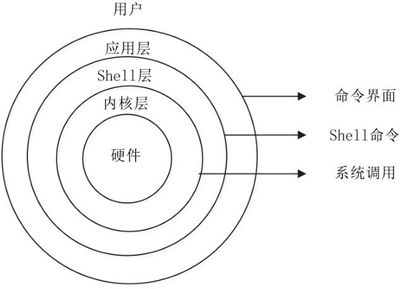

[TOC]

# 简介

是一个操作系统,和Windows、UNIX一样属于比较流行的操作系统

## linux和unix的联系

windows和linux都参考了unix,先有unix,才有的liunx

**Unix的历史**

---

在当时需要一个分时操作系统,然后以肯•汤普森为首的贝尔实验室研究人员就开发了unix系统,Multi 是大的意思，大而且繁；而 Uni 是小的意思，小而且巧。这是 UNIX 开发者的设计初衷，这个理念一直影响至今。

**Linux的历史**

---

Linux内核最初由李纳斯•托瓦兹（Linus Torvalds）开发的,之后作者公开了代码,使得所有可以一起完善linux,到现在只有 2% 的 Linux 核心代码是由李纳斯•托瓦兹自己编写的,但他保留了选择新代码和需要合并的新方法的最终裁定权

**Unix和Linux的关系**

---

UNIX 是 Linux 的父亲;

- Unix依赖硬件,而且是商业产品,不公开; 

- Linux不依赖硬件,而且是开源产品;

- UNIX/Linux系统结构

**Unix/Linux系统结构**

---

总共分为3个层次:

- 底层(系统内核)

  内核层是 UNIX/Linux 系统的核心和基础，`它直接附着在硬件平台之上，控制和管理系统内各种资源`（硬件资源和软件资源），有效地组织进程的运行，从而扩展硬件的功能，提高资源的利用效率，为用户提供方便、高效、安全、可靠的应用环境。

- 中间层(shell层)

  Shell 层是与用户直接交互的界面。用户可以在提示符下输入命令行，由 Shell 解释执行并输出相应结果或者有关信息,我们可以利用系统提供的丰富命令可以快捷而简便地完成许多工作

- 高层(应用层)

  应用层提供基于 X Window 协议的图形环境。



**Linux的优点**

---

- 有很多好用且免费的软件
- 有良好的可移植性及灵活性
- 优良的稳定性和安全性
- 支持几乎所有的网络协议及开发语言

## linux发行版

所有的linux发行版中,他们的内核都是一样的,是由李纳斯•托瓦兹开发,不同的是他们各自自带了一些不同的软件,系统安装界面和管理工具等

> 内核指的是一个提供设备驱动、文件系统、进程管理、网络通信等功能的系统软件，内核并不是一套完整的操作系统，它只是操作系统的核心。

**发行版**

---

- Red Hat Linux

  包括RHEL（Red Hat Enterprise Linux，收费版本）和 `CentOS`（RHEL 的社区克隆版本，免费版本）

- Ubuntu Linux

  界面友好，容易上手，对硬件的支持非常全面，是目前最适合做桌面系统的 Linux 发行版本,并且免费提供

- ...

**发行版选择**

---

- 如果需要一个服务器系统,需要比较稳定的CentOS或者RHEL
- 如果需要一个桌面系统,可以选择Ubuntu

## 桌面环境

- KDE 桌面系统
  - 优点：KDE 几乎是最先进最强大的桌面环境，它外观优美、高度可定制、兼容比较旧的硬件设备
  - 缺点：Kmail 等一些组件的配置对新手来说过于复杂。
- GNOME 桌面环境
  - 优点：简单易用，可通过插件来扩展功能。
  - 缺点：对插件的管理能力比较差，也缺少其它桌面环境拥有的许多功能。
- Unity
  - 优点：界面简洁直观，可以通过第三方工具来深度定制，而且使用了平视显示器（HUD）等新技术。
  - 缺点：默认的定制功能比较差劲，通知机制一般。

**查看桌面环境**

`echo $DESKTOP_SESSION`

# 安装

- 使用VMware虚拟机安装linux

- 选好镜像,一路next

- 在配置网络的时候,选择NAT模式

  网络模式选择

  - 桥接模式

    虚拟机的网卡和本机的物理网卡都连到VMnet0 虚拟交换机上,相当于虚拟机和主机连了一根网线

  - NAT模式

    虚拟机的网卡和本机的虚拟网卡连接到 VMnet8 虚拟交换机上,相当于本机开了一个wifi,然后虚拟机连接wifi进行上网

  - 仅主机模式

    虚拟机和本机都使用虚拟网卡 VMnet1,这种连接造成虚拟机和本机都没有网络,只能两个机子进行通讯

**linux的远程管理协议**

---

linux使用的是SSH协议（Secure [Shell](http://c.biancheng.net/shell/)）

> SSH协议: 命令行界面远程管理协议，几乎所有操作系统都默认支持此协议。和 Telnet 不同，该协议在数据传输时会对数据进行加密并压缩，因此使用此协议传输数据既安全速度又快。

# 文件和目录

## 文件目录结构

整体结构图


**根目录**

---

与系统的开机、修复、还原密切相关; 根目录必须包含开机软件、核心文件、开机所需程序、函数库、修复系统程序等文件

**一级目录**

---

- `/bin`: 存放系统命令
- `/boot`: 系统启动目录
- `/dev`: 设备文件保存位置
- `/etc`: 配置文件保存位置
- `/home`: 普通用户的主目录(也成为家目录),每个用户在家目录都会有一个和用户名相同的目录
- `/lib`: 系统调用的函数库保存位置
- `/media,/mnt,/misc`:挂载目录 ,挂载媒体设备
- `/opt`: 第三方安装的软件保存位置
- `/root`: root的主目录
- `/sbin`: 保存与系统环境相关的命令
- `/srv`: 服务数据目录; 一些系统服务启动之后，会在这个目录中保存所需要的数据
- `/tmp`: 临时目录; 系统存放临时文件的目录
- `/lost+found`: 当系统意外崩溃或意外关机时，产生的一些文件碎片会存放在这里
- `/proc,/sys`: 虚拟文件系统; 该目录中的数据并不保存在硬盘上，而是保存到内存中。主要保存系统的内核、进程、外部设备状态和网络状态等
- `/usr`: 此目录用于存储系统软件资源。FHS 建议所有开发者，应把软件产品的数据合理的放置在 /usr 目录下的各子目录中，而不是为他们的产品创建单独的目录。
- `/var`: 用于存储动态数据，例如缓存、日志文件、软件运行过程中产生的文件等。


详细介绍两个目录

**/usr目录**

---

Linux 系统中，所有系统默认的软件都存储在 /usr 目录下, /usr 目录类似 Windows 系统中 C:\Windows\ + C:\Program files\ 两个目录的综合体。

- `/usr/bin/`: 存放系统命令
- `/usr/sbin/`: 存放根文件系统不必要的系统管理命令，如多数服务程序，只有 root 可以使用。
- `/usr/lib/`: 应用程序调用的函数库保存位置 
- `/usr/XllR6/`: 图形界面系统保存位置 
- `/usr/local/`: 手工安装的软件保存位置。我们一般建议源码包软件安装在这个位置  
- `/usr/share/`: 应用程序的资源文件保存位置，如帮助文档、说明文档和字体目录  
- `/usr/src/`: 源码包保存位置。我们手工下载的源码包和内核源码包都可以保存到这里

**/var目录**

---

- `/var/lib/`: 程序运行中需要调用或改变的数据保存位置。如 MySQL 的数据库保存在 /var/lib/mysql/ 目录中  
- `/var/log/`: 登陆文件放置的目录，其中所包含比较重要的文件如 /var/log/messages, /var/log/wtmp 等。  
- `/var/run/`: 一些服务和程序运行后，它们的 PID（进程 ID）保存位置  
- `/var/spool/`: 里面主要都是一些临时存放，随时会被用户所调用的数据，例如 /var/spool/mail/ 存放新收到的邮件，/var/spool/cron/ 存放系统定时任务。  
- `/var/www/`: RPM 包安装的 Apache 的网页主目录  
- `/var/nis和/var/yp`  NIS `服务机制所使用的目录`，nis 主要记录所有网络中每一个 client 的连接信息；yp 是 linux 的 nis 服务的日志文件存放的目录  
- `/var/tmp`: 一些应用程序在安装或执行时，需要在重启后使用的某些文件，此目录能将该类文件暂时存放起来，完成后再行删除

# linux基本命令

**命令的基本格式**

```cmd
[root@localhost ~]# 命令[选项][参数]
```

> - root：显示的是当前的登录用户
> - localhost：当前系统的简写主机名（完整主机名是 localhost.localdomain）。
> - ~：代表用户当前所在的目录，此例中用户当前所在的目录是家目录。
>   - 超级用户的家目录：/root。
>   - 普通用户的家目录：/home/用户名
> - \#：命令提示符，Linux 用这个符号标识登录的用户权限等级。如果是超级用户，提示符就是 #；如果是普通用户，提示符就是 $。

**总结一下：**

命令的选项用于调整命令功能，而命令的参数是这个命令的操作对象

## cd

用来切换工作目录, 是 Change Directory 的缩写

**基本格式**

```cmd
[root@localhost ~]# cd [相对路径或绝对路径]
```

**选项**

- `~`: 代表当前登录用户的主目录  
- `~用户名`: 表示切换至指定用户的主目录  
- `-`: 代表上次所在目录  
- `.`: 代表当前目录  
- `..`: 代表上级目录

| 特殊符号 | 作 用                      |
| -------- | -------------------------- |
| ~        | 代表当前登录用户的主目录   |
| ~用户名  | 表示切换至指定用户的主目录 |
| -        | 代表上次所在目录           |
| .        | 代表当前目录               |
| ..       | 代表上级目录               |

## pwd

显示用户当前所处的工作目录, Print Working Directory （打印工作目录）的缩写

**基本格式**

```cmd
[root@localhost ~]# pwd
```

## ls

显示当前目录下的内容; list 的缩写

**基本命令**

```cmd
[root@localhost ~]# ls [选项] 目录名称
```

**选项**

- `-a`: 显示全部的文件，包括隐藏文件（开头为 . 的文件）
- `-h`: 以易读的方式显示文件或目录大小，如 1KB、234MB、2GB 等。
- `-l`: 使用长格式列出文件和目录信息
- `-R`: 连同子目录内容一起列出来，递归显示目录
- `-t`: 以时间排序，而不是以文件名排序。

**示例**

```cmd
# 不加参数(默认当前路径)
[root@www ~]# ls -alh 
# 加上参数(路径)
[root@www ~]# ls -alh /
```

## mkdir

用于创建新目录, 是 make directories 的缩写

**基本格式**

```cmd
[root@localhost ~]# mkdir [-mp] 目录名
```

**选项**

- `-m`: 选项用于手动配置所创建目录的权限，而不再使用默认权限。
- `-p`: 选项递归创建所有目录，以创建 /home/test/demo 为例，在默认情况下，你需要一层一层的创建各个目录，而使用 -p 选项，则系统会自动帮你创建 /home、/home/test 以及 /home/test/demo。

**示例**

```cmd
# 使用 -p 选项递归建立目录
[root@localhost ~]# mkdir -p lm/movie/jp/cangls

# 使用 -m 选项自定义目录权限
[root@localhost ~]# mkdir -m 711 test2
```

## rmdir

用于删除空目录, 是remove empty directories 的缩写,

**基本格**

```cmd
[root@localhost ~]# rmdir [-p] 目录名
```

**选项**

- `-p`: 用于递归删除空目录。

## touch

创建文件

**基本格式**

```cmd
[root@localhost ~]# touch [选项] 文件名
```

**选项**

- `-a`：只修改文件的访问时间；
- `-c`：仅修改文件的时间参数（3 个时间参数都改变），如果文件不存在，则不建立新文件。
- `-d`：后面可以跟欲修订的日期，而不用当前的日期，即把文件的 atime 和 mtime 时间改为指定的时间。
- `-m`：只修改文件的数据修改时间。
- `-t`：命令后面可以跟欲修订的时间，而不用目前的时间，时间书写格式为 `YYMMDDhhmm`。

## ln

用于给文件创建链接

> - 软链接：类似于 Windows 系统中给文件创建快捷方式
> - 硬链接：指的就是给一个文件的 inode 分配多个文件名，通过任何一个文件名，都可以找到此文件的 inode，从而读取该文件的数据信息。

**基本格式**

```cmd
[root@localhost ~]# ln [选项] 源文件 目标文件
```

**选项**

- `-s`：建立软链接文件。如果不加 "-s" 选项，则建立硬链接文件；
- `-f`：强制。如果目标文件已经存在，则删除目标文件后再建立链接文件；

**示例**

- 创建硬链接

  `ln /root/cangls /tmp`
  
- 创建软连接

  `ln -s /root/bols /tmp`

## cp

复制文件和目录

**基本格式**

```cmd
[root@localhost ~]# cp [选项] 源文件 目标文件
```

**选项**

- `-a`：相当于 -d、-p、-r 选项的集合
- `-d`：如果源文件为软链接（对硬链接无效），则复制出的目标文件也为软链接；
- `-p`：复制后目标文件保留源文件的属性（包括所有者、所属组、权限和时间）；
- `-r`：递归复制，用于复制目录；
- `-u`：若目标文件比源文件有差异，则使用该选项可以更新目标文件，此选项可用于对文件的升级和备用。

**示例**

- 把源文件不改名复制到 /tmp/ 目录下

  `cp cangls /tmp/`

- 改名复制

  `cp cangls /tmp/bols`

## rm

删除命令

**基本格式**

```cmd
[root@localhost ~]# rm[选项] 文件或目录
```

**选项**

- `-f`：强制删除（force），和 -i 选项相反，使用 -f，系统将不再询问，而是直接删除目标文件或目录。
- `-i`：和 -f 正好相反，在删除文件或目录之前，系统会给出提示信息，使用 -i 可以有效防止不小心删除有用的文件或目录。
- `-r`：递归删除，主要用于删除目录，可删除指定目录及包含的所有内容，包括所有的子目录和文件。

**示例**

```cmd
#强制删除所有，一了百了
[root@localhost ~]# rm -rf /test
```

## mv

在不同的目录之间移动文件或目录, 也可以对文件和目录进行重命名; move 的缩写

**基本格式**

```cmd
[root@localhost ~]# mv 【选项】 源文件 目标文件
```

**选项**

- `-f`：强制覆盖，如果目标文件已经存在，则不询问，直接强制覆盖；
- `-i`：交互移动，如果目标文件已经存在，则询问用户是否覆盖（默认选项）；
- `-n`：如果目标文件已经存在，则不会覆盖移动，而且不询问用户；
- `-v`：显示文件或目录的移动过程；
- `-u`：若目标文件已经存在，但两者相比，源文件更新，则会对目标文件进行升级；

**示例**

- 移动目录(源文件删除)

  `mv cangls /tmp`

- 移动并强制覆盖目录

  `mv -f cangls /tmp`

- 修改名称(如果都在同一目录,移动就是改名)

  `mv bols lmls`

# 打包和压缩

**打包**是指将多个文件打包成一个文件,但是并不进行压缩

**压缩**是指将一个文件进行压缩,使之所占用的空间变小

## .tar和.tar.gz文件

`.tar`文件是打包非压缩文件,`.tar.gz`文件是打包且压缩文件

**.tar文件**

---

- 打包

  `tar -cvf ./test.tar test`

- 解压

  `tar -xvf ./anaconda-ks.cfg.tar`

**.tar.gz文件**

---

- 打包并压缩

  `tar -zcvf ./tmp.tar.gz /tmp/`

- 解压缩

  `tar -zxvf ./tmp.tar.gz`

## .zip文件

- ### 压缩文件

  **基本格式**

  ```cmd
  [root@localhost ~]#zip [选项] 压缩包名 源文件或源目录列表
  ```

  **选项**

  - `-v`: 显示详细的压缩过程信息。  
  - `-r`: 递归压缩目录，及将制定目录下的所有文件以及子目录全部压缩。  

  **示例**

  - 压缩多个文件

    `zip -v test.zip install.log install.log.syslog`

  - 压缩目录

    `zip -vr dir1.zip dir1`

- ### 解压缩文件

  **基本格式**

  ```cmd
  [root@localhost ~]# unzip [选项] 压缩包名
  ```

  **选项**

  - `-d 目录名`: 将压缩文件解压到指定目录下。
  - `-o`: 解压时覆盖已经存在的文件，并且无需用户确认。

  **示例**

  - 解压到当前目录

    `unzip -d ./ ana.zip`

# Vim文本编辑器

## Vim介绍及其安装

Vim 是一个基于文本界面的编辑工具，使用简单且功能强大。更重要的是，Vim 是所有 Linux 发行版本默认的文本编辑器。Vim 是 Vi 的增强版（在 Vi 的基础上增加了正则表达式的查找、多窗口的编辑等功能），使用 Vim 进行程序开发会更加方便。

  **vim的安装**

```cmd
yum -y install vim
```

## Vim三种工作模式


- **命令模式**

  使用 Vim 编辑文件时，默认处于命令模式。此模式下，可使用方向键（上、下、左、右键）或 k、j、h、i 移动光标的位置，还可以对文件内容进行复制、粘贴、替换、删除等操作。

- **输入模式**

  在输入模式下，Vim 可以对文件执行写操作，类似于在 Windows 系统的文档中输入内容。

  从命令模式进入输入模式进行编辑，可以按下 I、i、O、o、A、a 等键来完成，使用不同的键，光标所处的位置不同

- **编辑模式**

  编辑模式用于对文件中的指定内容执行保存、查找或替换等操作。

  使 Vim 切换到编辑模式的方法是在命令模式状态下按“`:`”键，此时 Vim 窗口的左下方出现一个“`:`”符号，这是就可以输入相关指令进行操作了。

  > 指令执行后 Vim 会自动返回命令模式。如想直接返回命令模式，按 Esc 即可。

## Vim基本操作

### Vim打开文件

---

**基本格式:**

```cmd
[root@itxdl ~]# vim [选项] 文件名
```

**选项**

| Vi 使用的选项          | 说 明                                             |
| ---------------------- | ------------------------------------------------- |
| vim filename           | 打开或新建一个文件，并将光标置于第一行的首部      |
| vim -r filename        | 恢复上次 vim 打开时崩溃的文件                     |
| vim -R filename        | 把指定的文件以只读方式放入 Vim 编辑器中           |
| vim + filename         | 打开文件，并将光标置于最后一行的首部              |
| vi +n filename         | 打开文件，并将光标置于第 n 行的首部               |
| vi +/pattern filename  | 打幵文件，并将光标置于第一个与 pattern 匹配的位置 |
| vi -c command filename | 在对文件进行编辑前，先执行指定的命令              |

示例:

```cmd
[root@itxdl ~]# vim /test/vi.test
```

### Vim编辑文件

---

#### 插入文本

使 Vim 进行输入模式的方式是在命令模式状态下输入 i、I、a、A、o、O 等插入命令（各指令的具体功能如表 所示），当编辑文件完成后按 Esc 键即可返回命令模式。

| 快捷键 | 功能描述                                                     |
| ------ | ------------------------------------------------------------ |
| `i`    | `在当前光标所在位置插入随后输入的文本`，光标后的文本相应向右移动 |
| `I`    | 在光标所在行的行首插入随后输入的文本，行首是该行的第一个非空白字符，相当于光标移动到行首执行 i 命令 |
| `o`    | `在光标所在行的下面插入新的一行`。光标停在空行首，等待输入文本 |
| `O`    | 在光标所在行的上面插入新的一行。光标停在空行的行首，等待输入文本 |
| `a`    | `在当前光标所在位置之后插入随后输入的文本`                   |
| `A`    | `在光标所在行的行尾插入随后输入的文本`，相当于光标移动到行尾再执行a命令 |

#### 查找文本

| 快捷键  | 功能描述                           |
| ------- | ---------------------------------- |
| `/abc`  | `从光标所在位置向前查找字符串 abc` |
| `/^abc` | 查找以 abc 为行首的行              |
| `/abc$` | 查找以 abc 为行尾的行              |
| `?abc`  | `从光标所在为主向后查找字符串 abc` |
| `n`     | `向同一方向重复上次的查找指令`     |
| `N`     | `向相反方向重复上次的查找指定`     |

> - 如果想忽略大小写，则输入命令 ":set ic"；调整回来输入":set noic"。
> - 如果在字符串中出现特殊符号，则需要加上转义字符 "\"。常见的特殊符号有 \、*、?、$ 等。如果出现这些字符，例如，要查找字符串 "10$"，则需要在命令模式中输入 "/10\$"。

#### 替换文本

| 快捷键          | 功能描述                                                     |
| --------------- | ------------------------------------------------------------ |
| `r`             | 替换光标所在位置的字符                                       |
| `R`             | 从光标所在位置开始替换字符，其输入内容会覆盖掉后面等长的文本内容，按“Esc”可以结束 |
| `:s/a1/a2`      | `将当前光标所在行中的第一个 a1 用 a2 替换`                   |
| `:n1,n2s/a1/a2` | 将文件中 n1 到 n2 行中第一个 a1 都用 a2 替换                 |
| `:%s/a1/a2`     | `将文件中每一行的第一个的 a1 都用 a2 替换`                   |

> 在命令后面加上`/g`参数即可替换每行所有的文本,不加该参数则是替换每行的第一个文本

**示例**

- 替换`当前行`的`第一个` vivian 为 sky 

  ```cmd
  [root@itxdl ~]# :s/vivian/sky/
  ```

- 替换`当前行`的`所有的` vivian 为 sky 

  ```cmd
  [root@itxdl ~]# :s/vivian/sky/g
  ```

-  替换`每一行`的`第一个` vivian 为 sky 

  ```cmd
  [root@itxdl ~]# :%s/vivian/sky/
  ```

- 替换`每一行`的`所有的` vivian 为 sky 

  ```cmd
  [root@itxdl ~]# :%s/vivian/sky/g
  ```

#### 删除文本

| 快捷键    | 功能描述                               |
| --------- | -------------------------------------- |
| `x`       | 删除光标所在位置的字符                 |
| `dd`      | 删除光标所在行                         |
| `ndd`     | 删除当前行（包括此行）后 n 行文本      |
| `dG`      | 删除光标所在行一直到文件末尾的所有内容 |
| `D`       | 删除光标位置到行尾的内容               |
| `:a1,a2d` | 函数从 a1 行到 a2 行的文本内容         |

> 注意，被删除的内容并没有真正删除，都放在了剪贴板中。将光标移动到指定位置处，按下 "p" 键，就可以将刚才删除的内容又粘贴到此处。

#### 复制文本

| 快捷键 | 功能描述                                                     |
| ------ | ------------------------------------------------------------ |
| `p`    | `将剪贴板中的内容复制到光标后`                               |
| `P`    | 将剪贴板中的内容复制到光标前                                 |
| `yy`   | `将光标所在行复制到剪贴板`，此命令前可以加数字 n，可复制多行 |
| `yw`   | 将光标位置的单词复制到剪贴板                                 |

#### 其他常用快捷键

| 快捷键 | 功能描述                                                     |
| ------ | ------------------------------------------------------------ |
| `u`    | `撤销`: 如果不小心误删除了文件内容，则可以通过 "u" 键来撤销刚才执行的命令。如果要撤销刚才的多次操作，可以多按几次 "u" 键。 |
| `J`    | `两行合并成一行`: 现在需要将其合并成一行（实际上就是将两行间的换行符去掉）。可以直接在命令模式中按下 "J" 键 |

### Vim保存退出文本

---

| 命令          | 功能描述                                           |
| ------------- | -------------------------------------------------- |
| `:wq`         | `保存并退出 Vim 编辑器`                            |
| `:wq!`        | `保存并强制退出 Vim 编辑器`                        |
| `:q`          | `不保存就退出 Vim 编辑器`                          |
| `:q!`         | `不保存，且强制退出 Vim 编辑器`                    |
| `:w`          | 保存但是不退出 Vim 编辑器                          |
| `:w!`         | 强制保存文本                                       |
| `:w filename` | 另存到 filename 文件                               |
| `x!`          | 保存文本，并退出 Vim 编辑器，更通用的一个 vim 命令 |
| `ZZ`          | `直接退出 Vim 编辑器`                              |

> 需要注意的是，"w!" 和 "wq!" 等类似的指令，通常用于对文件没有写权限的时候（显示 readonly，如图 12 所示），但如果你是文件的所有者或者 root 用户，就可以强制执行。

## Vim移动光标命令汇总

### 光标移动到行首或行尾

---

| 快捷键 | 功能描述                                 |
| ------ | ---------------------------------------- |
| 0 或 ^ | 光标移动至当前行的行首                   |
| $      | 光标移动至当前行的行尾                   |
| n$     | 光标移动至当前行只有 n 行的行尾，n为数字 |

### 光标移动到指定行

---

| 快捷键 | 功能描述                                                 |
| ------ | -------------------------------------------------------- |
| gg     | 光标移动到文件开头                                       |
| G      | 光标移动至文件末尾                                       |
| nG     | 光标移动到第 n 行，n 为数字                              |
| :n     | 编辑模式下使用的快捷键，可以将光标快速定义到指定行的行首 |

# linux文本处理三剑客

在 Linux 中，文本处理无非是对文本内容做查看、修改等操作。本章将介绍Linux中常用的文本处理命令，以及被称为Linux三剑客的 `grep`、`sed` 和 `awk` 命令。

## cat

cat 命令可以用来显示文本文件的内容, 也可以把几个文件内容附加到另一个文件中，即连接合并文件。

**基本格式**:

```cmd
[root@localhost ~]# cat [选项] 文件名
# 显示文档内容
或者
[root@localhost ~]# cat 文件1 文件2 > 文件3
# 合并文件
```

**选项**

| 选项 | 含义                                                     |
| ---- | -------------------------------------------------------- |
| `-A` | 相当于 -vET 选项的整合，用于列出所有隐藏符号；           |
| `-E` | 列出每行结尾的回车符 $；                                 |
| `-n` | `对输出的所有行进行编号`；                               |
| `-b` | 同 -n 不同，此选项表示只对非空行进行编号。               |
| `-T` | 把 Tab 键 ^I 显示出来；                                  |
| `-V` | 列出特殊字符；                                           |
| `-s` | 当遇到有连续 2 行以上的空白行时，就替换为 1 行的空白行。 |

> 注意，cat 命令用于查看文件内容时，不论文件内容有多少，都会一次性显示。如果文件非常大，那么文件开头的内容就看不到了。不过 Linux 可以使用`PgUp+上箭头`组合键向上翻页，但是这种翻页是有极限的，如果文件足够长，那么还是无法看全文件的内容。

因此，cat 命令适合查看不太大的文件。

## more

more `命令可以分页显示文本文件的内容`，使用者可以逐页阅读文件中内容

**基本格式**

```cmd
[root@localhost ~]# more [选项] 文件名
```

**选项**

| 选项 | 含义                                                     |
| ---- | -------------------------------------------------------- |
| `-f` | 计算行数时，以实际的行数，而不是自动换行过后的行数。     |
| `-p` | 不以卷动的方式显示每一页，而是先清除屏幕后再显示内容。   |
| `-c` | 跟 -p 选项相似，不同的是先显示内容再清除其他旧资料。     |
| `-s` | 当遇到有连续两行以上的空白行时，就替换为一行的空白行。   |
| `-u` | 不显示下引号（根据环境变量 TERM 指定的终端而有所不同）。 |
| `+n` | 从第 n 行开始显示文件内容，n 代表数字。                  |
| `-n` | 一次显示的行数，n 代表数字。                             |

**示例**

```cmd
[root@localhost ~]# more anaconda-ks.cfg
# Kickstart file automatically generated by anaconda.
#version=DEVEL
install
cdrom
…省略部分内容…
--More--(69%)
#在这里执行交互命令即可
```

**交互命令**

more 命令的执行会打开一个交互界面，因此读者有必要了解一些交互命令

| 交互指令              | 功能                         |
| --------------------- | ---------------------------- |
| `h 或 ？`             | 显示 more 命令交互命令帮助。 |
| `q 或 Q`              | `退出 more。`                |
| `v`                   | 在当前行启动一个编辑器。     |
| `:f`                  | 显示当前文件的文件名和行号。 |
| `!<命令> 或 :!<命令>` | 在子Shell中执行指定命令。    |
| `回车键`              | 向下移动一行。               |
| `空格键`              | `向下移动一页`。             |
| `Ctrl+l`              | 刷新屏幕。                   |
| `=`                   | 显示当前行的行号。           |
| `'`                   | 转到上一次搜索开始的地方。   |
| `Ctrf+f`              | `向下滚动一页`。             |
| `.`                   | 重复上次输入的命令。         |
| `/ 字符串`            | 搜索指定的字符串。           |
| `d`                   | `向下移动半页`。             |
| `b`                   | `向上移动一页`。             |

## head

可以显示指定文件前若干行的文件内容

**基本格式:**

```cmd
[root@localhost ~]# head [选项] 文件名
```

**选项**

| 选项   | 含义                                                         |
| ------ | ------------------------------------------------------------ |
| `-n K` | 这里的 K 表示行数，该选项用来显示文件前 K 行的内容；如果使用 "-K" 作为参数，则表示除了文件最后 K 行外，显示剩余的全部内容。 |
| `-c K` | 这里的 K 表示字节数，该选项用来显示文件前 K 个字节的内容；如果使用 "-K"，则表示除了文件最后 K 字节的内容，显示剩余全部内容。 |
| `-v`   | 显示文件名；                                                 |

> 注意，如不设置显示的具体行数，则默认显示 10 行的文本数据。

**示例**

```cmd
[root@localhost ~]# head anaconda-ks.cfg
```

```cmd
[root@localhost ~]# head -n 20 anaconda-ks.cfg
# 显示文件的开头 20 行内容
```

## less

less 命令的作用和 more 十分类似，都用来浏览文本文件中的内容，不同之处在于，使用 more 命令浏览文件内容时，只能不断向后翻看，而使用 less 命令浏览，`既可以向后翻看，也可以向前翻看。`

不仅如此，为了方面用户浏览文本内容，less 命令还提供了以下几个功能：

- 使用光标键可以在文本文件中前后（左后）滚屏；
- 用行号或百分比作为书签浏览文件；
- 提供更加友好的检索、高亮显示等操作；
- 兼容常用的字处理程序（如 Vim、Emacs）的键盘操作；
- 阅读到文件结束时，less 命令不会退出；
- 屏幕底部的信息提示更容易控制使用，而且提供了更多的信息。

**基本格式**

```cmd
[root@localhost ~]# less [选项] 文件名
```

**选项**

| 选项              | 选项含义                                               |
| ----------------- | ------------------------------------------------------ |
| `-N`              | 显示每行的行号。                                       |
| `-S`              | 行过长时将超出部分舍弃。                               |
| `-e`              | 当文件显示结束后，自动离开。                           |
| `-g`              | 只标志最后搜索到的关键同。                             |
| `-Q`              | 不使用警告音。                                         |
| `-i`              | 忽略搜索时的大小写。                                   |
| `-m`              | 显示类似 more 命令的百分比。                           |
| `-f`              | 强迫打开特殊文件，比如外围设备代号、目录和二进制文件。 |
| `-s`              | 显示连续空行为一行。                                   |
| `-b <缓冲区大小>` | 设置缓冲区的大小。                                     |
| `-o <文件名>`     | 将 less 输出的内容保存到指定文件中。                   |
| `-x <数字>`       | 将【Tab】键显示为规定的数字空格。                      |

**示例**

```cmd
[root@localhost ~]# less /boot/grub/grub.cfg
#
#DO NOT EDIT THIS FILE
function savedefault {
  if [ -z "${boot_once}" ]; then
:
```

可以看到，less 在屏幕底部显示一个冒号（：），等待用户输入命令，比如说，用户想向下翻一页，可以按空格键；如果想向上翻一页，可以按 b 键。

**交互指令**

在使用 less 命令查看文件内容的过程中，和 more 命令一样，也会进入交互界面，因此需要读者掌握一些常用的交互指令

| 交互指令   | 功能                                   |
| ---------- | -------------------------------------- |
| /字符串    | 向下搜索“字符串”的功能。               |
| ?字符串    | 向上搜索“字符串”的功能。               |
| n          | 重复*前一个搜索（与 / 成 ? 有关）。    |
| N          | 反向重复前一个搜索（与 / 或 ? 有关）。 |
| b          | 向上移动一页。                         |
| d          | 向下移动半页。                         |
| h 或 H     | 显示帮助界面。                         |
| q 或 Q     | 退出 less 命令。                       |
| y          | 向上移动一行。                         |
| 空格键     | 向下移动一页。                         |
| 回车键     | 向下移动一行。                         |
| 【PgDn】键 | 向下移动一页。                         |
| 【PgUp】键 | 向上移动一页。                         |
| Ctrl+f     | 向下移动一页。                         |
| Ctrl+b     | 向上移动一页。                         |
| Ctrl+d     | 向下移动一页。                         |
| Ctrl+u     | 向上移动半页。                         |
| j          | 向下移动一行。                         |
| k          | 向上移动一行。                         |
| G          | 移动至最后一行。                       |
| g          | 移动到第一行。                         |
| ZZ         | 退出 less 命令。                       |
| v          | 使用配置的编辑器编辑当前文件。         |
| [          | 移动到本文档的上一个节点。             |
| ]          | 移动到本文档的下一个节点。             |
| p          | 移动到同级的上一个节点。               |
| u          | 向上移动半页。                         |

## tail

tail 命令和 head 命令正好相反，`它用来查看文件末尾的数据`

**基本格式**

```cmd
[root@localhost ~]# tail [选项] 文件名
```

**选项**

| 选项   | 含义                                                         |
| ------ | ------------------------------------------------------------ |
| `-n K` | 这里的 K 指的是行数，该选项表示输出最后 K 行，在此基础上，如果使用 -n +K，则表示从文件的第 K 行开始输出。 |
| `-c K` | 这里的 K 指的是字节数，该选项表示输出文件最后 K 个字节的内容，在此基础上，使用 -c +K 则表示从文件第 K 个字节开始输出。 |
| `-f`   | 输出文件变化后新增加的数据。                                 |

**示例**

- 查看后几行数据

  ```cmd
  [root@localhost ~]# tail -n 3 /etc/passwd
  # 查看 /etc/passwd 文件最后 3 行的数据内容。
  ```

  或者

  ```cmd
  [root@localhost ~]# tail -3 /etc/passwd
  ```

- 监听文件的新增内容

  tail 命令有一种比较有趣的用法，可以使用 "`-f`" 选项来监听文件的新増内容

  ```cmd
  [root@localhost ~]#tail -f anaconda-ks.cfg
  @server-platform
  @server-policy
  pax
  oddjob
  sgpio
  certmonger
  pam_krb5
  krb5-workstation
  perl-DBD-SQLite
  %end
  #光标不会退出文件，而会一直监听在文件的结尾处
  ```

  > 这条命令会显示文件的最后 10 行内容，而且光标不会退出命令，每隔一秒会检查一下文件是否增加新的内容，如果增加就追加到原来的输出结果后面并显示。如果想终止输出，按【Ctrl+c】键中断 tail 命令即可。

## grep

很多时候，我们并不需要列出文件的全部内容，而是`从文件中找到包含指定信息的那些行`，要实现这个目的，可以使用 grep 命令。

grep命令能够在一个或多个文件中，搜索某一特定的字符模式（也就是正则表达式），此模式可以是单一的字符、字符串、单词或句子。

**基本格式**

```cmd
[root@localhost ~]# grep [选项] 模式 文件名
```

**选项**

| 选项 | 含义                                                       |
| ---- | ---------------------------------------------------------- |
| `-c` | 仅列出文件中`包含模式的行数`。                             |
| `-i` | 忽略模式中的字母大小写。                                   |
| `-l` | 列出带有匹配行的文件名。                                   |
| `-n` | 在每一行的最前面列出行号。                                 |
| `-v` | 列出没有匹配模式的行。                                     |
| `-w` | 把表达式当做一个完整的单字符来搜寻，忽略那些部分匹配的行。 |

**示例**

- 例1

  假设有一份 emp.data 员工清单，现在要搜索此文件，找出职位为 CLERK 的所有员工，则执行命令如下：

  ```cmd
  [root@localhost ~]# grep CLERK emp.data
  #忽略输出内容
  ```

  而在此基础上，如果只想知道职位为 CLERK 的员工的人数，可以使用“`-c`”选项，执行命令如下：

  ```cmd
  [root@localhost ~]# grep -c CLERK emp.data
  #忽略输出内容
  ```

- 例2

  搜索 emp.data 文件，使用正则表达式找出以 78 开头的数据行，执行命令如下：

  ```cmd
  [root@localhost ~]# grep ^78 emp.data
  #忽略输出内容
  ```

  > **正则表达式**是描述一组字符串的一个模式，正则表达式的构成模仿了数学表达式，通过使用操作符将较小的表达式组合成一个新的表达式。正则表达式可以是一些纯文本文字，也可以是用来产生模式的一些特殊字符。为了进一步定义一个搜索模式，grep 命令支持如表  所示的这几种正则表达式的元字符（也就是通配符）。
  >
  > | 通配符   | 功能                                                |
  > | -------- | --------------------------------------------------- |
  > | `c*`     | 将匹配 0 个（即空白）或多个字符 c（c 为任一字符）。 |
  > | `.`      | 将匹配任何一个字符，且只能是一个字符。              |
  > | `[xyz]`  | 匹配方括号中的任意一个字符。                        |
  > | `[^xyz]` | 匹配除方括号中字符外的所有字符。                    |
  > | `^`      | 锁定行的开头。                                      |
  > | `$`      | 锁定行的结尾。                                      |
  >
  > > 需要注意的是，在基本正则表达式中，如通配符 *、+、{、|、( 和 )等，已经失去了它们原本的含义，而若要恢复它们原本的含义，则要在之前添加反斜杠 \，如 \*、\+、\{、\|、\( 和 \)。

# linux系统的软件安装|

## linux的安装包

**源码包**

实际上，源码包就是一大堆源代码程序，是由程序员按照特定的格式和语法编写出来的。由于源码包的安装需要把源代码编译为二进制代码，因此安装时间较长。为了解决使用源码包安装方式的这些问题，Linux 软件包的安装出现了使用二进制包的安装方式

**二进制包**

二进制包，也就是源码包经过成功编译之后产生的包。由于二进制包在发布之前就已经完成了编译的工作，因此用户安装软件的速度较快（同 Windows下安装软件速度相当），且安装过程报错几率大大减小。

二进制包是 Linux 下默认的软件安装包，因此二进制包又被称为默认安装软件包。

目前主要有以下 2 大主流的二进制包管理系统：

- `RPM 包管理系统`：`功能强大，安装、升级、査询和卸载非常简单方便`，因此很多 Linux 发行版都默认使用此机制作为软件安装的管理方式，例如 Fedora、CentOS、SuSE 等。
- `DPKG 包管理系统`：由 Debian Linux 所开发的包管理机制，通过 DPKG 包，Debian Linux 就可以进行软件包管理，主要应用在 Debian 和 Ubuntu 中。

### 源码包和二进制包的区别

---

源码包一般包含多个文件，为了方便发布，通常会将源码包做打包压缩处理，Linux 中最常用的打包压缩格式为“tar.gz”

**使用源码包安装软件**

- 优点
  - 开源。如果你有足够的能力，则可以修改源代码。
  - 可以自由选择所需的功能。
  - 因为软件是编译安装的，所以更加适合自己的系统，更加稳定，效率也更高。
  - 卸载方便。
- 缺点
  - 安装过程步骤较多，尤其是在安装较大的软件集合时（如 LAMP 环境搭建），容易出现拼写错误。
  - 编译时间较长，所以安装时间比二进制安装要长。
  - 因为软件是编译安装的，所以在安装过程中一旦报错，新手很难解决。

**使用rpm包管理安装软件**

- 优点
  - 包管理系统简单，只通过几个命令就可以实现包的安装、升级、査询和卸载。
  - 安装速度比源码包安装快得多。
- 缺点
  - 经过编译，不能在看到源代码。
  - 功能选择不如源码包灵活。
  - 依赖性。有时我们会发现，在安装软件包 a 时需要先安装 b 和 c，而在安装 b 时需要先安装 d 和 e。这就需要先安装 d 和 e，再安装 b 和 c，最后才能安装 a

**两者如何选择**

- 如果只是安装软件,选择rpm包管理工具进行安装
- 如果要定义,可以选择进行源码安装

## rpm包统一命令规则

rpm二进制包的命名需遵守统一的命名规则，用户通过名称就可以直接获取这类包的版本、适用平台等信息。

**二进制包命令的一般格式**

```cmd
包名-版本号-发布次数-发行商-Linux平台-适合的硬件平台-包扩展名
```

**示例**

RPM 包的名称是`httpd-2.2.15-15.el6.centos.1.i686.rpm`

- httped：软件包名。这里需要注意，httped 是包名，而 httpd-2.2.15-15.el6.centos.1.i686.rpm 通常称为包全名，包名和包全名是不同的，在某些 Linux 命令中，有些命令（如包的安装和升级）使用的是包全名，而有些命令（包的查询和卸载）使用的是包名，一不小心就会弄错。

- 2.2.15：包的版本号，版本号的格式通常为`主版本号.次版本号.修正号`。

- 15：二进制包发布的次数，表示此 RPM 包是第几次编程生成的。

- el*：软件发行商，el6 表示此包是由 Red Hat 公司发布，适合在 RHEL 6.x (Red Hat Enterprise Unux) 和 CentOS 6.x 上使用。

- centos：表示此包适用于 CentOS 系统。

- i686：表示此包使用的硬件平台，目前的 RPM 包支持的平台如表 所示：

  > | 平台名称 | 适用平台信息                                                 |
  > | -------- | ------------------------------------------------------------ |
  > | i386     | 386 以上的计算机都可以安装                                   |
  > | i586     | 686 以上的计算机都可以安装                                   |
  > | i686     | 奔腾 II 以上的计算机都可以安装，目前所有的 CPU 是奔腾 II 以上的，所以这个软件版本居多 |
  > | x86_64   | 64 位 CPU 可以安装                                           |
  > | noarch   | 没有硬件限制                                                 |

- rpm：RPM 包的扩展名，表明这是编译好的二进制包，可以使用 rpm 命令直接安装。此外，还有以 src.rpm 作为扩展名的 RPM 包，这表明是源代码包，需要安装生成源码，然后对其编译并生成 rpm 格式的包，最后才能使用 rpm 命令进行安装。

## 使用rpm进行软件的安装、卸载和升级

### 使用rpm安装软件时的默认安装路径

---

通常情况下，RPM 包采用系统默认的安装路径，所有安装文件会按照类别分散安装到表 所示的目录中。

| 安装路径          | 含 义                      |
| ----------------- | -------------------------- |
| `/etc/`           | 配置文件安装目录           |
| `/usr/bin/`       | 可执行的命令安装目录       |
| `/usr/lib/`       | 程序所使用的函数库保存位置 |
| `/usr/share/doc/` | 基本的软件使用手册保存位置 |
| `/usr/share/man/` | 帮助文件保存位置           |

RPM 包的默认安装路径是可以通过命令查询的。

### 使用rpm安装软件

---

**rpm安装软件的命令格式**

```cmd
[root@localhost ~]# rpm -ivh 包全名
```

**选项**

- -i：安装（install）;
- -v：显示更详细的信息（verbose）;
- -h：打印 #，显示安装进度（hash）;

> 注意一定是包全名。涉及到包全名的命令，一定要注意路径，可能软件包在光盘中，因此需提前做好设备的挂载工作。

**示例**

- 使用此命令安装 apache 软件包

  ```cmd
  [root@localhost ~]# rpm -ivh /mnt/cdrom/Packages/httpd-2.2.15-15.el6.centos.1.i686.rpm
  Preparing...
  ####################
  [100%]
  1:httpd
  ####################
  [100%]
  ```

  > 注意，直到出现两个 100% 才是真正的安装成功，第一个 100% 仅表示完成了安装准备工作。

- 一次性安装多个安装包,仅需将包全名用空格分开即可

  ```cmd
  [root@localhost ~]# rpm -ivh a.rpm b.rpm c.rpm
  ```

- 如果还有其他安装要求（比如强制安装某软件而不管它是否有依赖性），可以通过以下选项进行调整

  - `-nodeps`：不检测依赖性安装。软件安装时会检测依赖性，确定所需的底层软件是否安装，如果没有安装则会报错。如果不管依赖性，想强制安装，则可以使用这个选项。注意，这样不检测依赖性安装的软件基本上是不能使用的，所以不建议这样做。
  - `-replacefiles`：替换文件安装。如果要安装软件包，但是包中的部分文件已经存在，那么在正常安装时会报"某个文件已经存在"的错误，从而导致软件无法安装。使用这个选项可以忽略这个报错而覆盖安装。
  - `-replacepkgs`：替换软件包安装。如果软件包已经安装，那么此选项可以把软件包重复安装一遍。
  - `-force`：强制安装。不管是否已经安装，都重新安装。也就是 -replacefiles 和 -replacepkgs 的综合。
  - `-test`：测试安装。不会实际安装，只是检测一下依赖性。
  - `-prefix`：指定安装路径。为安装软件指定安装路径，而不使用默认安装路径。

**安装完成后关于软件的相关操作命令**

---

**基本格式:**

```cmd
[root@localhost ~]# service 服务名 start|stop|restart|status
```

**各参数含义**

- start：启动服务；
- stop：停止服务；
- restart：重启服务；
- status: 查看服务状态；

**示例**

```cmd
[root@localhost ~]# service httpd start 
#启动apache服务
```

服务启动后，可以查看端口号 80 是否出现。命令如下：

```cmd
[root@localhost ~]# netstat -tlun | grep 80
tcp 0 0 :::80:::* LISTEN
```

访问localhost,出现apache的页面,则表示安装并启动成功!

### 使用rpm升级软件

---

**命令格式**

```cmd
[root@localhost ~]# rpm -Uvh 包全名
```

> `-U`（大写）选项的含义是：如果该软件没安装过则直接安装；若没安装则升级至最新版本。

```cmd
[root@localhost ~]# rpm -Fvh 包全名
```

>  `-F`（大写）选项的含义是：如果该软件没有安装，则不会安装，必须安装有较低版本才能升级。

### 使用rpm卸载软件

---

**基本格式**

```cmd
[root@localhost ~]# rpm -e 包名
```

**选项**

- `-e` 选项表示卸载，也就是 erase 的首字母。

**卸载时的依赖性问题**

RPM 软件包的卸载要考虑包之间的依赖性。

例如，我们先安装的 httpd 软件包，后安装 httpd 的功能模块 mod_ssl 包，那么在卸载时，就必须先卸载 mod_ssl，然后卸载 httpd，否则会报错。

> 软件包卸载和拆除大楼是一样的，本来先盖的 2 楼，后盖的 3 楼，那么拆楼时一定要先拆除 3 楼。

如果卸载 RPM 软件不考虑依赖性，执行卸载命令会包依赖性错误，例如：

```cmd
[root@localhost ~]# rpm -e httpd
error: Failed dependencies:
httpd-mmn = 20051115 is needed by (installed) mod_wsgi-3.2-1.el6.i686
httpd-mmn = 20051115 is needed by (installed) php-5.3.3-3.el6_2.8.i686
httpd-mmn = 20051115 is needed by (installed) mod_ssl-1:2.2.15-15.el6.
centos.1.i686
httpd-mmn = 20051115 is needed by (installed) mod_perl-2.0.4-10.el6.i686
httpd = 2.2.15-15.el6.centos.1 is needed by (installed) httpd-manual-2.2.
15-15.el6.centos.1 .noarch
httpd is needed by (installed) webalizer-2.21_02-3.3.el6.i686
httpd is needed by (installed) mod_ssl-1:2.2.15-15.el6.centos.1.i686
httpd=0:2.2.15-15.el6.centos.1 is needed by(installed)mod_ssl-1:2.2.15-15.el6.centos.1.i686
```

### 使用rpm查询软件相关内容

---

#### 查询软件包是否安装

---

**基本格式**

```cmd
[root@localhost ~]# rpm -q 包名
```

**选项**

- -q 表示查询，是 query 的首字母。

**示例**

- 查看 Linux 系统中是否安装 apache

  ```cmd
  [root@localhost ~]# rpm -q httpd
  httpd-2.2.15-15.el6.centos.1.i686
  ```

  > 注意这里使用的是包名，而不是包全名。因为已安装的软件包只需给出包名，系统就可以成功识别（使用包全名反而无法识别）。

#### 查询系统中所有安装的软件包

---

**查询 Linux 系统中所有已安装软件包**

```cmd
[root@localhost ~]# rpm -qa
libsamplerate-0.1.7-2.1.el6.i686
startup-notification-0.10-2.1.el6.i686
gnome-themes-2.28.1-6.el6.noarch
fontpackages-filesystem-1.41-1.1.el6.noarch
gdm-libs-2.30.4-33.el6_2.i686
gstreamer-0.10.29-1.el6.i686
redhat-lsb-graphics-4.0-3.el6.centos.i686
…省略部分输出…
```

**可以使用管道符查找出需要的内容**

```cmd
[root@localhost ~]# rpm -qa | grep httpd
httpd-devel-2.2.15-15.el6.centos.1.i686
httpd-tools-2.2.15-15.el6.centos.1.i686
httpd-manual-2.2.15-15.el6.centos.1.noarch
httpd-2.2.15-15.el6.centos.1.i686
```

#### 查询软件包的详细信息

---

**基本格式**

```cmd
[root@localhost ~]# rpm -qi 包名
```

**选项**

- -i 选项表示查询软件信息，是 information 的首字母。

**示例**

- 想查看 apache 包的详细信息

  ```cmd
  [root@localhost ~]# rpm -qi httpd
  Name : httpd Relocations:(not relocatable)
  #包名
  Version : 2.2.15 Vendor:CentOS
  #版本和厂商
  Release : 15.el6.centos.1 Build Date: 2012年02月14日星期二 06时27分1秒
  #发行版本和建立时间
  Install Date: 2013年01月07日星期一19时22分43秒
  Build Host:
  c6b18n2.bsys.dev.centos.org
  #安装时间
  Group : System Environment/Daemons Source RPM:
  httpd-2.2.15-15.el6.centos.1.src.rpm
  #组和源RPM包文件名
  Size : 2896132 License: ASL 2.0
  #软件包大小和许可协议
  Signature :RSA/SHA1,2012年02月14日星期二 19时11分00秒，Key ID
  0946fca2c105b9de
  #数字签名
  Packager：CentOS BuildSystem <http://bugs.centos.org>
  URL : http://httpd.apache.org/
  #厂商网址
  Summary : Apache HTTP Server
  #软件包说明
  Description:
  The Apache HTTP Server is a powerful, efficient, and extensible web server.
  #描述
  ```

**查询未安装软件包的详细信息**

- 基本格式

  ```cmd
  [root@localhost ~]# rpm -qip 包全名
  ```

- 选项

  -p 选项表示查询未安装的软件包，是 package 的首字母。

  > 注意，这里用的是包全名，且未安装的软件包需使用“绝对路径+包全名”的方式才能确定包。

#### 查询软件相关的文件和路径

---

rpm 软件包通常采用默认路径安装，各安装文件会分门别类安放在适当的目录文件下。使用 rpm 命令`可以查询到已安装软件包中包含的所有文件及各自安装路径`

**基本格式**

```cmd
[root@localhost ~]# rpm -ql 包名
```

**选项**

- -l 选项表示列出软件包所有文件的安装目录。

**示例**

- 查看 apache 软件包中所有文件以及各自的安装位置

  ```cmd
  [root@localhost ~]# rpm -ql httpd
  /etc/httpd
  /etc/httpd/conf
  /etc/httpd/conf.d
  /etc/httpd/conf.d/README
  /etc/httpd/conf.d/welcome.conf
  /etc/httpd/conf/httpd.conf
  /etc/httpd/conf/magic
  …省略部分输出…
  ```

**查询未安装软件包中包含的所有文件以及打算安装的路径**

- 命令格式

  ```cmd
  [root@localhost ~]# rpm -qlp 包全名
  ```

- 选项

  -p 选项表示查询未安装的软件包信息，是 package 的首字母。

  > 注意，由于软件包还未安装，因此需要使用“绝对路径+包全名”的方式才能确定包。

- 示例

  我们想查看 bing 软件包（未安装，绝对路径为：/mnt/cdrom/Packages/bind-9.8.2-0.10.rc1.el6.i686.rpm）中的所有文件及各自打算安装的位置

  ```cmd
  [root@localhost ~]# rpm -qlp /mnt/cdrom/Packages/bind-9.8.2-0.10.rc1.el6.i686.rpm
  /etc/NetworkManager/dispatcher.d/13-named
  /etc/logrotate.d/named
  /etc/named
  /etc/named.conf
  /etc/named.iscdlv.key
  /etc/named.rfc1912.zones
  …省略部分输出…
  ```

#### 查询系统文件属于哪个软件

---

rpm 支持反向查询，即查询某系统文件所属哪个 RPM 软件包

**基本格式**

```cmd
[root@localhost ~]# rpm -qf 系统文件名
```

**选项**

- -f 选项的含义是查询系统文件所属哪个软件包，是 file 的首字母。

  > 注意，只有使用 RPM 包安装的文件才能使用该命令，手动方式建立的文件无法使用此命令。

**示例**

- 查询 ls 命令所属的软件包

  ```cmd
  [root@localhost ~]# rpm -qf /bin/ls
  coreutils-8.4-19.el6.i686
  ```

#### 查询软件包的依赖关系

---

使用 rpm 命令安装 RPM 包，需考虑与其他 RPM 包的依赖关系。rpm -qR 命令就用来查询某已安装软件包依赖的其他包

**基本格式**

```cmd
[root@localhost ~]# rpm -qR 包名
```

**选项**

- -R（大写）选项的含义是查询软件包的依赖性，是 requires 的首字母。

**示例**

- 查询 apache 软件包的依赖性

  ```cmd
  [root@localhost ~]# rpm -qR httpd
  /bin/bash
  /bin/sh
  /etc/mime.types
  /usr/sbin/useradd
  apr-util-ldap
  chkconfig
  config(httpd) = 2.2.15-15.el6.centos.1
  httpd-tods = 2.2.15-15.el6.centos.1
  initscripts >= 8.36
  …省略部分输出…
  ```

- 在此命令的基础上增加 -p 选项，即可实现查找未安装软件包的依赖性

  ```cmd
  [root@localhost ~]# rpm -qRp /mnt/cdrom/Packages/bind-9.8.2-0.10.rc1.el6.i686.rpm
  /bin/bash
  /bin/sh
  bind-libs = 32:9.8.2-0.10.rc1.el6
  chkconfig
  chkconfig
  config(bind) = 32:9.8.2-0.10.rc1.el6
  grep
  libbind9.so.80
  libc.so.6
  libc.so.6(GLIBC_2.0)
  libc.so.6(GLIBC_2.1)
  …省略部分输出…
  ```

  > 注意，这里使用的也是“绝对路径+包全名”的方式。

### rpm包验证和数字证书

---

为了能够及时发现文件误删、误修改文件数据、恶意篡改文件内容等问题，Linux 提供了以下两种监控（检测）方式：

- RPM 包校验：其实就是将已安装文件和 /var/lib/rpm/ 目录下的数据库内容进行比较，确定文件内容是否被修改。
- RPM 包数字证书校验：用来校验 RPM 包本身是否被修改。

#### rpm包校验

---

RPM 包校验可用来判断已安装的软件包（或文件）是否被修改

**命令格式**

```cmd
[root@localhost ~]# rpm -Va
# -Va 选项表示校验系统中已安装的所有软件包。
```

```cmd
[root@localhost ~]# rpm -V 已安装的包名
# -V 选项表示校验指定 RPM 包中的文件，是 verity 的首字母。
```

```cmd
[root@localhost ~]# rpm -Vf 系统文件名
# -Vf 选项表示校验某个系统文件是否被修改。
```

**示例**

- 校验 apache 软件包中所有的安装文件是否被修改

  ```cmd
  [root@localhost -]# rpm -V httpd
  ```

  如果执行后无任何提示信息，表明所有用 apache 软件包安装的文件均未改动过

- 在修改apache的默认网页文件后,再次使用上述命令

  ```cmd
  [root@localhost ~]# rpm -V httpd
  S.5....T. c /etc/httpd/conf/httpd.conf
  ```

  可以看到，结果显示了文件被修改的信息

  > 该信息可分为以下 3 部分:
  >
  > - 最前面的 8 个字符（S.5....T）都属于验证信息，各字符的具体含义如下：
  >   - S：文件大小是否改变。
  >   - M：文件的类型或文件的权限（rwx）是否改变。
  >   - 5：文件MD5校验和是否改变（可以看成文件内容是否改变）。
  >   - D：设备的主从代码是否改变。
  >   - L：文件路径是否改变。
  >   - U：文件的属主（所有者）是否改变。
  >   - G：文件的属组是否改变。
  >   - T：文件的修改时间是否改变。
  >   - .：若相关项没发生改变，用 . 表示。
  > - 被修改文件类型，大致可分为以下几类：
  >   - c：配置文件（configuration file）。
  >   - d：普通文档（documentation）。
  >   - g："鬼"文件（ghost file），很少见，就是该文件不应该被这个 RPM 包包含。
  >   - l：授权文件（license file）。
  >   - r：描述文件（read me）。
  > - 被修改文件所在绝对路径（包含文件名）。

  由此，S.5....T. c S.5....T. c /etc/httpd/conf/httpd.conf 表达的完整含义是：配置文件 httpd.conf 的大小、内容、修改时间被人为修改过。

#### rpm数字证书验证

---

RPM 包校验方法只能用来校验已安装的 RPM 包及其安装文件，如果 RPM 包本身就被动过手脚，此方法将无法解决问题，需要使用 RPM 数字证书验证方法

> 简单的理解，RPM 包校验其实就是将现有安装文件与最初使用 RPM 包安装时的初始文件进行对比，如果有改动则提示给用户，因此这种方式无法验证 RPM 包本身被修改的情况。

数字证书，又称数字签名，由软件开发商直接发布。Linux 系统安装数字证书后，若 RPM 包做了修改，此包携带的数字证书也会改变，将无法与系统成功匹配，软件无法安装。

使用数字证书验证 RPM 包的方法具有如下 2 个特点：

1. 必须找到原厂的公钥文件，然后才能进行安装。
2. 安装 RPM 包会提取 RPM 包中的证书信息，然后和本机安装的原厂证书进行验证。如果验证通过，则允许安装；如果验证不通过，则不允许安装并发出警告。

**数字证书默认会放到系统中`/etc/pki/rpm-gpg/RPM-GPG-KEY-CentOS-6`位置处，通过以下命令也可验证**

```cmd
#系统中的数字证书位置
[root@localhost ~]# ll /etc/pki/rpm-gpg/RPM-GPG-KEY-CentOS-6
-rw-r--r--.1 root root 1706 6 月 26 17:29 /etc/pki/rpm-gpg/RPM-GPG-KEY-CentOS-6
```

**安装数字证书的命令**

```cmd
[root@localhost ~]# rpm --import /efc/pki/rpm-gpg/RPM-GPG-KEY-CentOS-6
# --import表示导入数字证书
```

**数字证书安装完成后，可使用如下命令进行验证**

```cmd
[root@localhost ~]# rpm -qa|grep gpg-pubkey
gpg-pubkey-c105b9de-4e0fd3a3
```

可以看到，数字证书已成功安装。在装有数字证书的系统上安装 RPM 包时，系统会自动验证包的数字证书，验证通过则可以安装，反之将无法安装（系统会报错）。

**查询数字证书详细信息的命令如下**

数字证书本身也是一个 RPM 包，因此可以用 rpm 命令查询数字证书的详细信息，也可以将其卸载。

```cmd
[root@localhost ~]# rpm -qi gpg-pubkey-c105b9de-4e0fd3a3
#查询数字证书包的详细信息
Name : gpg-pubkey
Relocations: (not relocatable)
Version : c105b9de Vendor: (none)
Release : 4e0fd3a3 Build Date: 2012年11月12日 星期一 23时05分20秒
Install Date: 2012年11月12日星期一23时05分20秒 Build Host: local host
Group : Public Keys
Source RPM: (none)
Size : 0
License: pubkey
…省略部分输出…
-----END PGP PUBLIC KEY BLOCK----
```

**卸载数字证书可以使用 -e 选项**

```cmd
[root@localhost ~]# rpm -e gpg-pubkey-c105b9de-4ead3a3
```

### 提取rpm包

---

在讲解如何从 RPM 包中提取文件之前，先来系统学习一下 cpio 命令。

#### cpio命令

---

cpio 命令用于从归档包中存入和读取文件，换句话说，cpio 命令可以从归档包中提取文件（或目录），也可以将文件（或目录）复制到归档包中。

> 归档包，也可称为文件库，其实就是 cpio 或 tar 格式的文件，该文件中包含其他文件以及一些相关信息（文件名、访问权限等）。归档包既可以是磁盘中的文件，也可以是磁带或管道。

cpio 命令可以看做是备份或还原命令，因为它可以将数据（文件）备份到 cpio 归档库，也可以利用 cpio 文档库对数据进行恢复。

使用 cpio 命令备份或恢复数据，需注意以下几点：

- 使用 cpio 备份数据时如果使用的是绝对路径，那么还原数据时会自动恢复到绝对路径下；同理，如果备份数据使用的是相对路径，那么数据会还原到相对路径下。
- cpio 命令无法自行指定备份（或还原）的文件，需要目标文件（或目录）的完整路径才能成功读取，因此此命令常与 find 命令配合使用。
- cpio 命令恢复数据时不会自动覆盖同名文件，也不会创建目录（直接解压到当前文件夹）。

**cpio命令基本模式**

---

- "-o" 模式：指的是 copy-out 模式，就是把数据备份到文件库中

  **命令格式**

  ```cmd
  [root@localhost ~]# cpio -o[vcB] > [文件丨设备]
  ```

  **选项**

  - -o：copy-out模式，备份；
  - -v：显示备份过程；
  - -c：使用较新的portable format存储方式；
  - -B：设定输入/输出块为 5120Bytes，而不是模式的 512Bytes；

  **示例**

  - 使用 cpio 备份数据

    ```cmd
    [root@localhost ~]#find /etc -print | cpio -ocvB > /root/etc.cpio
    #利用find命令指定要备份/etc/目录，使用>导出到etc.cpio文件
    [root@localhost ~]# II -h etc.cpio
    -rw--r--r--.1 root root 21M 6月5 12:29 etc.cpio
    #etc.cpio文件生成
    ```

- "-i" 模式：指的是 copy-in 模式，就是把数据从文件库中恢复

  **基本格式**

  ```cmd
  [root@localhost ~]# cpio -i[vcdu] < [文件|设备]
  ```

  **选项**

  - -i：copy-in 模式，还原；
  - -v：显示还原过程；
  - -c：较新的 portable format 存储方式；
  - -d：还原时自动新建目录；
  - -u：自动使用较新的文件覆盖较旧的文件；

  **示例**

  - 使用 cpio 恢复之前备份的数据

    ```cmd
    [root@localhost ~]# cpio -idvcu < /root/etc.cpio
    #还原etc的备份
    #如果大家査看一下当前目录/root/，就会发现没有生成/etc/目录。这是因为备份时/etc/目录使用的是绝对路径，所以数据直接恢复到/etc/系统目录中，而没有生成在/root/etc/目录中
    ```

- "-p" 模式：指的是复制模式，使用 -p 模式可以从某个目录读取所有文件，但并不将其备份到 cpio 库中，而是直接复制为其他文件

  **示例**

  - 使用 -p 将 /boot/ 复制到 /test/boot 目录中

    ```cmd
    [root@localhost ~]# cd /tmp/
    #进入/tmp/目录
    [root@localhost tmp]#rm -rf*
    #删除/tmp/目录中的所有数据
    [root@localhost tmp]# mkdir test
    #建立备份目录
    [root@localhost tmp]# find /boot/ -print | cpio -p /tmp/test
    #备份/boot/目录到/tmp/test/目录中
    [root@localhost tmp]# ls test/boot
    #在/tmp/test/目录中备份出了/boot/目录
    ```

#### 使用cpio命令提取rpm包中指定文件

---

在服务器使用过程，如果系统文件被误修改或误删除，可以考虑使用 cpio 命令提取出原 RPM 包中所需的系统文件，从而修复被误操作的源文件。

**命令格式**

```cmd
[root@localhost ~]# rpm2cpio 包全名|cpio -idv .文件绝对路径
```

### srpm源码包安装

---

另一种 RPM 包，即 SRPM 源码包安装软件。

SRPM 包，比 RPM 包多了一个“S”，是“Source”的首字母，所以 SRPM 可直译为“源代码形式的 RPM 包”。也就是说，SRPM 包中不再是经过编译的二进制文件，都是源代码文件。可以这样理解，SRPM 包是软件以源码形式发布后直接封装成 RPM 包的产物。

**RPM与SRPM对比**

| 文件格式 | 文件名格式  | 直接安装与否 | 内含程序类型   | 可否修改参数并编译 |
| -------- | ----------- | ------------ | -------------- | ------------------ |
| RPM      | xxx.rpm     | 可           | 已编译         | 不可               |
| SRPM     | xxx.src.rpm | 不可         | 未编译的源代码 | 可                 |

从表中可以看到，SRPM 包的命名与 RPM 包基本类似，唯一区别在于 SRPM 包多了“src”标志，即 SRPM 包采用“包名-版本号-发布次数-发行商-src.rpm”的方式进行命名，比如“MySQL-5.5.29-2.el6.src.rpm”。

**使用srpm安装步骤**

1. 将 SRPM 包编译成二进制的 RPM 包；
2. 使用编译完成的 RPM 包安装软件；

**示例**

- 安装 apache 
  1. 利用 rpmbuild 命令可以直接使用 SRPM 包安装软件，也可以先将 SRPM 包编译成 RPM 包，再使用 RPM 包安装软件；
  2. 利用 *.spec 文件可实现将 SRPM 包编译成 RPM 包，再使用 RPM 包安装软件；

具体的操作命令用到的时候在查就好了

### yum源及配置

---

前面分别介绍了使用 SRPM 源码包和 RPM 二进制包安装软件，这两种方法都比较繁琐，需要手动解决包之间具有依赖性的问题，尤其是库文件依赖，需要自行去 [http://www.rpmfind.net](http://www.rpmfind.net/)网站上查找相关的 RPM 包, 而`yum是一种可自动安装软件包（自动解决包之间依赖关系）的安装方式。`

yum，全称“Yellow dog Updater, Modified”，是一个专门为了解决包的依赖关系而存在的软件包管理器。就好像 Windows 系统上可以通过 360 软件管家实现软件的一键安装、升级和卸载，Linux 系统也提供有这样的工具，就是 yum。

可以这么说，yum 是改进型的 RPM 软件管理器，它很好的解决了 RPM 所面临的软件包依赖问题。yum 在服务器端存有所有的 RPM 包，并将各个包之间的依赖关系记录在文件中，当管理员使用 yum 安装 RPM 包时，yum 会先从服务器端下载包的依赖性文件，通过分析此文件从服务器端一次性下载所有相关的 RPM 包并进行安装。

#### 查看 yum 是否已安装

---

```cmd
[root@localhost ~]# rpm -qa | grep yum
yum-metadata-parser-1.1.2-16.el6.i686
yum-3.2.29-30.el6.centos.noarch
yum-utils-1.1.30-14.el6.noarch
yum-plugin-fastestmirror-1.1.30-14.el6.noarch
yum-plugin-security-1.1.30-14.el6.noarch
```

[如果没有安装yum,可以使用rpm进行安装yum](https://jingyan.baidu.com/article/e3c78d6483a02a3c4d85f578.html)

#### 设置yum源

---

使用 yum 安装软件包之前，需指定好 yum 下载 RPM 包的位置，此位置称为 yum 源。换句话说，yum 源指的就是软件安装包的来源。

使用 yum 安装软件时至少需要一个 yum 源。`yum 源既可以使用网络 yum 源，也可以将本地光盘作为 yum 源`。接下来就给大家介绍这两种 yum 源的搭建方式。

**网络yum源搭建**

---

一般情况下，只要你的主机网络正常，可以直接使用网络 yum 源，不需要对配置文件做任何修改，这里对 yum 源配置文件做一下简单介绍。

网络 yum 源配置文件位于 /etc/yum.repos.d/ 目录下，文件扩展名为"*.repo"（只要扩展名为 "*.repo" 的文件都是 yum 源的配置文件）。

```cmd
[root@localhost ~]# ls /etc/yum.repos.d/
CentOS-Base.repo
CentOS-Media.repo
CentOS-Debuginfo.repo.bak
CentOS-Vault.repo
```

可以看到，该目录下有 4 个 yum 配置文件，通常情况下 CentOS-Base.repo 文件生效

我们可以尝试打开此文件

```cmd
[root@localhost yum.repos.d]# vim /etc/yum.repos.d/ CentOS-Base.repo
[base]
name=CentOS-$releasever - Base
mirrorlist=http://mirrorlist.centos.org/? release= $releasever&arch=$basearch&repo=os
baseurl=http://mirror.centos.org/centos/$releasever/os/$basearch/
gpgcheck=1
gpgkey=file:///etc/pki/rpm-gpg/RPM-GPG-KEY-CentOS-6
…省略部分输出…
```

此文件中含有 5 个 yum 源容器，这里只列出了 base 容器，其他容器和 base 容器类似。

base 容器中各参数的含义分别为：

- [base]：容器名称，一定要放在[]中。
- name：容器说明，可以自己随便写。
- mirrorlist：镜像站点，这个可以注释掉。
- baseurl：`我们的 yum 源服务器的地址`。默认是 CentOS 官方的 yum 源服务器，是可以使用的。如果你觉得慢，则可以改成你喜欢的 yum 源地址。
- enabled：此容器是否生效，如果不写或写成 enabled 则表示此容器生效，写成 enable=0 则表示此容器不生效。
- gpgcheck：如果为 1 则表示 RPM 的数字证书生效；如果为 0 则表示 RPM 的数字证书不生效。
- gpgkey：数字证书的公钥文件保存位置。不用修改。

**本地 yum 源**

---

在无法联网的情况下，yum 可以考虑用本地光盘（或安装映像文件）作为 yum 源。

Linux 系统安装映像文件中就含有常用的 RPM 包，我们可以使用压缩文件打开映像文件（iso文件），进入其 Packages 子目录，如图 所示


可以看到，该子目录下含有几乎所有常用的 RPM 包，因此使用系统安装映像作为本地 yum 源没有任何问题。

在 /etc/yum.repos.d/ 目录下有一个 CentOS-Media.repo 文件，此文件就是以本地光盘作为 yum 源的模板文件，只需进行简单的修改即可，步骤如下：

1. 放入 CentOS 安装光盘，并挂载光盘到指定位置。命令如下：

   ```cmd
   [root@localhost ~]# mkdir /mnt/cdrom
   #创建cdrom目录，作为光盘的挂载点
   [root@localhost ~]# mount /dev/cdrom /mnt/cdrom/
   mount: block device/dev/srO is write-protected, mounting read-only
   #挂载光盘到/mnt/cdrom目录下
   ```

2. 修改其他几个 yum 源配置文件的扩展名，让它们失效，因为只有扩展名是"*.repo"的文件才能作为 yum 源配置文件。当然也可以删除其他几个 yum 源配置文件，但是如果删除了，当又想用网络作为 yum 源时，就没有了参考文件，所以最好还是修改扩展名。 命令如下：

   ```cmd
   [root@localhost ~]# cd /etc/yum.repos.d/
   [root@localhost yum.repos.d]# mv CentOS-Base, repo CentOS-Base.repo.bak
   [root@localhost yum.repos.d]#mv CentOS-Debuginfo.repo CentOS-Debuginfo.repo.bak
   [root@localhost yum.repos.d]# mv CentOS-Vault.repo CentOS-Vault.repo.bak
   ```

3. 修改光盘 yum 源配置文件 CentOS-Media.repo，参照以下方修改：

   ```cmd
   [root@localhost yum.repos.d]# vim CentOS-Media.repo
   [c6-media]
   name=CentOS-$releasever - Media
   baseurl=file:///mnt/cdrom
   #地址为你自己的光盘挂载地址
   #file:///media/cdrom/
   #file:///media/cdrecorder/
   #注释这两个的不存在地址
   gpgcheck=1
   enabled=1
   #把enabled=0改为enabled=1, 让这个yum源配置文件生效
   gpgkey=file:///etc/pki/rpm-gpg/RPM-GPG-KEY-CentOS-6
   ```

本地 yum 源就配置完成了。

### yum命令

---

使用 yum 命令实现查询、安装、升级和卸载 RPM 包。

#### yum查询命令

---

**查询所有已安装和可安装的软件包**

- 命令

  `yum list`

- 示例

  ```cmd
  [root@localhost yum.repos.d]# yum list
  #查询所有可用软件包列表
  Installed Packages
  #已经安装的软件包
  ConsdeKit.i686 0.4.1-3.el6
  @anaconda-CentOS-201207051201 J386/6.3
  ConsdeKit-libs.i686 0.4.1-3.el6 @anaconda-CentOS-201207051201 J386/6.3
  …省略部分输出…
  Available Packages
  #还可以安装的软件包
  389-ds-base.i686 1.2.10.2-15.el6 c6-media
  389-ds-base-devel.i686 1.2.10.2-15.el6 c6-media
  #软件名 版本 所在位置（光盘）
  …省略部分输出…
  ```

**查询执行软件包的安装情况**

- 命令

  `yum list 包名`

- 示例

  ```cmd
  [root@localhost yum.repos.d]# yum list samba
  Available Packages samba.i686 3.5.10-125.el6 c6-media
  #查询 samba 软件包的安装情况
  ```

**从yum源服务器上查找与关键字相关的所有软件包**

- 命令

  `yum search 关键字`

- 示例

  ```cmd
  [root@localhost yum.repos.d]# yum search samba
  #搜索服务器上所有和samba相关的软件包
  ========================N/S Matched:
  samba =============================
  samba-client.i686：Samba client programs
  samba-common.i686：Files used by both Samba servers and clients
  samba-doc.i686: Documentation for the Samba suite
  …省略部分输出…
  Name and summary matches only, use"search all" for everything.
  ```

**查询执行软件包的详细信息**

- 命令

  `yum info 包名`

- 示例

  ```cmd
  [root@localhost yum.repos.d]# yum info samba
  #查询samba软件包的信息
  Available Packages <-没有安装
  Name : samba <-包名
  Arch : i686 <-适合的硬件平台
  Version : 3.5.10 <―版本
  Release : 125.el6 <—发布版本
  Size : 4.9M <—大小
  Repo : c6-media <-在光盘上
  …省略部分输出…
  ```

#### yum安装命令

---

**命令格式**

`yum -y install 包名`

**选项**

- install：表示安装软件包。
- -y：自动回答 yes。如果不加 -y，那么每个安装的软件都需要手工回答 yes；

**示例**

- 使用yum命令安装gcc

  ```cmd
  [root@localhost yum jepos.d]#yum -y install gcc
  #使用yum自动安装gcc
  ```

  > gcc 是 C 语言的编译器，鉴于该软件包涉及到的依赖包较多，建议使用 yum 命令安装。

#### yum升级命令

---

使用 yum 升级软件包，需确保 yum 源服务器中软件包的版本比本机安装的软件包版本高。

**升级常用命令**

- `yum -y update`：升级所有软件包。不过考虑到服务器强调稳定性，因此该命令并不常用。
- `yum -y update 包名`：升级特定的软件包。

#### yum卸载命令

---

使用 yum 卸载软件包时，会同时卸载所有与该包有依赖关系的其他软件包，即便有依赖包属于系统运行必备文件，也会被 yum 无情卸载，带来的直接后果就是使系统崩溃。

> 除非你能确定卸载此包以及它的所有依赖包不会对系统产生影响，否则不要使用 yum 卸载软件包。

**命令格式**

` yum remove 包名`

**示例**

- 使用yum命令卸载samba 软件包

  ```cmd
  [root@localhost yum.repos.d]# yum remove samba
  #卸载samba软件包
  ```

# linux用户和用户组管理

## 原理和相关文件

### 用户和用户组的关系

---

Linux 是多用户多任务操作系统，换句话说，Linux 系统支持多个用户在同一时间内登陆，不同用户可以执行不同的任务，并且互不影响。

例如，某台 Linux 服务器上有 4 个用户，分别是 root、www、ftp 和 mysql，在同一时间内，root 用户可能在查看系统日志、管理维护系统；www 用户可能在修改自己的网页程序；ftp 用户可能在上传软件到服务器；mysql 用户可能在执行自己的 SQL 查询，每个用户互不干扰，有条不紊地进行着自己的工作。与此同时，每个用户之间不能越权访问，比如 www 用户不能执行 mysql 用户的 SQL 查询操作，ftp 用户也不能修改 www 用户的网页程序。

**用户**

不同用户具有不同的权限，毎个用户在权限允许的范围内完成不同的任务，Linux 正是通过这种权限的划分与管理，实现了多用户多任务的运行机制。

因此，`如果要使用 Linux 系统的资源，就必须向系统管理员申请一个账户，然后通过这个账户进入系统（账户和用户是一个概念）。通过建立不同属性的用户，一方面可以合理地利用和控制系统资源，另一方面也可以帮助用户组织文件，提供对用户文件的安全性保护。`

每个用户都有唯一的用户名和密码。在登录系统时，只有正确输入用户名和密码，才能进入系统和自己的主目录。

**用户组**

用户组是具有相同特征用户的逻辑集合。简单的理解，有时我们需要让多个用户具有相同的权限，比如查看、修改某一个文件的权限，一种方法是分别对多个用户进行文件访问授权，如果有 10 个用户的话，就需要授权 10 次，那如果有 100、1000 甚至更多的用户呢？

显然，这种方法不太合理。最好的方式是建立一个组，让这个组具有查看、修改此文件的权限，然后将所有需要访问此文件的用户放入这个组中。那么，所有用户就具有了和组一样的权限，这就是用户组。  

用户分组是 Linux 系统中对用户进行管理及控制访问权限的一种手段，通过定义用户组，很多程序上简化了对用户的管理工作。

**两者关系**

用户和用户组的对应关系有以下 4 种：

1. 一对一：一个用户可以存在一个组中，是组中的唯一成员；
2. 一对多：一个用户可以存在多个用户组中，此用户具有这多个组的共同权限；
3. 多对一：多个用户可以存在一个组中，这些用户具有和组相同的权限；
4. 多对多：多个用户可以存在多个组中，也就是以上 3 种关系的扩展。

### 用户ID和用户组ID

---

登陆 Linux 系统时，虽然输入的是自己的用户名和密码，但其实 Linux 并不认识你的用户名称，它只认识用户名对应的 ID 号（也就是一串数字）。Linux 系统将所有用户的名称与 ID 的对应关系都存储在 /etc/passwd 文件中。

> 说白了，用户名并无实际作用，仅是为了方便用户的记忆而已。

Linux 系统中，每个用户的 ID 细分为 2 种，分别是用户 ID（User ID，简称 UID）和组 ID（Group ID，简称 GID），这与文件有拥有者和拥有群组两种属性相对应（如图  所示）。


从图  中可以看到，该文件的拥有者是超级管理员 root，拥有群组也是 root。读者可能会问，既然 Linux 系统不认识用户名，文件是如何判别它的拥有者名称和群组名称的呢？

每个文件都有自己的拥有者 ID 和群组 ID，当显示文件属性时，系统会根据 /etc/passwd 和 /etc/group 文件中的内容，分别找到 UID 和 GID 对应的用户名和群组名，然后显示出来。

> 在 /etc/passwd 文件中，利用 UID 可以找到对应的用户名；在 /etc/group 文件中，利用 GID 可以找到对应的群组名。

### /etc/passwd内容解释

---

Linux 系统中的 `/etc/passwd` 文件，是系统用户配置文件，`存储了系统中所有用户的基本信息`，并且所有用户都可以对此文件执行读操作。

打开文件内容

```cmd
[root@localhost ~]# vi /etc/passwd
#查看一下文件内容
root:x:0:0:root:/root:/bin/bash
bin:x:1:1:bin:/bin:/sbin/nologin
daemon:x:2:2:daemon:/sbin:/sbin/nologin
adm:x:3:4:adm:/var/adm:/sbin/nologin
...省略部分输出...
```

可以看到，/etc/passwd 文件中的内容非常规律，每行记录对应一个用户。

这些用户中的绝大多数是系统或服务正常运行所必需的用户，这种用户通常称为系统用户或伪用户。系统用户无法用来登录系统，但也不能删除，因为一旦删除，依赖这些用户运行的服务或程序就不能正常执行，会导致系统问题。

每行用户信息都以 "：" 作为分隔符，划分为 7 个字段，每个字段所表示的含义如下：

`用户名：密码：UID（用户ID）：GID（组ID）：描述性信息：主目录：默认Shell`

下面介绍字段的具体信息

**用户名**

---

用户名，就是一串代表用户身份的字符串。

用户名仅是为了方便用户记忆，Linux 系统是通过 UID 来识别用户身份，分配用户权限的。/etc/passwd 文件中就定义了用户名和 UID 之间的对应关系。

**密码**

---

"x" 表示此用户设有密码，但不是真正的密码，真正的密码保存在 `/etc/shadow` 文件中（下一节做详细介绍）。 Linux 系统把真正的加密密码串放置在 /etc/shadow 文件中，此文件只有 root 用户可以浏览和操作，这样就最大限度地保证了密码的安全。

> 需要注意的是，虽然 "x" 并不表示真正的密码，但也不能删除，如果删除了 "x"，那么系统会认为这个用户没有密码，从而导致只输入用户名而不用输入密码就可以登陆（只能在本地使用无密码登录，远程是不可以的），除非特殊情况（如破解用户密码）

**UID**

---

UID，也就是用户 ID。每个用户都有唯一的一个 UID，Linux 系统通过 UID 来识别不同的用户。

实际上，UID 就是一个 0~65535 之间的数，不同范围的数字表示不同的用户身份，具体如表所示。

| UID 范围  | 用户身份                                                     |
| --------- | ------------------------------------------------------------ |
| 0         | 超级用户。UID 为 0 就代表这个账号是管理员账号。在 Linux 中，如何把普通用户升级成管理员呢？只需把其他用户的 UID 修改为 0 就可以了，这一点和 Windows 是不同的。不过不建议建立多个管理员账号。 |
| 1~499     | 系统用户（伪用户）。也就是说，此范围的 UID 保留给系统使用。其中，1~99 用于系统自行创建的账号；100~499 分配给有系统账号需求的用户。  其实，除了 0 之外，其他的 UID 并无不同，这里只是默认 500 以下的数字给系统作为保留账户，只是一个公认的习惯而已。 |
| 500~65535 | 普通用户。通常这些 UID 已经足够用户使用了。但不够用也没关系，2.6.x 内核之后的 Linux 系统已经可以支持 232 个 UID 了。 |

**GID**

---

全称“Group ID”，简称“组ID”，表示用户初始组的组 ID 号。

这里需要解释一下初始组和附加组的概念。

- 初始组

  指用户登陆时就拥有这个用户组的相关权限。每个用户的初始组只能有一个，通常就是将和此用户的用户名相同的组名作为该用户的初始组。比如说，我们手工添加用户 lamp，在建立用户 lamp 的同时，就会建立 lamp 组作为 lamp 用户的初始组。

- 附加组

  指用户可以加入多个其他的用户组，并拥有这些组的权限。每个用户只能有一个初始组，除初始组外，用户再加入其他的用户组，这些用户组就是这个用户的附加组。附加组可以有多个，而且用户可以有这些附加组的权限。

**描述性信息**

---

这个字段并没有什么重要的用途，只是用来解释这个用户的意义而已。

**主目录**

---

用户登录后有操作权限的访问目录，通常称为用户的主目录。

- 示例

  root 超级管理员账户的主目录为 /root，普通用户的主目录为 /home/yourIDname，即在 /home/ 目录下建立和用户名相同的目录作为主目录，如 lamp 用户的主目录就是 /home/lamp/ 目录。

**默认的shell**

---

Shell 就是 Linux 的命令解释器，是用户和 Linux 内核之间沟通的桥梁。

用户登陆 Linux 系统后，通过使用 Linux 命令完成操作任务，但系统只认识类似 0101 的机器语言，这里就需要使用命令解释器。也就是说，`Shell 命令解释器的功能就是将用户输入的命令转换成系统可以识别的机器语言。`

通常情况下，Linux 系统默认使用的命令解释器是 bash（/bin/bash），当然还有其他命令解释器，例如 sh、csh 等。

`在 /etc/passwd 文件中，大家可以把这个字段理解为用户登录之后所拥有的权限`。如果这里使用的是 bash 命令解释器，就代表这个用户拥有权限范围内的所有权限。

- 示例

  ```cmd
  [root@localhost ~]# vi /etc/passwd
  lamp:x:502:502::/home/lamp:/bin/bash
  ```

  我手工添加了 lamp 用户，它使用的是 bash 命令解释器，那么这个用户就可以使用普通用户的所有权限。

  如果我把 lamp 用户的 Shell 命令解释器修改为 /sbin/nologin，那么，这个用户就不能登录了,因为 /sbin/nologin 就是禁止登录的 Shell

### /etc/shadow内容解析

---

/etc/shadow 文件，`用于存储 Linux 系统中用户的密码信息`，又称为“影子文件”。

/etc/shadow 文件只有 root 用户拥有读权限，其他用户没有任何权限，这样就保证了用户密码的安全性。

**文件内容**

```cmd
[root@localhost ~]#vim /etc/shadow
root: $6$9w5Td6lg
$bgpsy3olsq9WwWvS5Sst2W3ZiJpuCGDY.4w4MRk3ob/i85fl38RH15wzVoom ff9isV1 PzdcXmixzhnMVhMxbvO:15775:0:99999:7:::
bin:*:15513:0:99999:7:::
daemon:*:15513:0:99999:7:::
…省略部分输出…
```

同 /etc/passwd 文件一样，文件中每行代表一个用户，同样使用 ":" 作为分隔符，不同之处在于，每行用户信息被划分为 9 个字段。

每个字段的含义如下：

`用户名：加密密码：最后一次修改时间：最小修改时间间隔：密码有效期：密码需要变更前的警告天数：密码过期后的宽限时间：账号失效时间：保留字段`

**用户名**

---

同 /etc/passwd 文件的用户名有相同的含义。

**加密密码**

---

这里保存的是真正加密的密码。目前 Linux 的密码采用的是 SHA512 散列加密算法，原来采用的是 MD5 或 DES 加密算法。SHA512 散列加密算法的加密等级更高，也更加安全。

所有伪用户的密码都是 "!!" 或 "*"，代表没有密码是不能登录的。当然，新创建的用户如果不设定密码，那么它的密码项也是 "!!"，代表这个用户没有密码，不能登录。

**最后一次修改时间**

---

此字段表示最后一次修改密码的时间

Linux 计算日期的时间是以  1970 年 1 月 1 日作为 1 不断累加得到的时间，到 1971 年 1 月 1 日，则为 366 天。这里显示 15775 天，也就是说，此 root 账号在 1970 年 1 月 1 日之后的第 15775 天修改的 root 用户密码。

**最小修改时间间隔**

---

最小修改间隔时间，也就是说，该字段规定了从第 3 字段（最后一次修改密码的日期）起，多长时间之内不能修改密码。如果是 0，则密码可以随时修改；如果是 10，则代表密码修改后 10 天之内不能再次修改密码。

**密码有效期**

---

该字段的默认值为 99999，也就是 273 年，可认为是永久生效。如果改为 90，则表示密码被修改 90 天之后必须再次修改，否则该用户即将过期。

**密码需要变更前的警告天数**

---

该字段的默认值是 7，也就是说，距离密码有效期的第 7 天开始，每次登录系统都会向该账户发出 "修改密码" 的警告信息。

**密码过期后的宽限天数**

---

在密码过期后，用户如果还是没有修改密码，则在此字段规定的宽限天数内，用户还是可以登录系统的；如果过了宽限天数，系统将不再让此账户登陆，也不会提示账户过期，是完全禁用。

比如说，此字段规定的宽限天数是 10，则代表密码过期 10 天后失效；如果是 0，则代表密码过期后立即失效；如果是 -1，则代表密码永远不会失效。

**账号失效时间**

---

同第 3 个字段一样;该字段通常被使用在具有收费服务的系统中。

**保留**

---

这个字段目前没有使用，等待新功能的加入。

**忘记密码怎么办**

---

对于普通账户的密码遗失，可以通过 root 账户解决，它会重新给你配置好指定账户的密码，而不需知道你原有的密码（利用 root 的身份使用 passwd 命令即可）。

如果 root 账号的密码遗失，则需要重新启动进入单用户模式，系统会提供 root 权限的 bash 接口，此时可以用 passwd 命令修改账户密码；也可以通过挂载根目录，修改 /etc/shadow，将账户的 root 密码清空的方法，此方式可使用 root 无法密码即可登陆，建议登陆后使用 passwd 命令配置 root 密码。

### /etc/group文件解析

---

/ect/group 文件是用户组配置文件，即`用户组的所有信息都存放在此文件中。`

此文件是记录组 ID（GID）和组名相对应的文件。

**文件内容**

```cmd
[root@localhost ~]#vim /etc/group
root:x:0:
bin:x:1:bin,daemon
daemon:x:2:bin,daemon
…省略部分输出…
lamp:x:502:
```

我们曾创建 lamp 用户，系统默认生成一个 lamp 用户组，在此可以看到，此用户组的 GID 为 502，目前它仅作为 lamp 用户的初始组。

各用户组中，还是以 "：" 作为字段之间的分隔符，分为 4 个字段，每个字段对应的含义为：

`组名：密码：GID：该用户组中的用户列表`

**各个字段具体含义**

- 组名

  也就是是用户组的名称，有字母或数字构成。同 /etc/passwd 中的用户名一样，组名也不能重复。

- 组密码

  和 /etc/passwd 文件一样，这里的 "x" 仅仅是密码标识，真正加密后的组密码默认保存在 /etc/gshadow 文件中。

- 组ID(GID)

  就是群组的 ID 号，Linux 系统就是通过 GID 来区分用户组的，同用户名一样，组名也只是为了便于管理员记忆。

  这里的组 GID 与 /etc/passwd 文件中第 4 个字段的 GID 相对应，实际上，/etc/passwd 文件中使用 GID 对应的群组名，就是通过此文件对应得到的。

- 组中的用户

  此字段列出每个群组包含的所有用户。需要注意的是，如果该用户组是这个用户的初始组，则该用户不会写入这个字段，可以这么理解，该字段显示的用户都是这个用户组的附加用户。

### 用户和用户组的关系的总结

---

到此，我们已经学习了/etc/passwd、/etc/shadow、/etc/group，它们之间的关系可以这样理解，即先在 /etc/group 文件中查询用户组的 GID 和组名；然后在 /etc/passwd 文件中查找该 GID 是哪个用户的初始组，同时提取这个用户的用户名和 UID；最后通过 UID 到 /etc/shadow 文件中提取和这个用户相匹配的密码。

### /ect/gshadow文件内容解析

---

组用户信息存储在 /etc/group 文件中，而`将组用户的密码信息存储在 /etc/gshadow 文件中`。

**文件内容**

```cmd
[root@localhost ~]#vim /etc/gshadow
root:::
bin:::bin, daemon
daemon:::bin, daemon
...省略部分输出...
lamp:!::
```

文件中，每行代表一个组用户的密码信息，各行信息用 ":" 作为分隔符分为 4 个字段，每个字段的含义如下：

`组名：加密密码：组管理员：组附加用户列表`

**字段的具体含义**

- 组名

  同 /etc/group 文件中的组名相对应。

- 组密码

  对于大多数用户来说，通常不设置组密码，因此该字段常为空，但有时为 "!"，指的是该群组没有组密码，也不设有群组管理员。

- 组管理员

  从系统管理员的角度来说，该文件最大的功能就是创建群组管理员。

  考虑到 Linux 系统中账号太多，而超级管理员 root 可能比较忙碌，因此当有用户想要加入某群组时，root 或许不能及时作出回应。这种情况下，如果有群组管理员，那么他就能将用户加入自己管理的群组中，也就免去麻烦 root 了。

  不过，由于目前有 sudo 之类的工具，因此群组管理员的这个功能已经很少使用了。

- 组中的附加用户

  该字段显示这个用户组中有哪些附加用户，和 /etc/group 文件中附加组显示内容相同

### /ect/login.defs(创建用户的默认设置文件)

------

/etc/login.defs 文件用于在创建用户时，`对用户的一些基本属性做默认设置`，例如指定用户 UID 和 GID 的范围，用户的过期时间，密码的最大长度，等等。

> 需要注意的是，该文件的用户默认配置对 root 用户无效。并且，当此文件中的配置与 /etc/passwd 和 /etc/shadow 文件中的用户信息有冲突时，系统会以/etc/passwd 和 /etc/shadow 为准。

**/etc/login.defs文件内容选项含义**

| 设置项                   | 含义                                                         |
| ------------------------ | ------------------------------------------------------------ |
| MAIL_DIR /var/spool/mail | 创建用户时，系统会在目录 /var/spool/mail 中创建一个用户邮箱，比如 lamp 用户的邮箱是 /var/spool/mail/lamp。 |
| PASS_MAX_DAYS 99999      | 密码有效期，99999 是自 1970 年 1 月 1 日起密码有效的天数，相当于 273 年，可理解为密码始终有效。 |
| PASS_MIN_DAYS 0          | 表示自上次修改密码以来，最少隔多少天后用户才能再次修改密码，默认值是 0。 |
| PASS_MIN_LEN 5           | 指定密码的最小长度，默认不小于 5 位，但是现在用户登录时验证已经被 PAM 模块取代，所以这个选项并不生效。 |
| PASS_WARN_AGE 7          | 指定在密码到期前多少天，系统就开始通过用户密码即将到期，默认为 7 天。 |
| UID_MIN 500              | 指定最小 UID 为 500，也就是说，添加用户时，默认 UID 从 500 开始。注意，如果手工指定了一个用户的 UID 是 550，那么下一个创建的用户的 UID 就会从 551 开始，哪怕 500~549 之间的 UID 没有使用。 |
| UID_MAX 60000            | 指定用户最大的 UID 为 60000。                                |
| GID_MIN 500              | 指定最小 GID 为 500，也就是在添加组时，组的 GID 从 500 开始。 |
| GID_MAX 60000            | 用户 GID 最大为 60000。                                      |
| CREATE_HOME yes          | 指定在创建用户时，是否同时创建用户主目录，yes 表示创建，no 则不创建，默认是 yes。 |
| UMASK 077                | 用户主目录的权限默认设置为 077。                             |
| USERGROUPS_ENAB yes      | 指定删除用户的时候是否同时删除用户组，准备地说，这里指的是删除用户的初始组，此项的默认值为 yes。 |
| ENCRYPT_METHOD SHA512    | 指定用户密码采用的加密规则，默认采用 SHA512，这是新的密码加密模式，原先的 Linux 只能用 DES 或 MD5 加密。 |

## 操作命令

### useradd命令(添加新的系统用户)

------

**创建用户的原理**

useradd 命令创建用户的过程是这样的，系统首先读取 /etc/login.defs 和 /etc/default/useradd，根据这两个配置文件中定义的规则添加用户，也就是向 /etc/passwd、/etc/group、/etc/shadow、/etc/gshadow 文件中添加用户数据，接着系统会自动在 /etc/default/useradd 文件设定的目录下建立用户主目录，最后复制 /etc/skel 目录中的所有文件到此主目录中，由此，一个新的用户就创建完成了。

通过 /etc/default/useradd 文件，大家仅能修改有关新用户的部分默认值，有一些内容并没有在这个文件中，例如修改用户默认的 UID、GID，以及对用户密码的默认设置，对这些默认值的修改就需要在 /etc/login.defs 文件中进行。

**命令格式**

`useradd [选项] 用户名`

**选项**

| 选项        | 含义                                                         |
| ----------- | ------------------------------------------------------------ |
| -u UID      | 手工指定用户的 UID，注意 UID 的范围（不要小于 500）。        |
| -d 主目录   | 手工指定用户的主目录。主目录必须写绝对路径，而且如果需要手工指定主目录，则一定要注意权限； |
| -c 用户说明 | `手工指定/etc/passwd文件中各用户信息中第 5 个字段的描述性内容，可随意配置；` |
| -g 组名     | 手工`指定用户的初始组`。一般以和用户名相同的组作为用户的初始组，在创建用户时会默认建立初始组。一旦手动指定，则系统将不会在创建此默认的初始组目录。 |
| -G 组名     | `指定用户的附加组`。我们把用户加入其他组，一般都使用附加组； |
| -s shell    | 手工指定用户的登录 [Shell](http://c.biancheng.net/shell/)，默认是 /bin/bash； |
| -e 曰期     | 指定用户的失效曰期，格式为 "YYYY-MM-DD"。也就是 /etc/shadow 文件的第八个字段； |
| -o          | 允许创建的用户的 UID 相同。例如，执行 "useradd -u 0 -o usertest" 命令建立用户 usertest，它的 UID 和 root 用户的 UID 相同，都是 0； |
| -m          | 建立用户时强制建立用户的家目录。在建立系统用户时，该选项是默认的； |
| -r          | 创建系统用户，也就是 UID 在 1~499 之间，供系统程序使用的用户。由于系统用户主要用于运行系统所需服务的权限配置，因此系统用户的创建默认不会创建主目录。 |

其实，系统已经帮我们规定了非常多的默认值，在没有特殊要求下，无需使用任何选项即可成功创建用户。

**示例**

- 创建lamp普通用户(`默认创建的用户已经非常好用了,一般不需要添加参数`)

  ```cmd
  [root@localhost ~]# useradd lamp
  ```

  不要小看这条简单的命令，它会完成以下几项操作：

  - 在 /etc/passwd 文件中创建一行与 lamp 用户相关的数据：

    ```cmd
    [root@localhost ~]# grep "lamp" /etc/passwd
    lamp:x:500:500::/home/lamp:/bin/bash
    ```

    可以看到，用户的 UID 是从 500 开始计算的。同时默认指定了用户的家目录为 /home/lamp/，用户的登录 Shell 为 /bin/bash。

  - 在 /etc/shadow 文件中新增了一行与 lamp 用户密码相关的数据：

    ```cmd
    [root@localhost ~]# grep "lamp" /etc/shadow
    lamp:!!:15710:0:99999:7:::
    ```

    当然，这个用户还没有设置密码，所以密码字段是 "!!"，代表这个用户没有合理密码，不能正常登录。同时会按照默认值设定时间字段，例如密码有效期有 99999 天，距离密码过期 7 天系统会提示用户“密码即将过期”等。

  - 在 /etc/group 文件中创建一行与用户名一模一样的群组：

    ```cmd
    [root@localhost ~]# grep "lamp" /etc/group
    lamp:x:500:
    ```

    该群组会作为新建用户的初始组。

  - 在 /etc/gshadow 文件中新增一行与新增群组相关的密码信息

    ```cmd
    [root@localhost ~]# grep "lamp" /etc/gshadow
    lamp:!::
    ```

    当然，我们没有设定组密码，所以这里没有密码，也没有组管理员。

  - 默认创建用户的主目录和邮箱：

    ```cmd
    [root@localhost ~]#ll -d /home/lamp/
    drwx------ 3 lamp lamp 4096 1月6 00:19 /home/lamp/
    [root@localhost ~]#ll /var/spod/mail/lamp
    -rw-rw---- 1 lamp mail 0 1月6 00:19 /var/spool/mail/lamp
    ```

    注意这两个文件的权限，都要让 lamp 用户拥有相应的权限。

  - 将 /etc/skel 目录中的配置文件复制到新用户的主目录中（至于为什么，学完本节内容就会明白）。

  > 可以看到，useradd 命令创建用户的过程，其实就是修改了与用户相关的几个文件或目录，

- 在建立用户lamp1的同时，指定了UID（550）、初始组（lamp1）、附加组（root）、家目录（/home/lamp1/）、用户说明（test user）和用户登录Shell（/bin/bash）

  ```cmd
  [root@localhost ~]# useradd -u 550 -g lamp1 -G root -d /home/lamp1 -c "test user" -s /bin/bash lamp1
  ```

### passwd命令(修改用户密码)

------

学习 useradd 命令我们知道，使用此命令创建新用户时，并没有设定用户密码，因此还无法用来登陆系统，本节就来学习 passwd 密码配置命令 。

**命令格式**

```cmd
[root@localhost ~]#passwd [选项] 用户名
```

**选项**

- -S：查询用户密码的状态，也就是 /etc/shadow 文件中此用户密码的内容。仅 root 用户可用；
- -l：暂时锁定用户，该选项会在 /etc/shadow 文件中指定用户的加密密码串前添加 "!"，使密码失效。仅 root 用户可用；
- -u：解锁用户，和 -l 选项相对应，也是只能 root 用户使用；
- --stdin：可以将通过管道符输出的数据作为用户的密码。主要在批量添加用户时使用；
- -n 天数：设置该用户修改密码后，多长时间不能再次修改密码，也就是修改 /etc/shadow 文件中各行密码的第 4 个字段；
- -x 天数：设置该用户的密码有效期，对应 /etc/shadow 文件中各行密码的第 5 个字段；
- -w 天数：设置用户密码过期前的警告天数，对于 /etc/shadow 文件中各行密码的第 6 个字段；
- -i 日期：设置用户密码失效日期，对应 /etc/shadow 文件中各行密码的第 7 个字段。

**示例**

- 使用 root 账户修改 lamp 普通用户的密码

  ```cmd
  [root@localhost ~]#passwd lamp
  Changing password for user lamp.
  New password: <==直接输入新的口令，但屏幕不会有任何反应
  BAD PASSWORD: it is WAY too short <==口令太简单或过短的错误！这里只是警告信息，输入的密码依旧能用
  Retype new password:  <==再次验证输入的密码，再输入一次即可
  passwd: all authentication tokens updated successfully.  <==提示修改密码成功
  ```

- 修改当前系统已登入用户的密码

  ```cmd
  [root@localhost ~]#passwd
  #passwd直接回车代表修改当前用户的密码
  Changing password for user vbird2.
  Changing password for vbird2
  (current) UNIX password: <==这里输入『原有的旧口令』
  New password: <==这里输入新口令
  BAD PASSWORD: it is WAY too short <==口令检验不通过，请再想个新口令
  New password: <==这里再想个来输入吧
  Retype new password: <==通过口令验证！所以重复这个口令的输入
  passwd: all authentication tokens updated successfully. <==成功修改用户密码
  ```

  > 注意:
  >
  > 1. 普通用户只能使用 passwd 命令修改自己的密码，而不能修改其他用户的密码。
  > 2. 普通用户修改自己的密码需要先输入自己的旧密码，只有旧密码输入正确才能输入新密码。
  > 3. 而使用 root 用户，无论是修改普通用户的密码，还是修改自己的密码，都可以不遵守 PAM 模块设定的规则,都可以直接设置

### usermod命令(修改用户信息)

------

**基本格式**

`usermod [选项] 用户名`

**选项**

- -c 用户说明：修改用户的说明信息，即修改 /etc/passwd 文件目标用户信息的第 5 个字段；
- -d 主目录：修改用户的主目录，即修改 /etc/passwd 文件中目标用户信息的第 6 个字段，需要注意的是，主目录必须写绝对路径；
- -e 日期：修改用户的失效曰期，格式为 "YYYY-MM-DD"，即修改 /etc/shadow 文件目标用户密码信息的第 8 个字段；
- -g 组名：修改用户的初始组，即修改 /etc/passwd 文件目标用户信息的第 4 个字段（GID）；
- -u UID：修改用户的UID，即修改 /etc/passwd 文件目标用户信息的第 3 个字段（UID）；
- -G 组名：修改用户的附加组，其实就是把用户加入其他用户组，即修改 /etc/group 文件；
- -l 用户名：修改用户名称；
- -L：临时锁定用户（Lock）；
- -U：解锁用户（Unlock），和 -L 对应；
- -s shell：修改用户的登录 Shell，默认是 /bin/bash。

**示例**

- 锁定用户

  ```cmd
  [root@localhost ~]# usermod -L lamp
  [root@localhost ~]# grep "lamp" /etc/shadow
  lamp:!$6$YrPj8g0w$ChRVASybEncU24hkYFqxREH3NnzhAVDJSQLwRwTSbcA2N8UbPD9bBKVQSky xlaMGs/Eg5AQwO.UokOnKqaHFa/:15711:0:99999:7:::
  #其实锁定就是在密码字段前加入"!"，这时lamp用户就暂时不能登录了
  ```

- 解锁用户

  ```cmd
  [root@localhost ~]# usermod -U lamp
  [root@localhost ~]# grep "lamp" /etc/shadow
  lamp:$6$YrPj8g0w$ChRVASybEncU24hkYFqxREH3NnzhAVDJSQLwRwTSbcA2N8UbPD9bBKVQSkyx laMGs/Eg5AQwO.UokOnKqaHFa/:15711:0:99999:7:::
  #取消了密码字段前的 "!"
  ```

- 把用户加入root组

  ```cmd
  [root@localhost ~]# usermod -G root lamp
  [root@localhost ~]# grep "lamp" /etc/group
  root:x:0:lamp
  #lamp用户已经加入了root组
  lamp:x:501:
  ```

- 修改用户说明

  ```cmd
  [root@localhost ~]# usermod -c "test user" lamp 
  [root@localhost ~]# grep "lamp" /etc/passwd
  lamp:x:501:501:test user:/home/lamp:/bin/bash
  #查看一下，用户说明已经被修改了
  ```

### chage命令(修改用户密码状态)

------

显示更加详细的用户密码信息，并且和 passwd 命令一样，提供了修改用户密码信息的功能。

> 如果你要修改用户的密码信息，还是直接修改 /etc/shadow 文件更加方便。

**基本格式**


### userde命令l(删除用户)

------


### id命令(查看用户的UID和GID)

------


### su命令(用户间切换)

------


### groupadd命令(修改用户组)

------


### groupdel命令(删除用户组)

------


### gpasswd命令(把用户添加进组或从组中删除)

------


### newgrp命令(切换用户的有效组)

