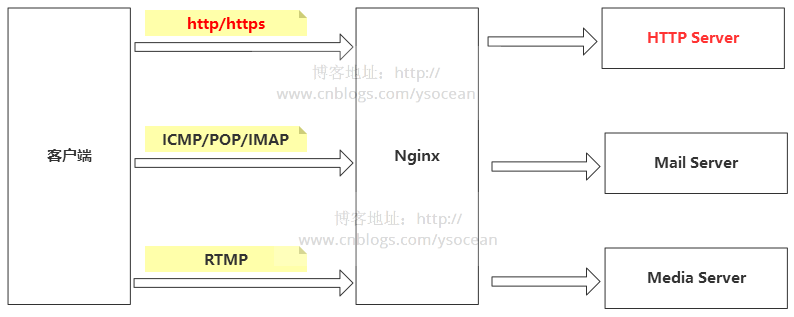
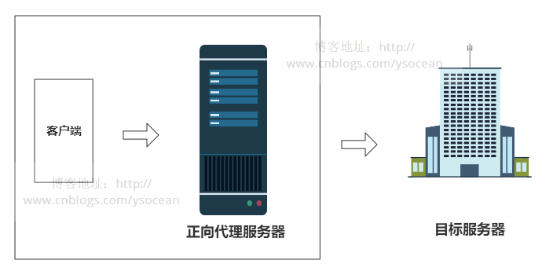
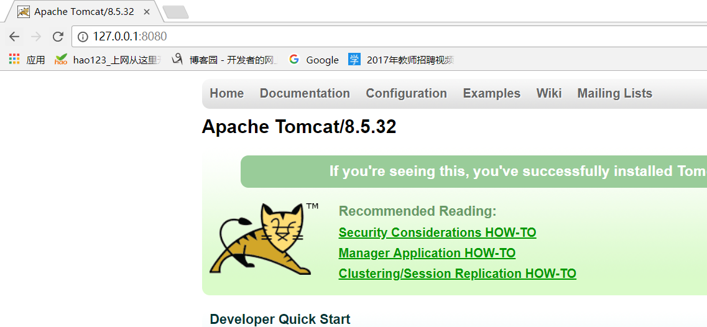
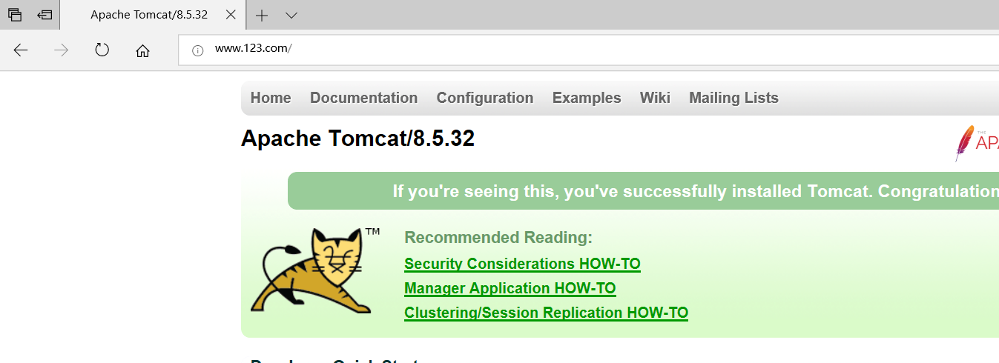

[TOC]

# 代理的理解

在Java设计模式中，代理模式是这样定义的：给某个对象提供一个代理对象，并由代理对象控制原对象的引用。

举个生活中的例子: 比如我们要买一间二手房，虽然我们可以自己去找房源，但是这太花费时间精力了,那么怎么办呢？最简单快捷的方法就是找二手房中介公司,我们只要告诉中介公司我们要什么样的二手房,然后委托中介公司去找房子,这就是代理,中介公司帮我们代理找二手房这件事情

代理简单来说，就是如果我们想做什么，但又不想直接去做，那么这时候就找另外一个人帮我们去做。那么这个例子里面的中介公司就是给我们做代理服务的，我们委托中介公司帮我们找房子。

Nginx 主要能够代理如下几种协议，其中用到的最多的就是做Http代理服务器。



## 正向代理

弄清楚什么是代理了，那么什么又是正向代理呢？

再举一个例子：大家都知道，现在国内是访问不了 Google的，那么怎么才能访问 Google呢？我们又想，美国人不是能访问 Google吗,如果我们电脑的对外公网 IP 地址能变成美国的 IP 地址，那不就可以访问 Google了。VPN 就是这样产生的。我们在访问 Google 时，先连上 VPN 服务器将我们的 IP 地址变成美国的 IP 地址，然后就可以顺利的访问了。

这里的 VPN 就是做正向代理的。正向代理服务器位于客户端和服务器之间，为了向服务器获取数据，客户端要向代理服务器发送一个请求，并指定目标服务器，代理服务器将目标服务器返回的数据转交给客户端。这里客户端是要进行一些正向代理的设置的。

> VPN 通俗的讲就是一种中转服务，当我们电脑接入 VPN 后，我们对外 IP 地址就会变成 VPN 服务器的 公网 IP，我们请求或接受任何数据都会通过这个VPN 服务器然后传入到我们本机。

## 反向代理

反向代理和正向代理的区别就是：**正向代理代理客户端，反向代理代理服务器。**

反向代理，其实客户端对代理是无感知的，因为客户端不需要任何配置就可以访问，**我们只需要将请求发送到反向代理服务器，由反向代理服务器去选择目标服务器获取数据后，再返回给客户端，此时反向代理服务器和目标服务器对外就是一个服务器**，暴露的是代理服务器地址，隐藏了真实服务器IP地址。

下面我们通过两张图来对比正向代理和方向代理：




理解这两种代理的关键在于代理服务器所代理的对象是什么，正向代理代理的是客户端，我们需要在客户端进行一些代理的设置。而反向代理代理的是服务器，作为客户端的我们是无法感知到服务器的真实存在的。

总结起来还是一句话：**正向代理代理客户端，反向代理代理服务器。**


# nginx反向代理示例

示例: 使用 nginx 反向代理 `www.123.com` 直接跳转到`127.0.0.1:8080`

- 启动一个tomcat,浏览器地址栏输入 127.0.0.1:8080，出现如下界面

  

- 通过修改本地 host 文件，将 `www.123.com` 映射到 `127.0.0.1`

  > 配置完成之后，我们便可以通过 `www.123.com:8080` 访问到第一步出现的 Tomcat初始界面。

- 在 nginx.conf 配置文件中增加如下配置:

  ```nginx
  server {
          listen       80;
          server_name  www.123.com;
  
          location / {
              proxy_pass http://127.0.0.1:8080;
              index  index.html index.htm index.jsp;
          }
      }
  ```

  如上配置，我们监听80端口，访问域名为`www.123.com`，不加端口号时默认为80端口，故访问该域名时会跳转到`127.0.0.1:8080`路径上。

  我们在浏览器端输入 `www.123.com` 结果如下：

  


总结:

其实这里更贴切的说是通过nginx代理端口，原先访问的是8080端口，通过nginx代理之后，通过80端口就可以访问了。


# nginx安装

## windows安装

[下载地址](http://nginx.org/en/download.html)

- 选择windows版的.zip文件,下载后解压

- 启动nginx

  切换到nginx解压目录下，输入命令 `start ./nginx.exe`

  > 虽然会有一个黑窗口一闪而过,但是nginx已经启动了

- 关闭ngixn

  `./nginx.exe -s stop`

  > 必须使用这种方式关闭或者是在任务管理器中将其关闭

- 配置文件nginx.conf修改重装载命令

  `./nginx.exe -s reload`

## linux安装

- 下载安装所需要的依赖文件

  ```shell
  [root@bogon src]# yum install pcre pcre-devel zlib zlib-devel
  [root@bogon src]# yum install gcc-c++
  ```

- 下载nginx

  ```shell
  [root@bogon src]# cd /usr/local/src/
  [root@bogon src]# wget http://nginx.org/download/nginx-1.6.2.tar.gz
  ```

- 解压安装包

  ```shell
  [root@bogon src]# tar zxvf nginx-1.6.2.tar.gz
  ```

- 进入安装包目录

  ```shell
  [root@bogon src]# cd nginx-1.6.2
  ```

- 编译安装

  ```shell
  [root@bogon nginx-1.6.2]# ./configure && make && make install
  ```

  > nginx的configure命令支持以下参数：
  >
  > - `--prefix=*path*`    定义一个目录，存放服务器上的文件 ，也就是nginx的安装目录。默认使用 `/usr/local/nginx。`
  >
  > 示例:
  >
  > ```nginx
  > ./configure --prefix=/usr/local/nginx/
  > ```

- 启动nginx

  ```shell
  [root@bogon nginx-1.6.2]# /usr/local/nginx/sbin/nginx
  ```

## nginx的文件夹组成

cd /usr/local/nginx目录下:,看到如下4个文件

- conf配置文件
- html网页文件
- logs日志文件
- sbin主要二进制程序


# nginx命令

## nginx常用命令

### 启动命令

`/usr/local/nginx/sbin/nginx`

> 这里的路径要看真实nginx安装的路径,但是只要找到`nginx/sbin`目录即可

### 关闭命令

`/usr/local/nginx/sbin/nginx -s stop`

### 重启命令

`/usr/local/nginx/sbin/nginx -s reload`

## nginx常用设置

### 设置开机启动

`systemctl enable nginx.service`

### 停止开机启动

`systemctl disable nginx.service`

### 重新启动服务

`systemctl restart nginx.service`

### 启动nginx服务

`systemctl start nginx.service`

### 查看nginx服务的当前状态

`systemctl status nginx.service`

### 查看所有已启动的服务

`systemctl list-units --type=service`


# nginx模块

## http核心模块

### error_page

语法: *error_page code [ code... ]* *[ = | =answer-code ]* uri

默认: *no*

作用域:  *http, server, location*

**该指令指定URI, URI将显示所指示的错误,并且可以指定返回的错误状态码。**

示例:

```nginx
error_page   404          /404.html;

error_page   502 503 504  /50x.html;
error_page   403          http://example.com/forbidden.html;
error_page   404          = @fetch;
error_page 	 404   =200   /.empty.gif; #指定返回的状态码是200
```

用法:

```ngin
http{
	error_page   404          /404.html;
}
```

---

### index

语法: *index file [file...]*

默认: *index index.html*

作用域: *http, server, location*

**可以指定首页的文件;文件按其枚举的顺序进行先后显示**

示例:

```nginx
http{
	index  0.html  /index.html;
}
```

---

### listen

语法: *listen address:port [ default [ backlog=num | rcvbuf=size | sndbuf=size | accept_filter=filter | deferred | bind | ssl ] ]*

默认: *listen 80*

作用域: *server*

**listen指令指定所包含的服务器接受的地址和端口。可以只指定地址、端口或服务器名作为地址。**

示例:

```nginx
listen 127.0.0.1:8000;

listen 127.0.0.1;
listen 8000;
listen *:8000;
listen localhost:8000;

listen  443 default ssl;
```

用法:

```nginx
server{
    listen 8000;
}
```

---

### location

语法: *location [=|~|~\*|^~] /uri/ { ... }*

默认: no

作用域: server

**这个指令允许根据URI进行不同的配置。它可以同时使用文字字符串和正则表达式进行配置。要使用正则表达式，必须使用前缀**


四种匹配 ( **匹配顺序从上到下**: 精准匹配 > 普通匹配 > 正则匹配 > 通用匹配 )

- 精准匹配
  - `= /like`：精确匹配（必须全部相等）
- 普通匹配
  - `/img/a.png`: 需要正好匹配
  - `^~ /static/`：以某个常规字符串开头进行匹配
- 正则匹配
  - `~ /Dog`：大小写敏感
  - `~* /Dog`：忽略大小写
- 通用匹配
  - `/` : 任何请求都会匹配到

**总结**:

> 发送到nginx上的请求会根据我们指定的匹配规则进行匹配
>
> - 如果匹配成功
>   - 如果匹配的location中指向的是资源,那么就会按照location中指定的root资源文件夹去找对应请求url中的资源文件(文件的路径必须要和请求中的url相对应,如果没有找到,则返回404页面)
>   - 如果匹配的location中指向的是分发服务(proxy_pass),则将url原封不动的转发到指定的服务器上
>
> - 如果匹配失败
>   - 返回404页面

---

### root

语法: *root path*

默认: *root html*

作用域: *http, server, location*

**root指定请求的文档根。例如，使用这个配置**

```nginx
location  /i/ {
 	root  /spool/w3;
}
```

---

### server

语法: *server {...}*

默认: *no*

作用域: *http*

**为虚拟服务器指定配置,可以指定服务器的listen,server_name,location等**

> - listen: 监听的端口
> - server_name: 服务器的虚拟名称
> - location: 分发方式 

---

### server_name

语法: *server_name name [... ]*

默认: *server_name hostname*

作用域: *server*

**nginx会根据`server_name`和`port`进行筛选,把请求发送到对应的server中**

> `server_name`(本质上是域名或者是ip) **必须是对应着nginx服务所在的ip**

示例:

```nginx
server {
 	server_name   example.com  www.example.com;
}
```

---

### nginx变量

用到了自己再去网上查

## http upstream模块

### HttpIndex模块

这个模块提供一个简单方法来实现在轮询和客户端IP之间的后端服务器负荷平衡。

示例:

```nginx
upstream backend  {
  server backend1.example.com weight=5;
  server backend2.example.com:8080;
  server unix:/tmp/backend3;
}
 
server {
  location / {
    proxy_pass  http://backend;
  }
}
```

---

### ip_hash

语法: ip_hash

默认: none

作用域: upstream

该指令使请求基于客户机的ip地址分布在上行流之间。哈希的键是客户机的c类网络地址。此方法保证客户机请求将始终传输到相同的服务器。但是如果这个服务器被认为是无效的，那么这个客户机的请求将被转移到另一个服务器。这使得客户机总是连接到同一服务器的可能性很高。

示例:

```nginx
upstream backend {
  ip_hash;
  server   backend1.example.com;
  server   backend2.example.com;
  server   backend3.example.com  down;
  server   backend4.example.com;
}
```

## HttpGzip模块

使用示例:

```nginx
gzip             on; # 开启或者关闭gzip模块
gzip_min_length  1000;# 设置允许压缩的页面最小字节数，页面字节数从header头中的Content-Length中进行获取。
gzip_proxied     expired no-cache no-store private auth;# Nginx作为反向代理的时候启用
gzip_types       text/plain application/xml; # 匹配MIME类型进行压缩，（无论是否指定）"text/html"类型总是会被压缩的。
```

## HttpHeaders模块

本模板可以设置HTTP报文的头标。

示例:

```nginx
expires     24h;
expires     0;
expires     -1;
expires     epoch;
add_header  Cache-Control  private;
```

---

### add_header 

语法： *add_header name value*

默认值： *none*

作用域： *http, server, location*

**当HTTP应答状态码为 200、204、301、302 或 304 的时候，增加指定的HTTP头标。**

---

### expires

语法： *expires [time|epoch|max|off]*

默认值： *expires off*

作用域： *http, server, location*

**使用本指令可以控制HTTP应答中的“Expires”和“Cache-Control”的头标，（起到控制页面缓存的作用）。**

**可以在time值中使用正数或负数。“Expires”头标的值将通过当前系统时间加上您设定的 time 值来获得。**

- 负数：`Cache-Control: no-cache`
- 正数或零：`Cache-Control: max-age = #`,`#` 为您指定时间的秒数

## HttpProxy模块

此模块专伺将请求导向其它服务.

示例:

```nginx
location / {
	proxy_pass        http://localhost:8000;
	proxy_set_header  X-Real-IP  $remote_addr;
}
```

---

### proxy_pass

**语法: *proxy_pass URL*

默认值: *no*

上下文: *location, if in location*

**该指令会将url转发到指定的服务器**

```nginx
location  /some/path/ {
	proxy_pass   http://127.0.0.1;
}
```

---

### proxy_redirect

语法: *proxy_redirect [ default|off|redirect replacement ]*

默认值: *proxy_redirect default*

上下文: *http, server, location*

**该指令可以修改请求的url,并进行转发**

示例:

> 原本的url: `http://localhost:8000/two/some/uri/`
>
> 现在的设置为: `proxy_redirect   http://localhost:8000/two/   http://frontend/one/;`
>
> 最后转发的结果为: `http://frontend/one/some/uri/`

总结: `proxy_redirect `指令可以将后面的前面的url拿后面的url进行替换

---

### proxy_set_header

语法: *proxy_set_header header value*

默认值: *Host and Connection*

上下文: *http, server, location*

**该指令允许重新定义和添加一些将被传输到代理服务器的请求头行。**

示例:

```nginx
proxy_set_header Host $http_host;
```

### 负载均衡

示例:

```nginx
http {
    upstream myproject {
        server 127.0.0.1:8000 weight=3;
        server 127.0.0.1:8001;
        server 127.0.0.1:8002;
        server 127.0.0.1:8003;
    }

    server {
        listen 80;
        server_name www.domain.com;
        location / {
        	proxy_pass http://myproject;
        }
    }
}
```

## HttpRewrite模块

该模块允许使用正则表达式改变URI，并且根据变量来转向以及选择配置。

如果在server级别设置该选项，那么他们将在location之前生效。如果在location还有更进一步的重写规则，location部分的规则依然会被执行。如果这个URI重写是因为location部分的规则造成的，那么location部分会再次被执行作为新的URI。

这个循环会执行10次，然后Nginx会返回一个500错误。

---

### break

语法: *break*

默认值: *none*

作用域: *server, location, if*

**退出当前的规则列**

示例:

```nginx
if ($slow) {
    limit_rate  10k;
    break;
}
```

---

### if

语法: *if (condition) { ... }*

默认: *none*

作用域: *server, location*

**检查条件的真实性。如果条件的值为true，则执行花括号中指示的代码，并按照下面块中的配置处理请求。配置内指令如果继承自上一级。**

示例:

```nginx
if ($http_user_agent ~ MSIE) {
: rewrite  ^(.*)$  /msie/$1  break;
}
if ($http_cookie ~* "id=([^;] +)(?:;|$)" ) {
: set  $id  $1;
}
if ($request_method = POST ) {
: return 405;
}
if (!-f $request_filename) {
: break;
: proxy_pass  http://127.0.0.1;
}
if ($slow) {
: limit_rate  10k;
}
if ($invalid_referer) {
: return   403;
}
```

---

### return

语法: *return code*

默认值: *none*

作用域: *server, location, if*

**这个指令根据规则的执行情况，返回一个状态值给客户端。可使用值包括：204，400，402-406，408，410，411，413，416以及500-504。也可以发送非标准的444代码-未发送任何头信息下结束连接。**

---

### rewrite

语法: *rewrite regex replacement [flag]*

默认: *none*

作用域: *server, location, if*

**这个指令根据表达式来更改URI，或者修改字符串。指令根据配置文件中的顺序来执行。**可以理解成是重定向

示例:

```nginx
rewrite ^/(.*) http://www.baidu.com/ permanent;     # 匹配成功后跳转到百度，执行永久301跳转
```

常用正则表达式：

| 字符      | 描述                                                         |
| --------- | ------------------------------------------------------------ |
| \         | 将后面接着的字符标记为一个特殊字符或者一个原义字符或一个向后引用 |
| ^         | 匹配输入字符串的起始位置                                     |
| $         | 匹配输入字符串的结束位置                                     |
| *         | 匹配前面的字符零次或者多次                                   |
| +         | 匹配前面字符串一次或者多次                                   |
| ?         | 匹配前面字符串的零次或者一次                                 |
| .         | 匹配除“\n”之外的所有单个字符                                 |
| (pattern) | 匹配括号内的pattern                                          |

rewrite 最后一项flag参数：

| 标记符号  | 说明                                               |
| --------- | -------------------------------------------------- |
| last      | 本条规则匹配完成后继续向下匹配新的location URI规则 |
| break     | 本条规则匹配完成后终止，不在匹配任何规则           |
| redirect  | 返回302临时重定向                                  |
| permanent | 返回301永久重定向                                  |

示例:

```nginx
# 添加个server区块做https跳转
server {　　　　　　　　　　　　　　　　　　
    listen     80;
    server_name  brian.com;
    rewrite ^/(.*) https://www.brian.com/$1 permanent;
}
# 添加个server区块做域名跳转
server {
    listen       80;
    server_name  brian.com;

    if ( $http_host ~* "^(.*)") {
        set $domain $1;
        rewrite ^(.*) http://www.baidu.com break;
    }     
}
```

---

### set

语法:*set variable value*

默认值:*none*

作用域:*server, location, if*

**指令为所指示的变量建立值。作为值，可以使用文本、变量及其组合。**

示例:

```nginx
if ($host ~* www\.(.*)) {
    set $host_without_www $1;
    rewrite ^(.*)$ http://$host_without_www$1 permanent; # $1 contains '/foo', not 'www.mydomain.com/foo'
}
```

## SSL模块

此模块支持HTTPS。

示例:

```nginx
http {
  server {
    server_name YOUR_DOMAINNAME_HERE;
    listen               443;
    ssl                  on;	# 为服务器启用HTTPS。
    ssl_certificate      /usr/local/nginx/conf/cert.pem; # 表示此虚拟服务器的密钥为PEM格式的文件,文件名路径相对于nginx配置文件nginx的目录。但不是nginx前缀目录。
    ssl_certificate_key  /usr/local/nginx/conf/cert.key; # 指示具有PEM格式证书CA的文件，用于检查客户端证书。
    keepalive_timeout    70;
  }
}
```


# nginx配置文件

```nginx
//配置工作进程,几个cpu就配几
worker_processes  1; 
events {
    //配置单个cpu的最大连接个数
    worker_connections  1024;  
}

//配置http(在http内server外的配置都属于server的全局配置,这个配置都是共同作用于多个server的)
//在http下可以有多个server配置
http { 
    include       mime.types;
    default_type  application/octet-stream;

    //定义日志的格式
    log_format  main  '$remote_addr - $remote_user [$time_local] "$request" '    
                      '$status $body_bytes_sent "$http_referer" '
                      '"$http_user_agent" "$http_x_forwarded_for"';
    
    //记录访问日志,最后的main是日志的格式
    access_log  logs/access.log  main; 

    sendfile        on;
    keepalive_timeout  65;
    
    //配置server(可以配置多个server)
    server { 
        listen       80; 			//监听的端口
        server_name  localhost; 	//地址,可以写ip,也可以写域名
            
        //资源的位置以及匹配的请求
        location / {  
            root   html;  			//资源位于哪个文件夹
            index  index.html index.htm;   //配置欢迎页
        }
    
        error_page   500 502 503 504  /50x.html;  //配置错误的页面
        location = /50x.html { 		//精准匹配
            root   html;
        }
    }
}
```

# 在租赁的服务器上默认nginx的配置

- nginx.conf配置文件在/etc/nginx下
  vim /etc/nginx/nginx.conf
- 资源文件目录在/usr/share/nginx下
- 日志文件目录在/var/log/nginx下
- nginx.pid文件在/run下
- 启动命令 : /usr/sbin/nginx
- 关闭命令 : /usr/sbin/nginx -s stop
- 重启命令 : /usr/sbin/nginx -s reload


# 参考文档

[nginx 反向代理](https://www.cnblogs.com/ysocean/p/9392908.html)